# Introduction

This document contains the script and results for a research project on extortion against businesses in Mexico.

Previous research has found that extortion against businesses is acutely concentrated on a few businesses who experience more than half of all extortion incidents in the country as repeat extortion victimizations. That project found that the rate at which businesses suffer extortion is mostly determined by their characteristics---such as their age, whether they are a restaurant, the number of corruption incidents they have suffered, and their size---and to a lesser extent, to the characteristics of the state where they are located---which include the state homicide rate and other unmeasured between-state differences.

Nonetheless, that research did not consider that most extortion victims do not comply with extortion demands. Thus this project aims to explore the distribution of successful extortion incidents, and identify the incident, victim and area characteristics associated with a higher likelihood of complying with extortion.

The incident-level characteristics that will be explored are:

- month
- time of day
- number of offenders
- victim's relationship to the offender
- use of a weapon
- type of weapon
- use of violence
- whether the incident was reported to the authorities (MP + other)
- type of extortion
- what was requested
- retaliation against business for not complying
- whether the victim complied with the extortion

The victim-level characteristics are:
- business type
- business age
- business size
- Victim of corruption
- number of corruption victimizations, repeat corruption victim
- number of extortion victimizations
- repeat extortion victim

Area-level characteristics:
- State
- State homicides
- State population (control)

# Set up, data input and pre-process

## Session info

We first check details of the session and system, and for reproducibility, we set the random seed.


```r
starttime <- proc.time()
date()
```

```
[1] "Sat Nov  5 19:37:59 2016"
```

```r
sessionInfo()
```

```
R version 3.3.0 (2016-05-03)
Platform: x86_64-pc-linux-gnu (64-bit)
Running under: Red Hat Enterprise Linux Server 7.2 (Maipo)

locale:
 [1] LC_CTYPE=en_US.UTF-8       LC_NUMERIC=C              
 [3] LC_TIME=en_US.UTF-8        LC_COLLATE=en_US.UTF-8    
 [5] LC_MONETARY=en_US.UTF-8    LC_MESSAGES=en_US.UTF-8   
 [7] LC_PAPER=en_US.UTF-8       LC_NAME=C                 
 [9] LC_ADDRESS=C               LC_TELEPHONE=C            
[11] LC_MEASUREMENT=en_US.UTF-8 LC_IDENTIFICATION=C       

attached base packages:
[1] stats     graphics  grDevices utils     datasets  methods   base     

other attached packages:
 [1] arm_1.9-1       sjPlot_2.1.0    sjstats_0.5.0   pscl_1.4.9     
 [5] lattice_0.20-33 MASS_7.3-45     lmtest_0.9-34   zoo_1.7-13     
 [9] xtable_1.8-2    texreg_1.36.7   car_2.1-3       classInt_0.1-23
[13] lme4_1.1-12     Matrix_1.2-6    Cairo_1.5-9     ggplot2_2.1.0  
[17] foreign_0.8-67  knitr_1.14     

loaded via a namespace (and not attached):
 [1] Rcpp_0.12.7        stringdist_0.9.4.2 mvtnorm_1.0-5     
 [4] tidyr_0.6.0        class_7.3-14       assertthat_0.1    
 [7] digest_0.6.10      psych_1.6.9        R6_2.1.2          
[10] plyr_1.8.4         MatrixModels_0.4-1 stats4_3.3.0      
[13] evaluate_0.9       coda_0.18-1        e1071_1.6-7       
[16] highr_0.6          lazyeval_0.2.0     multcomp_1.4-6    
[19] minqa_1.2.4        SparseM_1.72       nloptr_1.0.4      
[22] labeling_0.3       splines_3.3.0      stringr_1.1.0     
[25] munsell_0.4.3      broom_0.4.1        mnormt_1.5-4      
[28] mgcv_1.8-12        nnet_7.3-12        tibble_1.2        
[31] coin_1.1-2         codetools_0.2-14   dplyr_0.5.0       
[34] sjmisc_2.0.0       grid_3.3.0         nlme_3.1-128      
[37] gtable_0.2.0       DBI_0.5-1          magrittr_1.5      
[40] formatR_1.4        scales_0.4.0       stringi_1.1.1     
[43] reshape2_1.4.1     effects_3.1-1      sandwich_2.3-4    
[46] TH.data_1.0-7      RColorBrewer_1.1-2 tools_3.3.0       
[49] purrr_0.2.2        abind_1.4-5        parallel_3.3.0    
[52] pbkrtest_0.4-6     survival_2.39-5    colorspace_1.2-6  
[55] haven_1.0.0        quantreg_5.29      modeltools_0.2-21 
```

```r
set.seed(42)
options(scipen=0)
```

## Load packages and functions

Next we load the packages that we will use.


```r
library(foreign)
library(ggplot2)
library(Cairo)
library(knitr)
library(lme4)
library(classInt)
library(car)
library(texreg)
#library(xtable)
library(lmtest)
library(pscl)
library(sjstats)
library(sjPlot)
library(arm)
```


```r
cv.test = function(df) {
  CV = sqrt(chisq.test(df)$statistic /
              (sum(df) * (min(ncol(df),nrow(df)) - 1)))
  return(as.numeric(CV))
}

id.test <- function(x)
{
  # Takes a vector and calculates the index of dispersion
  # Then evaluates its significance for Overdispersion only
  # Returns a list with named numbers
  mu <- mean(x)
  names(mu) <- "Mean"
  v <- var(x)
  names(v) <- "Variance"
  n <- length(x)
  df <- n-1
  names(df) <- "df"
  index <- ((df)*v)/mu
  names(index) <- "I"
  pval <- pchisq(index, df, lower.tail=FALSE)
  names(pval) <- "P-value"
  pv95 <- qchisq(.95, df)
  names(pv95) <- "95% Chi-sq"

  return(c(index, pval, df, pv95))
}

icc_3level <- function(model){
  # Takes a three level lmer and provides the ICC
  # for level 2 and level 3
  require(sjstats)

  icc_l2 <- sum(get_re_var(model))/(sum(get_re_var(model)) +
                          get_re_var(model, "sigma_2"))
  names(icc_l2) <- names(icc(model))[1]

  icc_l3 <- get_re_var(model)[2]/(sum(get_re_var(model)) +
                          get_re_var(model, "sigma_2"))
  names(icc_l3) <- names(icc(model))[2]

  return(c(icc_l2, icc_l3))
}
```

## Load data

We first load and arrange the area and victim level data


```r
enve_all <- read.dbf("enve2014cuest_ciega_2014.dbf")
cat_entidades <- read.csv("cat_entidades.csv", head=TRUE)
homicidios <- read.csv("homicidios_values.csv", header=TRUE)
homicidios <- merge(homicidios, cat_entidades, by="CVE_ENT", all.x=TRUE)
scode <- read.csv("secode.csv", head=TRUE)
scode$Code <- scode$Code*10000

# Prepare data for analysis
# Selecting only the relevant variables

enve_test <- data.frame(extortions=as.integer(as.character(enve_all$P26_10)))

enve_test$extortion_victim <- enve_all$P25_10
enve_test$extortions[enve_test$extortion_victim == 2] <- 0
summary(enve_test$extortions)
```

```
   Min. 1st Qu.  Median    Mean 3rd Qu.    Max.    NA's 
 0.0000  0.0000  0.0000  0.5808  0.0000 33.0000      50 
```

```r
table(enve_test$extortions)
```

```

   0    1    2    3    4    5    6    7    8    9   10   11   12   13   14 
2153  109   46   32   25   19    8    5    4    5    4    2    5    4    6 
  15   19   20   21   22   23   25   27   29   32   33 
   5    2    4    2    1    2    1    1    1    3    1 
```

```r
enve_test$rep_extortion_victim <- factor(enve_test$extortions)
levels(enve_test$rep_extortion_victim) <- c(0, 0,
                    rep(1, length(levels(enve_test$rep_extortion_victim)) - 2))

summary(enve_test$rep_extortion_victim)
```

```
   0    1 NA's 
2262  188   50 
```

```r
enve_test$CVE_UNICA <- as.integer(as.character(enve_all$ID_CONSECU))

enve_test$bribes <- as.integer(as.character(enve_all$P33))
summary(enve_test$bribes)
```

```
   Min. 1st Qu.  Median    Mean 3rd Qu.    Max.    NA's 
  1.000   1.000   2.000   2.486   3.000  16.000    2218 
```

```r
# 4 bribe cats
enve_test$bribe1 <- enve_all$P29_1
enve_test$bribe2 <- enve_all$P30_1
enve_test$bribe3 <- enve_all$P31_1
enve_test$bribe4 <- enve_all$P32_1

enve_test$bribes[with(enve_test,
                        bribe1 == 2 &
                        bribe2 == 2 &
                        bribe3 == 2 &
                        bribe4 == 2)] <- 0

summary(enve_test$bribes)
```

```
   Min. 1st Qu.  Median    Mean 3rd Qu.    Max.    NA's 
 0.0000  0.0000  0.0000  0.2861  0.0000 16.0000      50 
```

```r
enve_test$bribe_victim <- factor(enve_test$bribes)
levels(enve_test$bribe_victim) <- c(0,
                                    rep(1, length(levels(enve_test$bribe_victim)) - 1))
summary(enve_test$bribe_victim)
```

```
   0    1 NA's 
2168  282   50 
```

```r
enve_test$rep_bribe <- factor(enve_test$bribes)
levels(enve_test$rep_bribe) <- c(0, 0, rep(1,
                                           length(levels(enve_test$rep_bribe)) - 2))
summary(enve_test$rep_bribe)
```

```
   0    1 NA's 
2303  147   50 
```

```r
enve_test$bribe_cats <- factor(enve_test$bribes)
levels(enve_test$bribe_cats) <- c(0, 1, 2, rep("3+",
                                            length(levels(enve_test$bribe_cats)) - 3))
summary(enve_test$bribe_cats)
```

```
   0    1    2   3+ NA's 
2168  135   54   93   50 
```

```r
enve_test$CVE_ENT <- as.integer(as.character(enve_all$CVE_ENT))

enve_test$size <- enve_all$ID_ESTRATO
levels(enve_test$size) <- c("Large", "Medium", "Small", "Micro")

enve_test$sector <- enve_all$SECTOR_FIN

# subsector
enve_test$tempsub <- as.integer(as.character(enve_all$P1_1B))
enve_test$subsector <- cut(enve_test$tempsub, scode$Code, right=FALSE)
levels(enve_test$subsector) <- scode$Sector
enve_test$subsector <- droplevels(enve_test$subsector)
enve_test$subsector <- relevel(enve_test$subsector, ref="Retail")
levels(enve_test$subsector)
```

```
 [1] "Retail"         "Mining"         "Utilities"      "Construction"  
 [5] "Manufacturing"  "Wholesale"      "Transport"      "Media"         
 [9] "Finance"        "Real estate"    "Prof. services" "Corporate"     
[13] "Maintenance"    "Education"      "Health"         "Leisure"       
[17] "HotelsRestBar"  "Other"         
```

```r
enve_test$subsector_safe <- enve_test$subsector

enve_test$subsector <- as.character(enve_test$subsector)

enve_test$subsector[enve_test$subsector %in%
                      c("Mining",
                        "Utilities",
                        "Construction",
                        "Manufacturing")] <- "Industry"

enve_test$subsector[enve_test$subsector %in%
                      c("Finance",
                        "Health",
                        "Leisure",
                        "Education")] <- "Services_Low"

enve_test$subsector[enve_test$subsector %in%
                      c("Media",
                        "Maintenance",
                        "Other",
                        "Corporate")] <- "Services_Mid"

enve_test$subsector[enve_test$subsector %in%
                      c("Prof. services",
                        "Real estate")] <- "Services_Hi"

enve_test$subsector <- as.factor(enve_test$subsector)
enve_test$subsector <- relevel(enve_test$subsector, ref="Retail")
levels(enve_test$subsector)
```

```
[1] "Retail"        "HotelsRestBar" "Industry"      "Services_Hi"  
[5] "Services_Low"  "Services_Mid"  "Transport"     "Wholesale"    
```

```r
summary(enve_test$subsector)
```

```
       Retail HotelsRestBar      Industry   Services_Hi  Services_Low 
           82           367           908            78           504 
 Services_Mid     Transport     Wholesale 
          311           135           115 
```

```r
enve_test$hotrestbar <- enve_test$subsector
hotindx <- which(levels(enve_test$hotrestbar) == "HotelsRestBar")
levels(enve_test$hotrestbar)[-hotindx] <- 0
levels(enve_test$hotrestbar) <- c(0,1)

enve_test$years <- 2013 - as.numeric(as.character(enve_all$P3))
intyears <- classIntervals(enve_test$years, 5, style="quantile")
enve_test$yearsquant <- cut(enve_test$years, intyears$brks, right=TRUE,
                            include.lowest = TRUE)

enve_test <- merge(enve_test, homicidios, by="CVE_ENT", all.x=TRUE)

length(enve_test$extortions[is.na(enve_test$extortions)])
```

```
[1] 50
```

```r
length(enve_test$bribes[is.na(enve_test$bribes)])
```

```
[1] 50
```

```r
## enve_test$extortions[is.na(enve_test$extortions)] <- 0
## enve_test$bribes[is.na(enve_test$bribes)] <- 0
```

Next we load incident-level data:


```r
enve_incidents_all <- read.dbf("enve2014delitos_ciega_2014.dbf")

# Selecting only those relevant for extortion (code 10)

enve_incidents_all$delito <- as.integer(as.character(enve_incidents_all$ID_DELITO))

enve_incidents <- enve_incidents_all[enve_incidents_all$delito == 10,]

# Selecting those relevant for our study

incident_df <- data.frame(CVE_UNICA=as.integer(as.character(enve_incidents$ID_CONSECU)))

incident_df$delito <- enve_incidents$delito

meses <- c("January", "February", "March",
           "April", "May", "June", "July",
           "August", "September", "October",
           "November", "December", "NONE")

incident_df$month <- enve_incidents$M1_1
levels(incident_df$month) <- meses

incident_df$time <- enve_incidents$M1_3
levels(incident_df$time) <- c("Morning", "Afternoon", "Evening", "Night", "DK/DA")

incident_df$n_offenders <- enve_incidents$M1_8
summary(incident_df$n_offenders)
```

```
   1    2    3    4    5    6    9 NA's 
2394  750  154   34   23   34  199 3067 
```

```r
levels(incident_df$n_offenders) <- c(1:3, "4+", "4+", "4+", "DK/DA")
summary(incident_df$n_offenders)
```

```
    1     2     3    4+ DK/DA  NA's 
 2394   750   154    91   199  3067 
```

```r
## Data imputation for missing variables?

incident_df$rel_offenders <- enve_incidents$M1_11
levels(incident_df$rel_offenders) <- c("Employee", "Barely known",
                                       "Somewhat known", "Close acquaintance",
                                       "Total stranger", "DK/DA")
incident_df$rel_offenders <- relevel(incident_df$rel_offenders, ref="Total stranger")

incident_df$had_weapon <- enve_incidents$M1_13
levels(incident_df$had_weapon) <- c("Yes", "No", "DK/DA")
incident_df$had_weapon <- relevel(incident_df$had_weapon, ref="No")

incident_df$gun <- enve_incidents$M1_14_1
levels(incident_df$gun) <- c("Yes", "No", "DK/DA")
incident_df$gun <- relevel(incident_df$gun, ref="No")

incident_df$knife <- enve_incidents$M1_14_2
levels(incident_df$knife) <- c("Yes", "No", "DK/DA")
incident_df$knife <- relevel(incident_df$knife, ref="No")

incident_df$blunt <- enve_incidents$M1_14_3
levels(incident_df$blunt) <- c("Yes", "No", "DK/DA")
incident_df$blunt <- relevel(incident_df$blunt, ref="No")

incident_df$other <- enve_incidents$M1_14_4
levels(incident_df$other)
```

```
[1] "1" "2"
```

```r
levels(incident_df$other) <- c("Yes", "No")
incident_df$other <- relevel(incident_df$other, ref="No")

incident_df$weapon_type <- NA
incident_df[which(incident_df$other=="Yes"),"weapon_type"] <- "Other"
incident_df$weapon_type[which(incident_df$blunt=="Yes")] <- "Blunt"
incident_df$weapon_type[which(incident_df$knife=="Yes")] <- "Knife"
incident_df$weapon_type[which(incident_df$gun=="Yes")] <- "Gun"
incident_df$weapon_type[which(incident_df$had_weapon=="No")] <- "None"
incident_df$weapon_type[which(incident_df$had_weapon=="DK/DA")] <- "DK/DA"
incident_df$weapon_type <- as.factor(incident_df$weapon_type)
incident_df$weapon_type <- relevel(incident_df$weapon_type, ref="None")

incident_df$violenceI <- as.character(enve_incidents$M1_15)
incident_df$violenceI <- as.factor(incident_df$violenceI)
levels(incident_df$violenceI) <- c("Yes", "No", "DK/DA")
incident_df$violenceI <- relevel(incident_df$violenceI, ref="No")

incident_df$violenceII <- as.character(enve_incidents$M1_16)
incident_df$violenceII <- as.factor(incident_df$violenceII)
levels(incident_df$violenceII) <- c("Yes", "No", "DK/DA")
incident_df$violenceII <- relevel(incident_df$violenceII, ref="No")

incident_df$with_violence <- NA
incident_df$with_violence[which(incident_df$violenceI == "DK/DA" |
                                  incident_df$violenceII == "DK/DA")] <- 9
incident_df$with_violence[which(incident_df$violenceI == "No" |
                                  incident_df$violenceII == "No")] <- 0
incident_df$with_violence[which(incident_df$violenceI == "Yes" |
                                  incident_df$violenceII == "Yes")] <- 1
incident_df$with_violence <- as.factor(incident_df$with_violence)
levels(incident_df$with_violence) <- c("No", "Yes", "DK/DA")

incident_df$mp <- as.factor(as.character(enve_incidents$M1_18))
levels(incident_df$mp) <- c("Yes", "No", "DK/DA")
incident_df$mp <- relevel(incident_df$mp, ref="No")

incident_df$auto <- as.factor(as.character(enve_incidents$M1_26))
levels(incident_df$auto) <- c("Yes", "No", "DK/DA")
incident_df$auto <- relevel(incident_df$auto, ref="No")

incident_df$reported <- NA
incident_df$reported[which(incident_df$mp == "DK/DA" |
                             incident_df$auto == "DK/DA")] <- 9
incident_df$reported[which(incident_df$mp == "No" |
                             incident_df$auto == "No")] <- 0
incident_df$reported[which(incident_df$mp == "Yes" |
                             incident_df$auto == "Yes")] <- 1
incident_df$reported <- as.factor(incident_df$reported)
levels(incident_df$reported) <- c("No", "Yes", "DK/DA")

incident_df$extortion_type <- as.character(enve_incidents$M5_1)
incident_df$extortion_type <- as.factor(incident_df$extortion_type)
levels(incident_df$extortion_type) <- c("Telephone", "Telephone", "Street",
                                        "Premises", "Cobro de piso", "Telephone")
levels(incident_df$extortion_type)
```

```
[1] "Telephone"     "Street"        "Premises"      "Cobro de piso"
```

```r
summary(incident_df$extortion_type)
```

```
    Telephone        Street      Premises Cobro de piso 
         6365           207            52            31 
```

```r
requests <- with(enve_incidents, data.frame(money=M5_2_1, product=M5_2_2,
                                            nothing=M5_2_3, other=M5_2_4))

incident_df$request <- "Nothing"
incident_df$request[which(requests$other==1)] <- "Other"
incident_df$request[which(requests$nothing==1)] <- "Nothing"
incident_df$request[which(requests$product==1)] <- "Product"
incident_df$request[which(requests$money==1)] <- "Money"
incident_df$request <- as.factor(incident_df$request)
incident_df$request <- relevel(incident_df$request, ref="Other")

incident_df$complied <- enve_incidents$M5_3
levels(incident_df$complied) <-  c("Yes", "No", "DK/DA")
incident_df$complied <- relevel(incident_df$complied, ref="No")

incident_df$complied_bin <- enve_incidents$M5_3
levels(incident_df$complied_bin) <-  c("Yes", "No", NA)
incident_df$complied_bin <- relevel(incident_df$complied_bin, ref="No")

incident_df$retaliation <- enve_incidents$M5_4
levels(incident_df$retaliation) <-  c("Yes", "No", "DK/DA")
incident_df$retaliation <- relevel(incident_df$retaliation, ref="No")
```

Next we merge both incident-level and victim-level tables.


```r
enve_incvic <- merge(incident_df, enve_test, by="CVE_UNICA")
```

# EDA: Incident level

Before progressing to the modeling exercise, we need to explore the distribution of the different variables. See how many missing values are present, as well as exploring possible bivariate relationships, both between the IV and the DV, as well as between the IVs.


```r
summary(enve_incvic)
```

```
   CVE_UNICA         delito         month            time     n_offenders
 Min.   :   60   Min.   :10   December :179   Morning  :494   1    :570  
 1st Qu.: 7472   1st Qu.:10   November :177   Afternoon:822   2    :163  
 Median :11826   Median :10   June     :162   Evening  :248   3    : 38  
 Mean   :12095   Mean   :10   September:132   Night    : 22   4+   : 29  
 3rd Qu.:17614   3rd Qu.:10   March    :128   DK/DA    : 14   DK/DA: 47  
 Max.   :23355   Max.   :10   October  :126                   NA's :753  
                              (Other)  :696                              
            rel_offenders had_weapon     gun         knife     
 Total stranger    :754   No   :375   No   :   9   No   :  36  
 Employee          :  4   Yes  : 44   Yes  :  34   Yes  :   8  
 Barely known      : 21   DK/DA:428   DK/DA:   1   DK/DA:   0  
 Somewhat known    :  9   NA's :753   NA's :1556   NA's :1556  
 Close acquaintance:  9                                        
 DK/DA             : 50                                        
 NA's              :753                                        
   blunt       other      weapon_type violenceI    violenceII 
 No   :  43   No  :  44   None :375   No   :  42   No   :770  
 Yes  :   1   Yes :   0   Blunt:  1   Yes  :   2   Yes  : 17  
 DK/DA:   0   NA's:1556   DK/DA:428   DK/DA:   0   DK/DA: 58  
 NA's :1556               Gun  : 34   NA's :1556   NA's :755  
                          Knife:  7                           
                          Other:  0                           
                          NA's :755                           
 with_violence     mp          auto       reported          extortion_type
 No   :770     No   :1537   No   :1466   No   :1415   Telephone    :1514  
 Yes  : 19     Yes  :  61   Yes  : 133   Yes  : 185   Street       :  63  
 DK/DA: 58     DK/DA:   2   DK/DA:   1   DK/DA:   0   Premises     :  16  
 NA's :753                                            Cobro de piso:   7  
                                                                          
                                                                          
                                                                          
    request      complied    complied_bin retaliation     CVE_ENT     
 Other  : 363   No   :1132   No  :1132    No   :   3   Min.   : 1.00  
 Money  :1138   Yes  : 100   Yes : 100    Yes  :   2   1st Qu.: 9.00  
 Nothing:  63   DK/DA:   8   NA's: 368    DK/DA:   2   Median :16.00  
 Product:  36   NA's : 360                NA's :1593   Mean   :16.55  
                                                       3rd Qu.:24.00  
                                                       Max.   :32.00  
                                                                      
   extortions      extortion_victim rep_extortion_victim     bribes       
 Min.   : 0.0000   1: 184           0   :1466            Min.   : 0.0000  
 1st Qu.: 0.0000   2:1389           1   : 107            1st Qu.: 0.0000  
 Median : 0.0000   9:  27           NA's:  27            Median : 0.0000  
 Mean   : 0.5976                                         Mean   : 0.3193  
 3rd Qu.: 0.0000                                         3rd Qu.: 0.0000  
 Max.   :33.0000                                         Max.   :16.0000  
 NA's   :27                                              NA's   :34       
 bribe1   bribe2   bribe3   bribe4   bribe_victim rep_bribe   bribe_cats 
 1: 184   1: 184   1: 184   1: 184   0   :1382    0   :1467   0   :1382  
 2:1382   2:1382   2:1382   2:1382   1   : 184    1   :  99   1   :  85  
 9:  34   9:  34   9:  34   9:  34   NA's:  34    NA's:  34   2   :  30  
                                                              3+  :  69  
                                                              NA's:  34  
                                                                         
                                                                         
     size     sector     tempsub               subsector  
 Large :394   C:516   Min.   :212410   Industry     :585  
 Medium:386   I:503   1st Qu.:366185   Services_Low :338  
 Small :369   S:581   Median :514510   HotelsRestBar:235  
 Micro :451           Mean   :514018   Services_Mid :190  
                      3rd Qu.:666735   Transport    : 87  
                      Max.   :812910   Wholesale    : 63  
                                       (Other)      :102  
       subsector_safe hotrestbar     years         yearsquant 
 Manufacturing:339    0:1365     Min.   : 0.00   [0,8]  :371  
 Health       :266    1: 235     1st Qu.: 9.00   (8,16] :314  
 HotelsRestBar:235               Median :20.00   (16,25]:318  
 Construction :202               Mean   :20.36   (25,34]:319  
 Maintenance  :129               3rd Qu.:31.00   (34,43]:278  
 Transport    : 87               Max.   :43.00                
 (Other)      :342                                            
       X         denuncias_homs     poblacion           tasahom      
 Min.   : 1.00   Min.   :  39.0   Min.   :  698295   Min.   : 1.938  
 1st Qu.: 9.00   1st Qu.: 151.0   1st Qu.: 1874188   1st Qu.: 7.797  
 Median :16.00   Median : 536.0   Median : 2932313   Median :12.814  
 Mean   :16.55   Mean   : 596.8   Mean   : 3963777   Mean   :15.862  
 3rd Qu.:24.00   3rd Qu.: 775.0   3rd Qu.: 4941059   3rd Qu.:20.165  
 Max.   :32.00   Max.   :2087.0   Max.   :16364210   Max.   :59.225  
                                                                     
    loghoms             logpop         tasahom_cntr         logtasa       
 Min.   :-2.68705   Min.   :-1.6674   Min.   :-13.5451   Min.   :-2.0782  
 1st Qu.:-1.33333   1st Qu.:-0.6801   1st Qu.: -7.6856   1st Qu.:-0.6860  
 Median :-0.06648   Median :-0.2325   Median : -2.6690   Median :-0.1892  
 Mean   :-0.42794   Mean   :-0.2032   Mean   :  0.3789   Mean   :-0.2247  
 3rd Qu.: 0.30225   3rd Qu.: 0.2893   3rd Qu.:  4.6822   3rd Qu.: 0.2642  
 Max.   : 1.29287   Max.   : 1.4868   Max.   : 43.7420   Max.   : 1.3416  
                                                                          
       NOM_ENT        NOM_ABR    
 JALISCO   :  74   JAL.   :  74  
 OAXACA    :  67   OAX.   :  67  
 GUANAJUATO:  64   GTO.   :  64  
 CHIHUAHUA :  63   CHIH.  :  63  
 ZACATECAS :  62   ZAC.   :  62  
 HIDALGO   :  60   HGO.   :  60  
 (Other)   :1210   (Other):1210  
```

Using **compliance and of type of extortion** as DVs, we explore the relationship to different variables.

First we start with incident-level variables.

## Months

### Compliance


```r
## basic summary first

t0 <- table(enve_incvic$month)
t0
```

```

  January  February     March     April       May      June      July 
       85       120       128        83       125       162       111 
   August September   October  November  December      NONE 
      113       132       126       177       179        59 
```

```r
round(t0/sum(t0)*100, 2)
```

```

  January  February     March     April       May      June      July 
     5.31      7.50      8.00      5.19      7.81     10.12      6.94 
   August September   October  November  December      NONE 
     7.06      8.25      7.88     11.06     11.19      3.69 
```

```r
## first No NA then with NA

## Use complied_bin

t1 <- table(enve_incvic$month, enve_incvic$complied_bin)
t1
```

```
           
             No Yes
  January    69   5
  February   88   7
  March      94  11
  April      59   5
  May        85   7
  June      107  12
  July       68   4
  August     83   4
  September  96   9
  October    86   7
  November  129  15
  December  129  11
  NONE       39   3
```

```r
kable(t1)
```


|          |  No| Yes|
|:---------|---:|---:|
|January   |  69|   5|
|February  |  88|   7|
|March     |  94|  11|
|April     |  59|   5|
|May       |  85|   7|
|June      | 107|  12|
|July      |  68|   4|
|August    |  83|   4|
|September |  96|   9|
|October   |  86|   7|
|November  | 129|  15|
|December  | 129|  11|
|NONE      |  39|   3|

```r
t1/as.integer(margin.table(t1, margin=1))*100
```

```
           
                   No       Yes
  January   93.243243  6.756757
  February  92.631579  7.368421
  March     89.523810 10.476190
  April     92.187500  7.812500
  May       92.391304  7.608696
  June      89.915966 10.084034
  July      94.444444  5.555556
  August    95.402299  4.597701
  September 91.428571  8.571429
  October   92.473118  7.526882
  November  89.583333 10.416667
  December  92.142857  7.857143
  NONE      92.857143  7.142857
```

```r
kable(round(t1/as.integer(margin.table(t1, margin=1))*100, 2))
```


|          |    No|   Yes|
|:---------|-----:|-----:|
|January   | 93.24|  6.76|
|February  | 92.63|  7.37|
|March     | 89.52| 10.48|
|April     | 92.19|  7.81|
|May       | 92.39|  7.61|
|June      | 89.92| 10.08|
|July      | 94.44|  5.56|
|August    | 95.40|  4.60|
|September | 91.43|  8.57|
|October   | 92.47|  7.53|
|November  | 89.58| 10.42|
|December  | 92.14|  7.86|
|NONE      | 92.86|  7.14|

```r
t2 <- table(enve_incvic$month, enve_incvic$complied_bin, useNA = "ifany")
t2
```

```
           
             No Yes <NA>
  January    69   5   11
  February   88   7   25
  March      94  11   23
  April      59   5   19
  May        85   7   33
  June      107  12   43
  July       68   4   39
  August     83   4   26
  September  96   9   27
  October    86   7   33
  November  129  15   33
  December  129  11   39
  NONE       39   3   17
```

```r
kable(t2)
```


|          |  No| Yes| NA|
|:---------|---:|---:|--:|
|January   |  69|   5| 11|
|February  |  88|   7| 25|
|March     |  94|  11| 23|
|April     |  59|   5| 19|
|May       |  85|   7| 33|
|June      | 107|  12| 43|
|July      |  68|   4| 39|
|August    |  83|   4| 26|
|September |  96|   9| 27|
|October   |  86|   7| 33|
|November  | 129|  15| 33|
|December  | 129|  11| 39|
|NONE      |  39|   3| 17|

```r
t2/as.integer(margin.table(t2, margin=1))*100
```

```
           
                   No       Yes      <NA>
  January   81.176471  5.882353 12.941176
  February  73.333333  5.833333 20.833333
  March     73.437500  8.593750 17.968750
  April     71.084337  6.024096 22.891566
  May       68.000000  5.600000 26.400000
  June      66.049383  7.407407 26.543210
  July      61.261261  3.603604 35.135135
  August    73.451327  3.539823 23.008850
  September 72.727273  6.818182 20.454545
  October   68.253968  5.555556 26.190476
  November  72.881356  8.474576 18.644068
  December  72.067039  6.145251 21.787709
  NONE      66.101695  5.084746 28.813559
```

```r
kable(round(t2/as.integer(margin.table(t2, margin=1))*100, 2))
```


|          |    No|  Yes|    NA|
|:---------|-----:|----:|-----:|
|January   | 81.18| 5.88| 12.94|
|February  | 73.33| 5.83| 20.83|
|March     | 73.44| 8.59| 17.97|
|April     | 71.08| 6.02| 22.89|
|May       | 68.00| 5.60| 26.40|
|June      | 66.05| 7.41| 26.54|
|July      | 61.26| 3.60| 35.14|
|August    | 73.45| 3.54| 23.01|
|September | 72.73| 6.82| 20.45|
|October   | 68.25| 5.56| 26.19|
|November  | 72.88| 8.47| 18.64|
|December  | 72.07| 6.15| 21.79|
|NONE      | 66.10| 5.08| 28.81|

### Extortion type


```r
t3 <- table(enve_incvic$extortion_type, enve_incvic$month)
t3
```

```
               
                January February March April May June July August
  Telephone          81      112   119    79 120  151  109    108
  Street              2        7     6     4   2   10    2      4
  Premises            0        0     2     0   2    0    0      1
  Cobro de piso       2        1     1     0   1    1    0      0
               
                September October November December NONE
  Telephone           124     120      167      168   56
  Street                6       4        9        5    2
  Premises              2       1        1        6    1
  Cobro de piso         0       1        0        0    0
```

```r
kable(t3)
```


|              | January| February| March| April| May| June| July| August| September| October| November| December| NONE|
|:-------------|-------:|--------:|-----:|-----:|---:|----:|----:|------:|---------:|-------:|--------:|--------:|----:|
|Telephone     |      81|      112|   119|    79| 120|  151|  109|    108|       124|     120|      167|      168|   56|
|Street        |       2|        7|     6|     4|   2|   10|    2|      4|         6|       4|        9|        5|    2|
|Premises      |       0|        0|     2|     0|   2|    0|    0|      1|         2|       1|        1|        6|    1|
|Cobro de piso |       2|        1|     1|     0|   1|    1|    0|      0|         0|       1|        0|        0|    0|

```r
t3/as.integer(margin.table(t3, margin=1))*100
```

```
               
                  January  February     March     April       May
  Telephone      5.350066  7.397622  7.859974  5.217966  7.926024
  Street         3.174603 11.111111  9.523810  6.349206  3.174603
  Premises       0.000000  0.000000 12.500000  0.000000 12.500000
  Cobro de piso 28.571429 14.285714 14.285714  0.000000 14.285714
               
                     June      July    August September   October
  Telephone      9.973580  7.199472  7.133421  8.190225  7.926024
  Street        15.873016  3.174603  6.349206  9.523810  6.349206
  Premises       0.000000  0.000000  6.250000 12.500000  6.250000
  Cobro de piso 14.285714  0.000000  0.000000  0.000000 14.285714
               
                 November  December      NONE
  Telephone     11.030383 11.096433  3.698811
  Street        14.285714  7.936508  3.174603
  Premises       6.250000 37.500000  6.250000
  Cobro de piso  0.000000  0.000000  0.000000
```

```r
kable(round(t3/as.integer(margin.table(t3, margin=1))*100, 2))
```


|              | January| February| March| April|   May|  June| July| August| September| October| November| December| NONE|
|:-------------|-------:|--------:|-----:|-----:|-----:|-----:|----:|------:|---------:|-------:|--------:|--------:|----:|
|Telephone     |    5.35|     7.40|  7.86|  5.22|  7.93|  9.97| 7.20|   7.13|      8.19|    7.93|    11.03|    11.10| 3.70|
|Street        |    3.17|    11.11|  9.52|  6.35|  3.17| 15.87| 3.17|   6.35|      9.52|    6.35|    14.29|     7.94| 3.17|
|Premises      |    0.00|     0.00| 12.50|  0.00| 12.50|  0.00| 0.00|   6.25|     12.50|    6.25|     6.25|    37.50| 6.25|
|Cobro de piso |   28.57|    14.29| 14.29|  0.00| 14.29| 14.29| 0.00|   0.00|      0.00|   14.29|     0.00|     0.00| 0.00|

## Time of day

### Compliance


```r
## basic summary first

t4 <- table(enve_incvic$time, useNA="ifany")
t4
```

```

  Morning Afternoon   Evening     Night     DK/DA 
      494       822       248        22        14 
```

```r
round(t4/sum(t4)*100, 2)
```

```

  Morning Afternoon   Evening     Night     DK/DA 
    30.88     51.38     15.50      1.38      0.88 
```

```r
## first No NA then with NA

## Use complied_bin

t5 <- table(enve_incvic$time, enve_incvic$complied_bin)
t5
```

```
           
             No Yes
  Morning   366  28
  Afternoon 566  47
  Evening   178  22
  Night      10   2
  DK/DA      12   1
```

```r
kable(t5)
```


|          |  No| Yes|
|:---------|---:|---:|
|Morning   | 366|  28|
|Afternoon | 566|  47|
|Evening   | 178|  22|
|Night     |  10|   2|
|DK/DA     |  12|   1|

```r
t5/as.integer(margin.table(t5, margin=1))*100
```

```
           
                   No       Yes
  Morning   92.893401  7.106599
  Afternoon 92.332790  7.667210
  Evening   89.000000 11.000000
  Night     83.333333 16.666667
  DK/DA     92.307692  7.692308
```

```r
kable(round(t5/as.integer(margin.table(t5, margin=1))*100, 2))
```


|          |    No|   Yes|
|:---------|-----:|-----:|
|Morning   | 92.89|  7.11|
|Afternoon | 92.33|  7.67|
|Evening   | 89.00| 11.00|
|Night     | 83.33| 16.67|
|DK/DA     | 92.31|  7.69|

```r
t6 <- table(enve_incvic$time, enve_incvic$complied_bin, useNA = "ifany")
t6
```

```
           
             No Yes <NA>
  Morning   366  28  100
  Afternoon 566  47  209
  Evening   178  22   48
  Night      10   2   10
  DK/DA      12   1    1
```

```r
kable(t6)
```


|          |  No| Yes|  NA|
|:---------|---:|---:|---:|
|Morning   | 366|  28| 100|
|Afternoon | 566|  47| 209|
|Evening   | 178|  22|  48|
|Night     |  10|   2|  10|
|DK/DA     |  12|   1|   1|

```r
t6/as.integer(margin.table(t6, margin=1))*100
```

```
           
                   No       Yes      <NA>
  Morning   74.089069  5.668016 20.242915
  Afternoon 68.856448  5.717762 25.425791
  Evening   71.774194  8.870968 19.354839
  Night     45.454545  9.090909 45.454545
  DK/DA     85.714286  7.142857  7.142857
```

```r
kable(round(t6/as.integer(margin.table(t6, margin=1))*100, 2))
```


|          |    No|  Yes|    NA|
|:---------|-----:|----:|-----:|
|Morning   | 74.09| 5.67| 20.24|
|Afternoon | 68.86| 5.72| 25.43|
|Evening   | 71.77| 8.87| 19.35|
|Night     | 45.45| 9.09| 45.45|
|DK/DA     | 85.71| 7.14|  7.14|

### Extortion type


```r
t7 <- table(enve_incvic$extortion_type, enve_incvic$time)
t7
```

```
               
                Morning Afternoon Evening Night DK/DA
  Telephone         469       784     225    22    14
  Street             18        24      21     0     0
  Premises            3        11       2     0     0
  Cobro de piso       4         3       0     0     0
```

```r
kable(t7)
```


|              | Morning| Afternoon| Evening| Night| DK/DA|
|:-------------|-------:|---------:|-------:|-----:|-----:|
|Telephone     |     469|       784|     225|    22|    14|
|Street        |      18|        24|      21|     0|     0|
|Premises      |       3|        11|       2|     0|     0|
|Cobro de piso |       4|         3|       0|     0|     0|

```r
t7/as.integer(margin.table(t7, margin=1))*100
```

```
               
                   Morning  Afternoon    Evening      Night      DK/DA
  Telephone     30.9775429 51.7833554 14.8612946  1.4531044  0.9247028
  Street        28.5714286 38.0952381 33.3333333  0.0000000  0.0000000
  Premises      18.7500000 68.7500000 12.5000000  0.0000000  0.0000000
  Cobro de piso 57.1428571 42.8571429  0.0000000  0.0000000  0.0000000
```

```r
kable(round(t7/as.integer(margin.table(t7, margin=1))*100, 2))
```


|              | Morning| Afternoon| Evening| Night| DK/DA|
|:-------------|-------:|---------:|-------:|-----:|-----:|
|Telephone     |   30.98|     51.78|   14.86|  1.45|  0.92|
|Street        |   28.57|     38.10|   33.33|  0.00|  0.00|
|Premises      |   18.75|     68.75|   12.50|  0.00|  0.00|
|Cobro de piso |   57.14|     42.86|    0.00|  0.00|  0.00|

## Number of offenders

### Compliance


```r
## basic summary first

t8 <- table(enve_incvic$n_offenders, useNA="ifany")
t8
```

```

    1     2     3    4+ DK/DA  <NA> 
  570   163    38    29    47   753 
```

```r
round(t8/sum(t8)*100, 2)
```

```

    1     2     3    4+ DK/DA  <NA> 
35.62 10.19  2.38  1.81  2.94 47.06 
```

```r
## first No NA then with NA

## Use complied_bin

t9 <- table(enve_incvic$n_offenders, enve_incvic$complied_bin)
t9
```

```
       
         No Yes
  1     392  28
  2     101  22
  3      26   5
  4+      8  17
  DK/DA  33   3
```

```r
kable(t9)
```


|      |  No| Yes|
|:-----|---:|---:|
|1     | 392|  28|
|2     | 101|  22|
|3     |  26|   5|
|4+    |   8|  17|
|DK/DA |  33|   3|

```r
t9/as.integer(margin.table(t9, margin=1))*100
```

```
       
               No       Yes
  1     93.333333  6.666667
  2     82.113821 17.886179
  3     83.870968 16.129032
  4+    32.000000 68.000000
  DK/DA 91.666667  8.333333
```

```r
kable(round(t9/as.integer(margin.table(t9, margin=1))*100, 2))
```


|      |    No|   Yes|
|:-----|-----:|-----:|
|1     | 93.33|  6.67|
|2     | 82.11| 17.89|
|3     | 83.87| 16.13|
|4+    | 32.00| 68.00|
|DK/DA | 91.67|  8.33|

```r
t10 <- table(enve_incvic$n_offenders, enve_incvic$complied_bin, useNA = "ifany")
t10
```

```
       
         No Yes <NA>
  1     392  28  150
  2     101  22   40
  3      26   5    7
  4+      8  17    4
  DK/DA  33   3   11
  <NA>  572  25  156
```

```r
kable(t10)
```


|      |  No| Yes|  NA|
|:-----|---:|---:|---:|
|1     | 392|  28| 150|
|2     | 101|  22|  40|
|3     |  26|   5|   7|
|4+    |   8|  17|   4|
|DK/DA |  33|   3|  11|
|NA    | 572|  25| 156|

```r
t10/as.integer(margin.table(t10, margin=1))*100
```

```
       
               No       Yes      <NA>
  1     68.771930  4.912281 26.315789
  2     61.963190 13.496933 24.539877
  3     68.421053 13.157895 18.421053
  4+    27.586207 58.620690 13.793103
  DK/DA 70.212766  6.382979 23.404255
  <NA>  75.962815  3.320053 20.717131
```

```r
kable(round(t10/as.integer(margin.table(t10, margin=1))*100, 2))
```


|      |    No|   Yes|    NA|
|:-----|-----:|-----:|-----:|
|1     | 68.77|  4.91| 26.32|
|2     | 61.96| 13.50| 24.54|
|3     | 68.42| 13.16| 18.42|
|4+    | 27.59| 58.62| 13.79|
|DK/DA | 70.21|  6.38| 23.40|
|NA    | 75.96|  3.32| 20.72|

### Extortion type


```r
t11 <- table(enve_incvic$extortion_type, enve_incvic$n_offenders)
t11
```

```
               
                  1   2   3  4+ DK/DA
  Telephone     537 145  26  12    47
  Street         26  13  10  10     0
  Premises        3   3   1   7     0
  Cobro de piso   4   2   1   0     0
```

```r
kable(t11)
```


|              |   1|   2|  3| 4+| DK/DA|
|:-------------|---:|---:|--:|--:|-----:|
|Telephone     | 537| 145| 26| 12|    47|
|Street        |  26|  13| 10| 10|     0|
|Premises      |   3|   3|  1|  7|     0|
|Cobro de piso |   4|   2|  1|  0|     0|

```r
t11/as.integer(margin.table(t11, margin=1))*100
```

```
               
                        1         2         3        4+     DK/DA
  Telephone     70.013038 18.904824  3.389831  1.564537  6.127771
  Street        44.067797 22.033898 16.949153 16.949153  0.000000
  Premises      21.428571 21.428571  7.142857 50.000000  0.000000
  Cobro de piso 57.142857 28.571429 14.285714  0.000000  0.000000
```

```r
kable(round(t11/as.integer(margin.table(t11, margin=1))*100, 2))
```


|              |     1|     2|     3|    4+| DK/DA|
|:-------------|-----:|-----:|-----:|-----:|-----:|
|Telephone     | 70.01| 18.90|  3.39|  1.56|  6.13|
|Street        | 44.07| 22.03| 16.95| 16.95|  0.00|
|Premises      | 21.43| 21.43|  7.14| 50.00|  0.00|
|Cobro de piso | 57.14| 28.57| 14.29|  0.00|  0.00|

```r
t12 <- table(enve_incvic$extortion_type, enve_incvic$n_offenders, useNA="ifany")
t12
```

```
               
                  1   2   3  4+ DK/DA <NA>
  Telephone     537 145  26  12    47  747
  Street         26  13  10  10     0    4
  Premises        3   3   1   7     0    2
  Cobro de piso   4   2   1   0     0    0
```

```r
kable(t12)
```


|              |   1|   2|  3| 4+| DK/DA|  NA|
|:-------------|---:|---:|--:|--:|-----:|---:|
|Telephone     | 537| 145| 26| 12|    47| 747|
|Street        |  26|  13| 10| 10|     0|   4|
|Premises      |   3|   3|  1|  7|     0|   2|
|Cobro de piso |   4|   2|  1|  0|     0|   0|

```r
t12/as.integer(margin.table(t12, margin=1))*100
```

```
               
                         1          2          3         4+      DK/DA
  Telephone     35.4689564  9.5772787  1.7173052  0.7926024  3.1043593
  Street        41.2698413 20.6349206 15.8730159 15.8730159  0.0000000
  Premises      18.7500000 18.7500000  6.2500000 43.7500000  0.0000000
  Cobro de piso 57.1428571 28.5714286 14.2857143  0.0000000  0.0000000
               
                      <NA>
  Telephone     49.3394980
  Street         6.3492063
  Premises      12.5000000
  Cobro de piso  0.0000000
```

```r
kable(round(t12/as.integer(margin.table(t12, margin=1))*100, 2))
```


|              |     1|     2|     3|    4+| DK/DA|    NA|
|:-------------|-----:|-----:|-----:|-----:|-----:|-----:|
|Telephone     | 35.47|  9.58|  1.72|  0.79|   3.1| 49.34|
|Street        | 41.27| 20.63| 15.87| 15.87|   0.0|  6.35|
|Premises      | 18.75| 18.75|  6.25| 43.75|   0.0| 12.50|
|Cobro de piso | 57.14| 28.57| 14.29|  0.00|   0.0|  0.00|

## Relationship to offender

## Compliance


```r
## basic summary first

t13 <- table(enve_incvic$rel_offenders, useNA="ifany")
t13
```

```

    Total stranger           Employee       Barely known 
               754                  4                 21 
    Somewhat known Close acquaintance              DK/DA 
                 9                  9                 50 
              <NA> 
               753 
```

```r
round(t13/sum(t13)*100, 2)
```

```

    Total stranger           Employee       Barely known 
             47.12               0.25               1.31 
    Somewhat known Close acquaintance              DK/DA 
              0.56               0.56               3.12 
              <NA> 
             47.06 
```

```r
## first No NA then with NA

## Use complied_bin

t14 <- table(enve_incvic$rel_offenders, enve_incvic$complied_bin)
t14
```

```
                    
                      No Yes
  Total stranger     502  65
  Employee             2   1
  Barely known        13   5
  Somewhat known       4   1
  Close acquaintance   2   2
  DK/DA               37   1
```

```r
kable(t14)
```


|                   |  No| Yes|
|:------------------|---:|---:|
|Total stranger     | 502|  65|
|Employee           |   2|   1|
|Barely known       |  13|   5|
|Somewhat known     |   4|   1|
|Close acquaintance |   2|   2|
|DK/DA              |  37|   1|

```r
t14/as.integer(margin.table(t14, margin=1))*100
```

```
                    
                            No       Yes
  Total stranger     88.536155 11.463845
  Employee           66.666667 33.333333
  Barely known       72.222222 27.777778
  Somewhat known     80.000000 20.000000
  Close acquaintance 50.000000 50.000000
  DK/DA              97.368421  2.631579
```

```r
kable(round(t14/as.integer(margin.table(t14, margin=1))*100, 2))
```


|                   |    No|   Yes|
|:------------------|-----:|-----:|
|Total stranger     | 88.54| 11.46|
|Employee           | 66.67| 33.33|
|Barely known       | 72.22| 27.78|
|Somewhat known     | 80.00| 20.00|
|Close acquaintance | 50.00| 50.00|
|DK/DA              | 97.37|  2.63|

```r
t15 <- table(enve_incvic$rel_offenders, enve_incvic$complied_bin, useNA = "ifany")
t15
```

```
                    
                      No Yes <NA>
  Total stranger     502  65  187
  Employee             2   1    1
  Barely known        13   5    3
  Somewhat known       4   1    4
  Close acquaintance   2   2    5
  DK/DA               37   1   12
  <NA>               572  25  156
```

```r
kable(t15)
```


|                   |  No| Yes|  NA|
|:------------------|---:|---:|---:|
|Total stranger     | 502|  65| 187|
|Employee           |   2|   1|   1|
|Barely known       |  13|   5|   3|
|Somewhat known     |   4|   1|   4|
|Close acquaintance |   2|   2|   5|
|DK/DA              |  37|   1|  12|
|NA                 | 572|  25| 156|

```r
t15/as.integer(margin.table(t15, margin=1))*100
```

```
                    
                            No       Yes      <NA>
  Total stranger     66.578249  8.620690 24.801061
  Employee           50.000000 25.000000 25.000000
  Barely known       61.904762 23.809524 14.285714
  Somewhat known     44.444444 11.111111 44.444444
  Close acquaintance 22.222222 22.222222 55.555556
  DK/DA              74.000000  2.000000 24.000000
  <NA>               75.962815  3.320053 20.717131
```

```r
kable(round(t15/as.integer(margin.table(t15, margin=1))*100, 2))
```


|                   |    No|   Yes|    NA|
|:------------------|-----:|-----:|-----:|
|Total stranger     | 66.58|  8.62| 24.80|
|Employee           | 50.00| 25.00| 25.00|
|Barely known       | 61.90| 23.81| 14.29|
|Somewhat known     | 44.44| 11.11| 44.44|
|Close acquaintance | 22.22| 22.22| 55.56|
|DK/DA              | 74.00|  2.00| 24.00|
|NA                 | 75.96|  3.32| 20.72|

### Extortion type


```r
t16 <- table(enve_incvic$extortion_type, enve_incvic$rel_offenders)
t16
```

```
               
                Total stranger Employee Barely known Somewhat known
  Telephone                701        2            8              5
  Street                    35        0           13              4
  Premises                  11        2            0              0
  Cobro de piso              7        0            0              0
               
                Close acquaintance DK/DA
  Telephone                      2    49
  Street                         6     1
  Premises                       1     0
  Cobro de piso                  0     0
```

```r
kable(t16)
```


|              | Total stranger| Employee| Barely known| Somewhat known| Close acquaintance| DK/DA|
|:-------------|--------------:|--------:|------------:|--------------:|------------------:|-----:|
|Telephone     |            701|        2|            8|              5|                  2|    49|
|Street        |             35|        0|           13|              4|                  6|     1|
|Premises      |             11|        2|            0|              0|                  1|     0|
|Cobro de piso |              7|        0|            0|              0|                  0|     0|

```r
t16/as.integer(margin.table(t16, margin=1))*100
```

```
               
                Total stranger    Employee Barely known Somewhat known
  Telephone         91.3950456   0.2607562    1.0430248      0.6518905
  Street            59.3220339   0.0000000   22.0338983      6.7796610
  Premises          78.5714286  14.2857143    0.0000000      0.0000000
  Cobro de piso    100.0000000   0.0000000    0.0000000      0.0000000
               
                Close acquaintance       DK/DA
  Telephone              0.2607562   6.3885267
  Street                10.1694915   1.6949153
  Premises               7.1428571   0.0000000
  Cobro de piso          0.0000000   0.0000000
```

```r
kable(round(t16/as.integer(margin.table(t16, margin=1))*100, 2))
```


|              | Total stranger| Employee| Barely known| Somewhat known| Close acquaintance| DK/DA|
|:-------------|--------------:|--------:|------------:|--------------:|------------------:|-----:|
|Telephone     |          91.40|     0.26|         1.04|           0.65|               0.26|  6.39|
|Street        |          59.32|     0.00|        22.03|           6.78|              10.17|  1.69|
|Premises      |          78.57|    14.29|         0.00|           0.00|               7.14|  0.00|
|Cobro de piso |         100.00|     0.00|         0.00|           0.00|               0.00|  0.00|

```r
t17 <- table(enve_incvic$extortion_type, enve_incvic$rel_offenders, useNA="ifany")
t17
```

```
               
                Total stranger Employee Barely known Somewhat known
  Telephone                701        2            8              5
  Street                    35        0           13              4
  Premises                  11        2            0              0
  Cobro de piso              7        0            0              0
               
                Close acquaintance DK/DA <NA>
  Telephone                      2    49  747
  Street                         6     1    4
  Premises                       1     0    2
  Cobro de piso                  0     0    0
```

```r
kable(t17)
```


|              | Total stranger| Employee| Barely known| Somewhat known| Close acquaintance| DK/DA|  NA|
|:-------------|--------------:|--------:|------------:|--------------:|------------------:|-----:|---:|
|Telephone     |            701|        2|            8|              5|                  2|    49| 747|
|Street        |             35|        0|           13|              4|                  6|     1|   4|
|Premises      |             11|        2|            0|              0|                  1|     0|   2|
|Cobro de piso |              7|        0|            0|              0|                  0|     0|   0|

```r
t17/as.integer(margin.table(t17, margin=1))*100
```

```
               
                Total stranger    Employee Barely known Somewhat known
  Telephone         46.3011889   0.1321004    0.5284016      0.3302510
  Street            55.5555556   0.0000000   20.6349206      6.3492063
  Premises          68.7500000  12.5000000    0.0000000      0.0000000
  Cobro de piso    100.0000000   0.0000000    0.0000000      0.0000000
               
                Close acquaintance       DK/DA        <NA>
  Telephone              0.1321004   3.2364597  49.3394980
  Street                 9.5238095   1.5873016   6.3492063
  Premises               6.2500000   0.0000000  12.5000000
  Cobro de piso          0.0000000   0.0000000   0.0000000
```

```r
kable(round(t17/as.integer(margin.table(t17, margin=1))*100, 2))
```


|              | Total stranger| Employee| Barely known| Somewhat known| Close acquaintance| DK/DA|    NA|
|:-------------|--------------:|--------:|------------:|--------------:|------------------:|-----:|-----:|
|Telephone     |          46.30|     0.13|         0.53|           0.33|               0.13|  3.24| 49.34|
|Street        |          55.56|     0.00|        20.63|           6.35|               9.52|  1.59|  6.35|
|Premises      |          68.75|    12.50|         0.00|           0.00|               6.25|  0.00| 12.50|
|Cobro de piso |         100.00|     0.00|         0.00|           0.00|               0.00|  0.00|  0.00|

## Use of weapon

### Compliance


```r
## basic summary first

t18 <- table(enve_incvic$had_weapon, useNA="ifany")
t18
```

```

   No   Yes DK/DA  <NA> 
  375    44   428   753 
```

```r
round(t18/sum(t18)*100, 2)
```

```

   No   Yes DK/DA  <NA> 
23.44  2.75 26.75 47.06 
```

```r
## first No NA then with NA

## Use complied_bin

t19 <- table(enve_incvic$had_weapon, enve_incvic$complied_bin)
t19
```

```
       
         No Yes
  No    260  31
  Yes    12  23
  DK/DA 288  21
```

```r
kable(t19)
```


|      |  No| Yes|
|:-----|---:|---:|
|No    | 260|  31|
|Yes   |  12|  23|
|DK/DA | 288|  21|

```r
t19/as.integer(margin.table(t19, margin=1))*100
```

```
       
               No       Yes
  No    89.347079 10.652921
  Yes   34.285714 65.714286
  DK/DA 93.203883  6.796117
```

```r
kable(round(t19/as.integer(margin.table(t19, margin=1))*100, 2))
```


|      |    No|   Yes|
|:-----|-----:|-----:|
|No    | 89.35| 10.65|
|Yes   | 34.29| 65.71|
|DK/DA | 93.20|  6.80|

```r
t20 <- table(enve_incvic$had_weapon, enve_incvic$complied_bin, useNA = "ifany")

kable(t20)
```


|      |  No| Yes|  NA|
|:-----|---:|---:|---:|
|No    | 260|  31|  84|
|Yes   |  12|  23|   9|
|DK/DA | 288|  21| 119|
|NA    | 572|  25| 156|

```r
t20/as.integer(margin.table(t20, margin=1))*100
```

```
       
               No       Yes      <NA>
  No    69.333333  8.266667 22.400000
  Yes   27.272727 52.272727 20.454545
  DK/DA 67.289720  4.906542 27.803738
  <NA>  75.962815  3.320053 20.717131
```

```r
kable(round(t20/as.integer(margin.table(t20, margin=1))*100, 2))
```


|      |    No|   Yes|    NA|
|:-----|-----:|-----:|-----:|
|No    | 69.33|  8.27| 22.40|
|Yes   | 27.27| 52.27| 20.45|
|DK/DA | 67.29|  4.91| 27.80|
|NA    | 75.96|  3.32| 20.72|

### Extortion type


```r
t21 <- table(enve_incvic$extortion_type, enve_incvic$had_weapon)
t21
```

```
               
                 No Yes DK/DA
  Telephone     330  11   426
  Street         36  21     2
  Premises        4  10     0
  Cobro de piso   5   2     0
```

```r
kable(t21)
```


|              |  No| Yes| DK/DA|
|:-------------|---:|---:|-----:|
|Telephone     | 330|  11|   426|
|Street        |  36|  21|     2|
|Premises      |   4|  10|     0|
|Cobro de piso |   5|   2|     0|

```r
t21/as.integer(margin.table(t21, margin=1))*100
```

```
               
                       No       Yes     DK/DA
  Telephone     43.024772  1.434159 55.541069
  Street        61.016949 35.593220  3.389831
  Premises      28.571429 71.428571  0.000000
  Cobro de piso 71.428571 28.571429  0.000000
```

```r
kable(round(t21/as.integer(margin.table(t21, margin=1))*100, 2))
```


|              |    No|   Yes| DK/DA|
|:-------------|-----:|-----:|-----:|
|Telephone     | 43.02|  1.43| 55.54|
|Street        | 61.02| 35.59|  3.39|
|Premises      | 28.57| 71.43|  0.00|
|Cobro de piso | 71.43| 28.57|  0.00|

```r
t22 <- table(enve_incvic$extortion_type, enve_incvic$had_weapon, useNA="ifany")
t22
```

```
               
                 No Yes DK/DA <NA>
  Telephone     330  11   426  747
  Street         36  21     2    4
  Premises        4  10     0    2
  Cobro de piso   5   2     0    0
```

```r
kable(t22)
```


|              |  No| Yes| DK/DA|  NA|
|:-------------|---:|---:|-----:|---:|
|Telephone     | 330|  11|   426| 747|
|Street        |  36|  21|     2|   4|
|Premises      |   4|  10|     0|   2|
|Cobro de piso |   5|   2|     0|   0|

```r
t22/as.integer(margin.table(t22, margin=1))*100
```

```
               
                        No        Yes      DK/DA       <NA>
  Telephone     21.7965654  0.7265522 28.1373844 49.3394980
  Street        57.1428571 33.3333333  3.1746032  6.3492063
  Premises      25.0000000 62.5000000  0.0000000 12.5000000
  Cobro de piso 71.4285714 28.5714286  0.0000000  0.0000000
```

```r
kable(round(t22/as.integer(margin.table(t22, margin=1))*100, 2))
```


|              |    No|   Yes| DK/DA|    NA|
|:-------------|-----:|-----:|-----:|-----:|
|Telephone     | 21.80|  0.73| 28.14| 49.34|
|Street        | 57.14| 33.33|  3.17|  6.35|
|Premises      | 25.00| 62.50|  0.00| 12.50|
|Cobro de piso | 71.43| 28.57|  0.00|  0.00|

## Type of weapon

### Compliance


```r
## basic summary first

t23 <- table(enve_incvic$weapon_type, useNA="ifany")
t23
```

```

 None Blunt DK/DA   Gun Knife Other  <NA> 
  375     1   428    34     7     0   755 
```

```r
round(t23/sum(t23)*100, 2)
```

```

 None Blunt DK/DA   Gun Knife Other  <NA> 
23.44  0.06 26.75  2.12  0.44  0.00 47.19 
```

```r
## first No NA then with NA

## Use complied_bin

t24 <- table(enve_incvic$weapon_type, enve_incvic$complied_bin)
t24
```

```
       
         No Yes
  None  260  31
  Blunt   0   0
  DK/DA 288  21
  Gun     8  21
  Knife   2   2
  Other   0   0
```

```r
kable(t24)
```


|      |  No| Yes|
|:-----|---:|---:|
|None  | 260|  31|
|Blunt |   0|   0|
|DK/DA | 288|  21|
|Gun   |   8|  21|
|Knife |   2|   2|
|Other |   0|   0|

```r
t24/as.integer(margin.table(t24, margin=1))*100
```

```
       
               No       Yes
  None  89.347079 10.652921
  Blunt                    
  DK/DA 93.203883  6.796117
  Gun   27.586207 72.413793
  Knife 50.000000 50.000000
  Other                    
```

```r
kable(round(t24/as.integer(margin.table(t24, margin=1))*100, 2))
```


|      |    No|   Yes|
|:-----|-----:|-----:|
|None  | 89.35| 10.65|
|Blunt |   NaN|   NaN|
|DK/DA | 93.20|  6.80|
|Gun   | 27.59| 72.41|
|Knife | 50.00| 50.00|
|Other |   NaN|   NaN|

```r
t25 <- table(enve_incvic$weapon_type, enve_incvic$complied_bin, useNA = "ifany")
t25
```

```
       
         No Yes <NA>
  None  260  31   84
  Blunt   0   0    1
  DK/DA 288  21  119
  Gun     8  21    5
  Knife   2   2    3
  Other   0   0    0
  <NA>  574  25  156
```

```r
kable(t25)
```


|      |  No| Yes|  NA|
|:-----|---:|---:|---:|
|None  | 260|  31|  84|
|Blunt |   0|   0|   1|
|DK/DA | 288|  21| 119|
|Gun   |   8|  21|   5|
|Knife |   2|   2|   3|
|Other |   0|   0|   0|
|NA    | 574|  25| 156|

```r
t25/as.integer(margin.table(t25, margin=1))*100
```

```
       
                No        Yes       <NA>
  None   69.333333   8.266667  22.400000
  Blunt   0.000000   0.000000 100.000000
  DK/DA  67.289720   4.906542  27.803738
  Gun    23.529412  61.764706  14.705882
  Knife  28.571429  28.571429  42.857143
  Other                                 
  <NA>   76.026490   3.311258  20.662252
```

```r
kable(round(t25/as.integer(margin.table(t25, margin=1))*100, 2))
```


|      |    No|   Yes|     NA|
|:-----|-----:|-----:|------:|
|None  | 69.33|  8.27|  22.40|
|Blunt |  0.00|  0.00| 100.00|
|DK/DA | 67.29|  4.91|  27.80|
|Gun   | 23.53| 61.76|  14.71|
|Knife | 28.57| 28.57|  42.86|
|Other |   NaN|   NaN|    NaN|
|NA    | 76.03|  3.31|  20.66|

### Extortion type


```r
t26 <- table(enve_incvic$extortion_type, enve_incvic$weapon_type)
t26
```

```
               
                None Blunt DK/DA Gun Knife Other
  Telephone      330     0   426   9     0     0
  Street          36     1     2  13     7     0
  Premises         4     0     0  10     0     0
  Cobro de piso    5     0     0   2     0     0
```

```r
kable(t26)
```


|              | None| Blunt| DK/DA| Gun| Knife| Other|
|:-------------|----:|-----:|-----:|---:|-----:|-----:|
|Telephone     |  330|     0|   426|   9|     0|     0|
|Street        |   36|     1|     2|  13|     7|     0|
|Premises      |    4|     0|     0|  10|     0|     0|
|Cobro de piso |    5|     0|     0|   2|     0|     0|

```r
t26/as.integer(margin.table(t26, margin=1))*100
```

```
               
                     None     Blunt     DK/DA       Gun     Knife
  Telephone     43.137255  0.000000 55.686275  1.176471  0.000000
  Street        61.016949  1.694915  3.389831 22.033898 11.864407
  Premises      28.571429  0.000000  0.000000 71.428571  0.000000
  Cobro de piso 71.428571  0.000000  0.000000 28.571429  0.000000
               
                    Other
  Telephone      0.000000
  Street         0.000000
  Premises       0.000000
  Cobro de piso  0.000000
```

```r
kable(round(t26/as.integer(margin.table(t26, margin=1))*100, 2))
```


|              |  None| Blunt| DK/DA|   Gun| Knife| Other|
|:-------------|-----:|-----:|-----:|-----:|-----:|-----:|
|Telephone     | 43.14|  0.00| 55.69|  1.18|  0.00|     0|
|Street        | 61.02|  1.69|  3.39| 22.03| 11.86|     0|
|Premises      | 28.57|  0.00|  0.00| 71.43|  0.00|     0|
|Cobro de piso | 71.43|  0.00|  0.00| 28.57|  0.00|     0|

```r
t27 <- table(enve_incvic$extortion_type, enve_incvic$weapon_type, useNA="ifany")
t27
```

```
               
                None Blunt DK/DA Gun Knife Other <NA>
  Telephone      330     0   426   9     0     0  749
  Street          36     1     2  13     7     0    4
  Premises         4     0     0  10     0     0    2
  Cobro de piso    5     0     0   2     0     0    0
```

```r
kable(t27)
```


|              | None| Blunt| DK/DA| Gun| Knife| Other|  NA|
|:-------------|----:|-----:|-----:|---:|-----:|-----:|---:|
|Telephone     |  330|     0|   426|   9|     0|     0| 749|
|Street        |   36|     1|     2|  13|     7|     0|   4|
|Premises      |    4|     0|     0|  10|     0|     0|   2|
|Cobro de piso |    5|     0|     0|   2|     0|     0|   0|

```r
t27/as.integer(margin.table(t27, margin=1))*100
```

```
               
                      None      Blunt      DK/DA        Gun      Knife
  Telephone     21.7965654  0.0000000 28.1373844  0.5944518  0.0000000
  Street        57.1428571  1.5873016  3.1746032 20.6349206 11.1111111
  Premises      25.0000000  0.0000000  0.0000000 62.5000000  0.0000000
  Cobro de piso 71.4285714  0.0000000  0.0000000 28.5714286  0.0000000
               
                     Other       <NA>
  Telephone      0.0000000 49.4715984
  Street         0.0000000  6.3492063
  Premises       0.0000000 12.5000000
  Cobro de piso  0.0000000  0.0000000
```

```r
kable(round(t27/as.integer(margin.table(t27, margin=1))*100, 2))
```


|              |  None| Blunt| DK/DA|   Gun| Knife| Other|    NA|
|:-------------|-----:|-----:|-----:|-----:|-----:|-----:|-----:|
|Telephone     | 21.80|  0.00| 28.14|  0.59|  0.00|     0| 49.47|
|Street        | 57.14|  1.59|  3.17| 20.63| 11.11|     0|  6.35|
|Premises      | 25.00|  0.00|  0.00| 62.50|  0.00|     0| 12.50|
|Cobro de piso | 71.43|  0.00|  0.00| 28.57|  0.00|     0|  0.00|

## Use of violence

### Compliance


```r
## basic summary first

t28 <- table(enve_incvic$with_violence, useNA="ifany")
t28
```

```

   No   Yes DK/DA  <NA> 
  770    19    58   753 
```

```r
round(t28/sum(t28)*100, 2)
```

```

   No   Yes DK/DA  <NA> 
48.12  1.19  3.62 47.06 
```

```r
## first No NA then with NA

## Use complied_bin

t29 <- table(enve_incvic$with_violence, enve_incvic$complied_bin)
t29
```

```
       
         No Yes
  No    517  64
  Yes     7   7
  DK/DA  36   4
```

```r
kable(t29)
```


|      |  No| Yes|
|:-----|---:|---:|
|No    | 517|  64|
|Yes   |   7|   7|
|DK/DA |  36|   4|

```r
t29/as.integer(margin.table(t29, margin=1))*100
```

```
       
              No      Yes
  No    88.98451 11.01549
  Yes   50.00000 50.00000
  DK/DA 90.00000 10.00000
```

```r
kable(round(t29/as.integer(margin.table(t29, margin=1))*100, 2))
```


|      |    No|   Yes|
|:-----|-----:|-----:|
|No    | 88.98| 11.02|
|Yes   | 50.00| 50.00|
|DK/DA | 90.00| 10.00|

```r
t30 <- table(enve_incvic$with_violence, enve_incvic$complied_bin, useNA = "ifany")
t30
```

```
       
         No Yes <NA>
  No    517  64  189
  Yes     7   7    5
  DK/DA  36   4   18
  <NA>  572  25  156
```

```r
kable(t30)
```


|      |  No| Yes|  NA|
|:-----|---:|---:|---:|
|No    | 517|  64| 189|
|Yes   |   7|   7|   5|
|DK/DA |  36|   4|  18|
|NA    | 572|  25| 156|

```r
t30/as.integer(margin.table(t30, margin=1))*100
```

```
       
               No       Yes      <NA>
  No    67.142857  8.311688 24.545455
  Yes   36.842105 36.842105 26.315789
  DK/DA 62.068966  6.896552 31.034483
  <NA>  75.962815  3.320053 20.717131
```

```r
kable(round(t30/as.integer(margin.table(t30, margin=1))*100, 2))
```


|      |    No|   Yes|    NA|
|:-----|-----:|-----:|-----:|
|No    | 67.14|  8.31| 24.55|
|Yes   | 36.84| 36.84| 26.32|
|DK/DA | 62.07|  6.90| 31.03|
|NA    | 75.96|  3.32| 20.72|

### Extortion type


```r
t31 <- table(enve_incvic$extortion_type, enve_incvic$with_violence)
t31
```

```
               
                 No Yes DK/DA
  Telephone     704   5    58
  Street         46  13     0
  Premises       13   1     0
  Cobro de piso   7   0     0
```

```r
kable(t31)
```


|              |  No| Yes| DK/DA|
|:-------------|---:|---:|-----:|
|Telephone     | 704|   5|    58|
|Street        |  46|  13|     0|
|Premises      |  13|   1|     0|
|Cobro de piso |   7|   0|     0|

```r
t31/as.integer(margin.table(t31, margin=1))*100
```

```
               
                         No         Yes       DK/DA
  Telephone      91.7861799   0.6518905   7.5619296
  Street         77.9661017  22.0338983   0.0000000
  Premises       92.8571429   7.1428571   0.0000000
  Cobro de piso 100.0000000   0.0000000   0.0000000
```

```r
kable(round(t31/as.integer(margin.table(t31, margin=1))*100, 2))
```


|              |     No|   Yes| DK/DA|
|:-------------|------:|-----:|-----:|
|Telephone     |  91.79|  0.65|  7.56|
|Street        |  77.97| 22.03|  0.00|
|Premises      |  92.86|  7.14|  0.00|
|Cobro de piso | 100.00|  0.00|  0.00|

```r
t32 <- table(enve_incvic$extortion_type, enve_incvic$with_violence, useNA="ifany")
t32
```

```
               
                 No Yes DK/DA <NA>
  Telephone     704   5    58  747
  Street         46  13     0    4
  Premises       13   1     0    2
  Cobro de piso   7   0     0    0
```

```r
kable(t32)
```


|              |  No| Yes| DK/DA|  NA|
|:-------------|---:|---:|-----:|---:|
|Telephone     | 704|   5|    58| 747|
|Street        |  46|  13|     0|   4|
|Premises      |  13|   1|     0|   2|
|Cobro de piso |   7|   0|     0|   0|

```r
t32/as.integer(margin.table(t32, margin=1))*100
```

```
               
                        No        Yes      DK/DA       <NA>
  Telephone      46.499339   0.330251   3.830911  49.339498
  Street         73.015873  20.634921   0.000000   6.349206
  Premises       81.250000   6.250000   0.000000  12.500000
  Cobro de piso 100.000000   0.000000   0.000000   0.000000
```

```r
kable(round(t32/as.integer(margin.table(t32, margin=1))*100, 2))
```


|              |     No|   Yes| DK/DA|    NA|
|:-------------|------:|-----:|-----:|-----:|
|Telephone     |  46.50|  0.33|  3.83| 49.34|
|Street        |  73.02| 20.63|  0.00|  6.35|
|Premises      |  81.25|  6.25|  0.00| 12.50|
|Cobro de piso | 100.00|  0.00|  0.00|  0.00|

## Reported to the authorities


```r
## basic summary first

t33 <- table(enve_incvic$reported, useNA="ifany")
t33
```

```

   No   Yes DK/DA 
 1415   185     0 
```

```r
round(t33/sum(t33)*100, 2)
```

```

   No   Yes DK/DA 
88.44 11.56  0.00 
```

```r
## first No NA then with NA

## Use complied_bin

t34 <- table(enve_incvic$reported, enve_incvic$complied_bin)
t34
```

```
       
         No Yes
  No    995  82
  Yes   137  18
  DK/DA   0   0
```

```r
kable(t34)
```


|      |  No| Yes|
|:-----|---:|---:|
|No    | 995|  82|
|Yes   | 137|  18|
|DK/DA |   0|   0|

```r
t34/as.integer(margin.table(t34, margin=1))*100
```

```
       
               No       Yes
  No    92.386258  7.613742
  Yes   88.387097 11.612903
  DK/DA                    
```

```r
kable(round(t34/as.integer(margin.table(t34, margin=1))*100, 2))
```


|      |    No|   Yes|
|:-----|-----:|-----:|
|No    | 92.39|  7.61|
|Yes   | 88.39| 11.61|
|DK/DA |   NaN|   NaN|

```r
t35 <- table(enve_incvic$reported, enve_incvic$complied_bin, useNA = "ifany")
t35
```

```
       
         No Yes <NA>
  No    995  82  338
  Yes   137  18   30
  DK/DA   0   0    0
```

```r
kable(t35)
```


|      |  No| Yes|  NA|
|:-----|---:|---:|---:|
|No    | 995|  82| 338|
|Yes   | 137|  18|  30|
|DK/DA |   0|   0|   0|

```r
t35/as.integer(margin.table(t35, margin=1))*100
```

```
       
               No       Yes      <NA>
  No    70.318021  5.795053 23.886926
  Yes   74.054054  9.729730 16.216216
  DK/DA                              
```

```r
kable(round(t35/as.integer(margin.table(t35, margin=1))*100, 2))
```


|      |    No|  Yes|    NA|
|:-----|-----:|----:|-----:|
|No    | 70.32| 5.80| 23.89|
|Yes   | 74.05| 9.73| 16.22|
|DK/DA |   NaN|  NaN|   NaN|

### Extortion type


```r
t36 <- table(enve_incvic$extortion_type, enve_incvic$reported)
t36
```

```
               
                  No  Yes DK/DA
  Telephone     1346  168     0
  Street          49   14     0
  Premises        13    3     0
  Cobro de piso    7    0     0
```

```r
kable(t36)
```


|              |   No| Yes| DK/DA|
|:-------------|----:|---:|-----:|
|Telephone     | 1346| 168|     0|
|Street        |   49|  14|     0|
|Premises      |   13|   3|     0|
|Cobro de piso |    7|   0|     0|

```r
t36/as.integer(margin.table(t36, margin=1))*100
```

```
               
                       No       Yes     DK/DA
  Telephone      88.90357  11.09643   0.00000
  Street         77.77778  22.22222   0.00000
  Premises       81.25000  18.75000   0.00000
  Cobro de piso 100.00000   0.00000   0.00000
```

```r
kable(round(t36/as.integer(margin.table(t36, margin=1))*100, 2))
```


|              |     No|   Yes| DK/DA|
|:-------------|------:|-----:|-----:|
|Telephone     |  88.90| 11.10|     0|
|Street        |  77.78| 22.22|     0|
|Premises      |  81.25| 18.75|     0|
|Cobro de piso | 100.00|  0.00|     0|

```r
t37 <- table(enve_incvic$extortion_type, enve_incvic$reported, useNA="ifany")
t37
```

```
               
                  No  Yes DK/DA
  Telephone     1346  168     0
  Street          49   14     0
  Premises        13    3     0
  Cobro de piso    7    0     0
```

```r
kable(t37)
```


|              |   No| Yes| DK/DA|
|:-------------|----:|---:|-----:|
|Telephone     | 1346| 168|     0|
|Street        |   49|  14|     0|
|Premises      |   13|   3|     0|
|Cobro de piso |    7|   0|     0|

```r
t37/as.integer(margin.table(t37, margin=1))*100
```

```
               
                       No       Yes     DK/DA
  Telephone      88.90357  11.09643   0.00000
  Street         77.77778  22.22222   0.00000
  Premises       81.25000  18.75000   0.00000
  Cobro de piso 100.00000   0.00000   0.00000
```

```r
kable(round(t37/as.integer(margin.table(t37, margin=1))*100, 2))
```


|              |     No|   Yes| DK/DA|
|:-------------|------:|-----:|-----:|
|Telephone     |  88.90| 11.10|     0|
|Street        |  77.78| 22.22|     0|
|Premises      |  81.25| 18.75|     0|
|Cobro de piso | 100.00|  0.00|     0|

## Requested items

### Compliance


```r
## basic summary first

t38 <- table(enve_incvic$request, useNA="ifany")
t38
```

```

  Other   Money Nothing Product 
    363    1138      63      36 
```

```r
round(t38/sum(t38)*100, 2)
```

```

  Other   Money Nothing Product 
  22.69   71.12    3.94    2.25 
```

```r
## first No NA then with NA

## Use complied_bin

t39 <- table(enve_incvic$request, enve_incvic$complied_bin)
t39
```

```
         
            No  Yes
  Other      3    0
  Money   1047   88
  Nothing   51    8
  Product   31    4
```

```r
kable(t39)
```


|        |   No| Yes|
|:-------|----:|---:|
|Other   |    3|   0|
|Money   | 1047|  88|
|Nothing |   51|   8|
|Product |   31|   4|

```r
t39/as.integer(margin.table(t39, margin=1))*100
```

```
         
                  No        Yes
  Other   100.000000   0.000000
  Money    92.246696   7.753304
  Nothing  86.440678  13.559322
  Product  88.571429  11.428571
```

```r
kable(round(t39/as.integer(margin.table(t39, margin=1))*100, 2))
```


|        |     No|   Yes|
|:-------|------:|-----:|
|Other   | 100.00|  0.00|
|Money   |  92.25|  7.75|
|Nothing |  86.44| 13.56|
|Product |  88.57| 11.43|

```r
t40 <- table(enve_incvic$request, enve_incvic$complied_bin, useNA = "ifany")
t40
```

```
         
            No  Yes <NA>
  Other      3    0  360
  Money   1047   88    3
  Nothing   51    8    4
  Product   31    4    1
```

```r
kable(t40)
```


|        |   No| Yes|  NA|
|:-------|----:|---:|---:|
|Other   |    3|   0| 360|
|Money   | 1047|  88|   3|
|Nothing |   51|   8|   4|
|Product |   31|   4|   1|

```r
t40/as.integer(margin.table(t40, margin=1))*100
```

```
         
                  No        Yes       <NA>
  Other    0.8264463  0.0000000 99.1735537
  Money   92.0035149  7.7328647  0.2636204
  Nothing 80.9523810 12.6984127  6.3492063
  Product 86.1111111 11.1111111  2.7777778
```

```r
kable(round(t40/as.integer(margin.table(t40, margin=1))*100, 2))
```


|        |    No|   Yes|    NA|
|:-------|-----:|-----:|-----:|
|Other   |  0.83|  0.00| 99.17|
|Money   | 92.00|  7.73|  0.26|
|Nothing | 80.95| 12.70|  6.35|
|Product | 86.11| 11.11|  2.78|

### Extortion type


```r
t41 <- table(enve_incvic$extortion_type, enve_incvic$request)
t41
```

```
               
                Other Money Nothing Product
  Telephone       345  1082      51      36
  Street           16    36      11       0
  Premises          2    13       1       0
  Cobro de piso     0     7       0       0
```

```r
kable(t41)
```


|              | Other| Money| Nothing| Product|
|:-------------|-----:|-----:|-------:|-------:|
|Telephone     |   345|  1082|      51|      36|
|Street        |    16|    36|      11|       0|
|Premises      |     2|    13|       1|       0|
|Cobro de piso |     0|     7|       0|       0|

```r
t41/as.integer(margin.table(t41, margin=1))*100
```

```
               
                     Other      Money    Nothing    Product
  Telephone      22.787318  71.466314   3.368560   2.377807
  Street         25.396825  57.142857  17.460317   0.000000
  Premises       12.500000  81.250000   6.250000   0.000000
  Cobro de piso   0.000000 100.000000   0.000000   0.000000
```

```r
kable(round(t41/as.integer(margin.table(t41, margin=1))*100, 2))
```


|              | Other|  Money| Nothing| Product|
|:-------------|-----:|------:|-------:|-------:|
|Telephone     | 22.79|  71.47|    3.37|    2.38|
|Street        | 25.40|  57.14|   17.46|    0.00|
|Premises      | 12.50|  81.25|    6.25|    0.00|
|Cobro de piso |  0.00| 100.00|    0.00|    0.00|

```r
t42 <- table(enve_incvic$extortion_type, enve_incvic$request, useNA="ifany")
t42
```

```
               
                Other Money Nothing Product
  Telephone       345  1082      51      36
  Street           16    36      11       0
  Premises          2    13       1       0
  Cobro de piso     0     7       0       0
```

```r
kable(t42)
```


|              | Other| Money| Nothing| Product|
|:-------------|-----:|-----:|-------:|-------:|
|Telephone     |   345|  1082|      51|      36|
|Street        |    16|    36|      11|       0|
|Premises      |     2|    13|       1|       0|
|Cobro de piso |     0|     7|       0|       0|

```r
t42/as.integer(margin.table(t42, margin=1))*100
```

```
               
                     Other      Money    Nothing    Product
  Telephone      22.787318  71.466314   3.368560   2.377807
  Street         25.396825  57.142857  17.460317   0.000000
  Premises       12.500000  81.250000   6.250000   0.000000
  Cobro de piso   0.000000 100.000000   0.000000   0.000000
```

```r
kable(round(t42/as.integer(margin.table(t42, margin=1))*100, 2))
```


|              | Other|  Money| Nothing| Product|
|:-------------|-----:|------:|-------:|-------:|
|Telephone     | 22.79|  71.47|    3.37|    2.38|
|Street        | 25.40|  57.14|   17.46|    0.00|
|Premises      | 12.50|  81.25|    6.25|    0.00|
|Cobro de piso |  0.00| 100.00|    0.00|    0.00|

## Retaliation

### Compliance


```r
## basic summary first

t43 <- table(enve_incvic$retaliation, useNA="ifany")
t43
```

```

   No   Yes DK/DA  <NA> 
    3     2     2  1593 
```

```r
round(t43/sum(t43)*100, 2)
```

```

   No   Yes DK/DA  <NA> 
 0.19  0.12  0.12 99.56 
```

```r
t44 <- table(enve_incvic$retaliation, useNA="no")
t44
```

```

   No   Yes DK/DA 
    3     2     2 
```

```r
round(t44/sum(t44)*100, 2)
```

```

   No   Yes DK/DA 
42.86 28.57 28.57 
```

```r
## first No NA then with NA

## Use complied_bin

t45 <- table(enve_incvic$retaliation, enve_incvic$complied_bin)
t45
```

```
       
        No Yes
  No     3   0
  Yes    2   0
  DK/DA  1   1
```

```r
kable(t45)
```


|      | No| Yes|
|:-----|--:|---:|
|No    |  3|   0|
|Yes   |  2|   0|
|DK/DA |  1|   1|

```r
t45/as.integer(margin.table(t45, margin=1))*100
```

```
       
         No Yes
  No    100   0
  Yes   100   0
  DK/DA  50  50
```

```r
kable(round(t45/as.integer(margin.table(t45, margin=1))*100, 2))
```


|      |  No| Yes|
|:-----|---:|---:|
|No    | 100|   0|
|Yes   | 100|   0|
|DK/DA |  50|  50|

```r
t46 <- table(enve_incvic$retaliation, enve_incvic$complied_bin, useNA = "ifany")
t46
```

```
       
          No  Yes <NA>
  No       3    0    0
  Yes      2    0    0
  DK/DA    1    1    0
  <NA>  1126   99  368
```

```r
kable(t46)
```


|      |   No| Yes|  NA|
|:-----|----:|---:|---:|
|No    |    3|   0|   0|
|Yes   |    2|   0|   0|
|DK/DA |    1|   1|   0|
|NA    | 1126|  99| 368|

```r
t46/as.integer(margin.table(t46, margin=1))*100
```

```
       
                No        Yes       <NA>
  No    100.000000   0.000000   0.000000
  Yes   100.000000   0.000000   0.000000
  DK/DA  50.000000  50.000000   0.000000
  <NA>   70.684244   6.214689  23.101067
```

```r
kable(round(t46/as.integer(margin.table(t46, margin=1))*100, 2))
```


|      |     No|   Yes|   NA|
|:-----|------:|-----:|----:|
|No    | 100.00|  0.00|  0.0|
|Yes   | 100.00|  0.00|  0.0|
|DK/DA |  50.00| 50.00|  0.0|
|NA    |  70.68|  6.21| 23.1|

### Extortion type


```r
t47 <- table(enve_incvic$extortion_type, enve_incvic$retaliation)
t47
```

```
               
                No Yes DK/DA
  Telephone      3   2     1
  Street         0   0     0
  Premises       0   0     1
  Cobro de piso  0   0     0
```

```r
kable(t47)
```


|              | No| Yes| DK/DA|
|:-------------|--:|---:|-----:|
|Telephone     |  3|   2|     1|
|Street        |  0|   0|     0|
|Premises      |  0|   0|     1|
|Cobro de piso |  0|   0|     0|

```r
t47/as.integer(margin.table(t47, margin=1))*100
```

```
               
                       No       Yes     DK/DA
  Telephone      50.00000  33.33333  16.66667
  Street                                     
  Premises        0.00000   0.00000 100.00000
  Cobro de piso                              
```

```r
kable(round(t47/as.integer(margin.table(t47, margin=1))*100, 2))
```


|              |  No|   Yes|  DK/DA|
|:-------------|---:|-----:|------:|
|Telephone     |  50| 33.33|  16.67|
|Street        | NaN|   NaN|    NaN|
|Premises      |   0|  0.00| 100.00|
|Cobro de piso | NaN|   NaN|    NaN|

```r
t48 <- table(enve_incvic$extortion_type, enve_incvic$retaliation, useNA="ifany")
t48
```

```
               
                  No  Yes DK/DA <NA>
  Telephone        3    2     1 1508
  Street           0    0     0   63
  Premises         0    0     1   15
  Cobro de piso    0    0     0    7
```

```r
kable(t48)
```


|              | No| Yes| DK/DA|   NA|
|:-------------|--:|---:|-----:|----:|
|Telephone     |  3|   2|     1| 1508|
|Street        |  0|   0|     0|   63|
|Premises      |  0|   0|     1|   15|
|Cobro de piso |  0|   0|     0|    7|

```r
t48/as.integer(margin.table(t48, margin=1))*100
```

```
               
                         No         Yes       DK/DA        <NA>
  Telephone       0.1981506   0.1321004   0.0660502  99.6036988
  Street          0.0000000   0.0000000   0.0000000 100.0000000
  Premises        0.0000000   0.0000000   6.2500000  93.7500000
  Cobro de piso   0.0000000   0.0000000   0.0000000 100.0000000
```

```r
kable(round(t48/as.integer(margin.table(t48, margin=1))*100, 2))
```


|              |  No|  Yes| DK/DA|     NA|
|:-------------|---:|----:|-----:|------:|
|Telephone     | 0.2| 0.13|  0.07|  99.60|
|Street        | 0.0| 0.00|  0.00| 100.00|
|Premises      | 0.0| 0.00|  6.25|  93.75|
|Cobro de piso | 0.0| 0.00|  0.00| 100.00|

## Univariate and Bivariate analysis of Compliance and Extortion type

Now we run some univariate and bivariate analysis of extortion compliance and extortion type.

### Univariate

#### Compliance


```r
t49 <- table(enve_incvic$complied, useNA="ifany")
t49
```

```

   No   Yes DK/DA  <NA> 
 1132   100     8   360 
```

```r
round(t49/sum(t49)*100, 2)
```

```

   No   Yes DK/DA  <NA> 
70.75  6.25  0.50 22.50 
```

```r
t50 <- table(enve_incvic$complied, useNA="no")
t50
```

```

   No   Yes DK/DA 
 1132   100     8 
```

```r
round(t50/sum(t50)*100, 2)
```

```

   No   Yes DK/DA 
91.29  8.06  0.65 
```

```r
t51 <- table(enve_incvic$complied_bin, useNA="ifany")
t51
```

```

  No  Yes <NA> 
1132  100  368 
```

```r
round(t51/sum(t51)*100, 2)
```

```

   No   Yes  <NA> 
70.75  6.25 23.00 
```

```r
t52 <- table(enve_incvic$complied_bin, useNA="no")
t52
```

```

  No  Yes 
1132  100 
```

```r
round(t52/sum(t52)*100, 2)
```

```

   No   Yes 
91.88  8.12 
```

#### Extortion Type


```r
t53 <- table(enve_incvic$extortion_type, useNA="ifany")
t53
```

```

    Telephone        Street      Premises Cobro de piso 
         1514            63            16             7 
```

```r
round(t53/sum(t53)*100, 2)
```

```

    Telephone        Street      Premises Cobro de piso 
        94.62          3.94          1.00          0.44 
```

```r
t54 <- table(enve_incvic$extortion_type, useNA="no")
t54
```

```

    Telephone        Street      Premises Cobro de piso 
         1514            63            16             7 
```

```r
round(t54/sum(t54)*100, 2)
```

```

    Telephone        Street      Premises Cobro de piso 
        94.62          3.94          1.00          0.44 
```

### Bivariate

#### Compliance vs. Extortion type


```r
t55 <- table(enve_incvic$extortion_type, enve_incvic$complied_bin)
t55
```

```
               
                  No  Yes
  Telephone     1099   64
  Street          29   19
  Premises         1   13
  Cobro de piso    3    4
```

```r
kable(t55)
```


|              |   No| Yes|
|:-------------|----:|---:|
|Telephone     | 1099|  64|
|Street        |   29|  19|
|Premises      |    1|  13|
|Cobro de piso |    3|   4|

```r
t55/as.integer(margin.table(t55, margin=1))*100
```

```
               
                       No       Yes
  Telephone     94.496991  5.503009
  Street        60.416667 39.583333
  Premises       7.142857 92.857143
  Cobro de piso 42.857143 57.142857
```

```r
kable(round(t55/as.integer(margin.table(t55, margin=1))*100, 2))
```


|              |    No|   Yes|
|:-------------|-----:|-----:|
|Telephone     | 94.50|  5.50|
|Street        | 60.42| 39.58|
|Premises      |  7.14| 92.86|
|Cobro de piso | 42.86| 57.14|

```r
t56 <- table(enve_incvic$extortion_type, enve_incvic$complied_bin, useNA="ifany")
t56
```

```
               
                  No  Yes <NA>
  Telephone     1099   64  351
  Street          29   19   15
  Premises         1   13    2
  Cobro de piso    3    4    0
```

```r
kable(t56)
```


|              |   No| Yes|  NA|
|:-------------|----:|---:|---:|
|Telephone     | 1099|  64| 351|
|Street        |   29|  19|  15|
|Premises      |    1|  13|   2|
|Cobro de piso |    3|   4|   0|

```r
t56/as.integer(margin.table(t56, margin=1))*100
```

```
               
                       No       Yes      <NA>
  Telephone     72.589168  4.227213 23.183620
  Street        46.031746 30.158730 23.809524
  Premises       6.250000 81.250000 12.500000
  Cobro de piso 42.857143 57.142857  0.000000
```

```r
kable(round(t56/as.integer(margin.table(t56, margin=1))*100, 2))
```


|              |    No|   Yes|    NA|
|:-------------|-----:|-----:|-----:|
|Telephone     | 72.59|  4.23| 23.18|
|Street        | 46.03| 30.16| 23.81|
|Premises      |  6.25| 81.25| 12.50|
|Cobro de piso | 42.86| 57.14|  0.00|

## Complete cases


```r
### total rows of complete cases and excluding certain variables

a <- "complete cases"

paste(length(which(complete.cases(enve_incvic) == TRUE)), a)
```

```
[1] "0 complete cases"
```

```r
## Subsets

### those for sure excluded

excnames <- quote(c(gun,knife,blunt,other,violenceI,violenceII,mp,auto))

paste(length(which(complete.cases(subset(enve_incvic, select=-eval(excnames))) == TRUE)), a)
```

```
[1] "4 complete cases"
```

```r
### excluding retailiation too

excnames <- quote(c(gun,knife,blunt,other,violenceI,violenceII,mp,auto,retaliation))

paste(length(which(complete.cases(subset(enve_incvic, select=-eval(excnames))) == TRUE)), a)
```

```
[1] "611 complete cases"
```

```r
### excluding offender related variables

excnames <- quote(c(gun,knife,blunt,other,violenceI,violenceII,mp,auto,
                    retaliation,n_offenders,rel_offenders))

paste(length(which(complete.cases(subset(enve_incvic, select=-eval(excnames))) == TRUE)), a)
```

```
[1] "611 complete cases"
```

```r
### excluding weapons

excnames <- quote(c(gun,knife,blunt,other,violenceI,violenceII,mp,auto,
                    retaliation,weapon_type))

paste(length(which(complete.cases(subset(enve_incvic, select=-eval(excnames))) == TRUE)), a)
```

```
[1] "613 complete cases"
```

```r
excnames <- quote(c(gun,knife,blunt,other,violenceI,violenceII,mp,auto,
                    retaliation,weapon_type,had_weapon))

paste(length(which(complete.cases(subset(enve_incvic, select=-eval(excnames))) == TRUE)), a)
```

```
[1] "613 complete cases"
```

```r
### excluding weapons and offender related

excnames <- quote(c(gun,knife,blunt,other,violenceI,violenceII,mp,auto,
                    retaliation,n_offenders,rel_offenders,weapon_type))

paste(length(which(complete.cases(subset(enve_incvic, select=-eval(excnames))) == TRUE)), a)
```

```
[1] "613 complete cases"
```

```r
excnames <- quote(c(gun,knife,blunt,other,violenceI,violenceII,mp,auto,
                    retaliation,n_offenders,rel_offenders,weapon_type,had_weapon))

paste(length(which(complete.cases(subset(enve_incvic, select=-eval(excnames))) == TRUE)), a)
```

```
[1] "613 complete cases"
```

```r
### excluding with violence

excnames <- quote(c(gun,knife,blunt,other,violenceI,violenceII,mp,auto,
                    retaliation,with_violence))

paste(length(which(complete.cases(subset(enve_incvic, select=-eval(excnames))) == TRUE)), a)
```

```
[1] "611 complete cases"
```

```r
### excluding with violence and offender and weapons

excnames <- quote(c(gun,knife,blunt,other,violenceI,violenceII,mp,auto,
                    retaliation,n_offenders,rel_offenders,weapon_type,
                    with_violence,had_weapon))

paste(length(which(complete.cases(subset(enve_incvic, select=-eval(excnames))) == TRUE)), a)
```

```
[1] "1186 complete cases"
```

## Chi-square tests

Chi-square tests for all the tables calculated


```r
for (i in 1:56)
{
  print(paste("t",i,sep=""))
  print(chisq.test(get(paste("t",i,sep=""))))
  print("expected")
  print(chisq.test(get(paste("t",i,sep="")))$expected)
  #print(kable(chisq.test(get(paste("t",i,sep="")))$expected))
  print("simulated p-value")
  print(chisq.test(get(paste("t",i,sep="")),simulate.p.value = TRUE, B = 9999))
  print("Cramer's V'")
  print(cv.test(get(paste("t",i,sep=""))))
}
```

```
[1] "t1"
```

```
Warning in chisq.test(get(paste("t", i, sep = ""))): Chi-squared
approximation may be incorrect
```

```

	Pearson's Chi-squared test

data:  get(paste("t", i, sep = ""))
X-squared = 4.9337, df = 12, p-value = 0.9602

[1] "expected"
```

```
Warning in chisq.test(get(paste("t", i, sep = ""))): Chi-squared
approximation may be incorrect
```

```
           
                   No       Yes
  January    67.99351  6.006494
  February   87.28896  7.711039
  March      96.47727  8.522727
  April      58.80519  5.194805
  May        84.53247  7.467532
  June      109.34091  9.659091
  July       66.15584  5.844156
  August     79.93831  7.061688
  September  96.47727  8.522727
  October    85.45130  7.548701
  November  132.31169 11.688312
  December  128.63636 11.363636
  NONE       38.59091  3.409091
[1] "simulated p-value"

	Pearson's Chi-squared test with simulated p-value (based on 9999
	replicates)

data:  get(paste("t", i, sep = ""))
X-squared = 4.9337, df = NA, p-value = 0.9637

[1] "Cramer's V'"
```

```
Warning in chisq.test(df): Chi-squared approximation may be incorrect
```

```
[1] 0.06328189
[1] "t2"
```

```
Warning in chisq.test(get(paste("t", i, sep = ""))): Chi-squared
approximation may be incorrect
```

```

	Pearson's Chi-squared test

data:  get(paste("t", i, sep = ""))
X-squared = 27.511, df = 24, p-value = 0.2812

[1] "expected"
```

```
Warning in chisq.test(get(paste("t", i, sep = ""))): Chi-squared
approximation may be incorrect
```

```
           
                  No     Yes  <NA>
  January    60.1375  5.3125 19.55
  February   84.9000  7.5000 27.60
  March      90.5600  8.0000 29.44
  April      58.7225  5.1875 19.09
  May        88.4375  7.8125 28.75
  June      114.6150 10.1250 37.26
  July       78.5325  6.9375 25.53
  August     79.9475  7.0625 25.99
  September  93.3900  8.2500 30.36
  October    89.1450  7.8750 28.98
  November  125.2275 11.0625 40.71
  December  126.6425 11.1875 41.17
  NONE       41.7425  3.6875 13.57
[1] "simulated p-value"

	Pearson's Chi-squared test with simulated p-value (based on 9999
	replicates)

data:  get(paste("t", i, sep = ""))
X-squared = 27.511, df = NA, p-value = 0.2739

[1] "Cramer's V'"
```

```
Warning in chisq.test(df): Chi-squared approximation may be incorrect
```

```
[1] 0.09272043
[1] "t3"
```

```
Warning in chisq.test(get(paste("t", i, sep = ""))): Chi-squared
approximation may be incorrect
```

```

	Pearson's Chi-squared test

data:  get(paste("t", i, sep = ""))
X-squared = 38.863, df = 36, p-value = 0.342

[1] "expected"
```

```
Warning in chisq.test(get(paste("t", i, sep = ""))): Chi-squared
approximation may be incorrect
```

```
               
                  January February  March     April        May      June
  Telephone     80.431250  113.550 121.12 78.538750 118.281250 153.29250
  Street         3.346875    4.725   5.04  3.268125   4.921875   6.37875
  Premises       0.850000    1.200   1.28  0.830000   1.250000   1.62000
  Cobro de piso  0.371875    0.525   0.56  0.363125   0.546875   0.70875
               
                      July     August September   October   November
  Telephone     105.033750 106.926250  124.9050 119.22750 167.486250
  Street          4.370625   4.449375    5.1975   4.96125   6.969375
  Premises        1.110000   1.130000    1.3200   1.26000   1.770000
  Cobro de piso   0.485625   0.494375    0.5775   0.55125   0.774375
               
                  December      NONE
  Telephone     169.378750 55.828750
  Street          7.048125  2.323125
  Premises        1.790000  0.590000
  Cobro de piso   0.783125  0.258125
[1] "simulated p-value"

	Pearson's Chi-squared test with simulated p-value (based on 9999
	replicates)

data:  get(paste("t", i, sep = ""))
X-squared = 38.863, df = NA, p-value = 0.3328

[1] "Cramer's V'"
```

```
Warning in chisq.test(df): Chi-squared approximation may be incorrect
```

```
[1] 0.08998038
[1] "t4"

	Chi-squared test for given probabilities

data:  get(paste("t", i, sep = ""))
X-squared = 1468.4, df = 4, p-value < 2.2e-16

[1] "expected"
  Morning Afternoon   Evening     Night     DK/DA 
      320       320       320       320       320 
[1] "simulated p-value"

	Chi-squared test for given probabilities with simulated p-value
	(based on 9999 replicates)

data:  get(paste("t", i, sep = ""))
X-squared = 1468.4, df = NA, p-value = 1e-04

[1] "Cramer's V'"
[1] NA
[1] "t5"
```

```
Warning in chisq.test(get(paste("t", i, sep = ""))): Chi-squared
approximation may be incorrect
```

```

	Pearson's Chi-squared test

data:  get(paste("t", i, sep = ""))
X-squared = 4.1138, df = 4, p-value = 0.3908

[1] "expected"
```

```
Warning in chisq.test(get(paste("t", i, sep = ""))): Chi-squared
approximation may be incorrect
```

```
           
                   No       Yes
  Morning   362.01948 31.980519
  Afternoon 563.24351 49.756494
  Evening   183.76623 16.233766
  Night      11.02597  0.974026
  DK/DA      11.94481  1.055195
[1] "simulated p-value"

	Pearson's Chi-squared test with simulated p-value (based on 9999
	replicates)

data:  get(paste("t", i, sep = ""))
X-squared = 4.1138, df = NA, p-value = 0.3625

[1] "Cramer's V'"
```

```
Warning in chisq.test(df): Chi-squared approximation may be incorrect
```

```
[1] 0.05778523
[1] "t6"
```

```
Warning in chisq.test(get(paste("t", i, sep = ""))): Chi-squared
approximation may be incorrect
```

```

	Pearson's Chi-squared test

data:  get(paste("t", i, sep = ""))
X-squared = 18.854, df = 8, p-value = 0.01566

[1] "expected"
```

```
Warning in chisq.test(get(paste("t", i, sep = ""))): Chi-squared
approximation may be incorrect
```

```
           
                 No    Yes   <NA>
  Morning   349.505 30.875 113.62
  Afternoon 581.565 51.375 189.06
  Evening   175.460 15.500  57.04
  Night      15.565  1.375   5.06
  DK/DA       9.905  0.875   3.22
[1] "simulated p-value"

	Pearson's Chi-squared test with simulated p-value (based on 9999
	replicates)

data:  get(paste("t", i, sep = ""))
X-squared = 18.854, df = NA, p-value = 0.0203

[1] "Cramer's V'"
```

```
Warning in chisq.test(df): Chi-squared approximation may be incorrect
```

```
[1] 0.07675956
[1] "t7"
```

```
Warning in chisq.test(get(paste("t", i, sep = ""))): Chi-squared
approximation may be incorrect
```

```

	Pearson's Chi-squared test

data:  get(paste("t", i, sep = ""))
X-squared = 22.238, df = 12, p-value = 0.03494

[1] "expected"
```

```
Warning in chisq.test(get(paste("t", i, sep = ""))): Chi-squared
approximation may be incorrect
```

```
               
                  Morning Afternoon Evening    Night    DK/DA
  Telephone     467.44750 777.81750 234.670 20.81750 13.24750
  Street         19.45125  32.36625   9.765  0.86625  0.55125
  Premises        4.94000   8.22000   2.480  0.22000  0.14000
  Cobro de piso   2.16125   3.59625   1.085  0.09625  0.06125
[1] "simulated p-value"

	Pearson's Chi-squared test with simulated p-value (based on 9999
	replicates)

data:  get(paste("t", i, sep = ""))
X-squared = 22.238, df = NA, p-value = 0.0847

[1] "Cramer's V'"
```

```
Warning in chisq.test(df): Chi-squared approximation may be incorrect
```

```
[1] 0.06806554
[1] "t8"

	Chi-squared test for given probabilities

data:  get(paste("t", i, sep = ""))
X-squared = 1861.1, df = 5, p-value < 2.2e-16

[1] "expected"
       1        2        3       4+    DK/DA     <NA> 
266.6667 266.6667 266.6667 266.6667 266.6667 266.6667 
[1] "simulated p-value"

	Chi-squared test for given probabilities with simulated p-value
	(based on 9999 replicates)

data:  get(paste("t", i, sep = ""))
X-squared = 1861.1, df = NA, p-value = 1e-04

[1] "Cramer's V'"
[1] NA
[1] "t9"
```

```
Warning in chisq.test(get(paste("t", i, sep = ""))): Chi-squared
approximation may be incorrect
```

```

	Pearson's Chi-squared test

data:  get(paste("t", i, sep = ""))
X-squared = 91.78, df = 4, p-value < 2.2e-16

[1] "expected"
```

```
Warning in chisq.test(get(paste("t", i, sep = ""))): Chi-squared
approximation may be incorrect
```

```
       
               No       Yes
  1     370.39370 49.606299
  2     108.47244 14.527559
  3      27.33858  3.661417
  4+     22.04724  2.952756
  DK/DA  31.74803  4.251969
[1] "simulated p-value"

	Pearson's Chi-squared test with simulated p-value (based on 9999
	replicates)

data:  get(paste("t", i, sep = ""))
X-squared = 91.78, df = NA, p-value = 1e-04

[1] "Cramer's V'"
```

```
Warning in chisq.test(df): Chi-squared approximation may be incorrect
```

```
[1] 0.3801779
[1] "t10"
```

```
Warning in chisq.test(get(paste("t", i, sep = ""))): Chi-squared
approximation may be incorrect
```

```

	Pearson's Chi-squared test

data:  get(paste("t", i, sep = ""))
X-squared = 174.51, df = 10, p-value < 2.2e-16

[1] "expected"
```

```
Warning in chisq.test(get(paste("t", i, sep = ""))): Chi-squared
approximation may be incorrect
```

```
       
              No     Yes   <NA>
  1     403.2750 35.6250 131.10
  2     115.3225 10.1875  37.49
  3      26.8850  2.3750   8.74
  4+     20.5175  1.8125   6.67
  DK/DA  33.2525  2.9375  10.81
  <NA>  532.7475 47.0625 173.19
[1] "simulated p-value"

	Pearson's Chi-squared test with simulated p-value (based on 9999
	replicates)

data:  get(paste("t", i, sep = ""))
X-squared = 174.51, df = NA, p-value = 1e-04

[1] "Cramer's V'"
```

```
Warning in chisq.test(df): Chi-squared approximation may be incorrect
```

```
[1] 0.2335235
[1] "t11"
```

```
Warning in chisq.test(get(paste("t", i, sep = ""))): Chi-squared
approximation may be incorrect
```

```

	Pearson's Chi-squared test

data:  get(paste("t", i, sep = ""))
X-squared = 168, df = 12, p-value < 2.2e-16

[1] "expected"
```

```
Warning in chisq.test(get(paste("t", i, sep = ""))): Chi-squared
approximation may be incorrect
```

```
               
                         1          2          3         4+      DK/DA
  Telephone     516.162928 147.604486 34.4108619 26.2609209 42.5608028
  Street         39.704841  11.354191  2.6469894  2.0200708  3.2739079
  Premises        9.421488   2.694215  0.6280992  0.4793388  0.7768595
  Cobro de piso   4.710744   1.347107  0.3140496  0.2396694  0.3884298
[1] "simulated p-value"

	Pearson's Chi-squared test with simulated p-value (based on 9999
	replicates)

data:  get(paste("t", i, sep = ""))
X-squared = 168, df = NA, p-value = 1e-04

[1] "Cramer's V'"
```

```
Warning in chisq.test(df): Chi-squared approximation may be incorrect
```

```
[1] 0.2571331
[1] "t12"
```

```
Warning in chisq.test(get(paste("t", i, sep = ""))): Chi-squared
approximation may be incorrect
```

```

	Pearson's Chi-squared test

data:  get(paste("t", i, sep = ""))
X-squared = 336.49, df = 15, p-value < 2.2e-16

[1] "expected"
```

```
Warning in chisq.test(get(paste("t", i, sep = ""))): Chi-squared
approximation may be incorrect
```

```
               
                        1          2        3        4+     DK/DA
  Telephone     539.36250 154.238750 35.95750 27.441250 44.473750
  Street         22.44375   6.418125  1.49625  1.141875  1.850625
  Premises        5.70000   1.630000  0.38000  0.290000  0.470000
  Cobro de piso   2.49375   0.713125  0.16625  0.126875  0.205625
               
                      <NA>
  Telephone     712.526250
  Street         29.649375
  Premises        7.530000
  Cobro de piso   3.294375
[1] "simulated p-value"

	Pearson's Chi-squared test with simulated p-value (based on 9999
	replicates)

data:  get(paste("t", i, sep = ""))
X-squared = 336.49, df = NA, p-value = 1e-04

[1] "Cramer's V'"
```

```
Warning in chisq.test(df): Chi-squared approximation may be incorrect
```

```
[1] 0.2647682
[1] "t13"

	Chi-squared test for given probabilities

data:  get(paste("t", i, sep = ""))
X-squared = 3381.6, df = 6, p-value < 2.2e-16

[1] "expected"
    Total stranger           Employee       Barely known 
          228.5714           228.5714           228.5714 
    Somewhat known Close acquaintance              DK/DA 
          228.5714           228.5714           228.5714 
              <NA> 
          228.5714 
[1] "simulated p-value"

	Chi-squared test for given probabilities with simulated p-value
	(based on 9999 replicates)

data:  get(paste("t", i, sep = ""))
X-squared = 3381.6, df = NA, p-value = 1e-04

[1] "Cramer's V'"
[1] NA
[1] "t14"
```

```
Warning in chisq.test(get(paste("t", i, sep = ""))): Chi-squared
approximation may be incorrect
```

```

	Pearson's Chi-squared test

data:  get(paste("t", i, sep = ""))
X-squared = 14.802, df = 5, p-value = 0.01124

[1] "expected"
```

```
Warning in chisq.test(get(paste("t", i, sep = ""))): Chi-squared
approximation may be incorrect
```

```
                    
                             No        Yes
  Total stranger     500.031496 66.9685039
  Employee             2.645669  0.3543307
  Barely known        15.874016  2.1259843
  Somewhat known       4.409449  0.5905512
  Close acquaintance   3.527559  0.4724409
  DK/DA               33.511811  4.4881890
[1] "simulated p-value"

	Pearson's Chi-squared test with simulated p-value (based on 9999
	replicates)

data:  get(paste("t", i, sep = ""))
X-squared = 14.802, df = NA, p-value = 0.0237

[1] "Cramer's V'"
```

```
Warning in chisq.test(df): Chi-squared approximation may be incorrect
```

```
[1] 0.1526764
[1] "t15"
```

```
Warning in chisq.test(get(paste("t", i, sep = ""))): Chi-squared
approximation may be incorrect
```

```

	Pearson's Chi-squared test

data:  get(paste("t", i, sep = ""))
X-squared = 53.803, df = 12, p-value = 2.963e-07

[1] "expected"
```

```
Warning in chisq.test(get(paste("t", i, sep = ""))): Chi-squared
approximation may be incorrect
```

```
                    
                           No     Yes   <NA>
  Total stranger     533.4550 47.1250 173.42
  Employee             2.8300  0.2500   0.92
  Barely known        14.8575  1.3125   4.83
  Somewhat known       6.3675  0.5625   2.07
  Close acquaintance   6.3675  0.5625   2.07
  DK/DA               35.3750  3.1250  11.50
  <NA>               532.7475 47.0625 173.19
[1] "simulated p-value"

	Pearson's Chi-squared test with simulated p-value (based on 9999
	replicates)

data:  get(paste("t", i, sep = ""))
X-squared = 53.803, df = NA, p-value = 2e-04

[1] "Cramer's V'"
```

```
Warning in chisq.test(df): Chi-squared approximation may be incorrect
```

```
[1] 0.1296671
[1] "t16"
```

```
Warning in chisq.test(get(paste("t", i, sep = ""))): Chi-squared
approximation may be incorrect
```

```

	Pearson's Chi-squared test

data:  get(paste("t", i, sep = ""))
X-squared = 240.64, df = 15, p-value < 2.2e-16

[1] "expected"
```

```
Warning in chisq.test(get(paste("t", i, sep = ""))): Chi-squared
approximation may be incorrect
```

```
               
                Total stranger   Employee Barely known Somewhat known
  Telephone         682.783943 3.62219599   19.0165289     8.14994097
  Street             52.521842 0.27863046    1.4628099     0.62691854
  Premises           12.462810 0.06611570    0.3471074     0.14876033
  Cobro de piso       6.231405 0.03305785    0.1735537     0.07438017
               
                Close acquaintance      DK/DA
  Telephone             8.14994097 45.2774498
  Street                0.62691854  3.4828808
  Premises              0.14876033  0.8264463
  Cobro de piso         0.07438017  0.4132231
[1] "simulated p-value"

	Pearson's Chi-squared test with simulated p-value (based on 9999
	replicates)

data:  get(paste("t", i, sep = ""))
X-squared = 240.64, df = NA, p-value = 1e-04

[1] "Cramer's V'"
```

```
Warning in chisq.test(df): Chi-squared approximation may be incorrect
```

```
[1] 0.3077386
[1] "t17"
```

```
Warning in chisq.test(get(paste("t", i, sep = ""))): Chi-squared
approximation may be incorrect
```

```

	Pearson's Chi-squared test

data:  get(paste("t", i, sep = ""))
X-squared = 466.29, df = 18, p-value < 2.2e-16

[1] "expected"
```

```
Warning in chisq.test(get(paste("t", i, sep = ""))): Chi-squared
approximation may be incorrect
```

```
               
                Total stranger Employee Barely known Somewhat known
  Telephone          713.47250   3.7850    19.871250       8.516250
  Street              29.68875   0.1575     0.826875       0.354375
  Premises             7.54000   0.0400     0.210000       0.090000
  Cobro de piso        3.29875   0.0175     0.091875       0.039375
               
                Close acquaintance    DK/DA       <NA>
  Telephone               8.516250 47.31250 712.526250
  Street                  0.354375  1.96875  29.649375
  Premises                0.090000  0.50000   7.530000
  Cobro de piso           0.039375  0.21875   3.294375
[1] "simulated p-value"

	Pearson's Chi-squared test with simulated p-value (based on 9999
	replicates)

data:  get(paste("t", i, sep = ""))
X-squared = 466.29, df = NA, p-value = 1e-04

[1] "Cramer's V'"
```

```
Warning in chisq.test(df): Chi-squared approximation may be incorrect
```

```
[1] 0.3116796
[1] "t18"

	Chi-squared test for given probabilities

data:  get(paste("t", i, sep = ""))
X-squared = 631.88, df = 3, p-value < 2.2e-16

[1] "expected"
   No   Yes DK/DA  <NA> 
  400   400   400   400 
[1] "simulated p-value"

	Chi-squared test for given probabilities with simulated p-value
	(based on 9999 replicates)

data:  get(paste("t", i, sep = ""))
X-squared = 631.88, df = NA, p-value = 1e-04

[1] "Cramer's V'"
[1] NA
[1] "t19"
```

```
Warning in chisq.test(get(paste("t", i, sep = ""))): Chi-squared
approximation may be incorrect
```

```

	Pearson's Chi-squared test

data:  get(paste("t", i, sep = ""))
X-squared = 105.47, df = 2, p-value < 2.2e-16

[1] "expected"
```

```
Warning in chisq.test(get(paste("t", i, sep = ""))): Chi-squared
approximation may be incorrect
```

```
       
               No       Yes
  No    256.62992 34.370079
  Yes    30.86614  4.133858
  DK/DA 272.50394 36.496063
[1] "simulated p-value"

	Pearson's Chi-squared test with simulated p-value (based on 9999
	replicates)

data:  get(paste("t", i, sep = ""))
X-squared = 105.47, df = NA, p-value = 1e-04

[1] "Cramer's V'"
```

```
Warning in chisq.test(df): Chi-squared approximation may be incorrect
```

```
[1] 0.4075438
[1] "t20"
```

```
Warning in chisq.test(get(paste("t", i, sep = ""))): Chi-squared
approximation may be incorrect
```

```

	Pearson's Chi-squared test

data:  get(paste("t", i, sep = ""))
X-squared = 184.79, df = 6, p-value < 2.2e-16

[1] "expected"
```

```
Warning in chisq.test(get(paste("t", i, sep = ""))): Chi-squared
approximation may be incorrect
```

```
       
              No     Yes   <NA>
  No    265.3125 23.4375  86.25
  Yes    31.1300  2.7500  10.12
  DK/DA 302.8100 26.7500  98.44
  <NA>  532.7475 47.0625 173.19
[1] "simulated p-value"

	Pearson's Chi-squared test with simulated p-value (based on 9999
	replicates)

data:  get(paste("t", i, sep = ""))
X-squared = 184.79, df = NA, p-value = 1e-04

[1] "Cramer's V'"
```

```
Warning in chisq.test(df): Chi-squared approximation may be incorrect
```

```
[1] 0.2403084
[1] "t21"
```

```
Warning in chisq.test(get(paste("t", i, sep = ""))): Chi-squared
approximation may be incorrect
```

```

	Pearson's Chi-squared test

data:  get(paste("t", i, sep = ""))
X-squared = 297.74, df = 6, p-value < 2.2e-16

[1] "expected"
```

```
Warning in chisq.test(get(paste("t", i, sep = ""))): Chi-squared
approximation may be incorrect
```

```
               
                        No        Yes     DK/DA
  Telephone     339.580874 39.8441558 387.57497
  Street         26.121606  3.0649351  29.81346
  Premises        6.198347  0.7272727   7.07438
  Cobro de piso   3.099174  0.3636364   3.53719
[1] "simulated p-value"

	Pearson's Chi-squared test with simulated p-value (based on 9999
	replicates)

data:  get(paste("t", i, sep = ""))
X-squared = 297.74, df = NA, p-value = 1e-04

[1] "Cramer's V'"
```

```
Warning in chisq.test(df): Chi-squared approximation may be incorrect
```

```
[1] 0.4192411
[1] "t22"
```

```
Warning in chisq.test(get(paste("t", i, sep = ""))): Chi-squared
approximation may be incorrect
```

```

	Pearson's Chi-squared test

data:  get(paste("t", i, sep = ""))
X-squared = 552.22, df = 9, p-value < 2.2e-16

[1] "expected"
```

```
Warning in chisq.test(get(paste("t", i, sep = ""))): Chi-squared
approximation may be incorrect
```

```
               
                        No     Yes    DK/DA       <NA>
  Telephone     354.843750 41.6350 404.9950 712.526250
  Street         14.765625  1.7325  16.8525  29.649375
  Premises        3.750000  0.4400   4.2800   7.530000
  Cobro de piso   1.640625  0.1925   1.8725   3.294375
[1] "simulated p-value"

	Pearson's Chi-squared test with simulated p-value (based on 9999
	replicates)

data:  get(paste("t", i, sep = ""))
X-squared = 552.22, df = NA, p-value = 1e-04

[1] "Cramer's V'"
```

```
Warning in chisq.test(df): Chi-squared approximation may be incorrect
```

```
[1] 0.339184
[1] "t23"

	Chi-squared test for given probabilities

data:  get(paste("t", i, sep = ""))
X-squared = 2315.8, df = 6, p-value < 2.2e-16

[1] "expected"
    None    Blunt    DK/DA      Gun    Knife    Other     <NA> 
228.5714 228.5714 228.5714 228.5714 228.5714 228.5714 228.5714 
[1] "simulated p-value"

	Chi-squared test for given probabilities with simulated p-value
	(based on 9999 replicates)

data:  get(paste("t", i, sep = ""))
X-squared = 2315.8, df = NA, p-value = 1e-04

[1] "Cramer's V'"
[1] NA
[1] "t24"
```

```
Warning in chisq.test(get(paste("t", i, sep = ""))): Chi-squared
approximation may be incorrect
```

```

	Pearson's Chi-squared test

data:  get(paste("t", i, sep = ""))
X-squared = NaN, df = 5, p-value = NA

[1] "expected"
```

```
Warning in chisq.test(get(paste("t", i, sep = ""))): Chi-squared
approximation may be incorrect
```

```
       
                No        Yes
  None  256.521327 34.4786730
  Blunt   0.000000  0.0000000
  DK/DA 272.388626 36.6113744
  Gun    25.563981  3.4360190
  Knife   3.526066  0.4739336
  Other   0.000000  0.0000000
[1] "simulated p-value"
```

```
Warning in chisq.test(get(paste("t", i, sep = "")), simulate.p.value =
TRUE, : cannot compute simulated p-value with zero marginals
```

```
Warning in chisq.test(get(paste("t", i, sep = "")), simulate.p.value =
TRUE, : Chi-squared approximation may be incorrect
```

```

	Pearson's Chi-squared test

data:  get(paste("t", i, sep = ""))
X-squared = NaN, df = 5, p-value = NA

[1] "Cramer's V'"
```

```
Warning in chisq.test(df): Chi-squared approximation may be incorrect
```

```
[1] NaN
[1] "t25"
```

```
Warning in chisq.test(get(paste("t", i, sep = ""))): Chi-squared
approximation may be incorrect
```

```

	Pearson's Chi-squared test

data:  get(paste("t", i, sep = ""))
X-squared = NaN, df = 12, p-value = NA

[1] "expected"
```

```
Warning in chisq.test(get(paste("t", i, sep = ""))): Chi-squared
approximation may be incorrect
```

```
       
              No     Yes   <NA>
  None  265.3125 23.4375  86.25
  Blunt   0.7075  0.0625   0.23
  DK/DA 302.8100 26.7500  98.44
  Gun    24.0550  2.1250   7.82
  Knife   4.9525  0.4375   1.61
  Other   0.0000  0.0000   0.00
  <NA>  534.1625 47.1875 173.65
[1] "simulated p-value"
```

```
Warning in chisq.test(get(paste("t", i, sep = "")), simulate.p.value =
TRUE, : cannot compute simulated p-value with zero marginals

Warning in chisq.test(get(paste("t", i, sep = "")), simulate.p.value =
TRUE, : Chi-squared approximation may be incorrect
```

```

	Pearson's Chi-squared test

data:  get(paste("t", i, sep = ""))
X-squared = NaN, df = 12, p-value = NA

[1] "Cramer's V'"
```

```
Warning in chisq.test(df): Chi-squared approximation may be incorrect
```

```
[1] NaN
[1] "t26"
```

```
Warning in chisq.test(get(paste("t", i, sep = ""))): Chi-squared
approximation may be incorrect
```

```

	Pearson's Chi-squared test

data:  get(paste("t", i, sep = ""))
X-squared = NaN, df = 15, p-value = NA

[1] "expected"
```

```
Warning in chisq.test(get(paste("t", i, sep = ""))): Chi-squared
approximation may be incorrect
```

```
               
                      None       Blunt      DK/DA        Gun      Knife
  Telephone     339.497041 0.905325444 387.479290 30.7810651 6.33727811
  Street         26.183432 0.069822485  29.884024  2.3739645 0.48875740
  Premises        6.213018 0.016568047   7.091124  0.5633136 0.11597633
  Cobro de piso   3.106509 0.008284024   3.545562  0.2816568 0.05798817
               
                Other
  Telephone         0
  Street            0
  Premises          0
  Cobro de piso     0
[1] "simulated p-value"
```

```
Warning in chisq.test(get(paste("t", i, sep = "")), simulate.p.value =
TRUE, : cannot compute simulated p-value with zero marginals

Warning in chisq.test(get(paste("t", i, sep = "")), simulate.p.value =
TRUE, : Chi-squared approximation may be incorrect
```

```

	Pearson's Chi-squared test

data:  get(paste("t", i, sep = ""))
X-squared = NaN, df = 15, p-value = NA

[1] "Cramer's V'"
```

```
Warning in chisq.test(df): Chi-squared approximation may be incorrect
```

```
[1] NaN
[1] "t27"
```

```
Warning in chisq.test(get(paste("t", i, sep = ""))): Chi-squared
approximation may be incorrect
```

```

	Pearson's Chi-squared test

data:  get(paste("t", i, sep = ""))
X-squared = NaN, df = 18, p-value = NA

[1] "expected"
```

```
Warning in chisq.test(get(paste("t", i, sep = ""))): Chi-squared
approximation may be incorrect
```

```
               
                      None    Blunt    DK/DA      Gun    Knife Other
  Telephone     354.843750 0.946250 404.9950 32.17250 6.623750     0
  Street         14.765625 0.039375  16.8525  1.33875 0.275625     0
  Premises        3.750000 0.010000   4.2800  0.34000 0.070000     0
  Cobro de piso   1.640625 0.004375   1.8725  0.14875 0.030625     0
               
                      <NA>
  Telephone     714.418750
  Street         29.728125
  Premises        7.550000
  Cobro de piso   3.303125
[1] "simulated p-value"
```

```
Warning in chisq.test(get(paste("t", i, sep = "")), simulate.p.value =
TRUE, : cannot compute simulated p-value with zero marginals

Warning in chisq.test(get(paste("t", i, sep = "")), simulate.p.value =
TRUE, : Chi-squared approximation may be incorrect
```

```

	Pearson's Chi-squared test

data:  get(paste("t", i, sep = ""))
X-squared = NaN, df = 18, p-value = NA

[1] "Cramer's V'"
```

```
Warning in chisq.test(df): Chi-squared approximation may be incorrect
```

```
[1] NaN
[1] "t28"

	Chi-squared test for given probabilities

data:  get(paste("t", i, sep = ""))
X-squared = 1309.1, df = 3, p-value < 2.2e-16

[1] "expected"
   No   Yes DK/DA  <NA> 
  400   400   400   400 
[1] "simulated p-value"

	Chi-squared test for given probabilities with simulated p-value
	(based on 9999 replicates)

data:  get(paste("t", i, sep = ""))
X-squared = 1309.1, df = NA, p-value = 1e-04

[1] "Cramer's V'"
[1] NA
[1] "t29"
```

```
Warning in chisq.test(get(paste("t", i, sep = ""))): Chi-squared
approximation may be incorrect
```

```

	Pearson's Chi-squared test

data:  get(paste("t", i, sep = ""))
X-squared = 20.081, df = 2, p-value = 4.36e-05

[1] "expected"
```

```
Warning in chisq.test(get(paste("t", i, sep = ""))): Chi-squared
approximation may be incorrect
```

```
       
               No       Yes
  No    512.37795 68.622047
  Yes    12.34646  1.653543
  DK/DA  35.27559  4.724409
[1] "simulated p-value"

	Pearson's Chi-squared test with simulated p-value (based on 9999
	replicates)

data:  get(paste("t", i, sep = ""))
X-squared = 20.081, df = NA, p-value = 9e-04

[1] "Cramer's V'"
```

```
Warning in chisq.test(df): Chi-squared approximation may be incorrect
```

```
[1] 0.1778305
[1] "t30"
```

```
Warning in chisq.test(get(paste("t", i, sep = ""))): Chi-squared
approximation may be incorrect
```

```

	Pearson's Chi-squared test

data:  get(paste("t", i, sep = ""))
X-squared = 56.307, df = 6, p-value = 2.523e-10

[1] "expected"
```

```
Warning in chisq.test(get(paste("t", i, sep = ""))): Chi-squared
approximation may be incorrect
```

```
       
              No     Yes   <NA>
  No    544.7750 48.1250 177.10
  Yes    13.4425  1.1875   4.37
  DK/DA  41.0350  3.6250  13.34
  <NA>  532.7475 47.0625 173.19
[1] "simulated p-value"

	Pearson's Chi-squared test with simulated p-value (based on 9999
	replicates)

data:  get(paste("t", i, sep = ""))
X-squared = 56.307, df = NA, p-value = 1e-04

[1] "Cramer's V'"
```

```
Warning in chisq.test(df): Chi-squared approximation may be incorrect
```

```
[1] 0.1326496
[1] "t31"
```

```
Warning in chisq.test(get(paste("t", i, sep = ""))): Chi-squared
approximation may be incorrect
```

```

	Pearson's Chi-squared test

data:  get(paste("t", i, sep = ""))
X-squared = 120.6, df = 6, p-value < 2.2e-16

[1] "expected"
```

```
Warning in chisq.test(get(paste("t", i, sep = ""))): Chi-squared
approximation may be incorrect
```

```
               
                        No        Yes      DK/DA
  Telephone     697.272727 17.2054309 52.5218418
  Street         53.636364  1.3234947  4.0401417
  Premises       12.727273  0.3140496  0.9586777
  Cobro de piso   6.363636  0.1570248  0.4793388
[1] "simulated p-value"

	Pearson's Chi-squared test with simulated p-value (based on 9999
	replicates)

data:  get(paste("t", i, sep = ""))
X-squared = 120.6, df = NA, p-value = 1e-04

[1] "Cramer's V'"
```

```
Warning in chisq.test(df): Chi-squared approximation may be incorrect
```

```
[1] 0.2668198
[1] "t32"
```

```
Warning in chisq.test(get(paste("t", i, sep = ""))): Chi-squared
approximation may be incorrect
```

```

	Pearson's Chi-squared test

data:  get(paste("t", i, sep = ""))
X-squared = 264.56, df = 9, p-value < 2.2e-16

[1] "expected"
```

```
Warning in chisq.test(get(paste("t", i, sep = ""))): Chi-squared
approximation may be incorrect
```

```
               
                       No       Yes    DK/DA       <NA>
  Telephone     728.61250 17.978750 54.88250 712.526250
  Street         30.31875  0.748125  2.28375  29.649375
  Premises        7.70000  0.190000  0.58000   7.530000
  Cobro de piso   3.36875  0.083125  0.25375   3.294375
[1] "simulated p-value"

	Pearson's Chi-squared test with simulated p-value (based on 9999
	replicates)

data:  get(paste("t", i, sep = ""))
X-squared = 264.56, df = NA, p-value = 1e-04

[1] "Cramer's V'"
```

```
Warning in chisq.test(df): Chi-squared approximation may be incorrect
```

```
[1] 0.2347708
[1] "t33"

	Chi-squared test for given probabilities

data:  get(paste("t", i, sep = ""))
X-squared = 2218.3, df = 2, p-value < 2.2e-16

[1] "expected"
      No      Yes    DK/DA 
533.3333 533.3333 533.3333 
[1] "simulated p-value"

	Chi-squared test for given probabilities with simulated p-value
	(based on 9999 replicates)

data:  get(paste("t", i, sep = ""))
X-squared = 2218.3, df = NA, p-value = 1e-04

[1] "Cramer's V'"
[1] NA
[1] "t34"
```

```
Warning in chisq.test(get(paste("t", i, sep = ""))): Chi-squared
approximation may be incorrect
```

```

	Pearson's Chi-squared test

data:  get(paste("t", i, sep = ""))
X-squared = NaN, df = 2, p-value = NA

[1] "expected"
```

```
Warning in chisq.test(get(paste("t", i, sep = ""))): Chi-squared
approximation may be incorrect
```

```
       
              No      Yes
  No    989.5812 87.41883
  Yes   142.4188 12.58117
  DK/DA   0.0000  0.00000
[1] "simulated p-value"
```

```
Warning in chisq.test(get(paste("t", i, sep = "")), simulate.p.value =
TRUE, : cannot compute simulated p-value with zero marginals

Warning in chisq.test(get(paste("t", i, sep = "")), simulate.p.value =
TRUE, : Chi-squared approximation may be incorrect
```

```

	Pearson's Chi-squared test

data:  get(paste("t", i, sep = ""))
X-squared = NaN, df = 2, p-value = NA

[1] "Cramer's V'"
```

```
Warning in chisq.test(df): Chi-squared approximation may be incorrect
```

```
[1] NaN
[1] "t35"
```

```
Warning in chisq.test(get(paste("t", i, sep = ""))): Chi-squared
approximation may be incorrect
```

```

	Pearson's Chi-squared test

data:  get(paste("t", i, sep = ""))
X-squared = NaN, df = 4, p-value = NA

[1] "expected"
```

```
Warning in chisq.test(get(paste("t", i, sep = ""))): Chi-squared
approximation may be incorrect
```

```
       
               No     Yes   <NA>
  No    1001.1125 88.4375 325.45
  Yes    130.8875 11.5625  42.55
  DK/DA    0.0000  0.0000   0.00
[1] "simulated p-value"
```

```
Warning in chisq.test(get(paste("t", i, sep = "")), simulate.p.value =
TRUE, : cannot compute simulated p-value with zero marginals

Warning in chisq.test(get(paste("t", i, sep = "")), simulate.p.value =
TRUE, : Chi-squared approximation may be incorrect
```

```

	Pearson's Chi-squared test

data:  get(paste("t", i, sep = ""))
X-squared = NaN, df = 4, p-value = NA

[1] "Cramer's V'"
```

```
Warning in chisq.test(df): Chi-squared approximation may be incorrect
```

```
[1] NaN
[1] "t36"
```

```
Warning in chisq.test(get(paste("t", i, sep = ""))): Chi-squared
approximation may be incorrect
```

```

	Pearson's Chi-squared test

data:  get(paste("t", i, sep = ""))
X-squared = NaN, df = 6, p-value = NA

[1] "expected"
```

```
Warning in chisq.test(get(paste("t", i, sep = ""))): Chi-squared
approximation may be incorrect
```

```
               
                         No        Yes DK/DA
  Telephone     1338.943750 175.056250     0
  Street          55.715625   7.284375     0
  Premises        14.150000   1.850000     0
  Cobro de piso    6.190625   0.809375     0
[1] "simulated p-value"
```

```
Warning in chisq.test(get(paste("t", i, sep = "")), simulate.p.value =
TRUE, : cannot compute simulated p-value with zero marginals

Warning in chisq.test(get(paste("t", i, sep = "")), simulate.p.value =
TRUE, : Chi-squared approximation may be incorrect
```

```

	Pearson's Chi-squared test

data:  get(paste("t", i, sep = ""))
X-squared = NaN, df = 6, p-value = NA

[1] "Cramer's V'"
```

```
Warning in chisq.test(df): Chi-squared approximation may be incorrect
```

```
[1] NaN
[1] "t37"
```

```
Warning in chisq.test(get(paste("t", i, sep = ""))): Chi-squared
approximation may be incorrect
```

```

	Pearson's Chi-squared test

data:  get(paste("t", i, sep = ""))
X-squared = NaN, df = 6, p-value = NA

[1] "expected"
```

```
Warning in chisq.test(get(paste("t", i, sep = ""))): Chi-squared
approximation may be incorrect
```

```
               
                         No        Yes DK/DA
  Telephone     1338.943750 175.056250     0
  Street          55.715625   7.284375     0
  Premises        14.150000   1.850000     0
  Cobro de piso    6.190625   0.809375     0
[1] "simulated p-value"
```

```
Warning in chisq.test(get(paste("t", i, sep = "")), simulate.p.value =
TRUE, : cannot compute simulated p-value with zero marginals

Warning in chisq.test(get(paste("t", i, sep = "")), simulate.p.value =
TRUE, : Chi-squared approximation may be incorrect
```

```

	Pearson's Chi-squared test

data:  get(paste("t", i, sep = ""))
X-squared = NaN, df = 6, p-value = NA

[1] "Cramer's V'"
```

```
Warning in chisq.test(df): Chi-squared approximation may be incorrect
```

```
[1] NaN
[1] "t38"

	Chi-squared test for given probabilities

data:  get(paste("t", i, sep = ""))
X-squared = 1980.2, df = 3, p-value < 2.2e-16

[1] "expected"
  Other   Money Nothing Product 
    400     400     400     400 
[1] "simulated p-value"

	Chi-squared test for given probabilities with simulated p-value
	(based on 9999 replicates)

data:  get(paste("t", i, sep = ""))
X-squared = 1980.2, df = NA, p-value = 1e-04

[1] "Cramer's V'"
[1] NA
[1] "t39"
```

```
Warning in chisq.test(get(paste("t", i, sep = ""))): Chi-squared
approximation may be incorrect
```

```

	Pearson's Chi-squared test

data:  get(paste("t", i, sep = ""))
X-squared = 3.3241, df = 3, p-value = 0.3443

[1] "expected"
```

```
Warning in chisq.test(get(paste("t", i, sep = ""))): Chi-squared
approximation may be incorrect
```

```
         
                   No        Yes
  Other      2.756494  0.2435065
  Money   1042.873377 92.1266234
  Nothing   54.211039  4.7889610
  Product   32.159091  2.8409091
[1] "simulated p-value"

	Pearson's Chi-squared test with simulated p-value (based on 9999
	replicates)

data:  get(paste("t", i, sep = ""))
X-squared = 3.3241, df = NA, p-value = 0.3323

[1] "Cramer's V'"
```

```
Warning in chisq.test(df): Chi-squared approximation may be incorrect
```

```
[1] 0.05194357
[1] "t40"
```

```
Warning in chisq.test(get(paste("t", i, sep = ""))): Chi-squared
approximation may be incorrect
```

```

	Pearson's Chi-squared test

data:  get(paste("t", i, sep = ""))
X-squared = 1543.4, df = 6, p-value < 2.2e-16

[1] "expected"
```

```
Warning in chisq.test(get(paste("t", i, sep = ""))): Chi-squared
approximation may be incorrect
```

```
         
                No     Yes   <NA>
  Other   256.8225 22.6875  83.49
  Money   805.1350 71.1250 261.74
  Nothing  44.5725  3.9375  14.49
  Product  25.4700  2.2500   8.28
[1] "simulated p-value"

	Pearson's Chi-squared test with simulated p-value (based on 9999
	replicates)

data:  get(paste("t", i, sep = ""))
X-squared = 1543.4, df = NA, p-value = 1e-04

[1] "Cramer's V'"
```

```
Warning in chisq.test(df): Chi-squared approximation may be incorrect
```

```
[1] 0.6944933
[1] "t41"
```

```
Warning in chisq.test(get(paste("t", i, sep = ""))): Chi-squared
approximation may be incorrect
```

```

	Pearson's Chi-squared test

data:  get(paste("t", i, sep = ""))
X-squared = 38.379, df = 9, p-value = 1.49e-05

[1] "expected"
```

```
Warning in chisq.test(get(paste("t", i, sep = ""))): Chi-squared
approximation may be incorrect
```

```
               
                     Other      Money   Nothing Product
  Telephone     343.488750 1076.83250 59.613750 34.0650
  Street         14.293125   44.80875  2.480625  1.4175
  Premises        3.630000   11.38000  0.630000  0.3600
  Cobro de piso   1.588125    4.97875  0.275625  0.1575
[1] "simulated p-value"

	Pearson's Chi-squared test with simulated p-value (based on 9999
	replicates)

data:  get(paste("t", i, sep = ""))
X-squared = 38.379, df = NA, p-value = 0.0018

[1] "Cramer's V'"
```

```
Warning in chisq.test(df): Chi-squared approximation may be incorrect
```

```
[1] 0.08941863
[1] "t42"
```

```
Warning in chisq.test(get(paste("t", i, sep = ""))): Chi-squared
approximation may be incorrect
```

```

	Pearson's Chi-squared test

data:  get(paste("t", i, sep = ""))
X-squared = 38.379, df = 9, p-value = 1.49e-05

[1] "expected"
```

```
Warning in chisq.test(get(paste("t", i, sep = ""))): Chi-squared
approximation may be incorrect
```

```
               
                     Other      Money   Nothing Product
  Telephone     343.488750 1076.83250 59.613750 34.0650
  Street         14.293125   44.80875  2.480625  1.4175
  Premises        3.630000   11.38000  0.630000  0.3600
  Cobro de piso   1.588125    4.97875  0.275625  0.1575
[1] "simulated p-value"

	Pearson's Chi-squared test with simulated p-value (based on 9999
	replicates)

data:  get(paste("t", i, sep = ""))
X-squared = 38.379, df = NA, p-value = 0.0012

[1] "Cramer's V'"
```

```
Warning in chisq.test(df): Chi-squared approximation may be incorrect
```

```
[1] 0.08941863
[1] "t43"

	Chi-squared test for given probabilities

data:  get(paste("t", i, sep = ""))
X-squared = 4744.2, df = 3, p-value < 2.2e-16

[1] "expected"
   No   Yes DK/DA  <NA> 
  400   400   400   400 
[1] "simulated p-value"

	Chi-squared test for given probabilities with simulated p-value
	(based on 9999 replicates)

data:  get(paste("t", i, sep = ""))
X-squared = 4744.2, df = NA, p-value = 1e-04

[1] "Cramer's V'"
[1] NA
[1] "t44"
```

```
Warning in chisq.test(get(paste("t", i, sep = ""))): Chi-squared
approximation may be incorrect
```

```

	Chi-squared test for given probabilities

data:  get(paste("t", i, sep = ""))
X-squared = 0.28571, df = 2, p-value = 0.8669

[1] "expected"
```

```
Warning in chisq.test(get(paste("t", i, sep = ""))): Chi-squared
approximation may be incorrect
```

```
      No      Yes    DK/DA 
2.333333 2.333333 2.333333 
[1] "simulated p-value"

	Chi-squared test for given probabilities with simulated p-value
	(based on 9999 replicates)

data:  get(paste("t", i, sep = ""))
X-squared = 0.28571, df = NA, p-value = 1

[1] "Cramer's V'"
```

```
Warning in chisq.test(df): Chi-squared approximation may be incorrect
```

```
[1] NA
[1] "t45"
```

```
Warning in chisq.test(get(paste("t", i, sep = ""))): Chi-squared
approximation may be incorrect
```

```

	Pearson's Chi-squared test

data:  get(paste("t", i, sep = ""))
X-squared = 2.9167, df = 2, p-value = 0.2326

[1] "expected"
```

```
Warning in chisq.test(get(paste("t", i, sep = ""))): Chi-squared
approximation may be incorrect
```

```
       
              No       Yes
  No    2.571429 0.4285714
  Yes   1.714286 0.2857143
  DK/DA 1.714286 0.2857143
[1] "simulated p-value"

	Pearson's Chi-squared test with simulated p-value (based on 9999
	replicates)

data:  get(paste("t", i, sep = ""))
X-squared = 2.9167, df = NA, p-value = 0.5648

[1] "Cramer's V'"
```

```
Warning in chisq.test(df): Chi-squared approximation may be incorrect
```

```
[1] 0.6454972
[1] "t46"
```

```
Warning in chisq.test(get(paste("t", i, sep = ""))): Chi-squared
approximation may be incorrect
```

```

	Pearson's Chi-squared test

data:  get(paste("t", i, sep = ""))
X-squared = 8.7851, df = 6, p-value = 0.186

[1] "expected"
```

```
Warning in chisq.test(get(paste("t", i, sep = ""))): Chi-squared
approximation may be incorrect
```

```
       
               No     Yes   <NA>
  No       2.1225  0.1875   0.69
  Yes      1.4150  0.1250   0.46
  DK/DA    1.4150  0.1250   0.46
  <NA>  1127.0475 99.5625 366.39
[1] "simulated p-value"

	Pearson's Chi-squared test with simulated p-value (based on 9999
	replicates)

data:  get(paste("t", i, sep = ""))
X-squared = 8.7851, df = NA, p-value = 0.2402

[1] "Cramer's V'"
```

```
Warning in chisq.test(df): Chi-squared approximation may be incorrect
```

```
[1] 0.05239596
[1] "t47"
```

```
Warning in chisq.test(get(paste("t", i, sep = ""))): Chi-squared
approximation may be incorrect
```

```

	Pearson's Chi-squared test

data:  get(paste("t", i, sep = ""))
X-squared = NaN, df = 6, p-value = NA

[1] "expected"
```

```
Warning in chisq.test(get(paste("t", i, sep = ""))): Chi-squared
approximation may be incorrect
```

```
               
                       No       Yes     DK/DA
  Telephone     2.5714286 1.7142857 1.7142857
  Street        0.0000000 0.0000000 0.0000000
  Premises      0.4285714 0.2857143 0.2857143
  Cobro de piso 0.0000000 0.0000000 0.0000000
[1] "simulated p-value"
```

```
Warning in chisq.test(get(paste("t", i, sep = "")), simulate.p.value =
TRUE, : cannot compute simulated p-value with zero marginals

Warning in chisq.test(get(paste("t", i, sep = "")), simulate.p.value =
TRUE, : Chi-squared approximation may be incorrect
```

```

	Pearson's Chi-squared test

data:  get(paste("t", i, sep = ""))
X-squared = NaN, df = 6, p-value = NA

[1] "Cramer's V'"
```

```
Warning in chisq.test(df): Chi-squared approximation may be incorrect
```

```
[1] NaN
[1] "t48"
```

```
Warning in chisq.test(get(paste("t", i, sep = ""))): Chi-squared
approximation may be incorrect
```

```

	Pearson's Chi-squared test

data:  get(paste("t", i, sep = ""))
X-squared = 48.868, df = 9, p-value = 1.757e-07

[1] "expected"
```

```
Warning in chisq.test(get(paste("t", i, sep = ""))): Chi-squared
approximation may be incorrect
```

```
               
                      No     Yes   DK/DA        <NA>
  Telephone     2.838750 1.89250 1.89250 1507.376250
  Street        0.118125 0.07875 0.07875   62.724375
  Premises      0.030000 0.02000 0.02000   15.930000
  Cobro de piso 0.013125 0.00875 0.00875    6.969375
[1] "simulated p-value"

	Pearson's Chi-squared test with simulated p-value (based on 9999
	replicates)

data:  get(paste("t", i, sep = ""))
X-squared = 48.868, df = NA, p-value = 0.0738

[1] "Cramer's V'"
```

```
Warning in chisq.test(df): Chi-squared approximation may be incorrect
```

```
[1] 0.1009004
[1] "t49"

	Chi-squared test for given probabilities

data:  get(paste("t", i, sep = ""))
X-squared = 1952.7, df = 3, p-value < 2.2e-16

[1] "expected"
   No   Yes DK/DA  <NA> 
  400   400   400   400 
[1] "simulated p-value"

	Chi-squared test for given probabilities with simulated p-value
	(based on 9999 replicates)

data:  get(paste("t", i, sep = ""))
X-squared = 1952.7, df = NA, p-value = 1e-04

[1] "Cramer's V'"
[1] NA
[1] "t50"

	Chi-squared test for given probabilities

data:  get(paste("t", i, sep = ""))
X-squared = 1884.6, df = 2, p-value < 2.2e-16

[1] "expected"
      No      Yes    DK/DA 
413.3333 413.3333 413.3333 
[1] "simulated p-value"

	Chi-squared test for given probabilities with simulated p-value
	(based on 9999 replicates)

data:  get(paste("t", i, sep = ""))
X-squared = 1884.6, df = NA, p-value = 1e-04

[1] "Cramer's V'"
[1] NA
[1] "t51"

	Chi-squared test for given probabilities

data:  get(paste("t", i, sep = ""))
X-squared = 1075.3, df = 2, p-value < 2.2e-16

[1] "expected"
      No      Yes     <NA> 
533.3333 533.3333 533.3333 
[1] "simulated p-value"

	Chi-squared test for given probabilities with simulated p-value
	(based on 9999 replicates)

data:  get(paste("t", i, sep = ""))
X-squared = 1075.3, df = NA, p-value = 1e-04

[1] "Cramer's V'"
[1] NA
[1] "t52"

	Chi-squared test for given probabilities

data:  get(paste("t", i, sep = ""))
X-squared = 864.47, df = 1, p-value < 2.2e-16

[1] "expected"
 No Yes 
616 616 
[1] "simulated p-value"

	Chi-squared test for given probabilities with simulated p-value
	(based on 9999 replicates)

data:  get(paste("t", i, sep = ""))
X-squared = 864.47, df = NA, p-value = 1e-04

[1] "Cramer's V'"
[1] NA
[1] "t53"

	Chi-squared test for given probabilities

data:  get(paste("t", i, sep = ""))
X-squared = 4141.2, df = 3, p-value < 2.2e-16

[1] "expected"
    Telephone        Street      Premises Cobro de piso 
          400           400           400           400 
[1] "simulated p-value"

	Chi-squared test for given probabilities with simulated p-value
	(based on 9999 replicates)

data:  get(paste("t", i, sep = ""))
X-squared = 4141.2, df = NA, p-value = 1e-04

[1] "Cramer's V'"
[1] NA
[1] "t54"

	Chi-squared test for given probabilities

data:  get(paste("t", i, sep = ""))
X-squared = 4141.2, df = 3, p-value < 2.2e-16

[1] "expected"
    Telephone        Street      Premises Cobro de piso 
          400           400           400           400 
[1] "simulated p-value"

	Chi-squared test for given probabilities with simulated p-value
	(based on 9999 replicates)

data:  get(paste("t", i, sep = ""))
X-squared = 4141.2, df = NA, p-value = 1e-04

[1] "Cramer's V'"
[1] NA
[1] "t55"
```

```
Warning in chisq.test(get(paste("t", i, sep = ""))): Chi-squared
approximation may be incorrect
```

```

	Pearson's Chi-squared test

data:  get(paste("t", i, sep = ""))
X-squared = 231.74, df = 3, p-value < 2.2e-16

[1] "expected"
```

```
Warning in chisq.test(get(paste("t", i, sep = ""))): Chi-squared
approximation may be incorrect
```

```
               
                         No        Yes
  Telephone     1068.600649 94.3993506
  Street          44.103896  3.8961039
  Premises        12.863636  1.1363636
  Cobro de piso    6.431818  0.5681818
[1] "simulated p-value"

	Pearson's Chi-squared test with simulated p-value (based on 9999
	replicates)

data:  get(paste("t", i, sep = ""))
X-squared = 231.74, df = NA, p-value = 1e-04

[1] "Cramer's V'"
```

```
Warning in chisq.test(df): Chi-squared approximation may be incorrect
```

```
[1] 0.4337025
[1] "t56"
```

```
Warning in chisq.test(get(paste("t", i, sep = ""))): Chi-squared
approximation may be incorrect
```

```

	Pearson's Chi-squared test

data:  get(paste("t", i, sep = ""))
X-squared = 259.3, df = 6, p-value < 2.2e-16

[1] "expected"
```

```
Warning in chisq.test(get(paste("t", i, sep = ""))): Chi-squared
approximation may be incorrect
```

```
               
                       No     Yes   <NA>
  Telephone     1071.1550 94.6250 348.22
  Street          44.5725  3.9375  14.49
  Premises        11.3200  1.0000   3.68
  Cobro de piso    4.9525  0.4375   1.61
[1] "simulated p-value"

	Pearson's Chi-squared test with simulated p-value (based on 9999
	replicates)

data:  get(paste("t", i, sep = ""))
X-squared = 259.3, df = NA, p-value = 1e-04

[1] "Cramer's V'"
```

```
Warning in chisq.test(df): Chi-squared approximation may be incorrect
```

```
[1] 0.2846601
```

```r
warnings()
```

```
Warning message:
In file(filename, "r", encoding = encoding) :
  cannot open file 'runfile.R': No such file or directory
```

# EDA: Business and State level


```r
business_level_eda <- (subset(enve_test, CVE_UNICA %in%
    enve_incvic$CVE_UNICA))

# Distribution of extortion victimisations

ext_dist <- data.frame(table(business_level_eda$extortions))

colnames(ext_dist) <- c("Events", "Prevalence")

ext_dist$Events<- as.integer(as.character(ext_dist$Events))

ext_dist$Incidence <- ext_dist$Events * ext_dist$Prevalence

ext_dist$preval_per <- prop.table(ext_dist$Prevalence)*100

ext_dist$victim_per[2:length(ext_dist$Events)] <- prop.table(
                                                   ext_dist[2:length(
                                                    ext_dist$Events),2])*100

ext_dist$incid_per <- prop.table(ext_dist$Incidence)*100

ext_dist
```

```
   Events Prevalence Incidence  preval_per victim_per incid_per
1       0       1104         0 87.96812749         NA  0.000000
2       1         64        64  5.09960159 42.3841060  8.731241
3       2         20        40  1.59362550 13.2450331  5.457026
4       3         15        45  1.19521912  9.9337748  6.139154
5       4         14        56  1.11553785  9.2715232  7.639836
6       5          5        25  0.39840637  3.3112583  3.410641
7       6          3        18  0.23904382  1.9867550  2.455662
8       7          3        21  0.23904382  1.9867550  2.864939
9       8          1         8  0.07968127  0.6622517  1.091405
10      9          4        36  0.31872510  2.6490066  4.911323
11     10          1        10  0.07968127  0.6622517  1.364256
12     11          1        11  0.07968127  0.6622517  1.500682
13     12          2        24  0.15936255  1.3245033  3.274216
14     13          2        26  0.15936255  1.3245033  3.547067
15     14          2        28  0.15936255  1.3245033  3.819918
16     15          2        30  0.15936255  1.3245033  4.092769
17     19          2        38  0.15936255  1.3245033  5.184175
18     20          2        40  0.15936255  1.3245033  5.457026
19     21          2        42  0.15936255  1.3245033  5.729877
20     22          1        22  0.07968127  0.6622517  3.001364
21     25          1        25  0.07968127  0.6622517  3.410641
22     27          1        27  0.07968127  0.6622517  3.683492
23     32          2        64  0.15936255  1.3245033  8.731241
24     33          1        33  0.07968127  0.6622517  4.502046
```

```r
kable(ext_dist)
```


| Events| Prevalence| Incidence| preval_per| victim_per| incid_per|
|------:|----------:|---------:|----------:|----------:|---------:|
|      0|       1104|         0| 87.9681275|         NA|  0.000000|
|      1|         64|        64|  5.0996016| 42.3841060|  8.731241|
|      2|         20|        40|  1.5936255| 13.2450331|  5.457026|
|      3|         15|        45|  1.1952191|  9.9337748|  6.139154|
|      4|         14|        56|  1.1155378|  9.2715232|  7.639836|
|      5|          5|        25|  0.3984064|  3.3112583|  3.410641|
|      6|          3|        18|  0.2390438|  1.9867550|  2.455662|
|      7|          3|        21|  0.2390438|  1.9867550|  2.864939|
|      8|          1|         8|  0.0796813|  0.6622517|  1.091405|
|      9|          4|        36|  0.3187251|  2.6490066|  4.911323|
|     10|          1|        10|  0.0796813|  0.6622517|  1.364256|
|     11|          1|        11|  0.0796813|  0.6622517|  1.500682|
|     12|          2|        24|  0.1593625|  1.3245033|  3.274216|
|     13|          2|        26|  0.1593625|  1.3245033|  3.547067|
|     14|          2|        28|  0.1593625|  1.3245033|  3.819918|
|     15|          2|        30|  0.1593625|  1.3245033|  4.092769|
|     19|          2|        38|  0.1593625|  1.3245033|  5.184175|
|     20|          2|        40|  0.1593625|  1.3245033|  5.457026|
|     21|          2|        42|  0.1593625|  1.3245033|  5.729877|
|     22|          1|        22|  0.0796813|  0.6622517|  3.001364|
|     25|          1|        25|  0.0796813|  0.6622517|  3.410641|
|     27|          1|        27|  0.0796813|  0.6622517|  3.683492|
|     32|          2|        64|  0.1593625|  1.3245033|  8.731241|
|     33|          1|        33|  0.0796813|  0.6622517|  4.502046|

```r
#Poissonnes tests
n <- length(business_level_eda$extortions)
mean_ext <- mean(business_level_eda$extortions)
var_ext <- var(business_level_eda$extortions)

mean_ext
```

```
[1] NA
```

```r
var_ext
```

```
[1] NA
```

```r
var_mean_ratio <- var_ext/mean_ext
var_mean_ratio
```

```
[1] NA
```

```r
index_ext <- id.test(enve_test$extortions)
index_ext
```

```
         I    P-value         df 95% Chi-sq 
        NA         NA   2499.000   2616.411 
```

```r
vmr_df <- data.frame(Mean=mean_ext, Variance=var_ext, Ratio=var_mean_ratio,
                     Index=unname(index_ext[1]), Pvalue=unname(index_ext[2]),
                     DF=unname(index_ext[3]))

vmr_df
```

```
  Mean Variance Ratio Index Pvalue   DF
1   NA       NA    NA    NA     NA 2499
```

```r
kable(vmr_df)
```


| Mean| Variance| Ratio| Index| Pvalue|   DF|
|----:|--------:|-----:|-----:|------:|----:|
|   NA|       NA|    NA|    NA|     NA| 2499|

```r
# plot of extortions
ggplot(business_level_eda, aes(extortions)) +
    geom_histogram(binwidth = 1) +
    coord_trans(y="sqrt") +
    theme_bw() +
    ylab("Frequency") +
    xlab("Extortions") +
    ggtitle("Extortion counts frequency")
```

```
Warning: Removed 24 rows containing non-finite values (stat_bin).
```

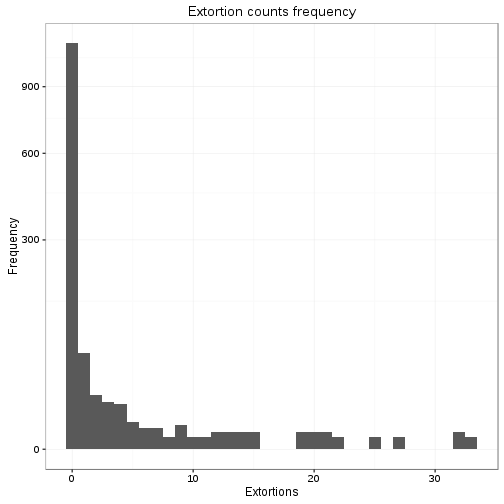

```r
ggplot(business_level_eda, aes(extortions)) +
  geom_density() +
  coord_trans(y="sqrt") +
  theme_bw() +
  ggtitle("Extortion counts density")
```

```
Warning: Removed 24 rows containing non-finite values (stat_density).
```


```r
ggplot(business_level_eda, aes(extortions)) +
  geom_density(adjust=2) +
  coord_trans(y="sqrt") +
  theme_bw() +
  ggtitle("Extortion counts density")
```

```
Warning: Removed 24 rows containing non-finite values (stat_density).
```

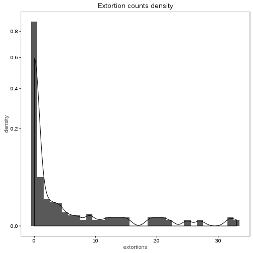

```r
ggplot(business_level_eda, aes(extortions)) +
  geom_density(adjust=3) +
  coord_trans(y="sqrt") +
  theme_bw() +
  ggtitle("Extortion counts density")
```

```
Warning: Removed 24 rows containing non-finite values (stat_density).
```

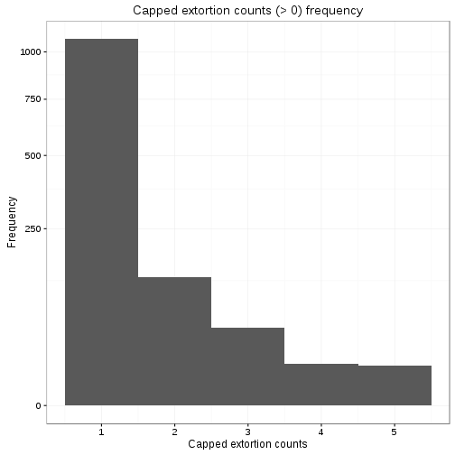

```r
ggplot(business_level_eda, aes(extortions)) +
  geom_histogram(aes(y=..density..), binwidth = 1) + geom_density() +
  coord_trans(y="sqrt") +
  theme_bw() +
  ggtitle("Extortion counts density")
```

```
Warning: Removed 24 rows containing non-finite values (stat_bin).
```

```
Warning: Removed 24 rows containing non-finite values (stat_density).
```

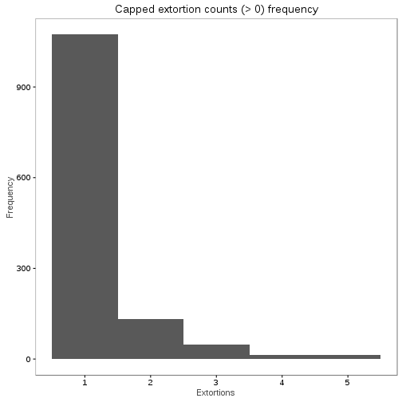

```r
ggplot(business_level_eda, aes(extortions)) +
  geom_histogram(aes(y=..density..), binwidth = 1) + geom_density(adjust=2) +
  coord_trans(y="sqrt") +
  theme_bw() +
  ggtitle("Extortion counts density")
```

```
Warning: Removed 24 rows containing non-finite values (stat_bin).

Warning: Removed 24 rows containing non-finite values (stat_density).
```

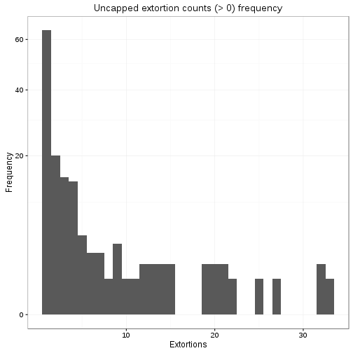

```r
ggplot(business_level_eda, aes(extortions)) +
  geom_histogram(aes(y=..density..), binwidth = 1) + geom_density(adjust=3) +
  coord_trans(y="sqrt") +
  theme_bw() +
  ggtitle("Extortion counts density")
```

```
Warning: Removed 24 rows containing non-finite values (stat_bin).

Warning: Removed 24 rows containing non-finite values (stat_density).
```


```r
## plot the capped distrbution of extortion

capped_ext_count <- table(enve_incvic$CVE_UNICA)

capped_ext_count_df <- data.frame(capped_ext_count)

names(capped_ext_count_df) <- c("CVE_UNICA", "Extortions")

table(capped_ext_count)
```

```
capped_ext_count
   1    2    3    4    5 
1073  131   48   14   13 
```

```r
ggplot(capped_ext_count_df, aes(Extortions)) +
  geom_histogram(binwidth = 1) +
  coord_trans(y="sqrt") +
  theme_bw() +
  ylab("Frequency") +
  xlab("Capped extortion counts") +
  ggtitle("Capped extortion counts (> 0) frequency") +
  expand_limits(y=1)
```


```r
ggplot(capped_ext_count_df, aes(Extortions)) +
  geom_histogram(binwidth = 1) +
  #coord_trans(y="sqrt") +
  theme_bw() +
  ylab("Frequency") +
  ggtitle("Capped extortion counts (> 0) frequency") +
  expand_limits(y=1)
```


```r
ggplot(business_level_eda[business_level_eda$extortions>0,], aes(extortions)) +
  geom_histogram(binwidth = 1) +
  coord_trans(y="sqrt") +
  theme_bw() +
  ylab("Frequency") +
  xlab("Extortions") +
  ggtitle("Uncapped extortion counts (> 0) frequency") +
  expand_limits(y=1)
```

```
Warning: Removed 24 rows containing non-finite values (stat_bin).
```

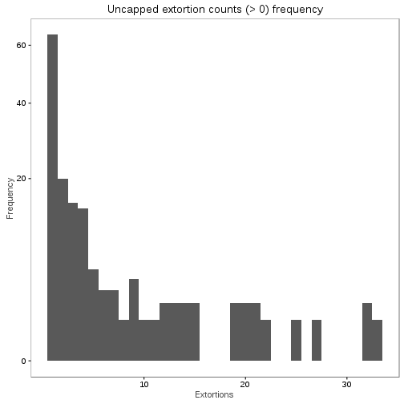

```r
ggplot(business_level_eda[business_level_eda$extortions>0,], aes(extortions)) +
  geom_histogram(binwidth = 1) +
  #coord_trans(y="sqrt") +
  theme_bw() +
  ylab("Frequency") +
  xlab("Extortions") +
  ggtitle("Uncapped extortion counts (> 0) frequency") +
  expand_limits(y=1)
```

```
Warning: Removed 24 rows containing non-finite values (stat_bin).
```

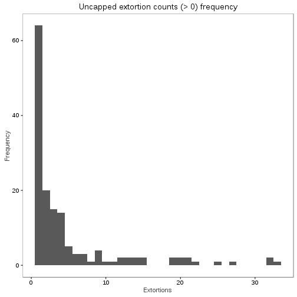

```r
# other extortion variables
table(business_level_eda$extortion_victim)
```

```

   1    2    9 
 151 1104   24 
```

```r
table(business_level_eda$rep_extortion_victim)
```

```

   0    1 
1168   87 
```

Now we create a summary table of business and state level variables


```r
### Summary table of business and state level variables

summ_table <- data.frame(variable=0, N=0, prevalence=0, incidence=0, mean=0,
                         sd=0, min=0, max=0)

ind <- 1
for (i in 1:length(business_level_eda))
{
  if (colnames(business_level_eda)[i] %in% c("extortions", "bribes"))
  {
    summ_table[ind,1] <- colnames(business_level_eda)[i]
    summ_table[ind,2] <- length(business_level_eda[,i])
    summ_table[ind,3] <- length(business_level_eda[business_level_eda[,i] != 0,i])
    summ_table[ind,4] <- sum(business_level_eda[,i])
    summ_table[ind,5] <- mean(business_level_eda[,i])
    summ_table[ind,6] <- sd(business_level_eda[,i])
    summ_table[ind,7] <- min(business_level_eda[,i])
    summ_table[ind,8] <- max(business_level_eda[,i])
  }

  else if (colnames(business_level_eda)[i] %in%
           c("rep_extortion_victim", "bribe_victim", "rep_bribe"))
  {
    summ_table[ind,1] <- colnames(business_level_eda)[i]
    summ_table[ind,2] <- length(business_level_eda[,i])
    summ_table[ind,3] <- length(business_level_eda[business_level_eda[,i] != 0,i])
    summ_table[ind,5] <- summ_table[ind,3]/summ_table[ind,2]
  }

  else if (colnames(business_level_eda)[i] == "years")
  {
    summ_table[ind,1] <- colnames(business_level_eda)[i]
    summ_table[ind,2] <- length(business_level_eda[,i])
    summ_table[ind,5] <- mean(business_level_eda[,i])
    summ_table[ind,6] <- sd(business_level_eda[,i])
    summ_table[ind,7] <- min(business_level_eda[,i])
    summ_table[ind,8] <- max(business_level_eda[,i])
  }

  else if (colnames(business_level_eda)[i] %in% c("size", "subsector",
                                         "restbar", "yearsquant"))
  {
    for (a in 1:length(levels(business_level_eda[,i])))
    {
      summ_table[ind,1] <- levels(business_level_eda[,i])[a]
      summ_table[ind,2] <- length(business_level_eda[business_level_eda[,i] ==
                                        levels(business_level_eda[,i])[a],i])
      summ_table[ind,5] <- summ_table[ind,2]/length(business_level_eda[,1])
      ind <- ind + 1
    }
  }
  ind <- ind + 1
}


summ_table[length(summ_table[,1])+1,] <- c(
            NA, length(homicidios[,"tasahom"]), NA, NA,
            mean(homicidios[,"tasahom"]), sd(homicidios[,"tasahom"]),
            min(homicidios[,"tasahom"]), max(homicidios[,"tasahom"]))

summ_table[length(summ_table[,1]),1] <- "state murder rt"

# homicido absoluto
summ_table[length(summ_table[,1])+1,] <- c(
            NA, length(homicidios[,"denuncias_homs"]), NA, NA,
            mean(homicidios[,"denuncias_homs"]), sd(homicidios[,"denuncias_homs"]),
            min(homicidios[,"denuncias_homs"]), max(homicidios[,"denuncias_homs"]))

summ_table[length(summ_table[,1]),1] <- "Murders"

#population
summ_table[length(summ_table[,1])+1,] <- c(
            NA, length(homicidios[,"poblacion"]), NA, NA,
            mean(homicidios[,"poblacion"])/1000, sd(homicidios[,"poblacion"])/1000,
            min(homicidios[,"poblacion"])/1000, max(homicidios[,"poblacion"])/1000)

summ_table[length(summ_table[,1]),1] <- "Population (in thousands)"

summ_table <- summ_table[!is.na(summ_table[,1]),]

summ_table[,c(5:8)] <- round(summ_table[,c(5:8)],3)

summ_table
```

```
                    variable    N prevalence incidence     mean       sd
1                          0    0          0         0    0.000    0.000
2                 extortions 1279        175        NA       NA       NA
4       rep_extortion_victim 1279        111        NA    0.087       NA
6                     bribes 1279        164        NA       NA       NA
11              bribe_victim 1279        164        NA    0.128       NA
12                 rep_bribe 1279        103        NA    0.081       NA
14                     Large  314         NA        NA    0.246       NA
15                    Medium  310         NA        NA    0.242       NA
16                     Small  288         NA        NA    0.225       NA
17                     Micro  367         NA        NA    0.287       NA
21                    Retail   36         NA        NA    0.028       NA
22             HotelsRestBar  189         NA        NA    0.148       NA
23                  Industry  464         NA        NA    0.363       NA
24               Services_Hi   40         NA        NA    0.031       NA
25              Services_Low  271         NA        NA    0.212       NA
26              Services_Mid  158         NA        NA    0.124       NA
27                 Transport   67         NA        NA    0.052       NA
28                 Wholesale   54         NA        NA    0.042       NA
32                     years 1279         NA        NA   20.586   12.603
33                     [0,8]  287         NA        NA    0.224       NA
34                    (8,16]  250         NA        NA    0.195       NA
35                   (16,25]  257         NA        NA    0.201       NA
36                   (25,34]  258         NA        NA    0.202       NA
37                   (34,43]  227         NA        NA    0.177       NA
38           state murder rt   32         NA        NA   16.168   12.634
39                   Murders   32         NA        NA  572.844  526.363
40 Population (in thousands)   32         NA        NA 3699.845 3152.545
       min       max
1    0.000     0.000
2       NA        NA
4       NA        NA
6       NA        NA
11      NA        NA
12      NA        NA
14      NA        NA
15      NA        NA
16      NA        NA
17      NA        NA
21      NA        NA
22      NA        NA
23      NA        NA
24      NA        NA
25      NA        NA
26      NA        NA
27      NA        NA
28      NA        NA
32   0.000    43.000
33      NA        NA
34      NA        NA
35      NA        NA
36      NA        NA
37      NA        NA
38   1.938    59.225
39  39.000  2087.000
40 698.295 16364.210
```

```r
kable(summ_table, row.names = F)
```


|variable                  |    N| prevalence| incidence|     mean|       sd|     min|       max|
|:-------------------------|----:|----------:|---------:|--------:|--------:|-------:|---------:|
|0                         |    0|          0|         0|    0.000|    0.000|   0.000|     0.000|
|extortions                | 1279|        175|        NA|       NA|       NA|      NA|        NA|
|rep_extortion_victim      | 1279|        111|        NA|    0.087|       NA|      NA|        NA|
|bribes                    | 1279|        164|        NA|       NA|       NA|      NA|        NA|
|bribe_victim              | 1279|        164|        NA|    0.128|       NA|      NA|        NA|
|rep_bribe                 | 1279|        103|        NA|    0.081|       NA|      NA|        NA|
|Large                     |  314|         NA|        NA|    0.246|       NA|      NA|        NA|
|Medium                    |  310|         NA|        NA|    0.242|       NA|      NA|        NA|
|Small                     |  288|         NA|        NA|    0.225|       NA|      NA|        NA|
|Micro                     |  367|         NA|        NA|    0.287|       NA|      NA|        NA|
|Retail                    |   36|         NA|        NA|    0.028|       NA|      NA|        NA|
|HotelsRestBar             |  189|         NA|        NA|    0.148|       NA|      NA|        NA|
|Industry                  |  464|         NA|        NA|    0.363|       NA|      NA|        NA|
|Services_Hi               |   40|         NA|        NA|    0.031|       NA|      NA|        NA|
|Services_Low              |  271|         NA|        NA|    0.212|       NA|      NA|        NA|
|Services_Mid              |  158|         NA|        NA|    0.124|       NA|      NA|        NA|
|Transport                 |   67|         NA|        NA|    0.052|       NA|      NA|        NA|
|Wholesale                 |   54|         NA|        NA|    0.042|       NA|      NA|        NA|
|years                     | 1279|         NA|        NA|   20.586|   12.603|   0.000|    43.000|
|[0,8]                     |  287|         NA|        NA|    0.224|       NA|      NA|        NA|
|(8,16]                    |  250|         NA|        NA|    0.195|       NA|      NA|        NA|
|(16,25]                   |  257|         NA|        NA|    0.201|       NA|      NA|        NA|
|(25,34]                   |  258|         NA|        NA|    0.202|       NA|      NA|        NA|
|(34,43]                   |  227|         NA|        NA|    0.177|       NA|      NA|        NA|
|state murder rt           |   32|         NA|        NA|   16.168|   12.634|   1.938|    59.225|
|Murders                   |   32|         NA|        NA|  572.844|  526.363|  39.000|  2087.000|
|Population (in thousands) |   32|         NA|        NA| 3699.845| 3152.545| 698.295| 16364.210|

As a precaution, explore the distribution of the dependent variable with the categorical business-level variables (size, subsector, yearsquant). Since if some categories have very few observations, they will probably have to be aggregated or the models might not converge.


```r
# size

t100 <- table(enve_incvic$size, enve_incvic$complied_bin)
t100
```

```
        
          No Yes
  Large  272  22
  Medium 296  24
  Small  232  36
  Micro  332  18
```

```r
kable(t100)
```


|       |  No| Yes|
|:------|---:|---:|
|Large  | 272|  22|
|Medium | 296|  24|
|Small  | 232|  36|
|Micro  | 332|  18|

```r
t100/as.integer(margin.table(t100, margin=1))*100
```

```
        
                No       Yes
  Large  92.517007  7.482993
  Medium 92.500000  7.500000
  Small  86.567164 13.432836
  Micro  94.857143  5.142857
```

```r
kable(round(t100/as.integer(margin.table(t100, margin=1))*100, 2))
```


|       |    No|   Yes|
|:------|-----:|-----:|
|Large  | 92.52|  7.48|
|Medium | 92.50|  7.50|
|Small  | 86.57| 13.43|
|Micro  | 94.86|  5.14|

```r
chisq.test(t100)
```

```

	Pearson's Chi-squared test

data:  t100
X-squared = 14.627, df = 3, p-value = 0.002165
```

```r
chisq.test(t100)$expected
```

```
        
               No      Yes
  Large  270.1364 23.86364
  Medium 294.0260 25.97403
  Small  246.2468 21.75325
  Micro  321.5909 28.40909
```

```r
chisq.test(t100, simulate.p.value=TRUE, B=9999)
```

```

	Pearson's Chi-squared test with simulated p-value (based on 9999
	replicates)

data:  t100
X-squared = 14.627, df = NA, p-value = 0.0024
```

```r
print("Cramer's V'")
```

```
[1] "Cramer's V'"
```

```r
cv.test(t100)
```

```
[1] 0.1089624
```

```r
# USE NA

t101 <- table(enve_incvic$size, enve_incvic$complied_bin, useNA = "ifany")
t101
```

```
        
          No Yes <NA>
  Large  272  22  100
  Medium 296  24   66
  Small  232  36  101
  Micro  332  18  101
```

```r
kable(t101)
```


|       |  No| Yes|  NA|
|:------|---:|---:|---:|
|Large  | 272|  22| 100|
|Medium | 296|  24|  66|
|Small  | 232|  36| 101|
|Micro  | 332|  18| 101|

```r
t101/as.integer(margin.table(t101, margin=1))*100
```

```
        
                No       Yes      <NA>
  Large  69.035533  5.583756 25.380711
  Medium 76.683938  6.217617 17.098446
  Small  62.872629  9.756098 27.371274
  Micro  73.614191  3.991131 22.394678
```

```r
kable(round(t101/as.integer(margin.table(t101, margin=1))*100, 2))
```


|       |    No|  Yes|    NA|
|:------|-----:|----:|-----:|
|Large  | 69.04| 5.58| 25.38|
|Medium | 76.68| 6.22| 17.10|
|Small  | 62.87| 9.76| 27.37|
|Micro  | 73.61| 3.99| 22.39|

```r
chisq.test(t101)
```

```

	Pearson's Chi-squared test

data:  t101
X-squared = 27.018, df = 6, p-value = 0.0001437
```

```r
chisq.test(t101)$expected
```

```
        
               No     Yes   <NA>
  Large  278.7550 24.6250  90.62
  Medium 273.0950 24.1250  88.78
  Small  261.0675 23.0625  84.87
  Micro  319.0825 28.1875 103.73
```

```r
chisq.test(t101, simulate.p.value=TRUE, B=9999)
```

```

	Pearson's Chi-squared test with simulated p-value (based on 9999
	replicates)

data:  t101
X-squared = 27.018, df = NA, p-value = 4e-04
```

```r
print("Cramer's V'")
```

```
[1] "Cramer's V'"
```

```r
cv.test(t101)
```

```
[1] 0.09188586
```

```r
# subsector

t200 <- table(enve_incvic$subsector, enve_incvic$complied_bin)
t200
```

```
               
                 No Yes
  Retail         28   4
  HotelsRestBar 175   8
  Industry      430  37
  Services_Hi    40   2
  Services_Low  232  23
  Services_Mid  128  17
  Transport      60   5
  Wholesale      39   4
```

```r
kable(t200)
```


|              |  No| Yes|
|:-------------|---:|---:|
|Retail        |  28|   4|
|HotelsRestBar | 175|   8|
|Industry      | 430|  37|
|Services_Hi   |  40|   2|
|Services_Low  | 232|  23|
|Services_Mid  | 128|  17|
|Transport     |  60|   5|
|Wholesale     |  39|   4|

```r
t200/as.integer(margin.table(t200, margin=1))*100
```

```
               
                       No       Yes
  Retail        87.500000 12.500000
  HotelsRestBar 95.628415  4.371585
  Industry      92.077088  7.922912
  Services_Hi   95.238095  4.761905
  Services_Low  90.980392  9.019608
  Services_Mid  88.275862 11.724138
  Transport     92.307692  7.692308
  Wholesale     90.697674  9.302326
```

```r
kable(round(t200/as.integer(margin.table(t200, margin=1))*100, 2))
```


|              |    No|   Yes|
|:-------------|-----:|-----:|
|Retail        | 87.50| 12.50|
|HotelsRestBar | 95.63|  4.37|
|Industry      | 92.08|  7.92|
|Services_Hi   | 95.24|  4.76|
|Services_Low  | 90.98|  9.02|
|Services_Mid  | 88.28| 11.72|
|Transport     | 92.31|  7.69|
|Wholesale     | 90.70|  9.30|

```r
chisq.test(t200)
```

```
Warning in chisq.test(t200): Chi-squared approximation may be incorrect
```

```

	Pearson's Chi-squared test

data:  t200
X-squared = 7.8289, df = 7, p-value = 0.3479
```

```r
chisq.test(t200)$expected
```

```
Warning in chisq.test(t200): Chi-squared approximation may be incorrect
```

```
               
                       No       Yes
  Retail         29.40260  2.597403
  HotelsRestBar 168.14610 14.853896
  Industry      429.09416 37.905844
  Services_Hi    38.59091  3.409091
  Services_Low  234.30195 20.698052
  Services_Mid  133.23052 11.769481
  Transport      59.72403  5.275974
  Wholesale      39.50974  3.490260
```

```r
chisq.test(t200, simulate.p.value=TRUE, B=9999)
```

```

	Pearson's Chi-squared test with simulated p-value (based on 9999
	replicates)

data:  t200
X-squared = 7.8289, df = NA, p-value = 0.3418
```

```r
print("Cramer's V'")
```

```
[1] "Cramer's V'"
```

```r
cv.test(t200)
```

```
Warning in chisq.test(df): Chi-squared approximation may be incorrect
```

```
[1] 0.07971578
```

```r
# USE NA

t201 <- table(enve_incvic$subsector, enve_incvic$complied_bin, useNA = "ifany")
t201
```

```
               
                 No Yes <NA>
  Retail         28   4   18
  HotelsRestBar 175   8   52
  Industry      430  37  118
  Services_Hi    40   2   10
  Services_Low  232  23   83
  Services_Mid  128  17   45
  Transport      60   5   22
  Wholesale      39   4   20
```

```r
kable(t201)
```


|              |  No| Yes|  NA|
|:-------------|---:|---:|---:|
|Retail        |  28|   4|  18|
|HotelsRestBar | 175|   8|  52|
|Industry      | 430|  37| 118|
|Services_Hi   |  40|   2|  10|
|Services_Low  | 232|  23|  83|
|Services_Mid  | 128|  17|  45|
|Transport     |  60|   5|  22|
|Wholesale     |  39|   4|  20|

```r
t201/as.integer(margin.table(t201, margin=1))*100
```

```
               
                       No       Yes      <NA>
  Retail        56.000000  8.000000 36.000000
  HotelsRestBar 74.468085  3.404255 22.127660
  Industry      73.504274  6.324786 20.170940
  Services_Hi   76.923077  3.846154 19.230769
  Services_Low  68.639053  6.804734 24.556213
  Services_Mid  67.368421  8.947368 23.684211
  Transport     68.965517  5.747126 25.287356
  Wholesale     61.904762  6.349206 31.746032
```

```r
kable(round(t201/as.integer(margin.table(t201, margin=1))*100, 2))
```


|              |    No|  Yes|    NA|
|:-------------|-----:|----:|-----:|
|Retail        | 56.00| 8.00| 36.00|
|HotelsRestBar | 74.47| 3.40| 22.13|
|Industry      | 73.50| 6.32| 20.17|
|Services_Hi   | 76.92| 3.85| 19.23|
|Services_Low  | 68.64| 6.80| 24.56|
|Services_Mid  | 67.37| 8.95| 23.68|
|Transport     | 68.97| 5.75| 25.29|
|Wholesale     | 61.90| 6.35| 31.75|

```r
chisq.test(t201)
```

```
Warning in chisq.test(t201): Chi-squared approximation may be incorrect
```

```

	Pearson's Chi-squared test

data:  t201
X-squared = 19.147, df = 14, p-value = 0.1594
```

```r
chisq.test(t201)$expected
```

```
Warning in chisq.test(t201): Chi-squared approximation may be incorrect
```

```
               
                      No     Yes   <NA>
  Retail         35.3750  3.1250  11.50
  HotelsRestBar 166.2625 14.6875  54.05
  Industry      413.8875 36.5625 134.55
  Services_Hi    36.7900  3.2500  11.96
  Services_Low  239.1350 21.1250  77.74
  Services_Mid  134.4250 11.8750  43.70
  Transport      61.5525  5.4375  20.01
  Wholesale      44.5725  3.9375  14.49
```

```r
chisq.test(t201, simulate.p.value=TRUE, B=9999)
```

```

	Pearson's Chi-squared test with simulated p-value (based on 9999
	replicates)

data:  t201
X-squared = 19.147, df = NA, p-value = 0.1575
```

```r
print("Cramer's V'")
```

```
[1] "Cramer's V'"
```

```r
cv.test(t201)
```

```
Warning in chisq.test(df): Chi-squared approximation may be incorrect
```

```
[1] 0.07735179
```

```r
## hotrestbar

t300 <- table(enve_incvic$hotrestbar, enve_incvic$complied_bin)
t300
```

```
   
     No Yes
  0 957  92
  1 175   8
```

```r
kable(t300)
```


|   |  No| Yes|
|:--|---:|---:|
|0  | 957|  92|
|1  | 175|   8|

```r
t300/as.integer(margin.table(t300, margin=1))*100
```

```
   
           No       Yes
  0 91.229743  8.770257
  1 95.628415  4.371585
```

```r
kable(round(t300/as.integer(margin.table(t300, margin=1))*100, 2))
```


|   |    No|  Yes|
|:--|-----:|----:|
|0  | 91.23| 8.77|
|1  | 95.63| 4.37|

```r
chisq.test(t300)
```

```

	Pearson's Chi-squared test with Yates' continuity correction

data:  t300
X-squared = 3.4741, df = 1, p-value = 0.06234
```

```r
chisq.test(t300)$expected
```

```
   
          No     Yes
  0 963.8539 85.1461
  1 168.1461 14.8539
```

```r
chisq.test(t300, simulate.p.value=TRUE, B=9999)
```

```

	Pearson's Chi-squared test with simulated p-value (based on 9999
	replicates)

data:  t300
X-squared = 4.0424, df = NA, p-value = 0.0528
```

```r
print("Cramer's V'")
```

```
[1] "Cramer's V'"
```

```r
cv.test(t300)
```

```
[1] 0.05310242
```

```r
# USE NA

t301 <- table(enve_incvic$hotrestbar, enve_incvic$complied_bin, useNA = "ifany")
t301
```

```
   
     No Yes <NA>
  0 957  92  316
  1 175   8   52
```

```r
kable(t301)
```


|   |  No| Yes|  NA|
|:--|---:|---:|---:|
|0  | 957|  92| 316|
|1  | 175|   8|  52|

```r
t301/as.integer(margin.table(t301, margin=1))*100
```

```
   
           No       Yes      <NA>
  0 70.109890  6.739927 23.150183
  1 74.468085  3.404255 22.127660
```

```r
kable(round(t301/as.integer(margin.table(t301, margin=1))*100, 2))
```


|   |    No|  Yes|    NA|
|:--|-----:|----:|-----:|
|0  | 70.11| 6.74| 23.15|
|1  | 74.47| 3.40| 22.13|

```r
chisq.test(t301)
```

```

	Pearson's Chi-squared test

data:  t301
X-squared = 4.1985, df = 2, p-value = 0.1225
```

```r
chisq.test(t301)$expected
```

```
   
          No     Yes   <NA>
  0 965.7375 85.3125 313.95
  1 166.2625 14.6875  54.05
```

```r
chisq.test(t301, simulate.p.value=TRUE, B=9999)
```

```

	Pearson's Chi-squared test with simulated p-value (based on 9999
	replicates)

data:  t301
X-squared = 4.1985, df = NA, p-value = 0.1164
```

```r
print("Cramer's V'")
```

```
[1] "Cramer's V'"
```

```r
cv.test(t301)
```

```
[1] 0.05122582
```

```r
## years quant

t400 <- table(enve_incvic$yearsquant, enve_incvic$complied_bin)
t400
```

```
         
           No Yes
  [0,8]   256  23
  (8,16]  226  17
  (16,25] 229  21
  (25,34] 223  15
  (34,43] 198  24
```

```r
kable(t400)
```


|        |  No| Yes|
|:-------|---:|---:|
|[0,8]   | 256|  23|
|(8,16]  | 226|  17|
|(16,25] | 229|  21|
|(25,34] | 223|  15|
|(34,43] | 198|  24|

```r
t400/as.integer(margin.table(t400, margin=1))*100
```

```
         
                 No       Yes
  [0,8]   91.756272  8.243728
  (8,16]  93.004115  6.995885
  (16,25] 91.600000  8.400000
  (25,34] 93.697479  6.302521
  (34,43] 89.189189 10.810811
```

```r
kable(round(t400/as.integer(margin.table(t400, margin=1))*100, 2))
```


|        |    No|   Yes|
|:-------|-----:|-----:|
|[0,8]   | 91.76|  8.24|
|(8,16]  | 93.00|  7.00|
|(16,25] | 91.60|  8.40|
|(25,34] | 93.70|  6.30|
|(34,43] | 89.19| 10.81|

```r
chisq.test(t400)
```

```

	Pearson's Chi-squared test

data:  t400
X-squared = 3.6531, df = 4, p-value = 0.455
```

```r
chisq.test(t400)$expected
```

```
         
                No      Yes
  [0,8]   256.3539 22.64610
  (8,16]  223.2760 19.72403
  (16,25] 229.7078 20.29221
  (25,34] 218.6818 19.31818
  (34,43] 203.9805 18.01948
```

```r
chisq.test(t400, simulate.p.value=TRUE, B=9999)
```

```

	Pearson's Chi-squared test with simulated p-value (based on 9999
	replicates)

data:  t400
X-squared = 3.6531, df = NA, p-value = 0.4583
```

```r
print("Cramer's V'")
```

```
[1] "Cramer's V'"
```

```r
cv.test(t400)
```

```
[1] 0.05445321
```

```r
# USE NA

t401 <- table(enve_incvic$yearsquant, enve_incvic$complied_bin, useNA = "ifany")
t401
```

```
         
           No Yes <NA>
  [0,8]   256  23   92
  (8,16]  226  17   71
  (16,25] 229  21   68
  (25,34] 223  15   81
  (34,43] 198  24   56
```

```r
kable(t401)
```


|        |  No| Yes| NA|
|:-------|---:|---:|--:|
|[0,8]   | 256|  23| 92|
|(8,16]  | 226|  17| 71|
|(16,25] | 229|  21| 68|
|(25,34] | 223|  15| 81|
|(34,43] | 198|  24| 56|

```r
t401/as.integer(margin.table(t401, margin=1))*100
```

```
         
                 No       Yes      <NA>
  [0,8]   69.002695  6.199461 24.797844
  (8,16]  71.974522  5.414013 22.611465
  (16,25] 72.012579  6.603774 21.383648
  (25,34] 69.905956  4.702194 25.391850
  (34,43] 71.223022  8.633094 20.143885
```

```r
kable(round(t401/as.integer(margin.table(t401, margin=1))*100, 2))
```


|        |    No|  Yes|    NA|
|:-------|-----:|----:|-----:|
|[0,8]   | 69.00| 6.20| 24.80|
|(8,16]  | 71.97| 5.41| 22.61|
|(16,25] | 72.01| 6.60| 21.38|
|(25,34] | 69.91| 4.70| 25.39|
|(34,43] | 71.22| 8.63| 20.14|

```r
chisq.test(t401)
```

```

	Pearson's Chi-squared test

data:  t401
X-squared = 7.187, df = 8, p-value = 0.5166
```

```r
chisq.test(t401)$expected
```

```
         
                No     Yes  <NA>
  [0,8]   262.4825 23.1875 85.33
  (8,16]  222.1550 19.6250 72.22
  (16,25] 224.9850 19.8750 73.14
  (25,34] 225.6925 19.9375 73.37
  (34,43] 196.6850 17.3750 63.94
```

```r
chisq.test(t401, simulate.p.value=TRUE, B=9999)
```

```

	Pearson's Chi-squared test with simulated p-value (based on 9999
	replicates)

data:  t401
X-squared = 7.187, df = NA, p-value = 0.5235
```

```r
print("Cramer's V'")
```

```
[1] "Cramer's V'"
```

```r
cv.test(t401)
```

```
[1] 0.04739139
```

# Models

First we'll try a single level logistic and see how post-hoc analyses work.

As we have many missing values, will start with a saturated model and drop them sequentially, either by hand or through a function.


First we start with the most restricted not excluding weapons, violence or offender variables.


```r
excnames <- quote(c(complied_bin,
                      extortion_type,
                      month, time,
                      n_offenders,
                      had_weapon,
                      with_violence,
                      reported,
                      rep_extortion_victim,
                      bribe_victim,
                      size, hotrestbar, yearsquant,
                      loghoms, logpop))


m1df <- enve_incvic[which(complete.cases(subset(enve_incvic,
                                                select=eval(excnames)))),]

## Single level first
m1 <- glm(complied_bin ~
           extortion_type +
           time +
           n_offenders +
           had_weapon +
           with_violence +
           reported +
           rep_extortion_victim +
           bribe_victim +
           size + hotrestbar + yearsquant +
           loghoms + logpop,
         data=m1df,
         family = "binomial")

summary(m1)
```

```

Call:
glm(formula = complied_bin ~ extortion_type + time + n_offenders + 
    had_weapon + with_violence + reported + rep_extortion_victim + 
    bribe_victim + size + hotrestbar + yearsquant + loghoms + 
    logpop, family = "binomial", data = m1df)

Deviance Residuals: 
    Min       1Q   Median       3Q      Max  
-1.7373  -0.4093  -0.2803  -0.1825   2.8187  

Coefficients:
                              Estimate Std. Error z value Pr(>|z|)    
(Intercept)                   -3.42018    0.60697  -5.635 1.75e-08 ***
extortion_typeStreet           1.12635    0.58069   1.940 0.052418 .  
extortion_typePremises        18.17198 1069.69478   0.017 0.986446    
extortion_typeCobro de piso    2.41194    0.97287   2.479 0.013168 *  
timeAfternoon                  0.05026    0.38103   0.132 0.895066    
timeEvening                   -0.32041    0.50944  -0.629 0.529385    
timeNight                      2.17266    0.97046   2.239 0.025170 *  
timeDK/DA                      1.68126    1.47897   1.137 0.255629    
n_offenders2                   1.05275    0.37556   2.803 0.005061 ** 
n_offenders3                   0.96485    0.64211   1.503 0.132932    
n_offenders4+                  2.68648    0.80272   3.347 0.000818 ***
n_offendersDK/DA               0.16231    0.77357   0.210 0.833808    
had_weaponYes                  0.75089    0.73804   1.017 0.308960    
had_weaponDK/DA               -0.01122    0.37276  -0.030 0.975983    
with_violenceYes               0.36520    0.86135   0.424 0.671576    
with_violenceDK/DA             0.69679    0.66537   1.047 0.294999    
reportedYes                    0.65618    0.39649   1.655 0.097932 .  
rep_extortion_victim1          1.04291    0.55412   1.882 0.059820 .  
bribe_victim1                  0.10118    0.49782   0.203 0.838943    
sizeMedium                    -0.15490    0.46183  -0.335 0.737316    
sizeSmall                      0.57247    0.44306   1.292 0.196327    
sizeMicro                     -0.66546    0.50186  -1.326 0.184839    
hotrestbar1                   -0.98413    0.57576  -1.709 0.087404 .  
yearsquant(8,16]              -0.11273    0.55354  -0.204 0.838623    
yearsquant(16,25]              0.77097    0.49424   1.560 0.118776    
yearsquant(25,34]             -0.26359    0.57431  -0.459 0.646257    
yearsquant(34,43]              1.17233    0.50986   2.299 0.021487 *  
loghoms                       -0.06576    0.23506  -0.280 0.779675    
logpop                         0.49658    0.35492   1.399 0.161769    
---
Signif. codes:  0 '***' 0.001 '**' 0.01 '*' 0.05 '.' 0.1 ' ' 1

(Dispersion parameter for binomial family taken to be 1)

    Null deviance: 439.55  on 612  degrees of freedom
Residual deviance: 294.09  on 584  degrees of freedom
AIC: 352.09

Number of Fisher Scoring iterations: 16
```

```r
pR2(m1)
```

```
         llh      llhNull           G2     McFadden         r2ML 
-147.0470700 -219.7732617  145.4523833    0.3309146    0.2112293 
        r2CU 
   0.4127138 
```

```r
#print(xtable(m1), type="html")
#htmlreg(m1)
screenreg(m1)
```

```

=========================================
                             Model 1     
-----------------------------------------
(Intercept)                     -3.42 ***
                                (0.61)   
extortion_typeStreet             1.13    
                                (0.58)   
extortion_typePremises          18.17    
                             (1069.69)   
extortion_typeCobro de piso      2.41 *  
                                (0.97)   
timeAfternoon                    0.05    
                                (0.38)   
timeEvening                     -0.32    
                                (0.51)   
timeNight                        2.17 *  
                                (0.97)   
timeDK/DA                        1.68    
                                (1.48)   
n_offenders2                     1.05 ** 
                                (0.38)   
n_offenders3                     0.96    
                                (0.64)   
n_offenders4+                    2.69 ***
                                (0.80)   
n_offendersDK/DA                 0.16    
                                (0.77)   
had_weaponYes                    0.75    
                                (0.74)   
had_weaponDK/DA                 -0.01    
                                (0.37)   
with_violenceYes                 0.37    
                                (0.86)   
with_violenceDK/DA               0.70    
                                (0.67)   
reportedYes                      0.66    
                                (0.40)   
rep_extortion_victim1            1.04    
                                (0.55)   
bribe_victim1                    0.10    
                                (0.50)   
sizeMedium                      -0.15    
                                (0.46)   
sizeSmall                        0.57    
                                (0.44)   
sizeMicro                       -0.67    
                                (0.50)   
hotrestbar1                     -0.98    
                                (0.58)   
yearsquant(8,16]                -0.11    
                                (0.55)   
yearsquant(16,25]                0.77    
                                (0.49)   
yearsquant(25,34]               -0.26    
                                (0.57)   
yearsquant(34,43]                1.17 *  
                                (0.51)   
loghoms                         -0.07    
                                (0.24)   
logpop                           0.50    
                                (0.35)   
-----------------------------------------
AIC                            352.09    
BIC                            480.23    
Log Likelihood                -147.05    
Deviance                       294.09    
Num. obs.                      613       
=========================================
*** p < 0.001, ** p < 0.01, * p < 0.05
```

```r
nobs(m1)
```

```
[1] 613
```

```r
confint(m1)
```

```
Waiting for profiling to be done...
```

```
Warning: glm.fit: fitted probabilities numerically 0 or 1 occurred

Warning: glm.fit: fitted probabilities numerically 0 or 1 occurred

Warning: glm.fit: fitted probabilities numerically 0 or 1 occurred

Warning: glm.fit: fitted probabilities numerically 0 or 1 occurred

Warning: glm.fit: fitted probabilities numerically 0 or 1 occurred

Warning: glm.fit: fitted probabilities numerically 0 or 1 occurred

Warning: glm.fit: fitted probabilities numerically 0 or 1 occurred

Warning: glm.fit: fitted probabilities numerically 0 or 1 occurred

Warning: glm.fit: fitted probabilities numerically 0 or 1 occurred

Warning: glm.fit: fitted probabilities numerically 0 or 1 occurred
```

```
Warning: glm.fit: algorithm did not converge
```

```
Warning: glm.fit: fitted probabilities numerically 0 or 1 occurred

Warning: glm.fit: fitted probabilities numerically 0 or 1 occurred

Warning: glm.fit: fitted probabilities numerically 0 or 1 occurred

Warning: glm.fit: fitted probabilities numerically 0 or 1 occurred

Warning: glm.fit: fitted probabilities numerically 0 or 1 occurred

Warning: glm.fit: fitted probabilities numerically 0 or 1 occurred

Warning: glm.fit: fitted probabilities numerically 0 or 1 occurred

Warning: glm.fit: fitted probabilities numerically 0 or 1 occurred

Warning: glm.fit: fitted probabilities numerically 0 or 1 occurred

Warning: glm.fit: fitted probabilities numerically 0 or 1 occurred

Warning: glm.fit: fitted probabilities numerically 0 or 1 occurred

Warning: glm.fit: fitted probabilities numerically 0 or 1 occurred

Warning: glm.fit: fitted probabilities numerically 0 or 1 occurred

Warning: glm.fit: fitted probabilities numerically 0 or 1 occurred

Warning: glm.fit: fitted probabilities numerically 0 or 1 occurred

Warning: glm.fit: fitted probabilities numerically 0 or 1 occurred

Warning: glm.fit: fitted probabilities numerically 0 or 1 occurred

Warning: glm.fit: fitted probabilities numerically 0 or 1 occurred

Warning: glm.fit: fitted probabilities numerically 0 or 1 occurred

Warning: glm.fit: fitted probabilities numerically 0 or 1 occurred

Warning: glm.fit: fitted probabilities numerically 0 or 1 occurred

Warning: glm.fit: fitted probabilities numerically 0 or 1 occurred

Warning: glm.fit: fitted probabilities numerically 0 or 1 occurred

Warning: glm.fit: fitted probabilities numerically 0 or 1 occurred

Warning: glm.fit: fitted probabilities numerically 0 or 1 occurred

Warning: glm.fit: fitted probabilities numerically 0 or 1 occurred

Warning: glm.fit: fitted probabilities numerically 0 or 1 occurred

Warning: glm.fit: fitted probabilities numerically 0 or 1 occurred

Warning: glm.fit: fitted probabilities numerically 0 or 1 occurred

Warning: glm.fit: fitted probabilities numerically 0 or 1 occurred

Warning: glm.fit: fitted probabilities numerically 0 or 1 occurred

Warning: glm.fit: fitted probabilities numerically 0 or 1 occurred

Warning: glm.fit: fitted probabilities numerically 0 or 1 occurred

Warning: glm.fit: fitted probabilities numerically 0 or 1 occurred

Warning: glm.fit: fitted probabilities numerically 0 or 1 occurred

Warning: glm.fit: fitted probabilities numerically 0 or 1 occurred

Warning: glm.fit: fitted probabilities numerically 0 or 1 occurred

Warning: glm.fit: fitted probabilities numerically 0 or 1 occurred

Warning: glm.fit: fitted probabilities numerically 0 or 1 occurred

Warning: glm.fit: fitted probabilities numerically 0 or 1 occurred

Warning: glm.fit: fitted probabilities numerically 0 or 1 occurred

Warning: glm.fit: fitted probabilities numerically 0 or 1 occurred

Warning: glm.fit: fitted probabilities numerically 0 or 1 occurred

Warning: glm.fit: fitted probabilities numerically 0 or 1 occurred

Warning: glm.fit: fitted probabilities numerically 0 or 1 occurred

Warning: glm.fit: fitted probabilities numerically 0 or 1 occurred

Warning: glm.fit: fitted probabilities numerically 0 or 1 occurred

Warning: glm.fit: fitted probabilities numerically 0 or 1 occurred

Warning: glm.fit: fitted probabilities numerically 0 or 1 occurred

Warning: glm.fit: fitted probabilities numerically 0 or 1 occurred

Warning: glm.fit: fitted probabilities numerically 0 or 1 occurred

Warning: glm.fit: fitted probabilities numerically 0 or 1 occurred

Warning: glm.fit: fitted probabilities numerically 0 or 1 occurred

Warning: glm.fit: fitted probabilities numerically 0 or 1 occurred

Warning: glm.fit: fitted probabilities numerically 0 or 1 occurred

Warning: glm.fit: fitted probabilities numerically 0 or 1 occurred

Warning: glm.fit: fitted probabilities numerically 0 or 1 occurred

Warning: glm.fit: fitted probabilities numerically 0 or 1 occurred

Warning: glm.fit: fitted probabilities numerically 0 or 1 occurred

Warning: glm.fit: fitted probabilities numerically 0 or 1 occurred

Warning: glm.fit: fitted probabilities numerically 0 or 1 occurred

Warning: glm.fit: fitted probabilities numerically 0 or 1 occurred

Warning: glm.fit: fitted probabilities numerically 0 or 1 occurred

Warning: glm.fit: fitted probabilities numerically 0 or 1 occurred

Warning: glm.fit: fitted probabilities numerically 0 or 1 occurred

Warning: glm.fit: fitted probabilities numerically 0 or 1 occurred

Warning: glm.fit: fitted probabilities numerically 0 or 1 occurred

Warning: glm.fit: fitted probabilities numerically 0 or 1 occurred

Warning: glm.fit: fitted probabilities numerically 0 or 1 occurred

Warning: glm.fit: fitted probabilities numerically 0 or 1 occurred

Warning: glm.fit: fitted probabilities numerically 0 or 1 occurred

Warning: glm.fit: fitted probabilities numerically 0 or 1 occurred

Warning: glm.fit: fitted probabilities numerically 0 or 1 occurred

Warning: glm.fit: fitted probabilities numerically 0 or 1 occurred

Warning: glm.fit: fitted probabilities numerically 0 or 1 occurred

Warning: glm.fit: fitted probabilities numerically 0 or 1 occurred

Warning: glm.fit: fitted probabilities numerically 0 or 1 occurred

Warning: glm.fit: fitted probabilities numerically 0 or 1 occurred

Warning: glm.fit: fitted probabilities numerically 0 or 1 occurred

Warning: glm.fit: fitted probabilities numerically 0 or 1 occurred

Warning: glm.fit: fitted probabilities numerically 0 or 1 occurred

Warning: glm.fit: fitted probabilities numerically 0 or 1 occurred

Warning: glm.fit: fitted probabilities numerically 0 or 1 occurred

Warning: glm.fit: fitted probabilities numerically 0 or 1 occurred

Warning: glm.fit: fitted probabilities numerically 0 or 1 occurred

Warning: glm.fit: fitted probabilities numerically 0 or 1 occurred

Warning: glm.fit: fitted probabilities numerically 0 or 1 occurred

Warning: glm.fit: fitted probabilities numerically 0 or 1 occurred

Warning: glm.fit: fitted probabilities numerically 0 or 1 occurred

Warning: glm.fit: fitted probabilities numerically 0 or 1 occurred

Warning: glm.fit: fitted probabilities numerically 0 or 1 occurred

Warning: glm.fit: fitted probabilities numerically 0 or 1 occurred

Warning: glm.fit: fitted probabilities numerically 0 or 1 occurred

Warning: glm.fit: fitted probabilities numerically 0 or 1 occurred

Warning: glm.fit: fitted probabilities numerically 0 or 1 occurred

Warning: glm.fit: fitted probabilities numerically 0 or 1 occurred

Warning: glm.fit: fitted probabilities numerically 0 or 1 occurred

Warning: glm.fit: fitted probabilities numerically 0 or 1 occurred

Warning: glm.fit: fitted probabilities numerically 0 or 1 occurred

Warning: glm.fit: fitted probabilities numerically 0 or 1 occurred

Warning: glm.fit: fitted probabilities numerically 0 or 1 occurred

Warning: glm.fit: fitted probabilities numerically 0 or 1 occurred

Warning: glm.fit: fitted probabilities numerically 0 or 1 occurred

Warning: glm.fit: fitted probabilities numerically 0 or 1 occurred

Warning: glm.fit: fitted probabilities numerically 0 or 1 occurred

Warning: glm.fit: fitted probabilities numerically 0 or 1 occurred

Warning: glm.fit: fitted probabilities numerically 0 or 1 occurred

Warning: glm.fit: fitted probabilities numerically 0 or 1 occurred

Warning: glm.fit: fitted probabilities numerically 0 or 1 occurred

Warning: glm.fit: fitted probabilities numerically 0 or 1 occurred

Warning: glm.fit: fitted probabilities numerically 0 or 1 occurred

Warning: glm.fit: fitted probabilities numerically 0 or 1 occurred

Warning: glm.fit: fitted probabilities numerically 0 or 1 occurred

Warning: glm.fit: fitted probabilities numerically 0 or 1 occurred

Warning: glm.fit: fitted probabilities numerically 0 or 1 occurred

Warning: glm.fit: fitted probabilities numerically 0 or 1 occurred

Warning: glm.fit: fitted probabilities numerically 0 or 1 occurred

Warning: glm.fit: fitted probabilities numerically 0 or 1 occurred

Warning: glm.fit: fitted probabilities numerically 0 or 1 occurred

Warning: glm.fit: fitted probabilities numerically 0 or 1 occurred

Warning: glm.fit: fitted probabilities numerically 0 or 1 occurred

Warning: glm.fit: fitted probabilities numerically 0 or 1 occurred

Warning: glm.fit: fitted probabilities numerically 0 or 1 occurred

Warning: glm.fit: fitted probabilities numerically 0 or 1 occurred

Warning: glm.fit: fitted probabilities numerically 0 or 1 occurred

Warning: glm.fit: fitted probabilities numerically 0 or 1 occurred

Warning: glm.fit: fitted probabilities numerically 0 or 1 occurred

Warning: glm.fit: fitted probabilities numerically 0 or 1 occurred

Warning: glm.fit: fitted probabilities numerically 0 or 1 occurred

Warning: glm.fit: fitted probabilities numerically 0 or 1 occurred

Warning: glm.fit: fitted probabilities numerically 0 or 1 occurred

Warning: glm.fit: fitted probabilities numerically 0 or 1 occurred

Warning: glm.fit: fitted probabilities numerically 0 or 1 occurred

Warning: glm.fit: fitted probabilities numerically 0 or 1 occurred

Warning: glm.fit: fitted probabilities numerically 0 or 1 occurred

Warning: glm.fit: fitted probabilities numerically 0 or 1 occurred

Warning: glm.fit: fitted probabilities numerically 0 or 1 occurred

Warning: glm.fit: fitted probabilities numerically 0 or 1 occurred

Warning: glm.fit: fitted probabilities numerically 0 or 1 occurred

Warning: glm.fit: fitted probabilities numerically 0 or 1 occurred

Warning: glm.fit: fitted probabilities numerically 0 or 1 occurred

Warning: glm.fit: fitted probabilities numerically 0 or 1 occurred

Warning: glm.fit: fitted probabilities numerically 0 or 1 occurred

Warning: glm.fit: fitted probabilities numerically 0 or 1 occurred

Warning: glm.fit: fitted probabilities numerically 0 or 1 occurred

Warning: glm.fit: fitted probabilities numerically 0 or 1 occurred

Warning: glm.fit: fitted probabilities numerically 0 or 1 occurred

Warning: glm.fit: fitted probabilities numerically 0 or 1 occurred

Warning: glm.fit: fitted probabilities numerically 0 or 1 occurred
```

```
                                   2.5 %       97.5 %
(Intercept)                  -4.68113396  -2.29377308
extortion_typeStreet         -0.04332963   2.25097375
extortion_typePremises      -36.72984322 320.21298947
extortion_typeCobro de piso   0.50450239   4.40084129
timeAfternoon                -0.69102974   0.81218581
timeEvening                  -1.36333994   0.65156288
timeNight                     0.03083743   3.99334783
timeDK/DA                    -1.75827533   4.44439417
n_offenders2                  0.30637042   1.78776818
n_offenders3                 -0.38597263   2.16585453
n_offenders4+                 1.10709093   4.28607922
n_offendersDK/DA             -1.59953404   1.52871443
had_weaponYes                -0.70873568   2.20797695
had_weaponDK/DA              -0.74811875   0.72293180
with_violenceYes             -1.37624572   2.03140506
with_violenceDK/DA           -0.72425427   1.93517139
reportedYes                  -0.15101966   1.41379214
rep_extortion_victim1        -0.12559472   2.07595768
bribe_victim1                -0.95509012   1.02223267
sizeMedium                   -1.06865676   0.75815731
sizeSmall                    -0.29125006   1.45906095
sizeMicro                    -1.67815353   0.31026835
hotrestbar1                  -2.23908867   0.05038694
yearsquant(8,16]             -1.22905246   0.96938368
yearsquant(16,25]            -0.19054772   1.76508600
yearsquant(25,34]            -1.43090098   0.84927860
yearsquant(34,43]             0.18673328   2.20171943
loghoms                      -0.53133468   0.39383780
logpop                       -0.18827383   1.20826692
```

```r
# compare with null
lrtest(m1)
```

```
Likelihood ratio test

Model 1: complied_bin ~ extortion_type + time + n_offenders + had_weapon + 
    with_violence + reported + rep_extortion_victim + bribe_victim + 
    size + hotrestbar + yearsquant + loghoms + logpop
Model 2: complied_bin ~ 1
  #Df  LogLik  Df  Chisq Pr(>Chisq)    
1  29 -147.05                          
2   1 -219.77 -28 145.45  < 2.2e-16 ***
---
Signif. codes:  0 '***' 0.001 '**' 0.01 '*' 0.05 '.' 0.1 ' ' 1
```

```r
kable(lrtest(m1))
```


| #Df|    LogLik|  Df|    Chisq| Pr(>Chisq)|
|---:|---------:|---:|--------:|----------:|
|  29| -147.0471|  NA|       NA|         NA|
|   1| -219.7733| -28| 145.4524|          0|

```r
waldtest(m1)
```

```
Wald test

Model 1: complied_bin ~ extortion_type + time + n_offenders + had_weapon + 
    with_violence + reported + rep_extortion_victim + bribe_victim + 
    size + hotrestbar + yearsquant + loghoms + logpop
Model 2: complied_bin ~ 1
  Res.Df  Df      F    Pr(>F)    
1    584                         
2    612 -28 2.5748 2.206e-05 ***
---
Signif. codes:  0 '***' 0.001 '**' 0.01 '*' 0.05 '.' 0.1 ' ' 1
```

```r
kable(waldtest(m1))
```


| Res.Df|  Df|        F|   Pr(>F)|
|------:|---:|--------:|--------:|
|    584|  NA|       NA|       NA|
|    612| -28| 2.574754| 2.21e-05|

```r
waldtest(m1, test="Chisq")
```

```
Wald test

Model 1: complied_bin ~ extortion_type + time + n_offenders + had_weapon + 
    with_violence + reported + rep_extortion_victim + bribe_victim + 
    size + hotrestbar + yearsquant + loghoms + logpop
Model 2: complied_bin ~ 1
  Res.Df  Df  Chisq Pr(>Chisq)    
1    584                          
2    612 -28 72.093  9.441e-06 ***
---
Signif. codes:  0 '***' 0.001 '**' 0.01 '*' 0.05 '.' 0.1 ' ' 1
```

```r
kable(waldtest(m1, test="Chisq"))
```


| Res.Df|  Df|   Chisq| Pr(>Chisq)|
|------:|---:|-------:|----------:|
|    584|  NA|      NA|         NA|
|    612| -28| 72.0931|    9.4e-06|

```r
# compare sequentially
anova(m1, test="Rao")
```

```
Analysis of Deviance Table

Model: binomial, link: logit

Response: complied_bin

Terms added sequentially (first to last)

                     Df Deviance Resid. Df Resid. Dev     Rao  Pr(>Chi)
NULL                                   612     439.55                  
extortion_type        3   84.525       609     355.02 133.938 < 2.2e-16
time                  4    4.819       605     350.20   7.845   0.09742
n_offenders           4   24.312       601     325.89  27.694 1.439e-05
had_weapon            2    1.851       599     324.04   1.903   0.38610
with_violence         2    1.533       597     322.51   1.764   0.41403
reported              1    2.141       596     320.37   2.310   0.12851
rep_extortion_victim  1    2.360       595     318.01   2.765   0.09636
bribe_victim          1    0.092       594     317.92   0.094   0.75944
size                  3    7.514       591     310.40   8.154   0.04293
hotrestbar            1    1.494       590     308.91   1.363   0.24295
yearsquant            4   11.280       586     297.63  11.808   0.01884
loghoms               1    1.527       585     296.10   1.504   0.22006
logpop                1    2.005       584     294.09   1.973   0.16013
                        
NULL                    
extortion_type       ***
time                 .  
n_offenders          ***
had_weapon              
with_violence           
reported                
rep_extortion_victim .  
bribe_victim            
size                 *  
hotrestbar              
yearsquant           *  
loghoms                 
logpop                  
---
Signif. codes:  0 '***' 0.001 '**' 0.01 '*' 0.05 '.' 0.1 ' ' 1
```

```r
kable(anova(m1, test="Rao"))
```


|                     | Df|   Deviance| Resid. Df| Resid. Dev|         Rao|  Pr(>Chi)|
|:--------------------|--:|----------:|---------:|----------:|-----------:|---------:|
|NULL                 | NA|         NA|       612|   439.5465|          NA|        NA|
|extortion_type       |  3| 84.5245695|       609|   355.0220| 133.9381363| 0.0000000|
|time                 |  4|  4.8189504|       605|   350.2030|   7.8450608| 0.0974216|
|n_offenders          |  4| 24.3116646|       601|   325.8913|  27.6937806| 0.0000144|
|had_weapon           |  2|  1.8506365|       599|   324.0407|   1.9033376| 0.3860962|
|with_violence        |  2|  1.5331783|       597|   322.5075|   1.7636405| 0.4140286|
|reported             |  1|  2.1406811|       596|   320.3668|   2.3103836| 0.1285123|
|rep_extortion_victim |  1|  2.3601800|       595|   318.0067|   2.7647339| 0.0963627|
|bribe_victim         |  1|  0.0916042|       594|   317.9151|   0.0937718| 0.7594358|
|size                 |  3|  7.5144030|       591|   310.4007|   8.1542287| 0.0429295|
|hotrestbar           |  1|  1.4943519|       590|   308.9063|   1.3633742| 0.2429536|
|yearsquant           |  4| 11.2798161|       586|   297.6265|  11.8078740| 0.0188386|
|loghoms              |  1|  1.5271489|       585|   296.0993|   1.5039601| 0.2200630|
|logpop               |  1|  2.0051986|       584|   294.0941|   1.9730194| 0.1601277|

```r
anova(m1, test="LRT")
```

```
Analysis of Deviance Table

Model: binomial, link: logit

Response: complied_bin

Terms added sequentially (first to last)

                     Df Deviance Resid. Df Resid. Dev  Pr(>Chi)    
NULL                                   612     439.55              
extortion_type        3   84.525       609     355.02 < 2.2e-16 ***
time                  4    4.819       605     350.20   0.30638    
n_offenders           4   24.312       601     325.89 6.917e-05 ***
had_weapon            2    1.851       599     324.04   0.39641    
with_violence         2    1.533       597     322.51   0.46460    
reported              1    2.141       596     320.37   0.14344    
rep_extortion_victim  1    2.360       595     318.01   0.12447    
bribe_victim          1    0.092       594     317.92   0.76215    
size                  3    7.514       591     310.40   0.05719 .  
hotrestbar            1    1.494       590     308.91   0.22154    
yearsquant            4   11.280       586     297.63   0.02359 *  
loghoms               1    1.527       585     296.10   0.21654    
logpop                1    2.005       584     294.09   0.15676    
---
Signif. codes:  0 '***' 0.001 '**' 0.01 '*' 0.05 '.' 0.1 ' ' 1
```

```r
kable(anova(m1, test="LRT"))
```


|                     | Df|   Deviance| Resid. Df| Resid. Dev|  Pr(>Chi)|
|:--------------------|--:|----------:|---------:|----------:|---------:|
|NULL                 | NA|         NA|       612|   439.5465|        NA|
|extortion_type       |  3| 84.5245695|       609|   355.0220| 0.0000000|
|time                 |  4|  4.8189504|       605|   350.2030| 0.3063838|
|n_offenders          |  4| 24.3116646|       601|   325.8913| 0.0000692|
|had_weapon           |  2|  1.8506365|       599|   324.0407| 0.3964052|
|with_violence        |  2|  1.5331783|       597|   322.5075| 0.4645950|
|reported             |  1|  2.1406811|       596|   320.3668| 0.1434382|
|rep_extortion_victim |  1|  2.3601800|       595|   318.0067| 0.1244678|
|bribe_victim         |  1|  0.0916042|       594|   317.9151| 0.7621476|
|size                 |  3|  7.5144030|       591|   310.4007| 0.0571895|
|hotrestbar           |  1|  1.4943519|       590|   308.9063| 0.2215425|
|yearsquant           |  4| 11.2798161|       586|   297.6265| 0.0235929|
|loghoms              |  1|  1.5271489|       585|   296.0993| 0.2165408|
|logpop               |  1|  2.0051986|       584|   294.0941| 0.1567608|

```r
# Test for multicollinearity
vif(m1)
```

```
                         GVIF Df GVIF^(1/(2*Df))
extortion_type       2.155179  3        1.136529
time                 1.852051  4        1.080082
n_offenders          2.638587  4        1.128941
had_weapon           2.914928  2        1.306643
with_violence        2.063042  2        1.198470
reported             1.112284  1        1.054649
rep_extortion_victim 1.188765  1        1.090305
bribe_victim         1.074549  1        1.036605
size                 1.444263  3        1.063182
hotrestbar           1.125186  1        1.060748
yearsquant           1.818745  4        1.077634
loghoms              2.684585  1        1.638470
logpop               2.730280  1        1.652356
```

```r
# testing month
month_m1 <- glm(complied_bin ~
           extortion_type +
           month + time +
           n_offenders +
           had_weapon +
           with_violence +
           reported +
           rep_extortion_victim +
           bribe_victim +
           size + hotrestbar + yearsquant +
           loghoms + logpop,
         data=m1df,
         family = "binomial")

summary(month_m1)
```

```

Call:
glm(formula = complied_bin ~ extortion_type + month + time + 
    n_offenders + had_weapon + with_violence + reported + rep_extortion_victim + 
    bribe_victim + size + hotrestbar + yearsquant + loghoms + 
    logpop, family = "binomial", data = m1df)

Deviance Residuals: 
    Min       1Q   Median       3Q      Max  
-2.3702  -0.4089  -0.2502  -0.1347   2.7289  

Coefficients:
                              Estimate Std. Error z value Pr(>|z|)    
(Intercept)                   -3.27122    0.87330  -3.746 0.000180 ***
extortion_typeStreet           1.03791    0.62040   1.673 0.094336 .  
extortion_typePremises        18.65263 1049.84667   0.018 0.985825    
extortion_typeCobro de piso    2.86035    1.08372   2.639 0.008306 ** 
monthFebruary                 -0.97162    0.93650  -1.038 0.299500    
monthMarch                    -0.21192    0.85260  -0.249 0.803703    
monthApril                    -0.09013    0.92329  -0.098 0.922232    
monthMay                      -1.20182    1.06273  -1.131 0.258109    
monthJune                     -0.09520    0.78727  -0.121 0.903755    
monthJuly                     -0.46852    0.92627  -0.506 0.612984    
monthAugust                   -1.70221    1.07539  -1.583 0.113448    
monthSeptember                -0.86392    0.87910  -0.983 0.325741    
monthOctober                  -1.61036    1.02291  -1.574 0.115418    
monthNovember                  0.70562    0.76838   0.918 0.358448    
monthDecember                 -1.16875    0.90453  -1.292 0.196323    
monthNONE                     -0.98505    1.32879  -0.741 0.458504    
timeAfternoon                  0.10277    0.39888   0.258 0.796686    
timeEvening                   -0.24062    0.53143  -0.453 0.650709    
timeNight                      2.58597    1.02174   2.531 0.011375 *  
timeDK/DA                      2.27486    1.77282   1.283 0.199426    
n_offenders2                   1.18283    0.39220   3.016 0.002563 ** 
n_offenders3                   1.09777    0.67411   1.628 0.103424    
n_offenders4+                  3.17401    0.87646   3.621 0.000293 ***
n_offendersDK/DA               0.21942    0.82235   0.267 0.789609    
had_weaponYes                  0.59436    0.81512   0.729 0.465900    
had_weaponDK/DA               -0.07395    0.38294  -0.193 0.846865    
with_violenceYes               0.63354    0.93274   0.679 0.496998    
with_violenceDK/DA             0.87475    0.69461   1.259 0.207906    
reportedYes                    0.74965    0.41219   1.819 0.068960 .  
rep_extortion_victim1          1.05000    0.61224   1.715 0.086342 .  
bribe_victim1                  0.07088    0.51814   0.137 0.891185    
sizeMedium                    -0.10867    0.48335  -0.225 0.822111    
sizeSmall                      0.77813    0.47656   1.633 0.102511    
sizeMicro                     -0.46773    0.53183  -0.879 0.379152    
hotrestbar1                   -0.95549    0.61763  -1.547 0.121857    
yearsquant(8,16]              -0.16024    0.57618  -0.278 0.780925    
yearsquant(16,25]              1.04337    0.51308   2.034 0.041999 *  
yearsquant(25,34]             -0.32724    0.58602  -0.558 0.576559    
yearsquant(34,43]              1.31549    0.53734   2.448 0.014360 *  
loghoms                       -0.17285    0.24537  -0.704 0.481150    
logpop                         0.61118    0.37845   1.615 0.106319    
---
Signif. codes:  0 '***' 0.001 '**' 0.01 '*' 0.05 '.' 0.1 ' ' 1

(Dispersion parameter for binomial family taken to be 1)

    Null deviance: 439.55  on 612  degrees of freedom
Residual deviance: 277.30  on 572  degrees of freedom
AIC: 359.3

Number of Fisher Scoring iterations: 16
```

```r
lrtest(month_m1)
```

```
Likelihood ratio test

Model 1: complied_bin ~ extortion_type + month + time + n_offenders + 
    had_weapon + with_violence + reported + rep_extortion_victim + 
    bribe_victim + size + hotrestbar + yearsquant + loghoms + 
    logpop
Model 2: complied_bin ~ 1
  #Df  LogLik  Df  Chisq Pr(>Chisq)    
1  41 -138.65                          
2   1 -219.77 -40 162.25  < 2.2e-16 ***
---
Signif. codes:  0 '***' 0.001 '**' 0.01 '*' 0.05 '.' 0.1 ' ' 1
```

```r
waldtest(month_m1)
```

```
Wald test

Model 1: complied_bin ~ extortion_type + month + time + n_offenders + 
    had_weapon + with_violence + reported + rep_extortion_victim + 
    bribe_victim + size + hotrestbar + yearsquant + loghoms + 
    logpop
Model 2: complied_bin ~ 1
  Res.Df  Df      F   Pr(>F)   
1    572                       
2    612 -40 1.8904 0.001016 **
---
Signif. codes:  0 '***' 0.001 '**' 0.01 '*' 0.05 '.' 0.1 ' ' 1
```

```r
waldtest(month_m1, test="Chisq")
```

```
Wald test

Model 1: complied_bin ~ extortion_type + month + time + n_offenders + 
    had_weapon + with_violence + reported + rep_extortion_victim + 
    bribe_victim + size + hotrestbar + yearsquant + loghoms + 
    logpop
Model 2: complied_bin ~ 1
  Res.Df  Df  Chisq Pr(>Chisq)    
1    572                          
2    612 -40 75.618  0.0005662 ***
---
Signif. codes:  0 '***' 0.001 '**' 0.01 '*' 0.05 '.' 0.1 ' ' 1
```

```r
anova(m1, month_m1, test="LRT")
```

```
Analysis of Deviance Table

Model 1: complied_bin ~ extortion_type + time + n_offenders + had_weapon + 
    with_violence + reported + rep_extortion_victim + bribe_victim + 
    size + hotrestbar + yearsquant + loghoms + logpop
Model 2: complied_bin ~ extortion_type + month + time + n_offenders + 
    had_weapon + with_violence + reported + rep_extortion_victim + 
    bribe_victim + size + hotrestbar + yearsquant + loghoms + 
    logpop
  Resid. Df Resid. Dev Df Deviance Pr(>Chi)
1       584     294.09                     
2       572     277.30 12   16.798   0.1574
```

```r
anova(m1, month_m1, test="Chisq")
```

```
Analysis of Deviance Table

Model 1: complied_bin ~ extortion_type + time + n_offenders + had_weapon + 
    with_violence + reported + rep_extortion_victim + bribe_victim + 
    size + hotrestbar + yearsquant + loghoms + logpop
Model 2: complied_bin ~ extortion_type + month + time + n_offenders + 
    had_weapon + with_violence + reported + rep_extortion_victim + 
    bribe_victim + size + hotrestbar + yearsquant + loghoms + 
    logpop
  Resid. Df Resid. Dev Df Deviance Pr(>Chi)
1       584     294.09                     
2       572     277.30 12   16.798   0.1574
```

```r
lrtest(m1, month_m1)
```

```
Likelihood ratio test

Model 1: complied_bin ~ extortion_type + time + n_offenders + had_weapon + 
    with_violence + reported + rep_extortion_victim + bribe_victim + 
    size + hotrestbar + yearsquant + loghoms + logpop
Model 2: complied_bin ~ extortion_type + month + time + n_offenders + 
    had_weapon + with_violence + reported + rep_extortion_victim + 
    bribe_victim + size + hotrestbar + yearsquant + loghoms + 
    logpop
  #Df  LogLik Df  Chisq Pr(>Chisq)
1  29 -147.05                     
2  41 -138.65 12 16.798     0.1574
```

```r
waldtest(m1, month_m1)
```

```
Wald test

Model 1: complied_bin ~ extortion_type + time + n_offenders + had_weapon + 
    with_violence + reported + rep_extortion_victim + bribe_victim + 
    size + hotrestbar + yearsquant + loghoms + logpop
Model 2: complied_bin ~ extortion_type + month + time + n_offenders + 
    had_weapon + with_violence + reported + rep_extortion_victim + 
    bribe_victim + size + hotrestbar + yearsquant + loghoms + 
    logpop
  Res.Df Df      F Pr(>F)
1    584                 
2    572 12 1.2877 0.2213
```

```r
waldtest(m1, month_m1, test="Chisq")
```

```
Wald test

Model 1: complied_bin ~ extortion_type + time + n_offenders + had_weapon + 
    with_violence + reported + rep_extortion_victim + bribe_victim + 
    size + hotrestbar + yearsquant + loghoms + logpop
Model 2: complied_bin ~ extortion_type + month + time + n_offenders + 
    had_weapon + with_violence + reported + rep_extortion_victim + 
    bribe_victim + size + hotrestbar + yearsquant + loghoms + 
    logpop
  Res.Df Df  Chisq Pr(>Chisq)
1    584                     
2    572 12 15.453     0.2176
```

```r
# another test for multicollinearity, but using an lm instead
lm1 <- lm(as.integer(complied_bin) ~
           extortion_type +
           time +
           n_offenders +
           had_weapon +
           with_violence +
           reported +
           rep_extortion_victim +
           bribe_victim +
           size + hotrestbar + yearsquant +
           loghoms + logpop,
         data=m1df)

summary(lm1)
```

```

Call:
lm(formula = as.integer(complied_bin) ~ extortion_type + time + 
    n_offenders + had_weapon + with_violence + reported + rep_extortion_victim + 
    bribe_victim + size + hotrestbar + yearsquant + loghoms + 
    logpop, data = m1df)

Residuals:
     Min       1Q   Median       3Q      Max 
-0.68801 -0.11316 -0.05729  0.00542  1.00599 

Coefficients:
                              Estimate Std. Error t value Pr(>|t|)    
(Intercept)                  1.012e+00  3.986e-02  25.382  < 2e-16 ***
extortion_typeStreet         1.646e-01  5.392e-02   3.053 0.002365 ** 
extortion_typePremises       5.883e-01  1.004e-01   5.860 7.72e-09 ***
extortion_typeCobro de piso  4.149e-01  1.096e-01   3.786 0.000169 ***
timeAfternoon               -6.245e-05  2.552e-02  -0.002 0.998048    
timeEvening                 -1.582e-02  3.436e-02  -0.460 0.645466    
timeNight                    2.218e-01  1.054e-01   2.104 0.035773 *  
timeDK/DA                    2.305e-01  1.623e-01   1.420 0.156038    
n_offenders2                 7.799e-02  2.913e-02   2.678 0.007625 ** 
n_offenders3                 6.802e-02  5.321e-02   1.278 0.201687    
n_offenders4+                2.757e-01  8.289e-02   3.326 0.000935 ***
n_offendersDK/DA             9.732e-03  5.186e-02   0.188 0.851211    
had_weaponYes                1.704e-01  7.885e-02   2.161 0.031089 *  
had_weaponDK/DA              3.427e-03  2.423e-02   0.141 0.887558    
with_violenceYes             6.717e-02  8.934e-02   0.752 0.452450    
with_violenceDK/DA           5.857e-02  4.857e-02   1.206 0.228372    
reportedYes                  5.434e-02  3.163e-02   1.718 0.086353 .  
rep_extortion_victim1        9.021e-02  4.489e-02   2.009 0.044959 *  
bribe_victim1                9.078e-03  3.234e-02   0.281 0.779062    
sizeMedium                  -1.141e-02  3.186e-02  -0.358 0.720293    
sizeSmall                    5.312e-02  3.453e-02   1.538 0.124540    
sizeMicro                   -3.181e-02  3.117e-02  -1.021 0.307899    
hotrestbar1                 -4.465e-02  3.173e-02  -1.407 0.159941    
yearsquant(8,16]             9.092e-03  3.418e-02   0.266 0.790344    
yearsquant(16,25]            6.429e-02  3.461e-02   1.858 0.063715 .  
yearsquant(25,34]           -2.513e-05  3.429e-02  -0.001 0.999416    
yearsquant(34,43]            9.484e-02  3.608e-02   2.629 0.008798 ** 
loghoms                     -5.277e-03  1.604e-02  -0.329 0.742185    
logpop                       3.466e-02  2.364e-02   1.466 0.143088    
---
Signif. codes:  0 '***' 0.001 '**' 0.01 '*' 0.05 '.' 0.1 ' ' 1

Residual standard error: 0.2708 on 584 degrees of freedom
Multiple R-squared:  0.3179,	Adjusted R-squared:  0.2852 
F-statistic: 9.722 on 28 and 584 DF,  p-value: < 2.2e-16
```

```r
vif(lm1)
```

```
                         GVIF Df GVIF^(1/(2*Df))
extortion_type       2.345416  3        1.152666
time                 1.258442  4        1.029151
n_offenders          2.659927  4        1.130079
had_weapon           3.146534  2        1.331859
with_violence        1.586536  2        1.122309
reported             1.047988  1        1.023713
rep_extortion_victim 1.075444  1        1.037036
bribe_victim         1.095638  1        1.046727
size                 1.185759  3        1.028804
hotrestbar           1.044908  1        1.022207
yearsquant           1.273189  4        1.030651
loghoms              2.549246  1        1.596636
logpop               2.545697  1        1.595524
```

```r
## RMSE for the fitted values

rmses <- data.frame(model=NA)

m1_residuals <- residuals(m1, type="response")

rmses$model[1] <- "m1"
rmses$RMSE <- sqrt(mean(m1_residuals^2))
rmses$NRMSE <- sqrt(mean(m1_residuals^2))/sd(m1_residuals)
rmses$CVRMSE <- sqrt(mean(m1_residuals^2))/(max(m1_residuals)-
                                             min(m1_residuals))

rmses
```

```
  model     RMSE    NRMSE    CVRMSE
1    m1 0.258219 0.999184 0.1467088
```

```r
kable(rmses)
```


|model |     RMSE|    NRMSE|    CVRMSE|
|:-----|--------:|--------:|---------:|
|m1    | 0.258219| 0.999184| 0.1467088|

```r
# Plot observed vs fitted
m1_ob_pred <- data.frame(Observed=m1df$complied_bin,
                        Predicted=fitted(m1, type=response))

ggplot(m1_ob_pred, aes(Observed, Predicted)) +
 geom_boxplot() +
 theme_bw() +
 ggtitle("Compliance with extortion demands:\nObserved vs. predicted")
```

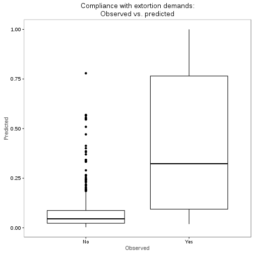

```r
## Stepwise selection of variables

sm1 <- step(m1)
```

```
Start:  AIC=352.09
complied_bin ~ extortion_type + time + n_offenders + had_weapon + 
    with_violence + reported + rep_extortion_victim + bribe_victim + 
    size + hotrestbar + yearsquant + loghoms + logpop

                       Df Deviance    AIC
- had_weapon            2   295.13 349.13
- with_violence         2   295.30 349.30
- time                  4   300.08 350.08
- bribe_victim          1   294.13 350.13
- loghoms               1   294.17 350.17
<none>                      294.09 352.09
- logpop                1   296.10 352.10
- reported              1   296.67 352.67
- size                  3   301.19 353.19
- rep_extortion_victim  1   297.21 353.21
- hotrestbar            1   297.54 353.54
- yearsquant            4   304.77 354.77
- n_offenders           4   308.99 358.99
- extortion_type        3   314.39 366.39

Step:  AIC=349.13
complied_bin ~ extortion_type + time + n_offenders + with_violence + 
    reported + rep_extortion_victim + bribe_victim + size + hotrestbar + 
    yearsquant + loghoms + logpop

                       Df Deviance    AIC
- with_violence         2   296.64 346.64
- time                  4   300.73 346.73
- bribe_victim          1   295.16 347.16
- loghoms               1   295.23 347.23
<none>                      295.13 349.13
- logpop                1   297.34 349.34
- reported              1   297.56 349.56
- rep_extortion_victim  1   298.26 350.26
- size                  3   302.44 350.44
- hotrestbar            1   299.06 351.06
- yearsquant            4   305.63 351.63
- n_offenders           4   319.86 365.86
- extortion_type        3   325.26 373.26

Step:  AIC=346.64
complied_bin ~ extortion_type + time + n_offenders + reported + 
    rep_extortion_victim + bribe_victim + size + hotrestbar + 
    yearsquant + loghoms + logpop

                       Df Deviance    AIC
- time                  4   302.15 344.15
- bribe_victim          1   296.64 344.64
- loghoms               1   296.83 344.83
<none>                      296.64 346.64
- reported              1   299.29 347.29
- rep_extortion_victim  1   299.49 347.49
- logpop                1   299.53 347.53
- hotrestbar            1   300.38 348.38
- yearsquant            4   306.62 348.62
- size                  3   304.70 348.70
- n_offenders           4   321.67 363.67
- extortion_type        3   329.63 373.63

Step:  AIC=344.15
complied_bin ~ extortion_type + n_offenders + reported + rep_extortion_victim + 
    bribe_victim + size + hotrestbar + yearsquant + loghoms + 
    logpop

                       Df Deviance    AIC
- bribe_victim          1   302.17 342.17
- loghoms               1   302.22 342.22
<none>                      302.15 344.15
- logpop                1   304.34 344.34
- reported              1   304.56 344.56
- size                  3   308.67 344.67
- rep_extortion_victim  1   305.19 345.19
- hotrestbar            1   306.11 346.11
- yearsquant            4   312.28 346.28
- n_offenders           4   327.46 361.46
- extortion_type        3   334.36 370.36

Step:  AIC=342.17
complied_bin ~ extortion_type + n_offenders + reported + rep_extortion_victim + 
    size + hotrestbar + yearsquant + loghoms + logpop

                       Df Deviance    AIC
- loghoms               1   302.25 340.25
<none>                      302.17 342.17
- logpop                1   304.37 342.37
- reported              1   304.58 342.58
- size                  3   308.73 342.73
- rep_extortion_victim  1   305.19 343.19
- hotrestbar            1   306.13 344.13
- yearsquant            4   312.33 344.33
- n_offenders           4   327.46 359.46
- extortion_type        3   334.38 368.38

Step:  AIC=340.25
complied_bin ~ extortion_type + n_offenders + reported + rep_extortion_victim + 
    size + hotrestbar + yearsquant + logpop

                       Df Deviance    AIC
<none>                      302.25 340.25
- reported              1   304.68 340.68
- size                  3   308.83 340.83
- rep_extortion_victim  1   305.28 341.28
- logpop                1   306.05 342.05
- hotrestbar            1   306.21 342.21
- yearsquant            4   312.54 342.54
- n_offenders           4   327.71 357.71
- extortion_type        3   334.58 366.58
```

```r
summary(sm1)
```

```

Call:
glm(formula = complied_bin ~ extortion_type + n_offenders + reported + 
    rep_extortion_victim + size + hotrestbar + yearsquant + logpop, 
    family = "binomial", data = m1df)

Deviance Residuals: 
    Min       1Q   Median       3Q      Max  
-1.5646  -0.4163  -0.2935  -0.1957   2.9808  

Coefficients:
                             Estimate Std. Error z value Pr(>|z|)    
(Intercept)                  -3.22617    0.50245  -6.421 1.36e-10 ***
extortion_typeStreet          1.31174    0.46268   2.835  0.00458 ** 
extortion_typePremises       17.47059  650.15857   0.027  0.97856    
extortion_typeCobro de piso   2.58763    0.91411   2.831  0.00464 ** 
n_offenders2                  1.06087    0.36219   2.929  0.00340 ** 
n_offenders3                  0.95707    0.62074   1.542  0.12312    
n_offenders4+                 3.13066    0.65726   4.763 1.91e-06 ***
n_offendersDK/DA              0.44621    0.69504   0.642  0.52087    
reportedYes                   0.62258    0.38770   1.606  0.10831    
rep_extortion_victim1         0.99650    0.53573   1.860  0.06287 .  
sizeMedium                   -0.29086    0.43704  -0.666  0.50572    
sizeSmall                     0.44658    0.41727   1.070  0.28451    
sizeMicro                    -0.67800    0.46297  -1.464  0.14307    
hotrestbar1                  -1.01996    0.56114  -1.818  0.06911 .  
yearsquant(8,16]             -0.04856    0.54032  -0.090  0.92838    
yearsquant(16,25]             0.79513    0.48689   1.633  0.10245    
yearsquant(25,34]            -0.22445    0.54375  -0.413  0.67976    
yearsquant(34,43]             1.10048    0.48905   2.250  0.02443 *  
logpop                        0.42014    0.21797   1.928  0.05392 .  
---
Signif. codes:  0 '***' 0.001 '**' 0.01 '*' 0.05 '.' 0.1 ' ' 1

(Dispersion parameter for binomial family taken to be 1)

    Null deviance: 439.55  on 612  degrees of freedom
Residual deviance: 302.25  on 594  degrees of freedom
AIC: 340.25

Number of Fisher Scoring iterations: 15
```

```r
#print(xtable(sm1), type="html")
#htmlreg(sm1)
screenreg(sm1)
```

```

========================================
                             Model 1    
----------------------------------------
(Intercept)                    -3.23 ***
                               (0.50)   
extortion_typeStreet            1.31 ** 
                               (0.46)   
extortion_typePremises         17.47    
                             (650.16)   
extortion_typeCobro de piso     2.59 ** 
                               (0.91)   
n_offenders2                    1.06 ** 
                               (0.36)   
n_offenders3                    0.96    
                               (0.62)   
n_offenders4+                   3.13 ***
                               (0.66)   
n_offendersDK/DA                0.45    
                               (0.70)   
reportedYes                     0.62    
                               (0.39)   
rep_extortion_victim1           1.00    
                               (0.54)   
sizeMedium                     -0.29    
                               (0.44)   
sizeSmall                       0.45    
                               (0.42)   
sizeMicro                      -0.68    
                               (0.46)   
hotrestbar1                    -1.02    
                               (0.56)   
yearsquant(8,16]               -0.05    
                               (0.54)   
yearsquant(16,25]               0.80    
                               (0.49)   
yearsquant(25,34]              -0.22    
                               (0.54)   
yearsquant(34,43]               1.10 *  
                               (0.49)   
logpop                          0.42    
                               (0.22)   
----------------------------------------
AIC                           340.25    
BIC                           424.20    
Log Likelihood               -151.13    
Deviance                      302.25    
Num. obs.                     613       
========================================
*** p < 0.001, ** p < 0.01, * p < 0.05
```

```r
#htmlreg(list(m1, sm1))
screenreg(list(m1, sm1))
```

```

======================================================
                             Model 1       Model 2    
------------------------------------------------------
(Intercept)                     -3.42 ***    -3.23 ***
                                (0.61)       (0.50)   
extortion_typeStreet             1.13         1.31 ** 
                                (0.58)       (0.46)   
extortion_typePremises          18.17        17.47    
                             (1069.69)     (650.16)   
extortion_typeCobro de piso      2.41 *       2.59 ** 
                                (0.97)       (0.91)   
timeAfternoon                    0.05                 
                                (0.38)                
timeEvening                     -0.32                 
                                (0.51)                
timeNight                        2.17 *               
                                (0.97)                
timeDK/DA                        1.68                 
                                (1.48)                
n_offenders2                     1.05 **      1.06 ** 
                                (0.38)       (0.36)   
n_offenders3                     0.96         0.96    
                                (0.64)       (0.62)   
n_offenders4+                    2.69 ***     3.13 ***
                                (0.80)       (0.66)   
n_offendersDK/DA                 0.16         0.45    
                                (0.77)       (0.70)   
had_weaponYes                    0.75                 
                                (0.74)                
had_weaponDK/DA                 -0.01                 
                                (0.37)                
with_violenceYes                 0.37                 
                                (0.86)                
with_violenceDK/DA               0.70                 
                                (0.67)                
reportedYes                      0.66         0.62    
                                (0.40)       (0.39)   
rep_extortion_victim1            1.04         1.00    
                                (0.55)       (0.54)   
bribe_victim1                    0.10                 
                                (0.50)                
sizeMedium                      -0.15        -0.29    
                                (0.46)       (0.44)   
sizeSmall                        0.57         0.45    
                                (0.44)       (0.42)   
sizeMicro                       -0.67        -0.68    
                                (0.50)       (0.46)   
hotrestbar1                     -0.98        -1.02    
                                (0.58)       (0.56)   
yearsquant(8,16]                -0.11        -0.05    
                                (0.55)       (0.54)   
yearsquant(16,25]                0.77         0.80    
                                (0.49)       (0.49)   
yearsquant(25,34]               -0.26        -0.22    
                                (0.57)       (0.54)   
yearsquant(34,43]                1.17 *       1.10 *  
                                (0.51)       (0.49)   
loghoms                         -0.07                 
                                (0.24)                
logpop                           0.50         0.42    
                                (0.35)       (0.22)   
------------------------------------------------------
AIC                            352.09       340.25    
BIC                            480.23       424.20    
Log Likelihood                -147.05      -151.13    
Deviance                       294.09       302.25    
Num. obs.                      613          613       
======================================================
*** p < 0.001, ** p < 0.01, * p < 0.05
```

```r
sm1$anova
```

```
             Step Df   Deviance Resid. Df Resid. Dev      AIC
1                 NA         NA       584   294.0941 352.0941
2    - had_weapon  2 1.03763066       586   295.1318 349.1318
3 - with_violence  2 1.50477726       588   296.6365 346.6365
4          - time  4 5.50997022       592   302.1465 344.1465
5  - bribe_victim  1 0.02575018       593   302.1723 342.1723
6       - loghoms  1 0.07890941       594   302.2512 340.2512
```

```r
kable(sm1$anova)
```


|Step            | Df|  Deviance| Resid. Df| Resid. Dev|      AIC|
|:---------------|--:|---------:|---------:|----------:|--------:|
|                | NA|        NA|       584|   294.0941| 352.0941|
|- had_weapon    |  2| 1.0376307|       586|   295.1318| 349.1318|
|- with_violence |  2| 1.5047773|       588|   296.6365| 346.6365|
|- time          |  4| 5.5099702|       592|   302.1465| 344.1465|
|- bribe_victim  |  1| 0.0257502|       593|   302.1723| 342.1723|
|- loghoms       |  1| 0.0789094|       594|   302.2512| 340.2512|

```r
## Using drop1 to test single variable exclusions

drop1(m1, test="LRT")
```

```
Single term deletions

Model:
complied_bin ~ extortion_type + time + n_offenders + had_weapon + 
    with_violence + reported + rep_extortion_victim + bribe_victim + 
    size + hotrestbar + yearsquant + loghoms + logpop
                     Df Deviance    AIC     LRT  Pr(>Chi)    
<none>                    294.09 352.09                      
extortion_type        3   314.39 366.39 20.2942 0.0001475 ***
time                  4   300.08 350.08  5.9816 0.2005297    
n_offenders           4   308.99 358.99 14.8920 0.0049305 ** 
had_weapon            2   295.13 349.13  1.0376 0.5952253    
with_violence         2   295.30 349.30  1.2065 0.5470212    
reported              1   296.67 352.67  2.5785 0.1083245    
rep_extortion_victim  1   297.21 353.21  3.1120 0.0777194 .  
bribe_victim          1   294.13 350.13  0.0407 0.8400716    
size                  3   301.19 353.19  7.0972 0.0688620 .  
hotrestbar            1   297.54 353.54  3.4469 0.0633716 .  
yearsquant            4   304.77 354.77 10.6807 0.0303965 *  
loghoms               1   294.17 350.17  0.0784 0.7794952    
logpop                1   296.10 352.10  2.0052 0.1567608    
---
Signif. codes:  0 '***' 0.001 '**' 0.01 '*' 0.05 '.' 0.1 ' ' 1
```

```r
kable(drop1(m1, test="LRT"))
```


|                     | Df| Deviance|      AIC|        LRT|  Pr(>Chi)|
|:--------------------|--:|--------:|--------:|----------:|---------:|
|<none>               | NA| 294.0941| 352.0941|         NA|        NA|
|extortion_type       |  3| 314.3884| 366.3884| 20.2942104| 0.0001475|
|time                 |  4| 300.0757| 350.0757|  5.9815589| 0.2005297|
|n_offenders          |  4| 308.9862| 358.9862| 14.8920317| 0.0049305|
|had_weapon           |  2| 295.1318| 349.1318|  1.0376307| 0.5952253|
|with_violence        |  2| 295.3007| 349.3007|  1.2065353| 0.5470212|
|reported             |  1| 296.6726| 352.6726|  2.5784965| 0.1083245|
|rep_extortion_victim |  1| 297.2061| 353.2061|  3.1119598| 0.0777194|
|bribe_victim         |  1| 294.1349| 350.1349|  0.0407240| 0.8400716|
|size                 |  3| 301.1914| 353.1914|  7.0972433| 0.0688620|
|hotrestbar           |  1| 297.5410| 353.5410|  3.4468707| 0.0633716|
|yearsquant           |  4| 304.7749| 354.7749| 10.6807271| 0.0303965|
|loghoms              |  1| 294.1725| 350.1725|  0.0783871| 0.7794952|
|logpop               |  1| 296.0993| 352.0993|  2.0051986| 0.1567608|

```r
## Exclude state then business level variables

m1_nostate <- glm(complied_bin ~
                    extortion_type +
                    time +
                    n_offenders +
                    had_weapon +
                    with_violence +
                    reported +
                    rep_extortion_victim +
                    bribe_victim +
                    size + hotrestbar + yearsquant,
                  data=m1df,
                  family = "binomial")

summary(m1_nostate)
```

```

Call:
glm(formula = complied_bin ~ extortion_type + time + n_offenders + 
    had_weapon + with_violence + reported + rep_extortion_victim + 
    bribe_victim + size + hotrestbar + yearsquant, family = "binomial", 
    data = m1df)

Deviance Residuals: 
    Min       1Q   Median       3Q      Max  
-1.7537  -0.3997  -0.2928  -0.1854   2.8013  

Coefficients:
                             Estimate Std. Error z value Pr(>|z|)    
(Intercept)                  -3.61408    0.60363  -5.987 2.13e-09 ***
extortion_typeStreet          1.09217    0.56429   1.935  0.05293 .  
extortion_typePremises       17.06417  661.58606   0.026  0.97942    
extortion_typeCobro de piso   2.44387    0.97493   2.507  0.01219 *  
timeAfternoon                 0.12391    0.37472   0.331  0.74089    
timeEvening                  -0.30240    0.49867  -0.606  0.54423    
timeNight                     2.01821    0.95279   2.118  0.03416 *  
timeDK/DA                     1.50056    1.47509   1.017  0.30903    
n_offenders2                  1.04291    0.37310   2.795  0.00519 ** 
n_offenders3                  0.93786    0.62515   1.500  0.13356    
n_offenders4+                 2.48273    0.78925   3.146  0.00166 ** 
n_offendersDK/DA              0.21788    0.76613   0.284  0.77611    
had_weaponYes                 0.83713    0.73555   1.138  0.25508    
had_weaponDK/DA              -0.07202    0.36839  -0.195  0.84501    
with_violenceYes              0.54353    0.84566   0.643  0.52040    
with_violenceDK/DA            0.78538    0.65185   1.205  0.22826    
reportedYes                   0.71542    0.39148   1.827  0.06763 .  
rep_extortion_victim1         1.01931    0.54789   1.860  0.06282 .  
bribe_victim1                 0.12859    0.49582   0.259  0.79537    
sizeMedium                   -0.12000    0.46085  -0.260  0.79456    
sizeSmall                     0.67372    0.43947   1.533  0.12526    
sizeMicro                    -0.56920    0.49433  -1.151  0.24955    
hotrestbar1                  -0.90222    0.56778  -1.589  0.11205    
yearsquant(8,16]             -0.10412    0.55297  -0.188  0.85064    
yearsquant(16,25]             0.82780    0.48839   1.695  0.09008 .  
yearsquant(25,34]            -0.16956    0.56489  -0.300  0.76405    
yearsquant(34,43]             1.23333    0.50540   2.440  0.01467 *  
---
Signif. codes:  0 '***' 0.001 '**' 0.01 '*' 0.05 '.' 0.1 ' ' 1

(Dispersion parameter for binomial family taken to be 1)

    Null deviance: 439.55  on 612  degrees of freedom
Residual deviance: 297.63  on 586  degrees of freedom
AIC: 351.63

Number of Fisher Scoring iterations: 15
```

```r
lrtest(m1_nostate, m1)
```

```
Likelihood ratio test

Model 1: complied_bin ~ extortion_type + time + n_offenders + had_weapon + 
    with_violence + reported + rep_extortion_victim + bribe_victim + 
    size + hotrestbar + yearsquant
Model 2: complied_bin ~ extortion_type + time + n_offenders + had_weapon + 
    with_violence + reported + rep_extortion_victim + bribe_victim + 
    size + hotrestbar + yearsquant + loghoms + logpop
  #Df  LogLik Df  Chisq Pr(>Chisq)
1  27 -148.81                     
2  29 -147.05  2 3.5323      0.171
```

```r
kable(lrtest(m1_nostate, m1))
```


| #Df|    LogLik| Df|    Chisq| Pr(>Chisq)|
|---:|---------:|--:|--------:|----------:|
|  27| -148.8132| NA|       NA|         NA|
|  29| -147.0471|  2| 3.532348|   0.170986|

```r
waldtest(m1_nostate, m1)
```

```
Wald test

Model 1: complied_bin ~ extortion_type + time + n_offenders + had_weapon + 
    with_violence + reported + rep_extortion_victim + bribe_victim + 
    size + hotrestbar + yearsquant
Model 2: complied_bin ~ extortion_type + time + n_offenders + had_weapon + 
    with_violence + reported + rep_extortion_victim + bribe_victim + 
    size + hotrestbar + yearsquant + loghoms + logpop
  Res.Df Df      F Pr(>F)
1    586                 
2    584  2 1.7322 0.1778
```

```r
kable(waldtest(m1_nostate, m1))
```


| Res.Df| Df|        F|    Pr(>F)|
|------:|--:|--------:|---------:|
|    586| NA|       NA|        NA|
|    584|  2| 1.732177| 0.1778065|

```r
waldtest(m1_nostate, m1, test="Chisq")
```

```
Wald test

Model 1: complied_bin ~ extortion_type + time + n_offenders + had_weapon + 
    with_violence + reported + rep_extortion_victim + bribe_victim + 
    size + hotrestbar + yearsquant
Model 2: complied_bin ~ extortion_type + time + n_offenders + had_weapon + 
    with_violence + reported + rep_extortion_victim + bribe_victim + 
    size + hotrestbar + yearsquant + loghoms + logpop
  Res.Df Df  Chisq Pr(>Chisq)
1    586                     
2    584  2 3.4644     0.1769
```

```r
kable(waldtest(m1_nostate, m1, test="Chisq"))
```


| Res.Df| Df|    Chisq| Pr(>Chisq)|
|------:|--:|--------:|----------:|
|    586| NA|       NA|         NA|
|    584|  2| 3.464354|  0.1768989|

```r
m1_nostate_nobus <- glm(complied_bin ~
                    extortion_type +
                    time +
                    n_offenders +
                    had_weapon +
                    with_violence +
                    reported,
                  data=m1df,
                  family = "binomial")

summary(m1_nostate_nobus)
```

```

Call:
glm(formula = complied_bin ~ extortion_type + time + n_offenders + 
    had_weapon + with_violence + reported, family = "binomial", 
    data = m1df)

Deviance Residuals: 
    Min       1Q   Median       3Q      Max  
-1.8969  -0.4133  -0.2887  -0.2835   2.5542  

Coefficients:
                             Estimate Std. Error z value Pr(>|z|)    
(Intercept)                  -3.12914    0.37433  -8.359  < 2e-16 ***
extortion_typeStreet          1.19830    0.50979   2.351  0.01874 *  
extortion_typePremises       17.89347  645.76959   0.028  0.97789    
extortion_typeCobro de piso   2.83378    0.87695   3.231  0.00123 ** 
timeAfternoon                -0.03707    0.35919  -0.103  0.91781    
timeEvening                  -0.09381    0.46130  -0.203  0.83885    
timeNight                     1.62938    0.93941   1.734  0.08283 .  
timeDK/DA                     2.17147    1.35648   1.601  0.10942    
n_offenders2                  1.02840    0.35591   2.890  0.00386 ** 
n_offenders3                  0.74880    0.59751   1.253  0.21013    
n_offenders4+                 2.00092    0.75188   2.661  0.00779 ** 
n_offendersDK/DA              0.40003    0.72615   0.551  0.58170    
had_weaponYes                 0.92221    0.70420   1.310  0.19034    
had_weaponDK/DA              -0.02777    0.35420  -0.078  0.93750    
with_violenceYes              0.24763    0.78829   0.314  0.75341    
with_violenceDK/DA            0.71045    0.61638   1.153  0.24907    
reportedYes                   0.56518    0.37461   1.509  0.13136    
---
Signif. codes:  0 '***' 0.001 '**' 0.01 '*' 0.05 '.' 0.1 ' ' 1

(Dispersion parameter for binomial family taken to be 1)

    Null deviance: 439.55  on 612  degrees of freedom
Residual deviance: 320.37  on 596  degrees of freedom
AIC: 354.37

Number of Fisher Scoring iterations: 15
```

```r
lrtest(m1_nostate_nobus, m1_nostate)
```

```
Likelihood ratio test

Model 1: complied_bin ~ extortion_type + time + n_offenders + had_weapon + 
    with_violence + reported
Model 2: complied_bin ~ extortion_type + time + n_offenders + had_weapon + 
    with_violence + reported + rep_extortion_victim + bribe_victim + 
    size + hotrestbar + yearsquant
  #Df  LogLik Df Chisq Pr(>Chisq)  
1  17 -160.18                      
2  27 -148.81 10 22.74    0.01175 *
---
Signif. codes:  0 '***' 0.001 '**' 0.01 '*' 0.05 '.' 0.1 ' ' 1
```

```r
kable(lrtest(m1_nostate_nobus, m1_nostate))
```


| #Df|    LogLik| Df|    Chisq| Pr(>Chisq)|
|---:|---------:|--:|--------:|----------:|
|  17| -160.1834| NA|       NA|         NA|
|  27| -148.8132| 10| 22.74036|  0.0117466|

```r
waldtest(m1_nostate_nobus, m1_nostate)
```

```
Wald test

Model 1: complied_bin ~ extortion_type + time + n_offenders + had_weapon + 
    with_violence + reported
Model 2: complied_bin ~ extortion_type + time + n_offenders + had_weapon + 
    with_violence + reported + rep_extortion_victim + bribe_victim + 
    size + hotrestbar + yearsquant
  Res.Df Df     F  Pr(>F)  
1    596                   
2    586 10 2.082 0.02408 *
---
Signif. codes:  0 '***' 0.001 '**' 0.01 '*' 0.05 '.' 0.1 ' ' 1
```

```r
kable(waldtest(m1_nostate_nobus, m1_nostate))
```


| Res.Df| Df|       F|    Pr(>F)|
|------:|--:|-------:|---------:|
|    596| NA|      NA|        NA|
|    586| 10| 2.08199| 0.0240811|

```r
waldtest(m1_nostate_nobus, m1_nostate, test="Chisq")
```

```
Wald test

Model 1: complied_bin ~ extortion_type + time + n_offenders + had_weapon + 
    with_violence + reported
Model 2: complied_bin ~ extortion_type + time + n_offenders + had_weapon + 
    with_violence + reported + rep_extortion_victim + bribe_victim + 
    size + hotrestbar + yearsquant
  Res.Df Df Chisq Pr(>Chisq)  
1    596                      
2    586 10 20.82    0.02239 *
---
Signif. codes:  0 '***' 0.001 '**' 0.01 '*' 0.05 '.' 0.1 ' ' 1
```

```r
kable(waldtest(m1_nostate_nobus, m1_nostate, test="Chisq"))
```


| Res.Df| Df|   Chisq| Pr(>Chisq)|
|------:|--:|-------:|----------:|
|    596| NA|      NA|         NA|
|    586| 10| 20.8199|   0.022385|

```r
lrtest(m1_nostate_nobus, m1_nostate, m1)
```

```
Likelihood ratio test

Model 1: complied_bin ~ extortion_type + time + n_offenders + had_weapon + 
    with_violence + reported
Model 2: complied_bin ~ extortion_type + time + n_offenders + had_weapon + 
    with_violence + reported + rep_extortion_victim + bribe_victim + 
    size + hotrestbar + yearsquant
Model 3: complied_bin ~ extortion_type + time + n_offenders + had_weapon + 
    with_violence + reported + rep_extortion_victim + bribe_victim + 
    size + hotrestbar + yearsquant + loghoms + logpop
  #Df  LogLik Df   Chisq Pr(>Chisq)  
1  17 -160.18                        
2  27 -148.81 10 22.7404    0.01175 *
3  29 -147.05  2  3.5323    0.17099  
---
Signif. codes:  0 '***' 0.001 '**' 0.01 '*' 0.05 '.' 0.1 ' ' 1
```

```r
kable(lrtest(m1_nostate_nobus, m1_nostate, m1))
```


| #Df|    LogLik| Df|     Chisq| Pr(>Chisq)|
|---:|---------:|--:|---------:|----------:|
|  17| -160.1834| NA|        NA|         NA|
|  27| -148.8132| 10| 22.740355|  0.0117466|
|  29| -147.0471|  2|  3.532348|  0.1709860|

```r
waldtest(m1_nostate_nobus, m1_nostate, m1)
```

```
Wald test

Model 1: complied_bin ~ extortion_type + time + n_offenders + had_weapon + 
    with_violence + reported
Model 2: complied_bin ~ extortion_type + time + n_offenders + had_weapon + 
    with_violence + reported + rep_extortion_victim + bribe_victim + 
    size + hotrestbar + yearsquant
Model 3: complied_bin ~ extortion_type + time + n_offenders + had_weapon + 
    with_violence + reported + rep_extortion_victim + bribe_victim + 
    size + hotrestbar + yearsquant + loghoms + logpop
  Res.Df Df      F  Pr(>F)  
1    596                    
2    586 10 2.0820 0.02408 *
3    584  2 1.7322 0.17781  
---
Signif. codes:  0 '***' 0.001 '**' 0.01 '*' 0.05 '.' 0.1 ' ' 1
```

```r
kable(waldtest(m1_nostate_nobus, m1_nostate, m1))
```


| Res.Df| Df|        F|    Pr(>F)|
|------:|--:|--------:|---------:|
|    596| NA|       NA|        NA|
|    586| 10| 2.081990| 0.0240811|
|    584|  2| 1.732177| 0.1778065|

```r
waldtest(m1_nostate_nobus, m1_nostate, m1, test="Chisq")
```

```
Wald test

Model 1: complied_bin ~ extortion_type + time + n_offenders + had_weapon + 
    with_violence + reported
Model 2: complied_bin ~ extortion_type + time + n_offenders + had_weapon + 
    with_violence + reported + rep_extortion_victim + bribe_victim + 
    size + hotrestbar + yearsquant
Model 3: complied_bin ~ extortion_type + time + n_offenders + had_weapon + 
    with_violence + reported + rep_extortion_victim + bribe_victim + 
    size + hotrestbar + yearsquant + loghoms + logpop
  Res.Df Df   Chisq Pr(>Chisq)  
1    596                        
2    586 10 20.8199    0.02239 *
3    584  2  3.4644    0.17690  
---
Signif. codes:  0 '***' 0.001 '**' 0.01 '*' 0.05 '.' 0.1 ' ' 1
```

```r
kable(waldtest(m1_nostate_nobus, m1_nostate, m1, test="Chisq"))
```


| Res.Df| Df|     Chisq| Pr(>Chisq)|
|------:|--:|---------:|----------:|
|    596| NA|        NA|         NA|
|    586| 10| 20.819897|  0.0223850|
|    584|  2|  3.464354|  0.1768989|

```r
## without the vars with a lot of missing

m1_no_viol_off_wea <- glm(complied_bin ~
                          extortion_type +
                          time +
                          reported,
                        data=m1df,
                        family = "binomial")

summary(m1_no_viol_off_wea)
```

```

Call:
glm(formula = complied_bin ~ extortion_type + time + reported, 
    family = "binomial", data = m1df)

Deviance Residuals: 
   Min      1Q  Median      3Q     Max  
-1.303  -0.386  -0.352  -0.351   2.374  

Coefficients:
                              Estimate Std. Error z value Pr(>|z|)    
(Intercept)                  -2.756173   0.286408  -9.623  < 2e-16 ***
extortion_typeStreet          2.014318   0.375665   5.362 8.23e-08 ***
extortion_typePremises       19.211398 719.835008   0.027 0.978708    
extortion_typeCobro de piso   3.041193   0.791972   3.840 0.000123 ***
timeAfternoon                 0.006212   0.336418   0.018 0.985267    
timeEvening                   0.196410   0.417509   0.470 0.638046    
timeNight                     1.728912   0.885617   1.952 0.050913 .  
timeDK/DA                     2.063025   1.257788   1.640 0.100963    
reportedYes                   0.697531   0.352319   1.980 0.047723 *  
---
Signif. codes:  0 '***' 0.001 '**' 0.01 '*' 0.05 '.' 0.1 ' ' 1

(Dispersion parameter for binomial family taken to be 1)

    Null deviance: 439.55  on 612  degrees of freedom
Residual deviance: 346.59  on 604  degrees of freedom
AIC: 364.59

Number of Fisher Scoring iterations: 15
```

```r
lrtest(m1_no_viol_off_wea, m1_nostate_nobus)
```

```
Likelihood ratio test

Model 1: complied_bin ~ extortion_type + time + reported
Model 2: complied_bin ~ extortion_type + time + n_offenders + had_weapon + 
    with_violence + reported
  #Df  LogLik Df  Chisq Pr(>Chisq)    
1   9 -173.29                         
2  17 -160.18  8 26.221  0.0009626 ***
---
Signif. codes:  0 '***' 0.001 '**' 0.01 '*' 0.05 '.' 0.1 ' ' 1
```

```r
kable(lrtest(m1_no_viol_off_wea, m1_nostate_nobus))
```


| #Df|    LogLik| Df|    Chisq| Pr(>Chisq)|
|---:|---------:|--:|--------:|----------:|
|   9| -173.2940| NA|       NA|         NA|
|  17| -160.1834|  8| 26.22108|  0.0009626|

```r
waldtest(m1_no_viol_off_wea, m1_nostate_nobus)
```

```
Wald test

Model 1: complied_bin ~ extortion_type + time + reported
Model 2: complied_bin ~ extortion_type + time + n_offenders + had_weapon + 
    with_violence + reported
  Res.Df Df      F   Pr(>F)   
1    604                      
2    596  8 3.1401 0.001728 **
---
Signif. codes:  0 '***' 0.001 '**' 0.01 '*' 0.05 '.' 0.1 ' ' 1
```

```r
kable(waldtest(m1_no_viol_off_wea, m1_nostate_nobus))
```


| Res.Df| Df|        F|    Pr(>F)|
|------:|--:|--------:|---------:|
|    604| NA|       NA|        NA|
|    596|  8| 3.140086| 0.0017277|

```r
waldtest(m1_no_viol_off_wea, m1_nostate_nobus, test="Chisq")
```

```
Wald test

Model 1: complied_bin ~ extortion_type + time + reported
Model 2: complied_bin ~ extortion_type + time + n_offenders + had_weapon + 
    with_violence + reported
  Res.Df Df  Chisq Pr(>Chisq)   
1    604                        
2    596  8 25.121   0.001483 **
---
Signif. codes:  0 '***' 0.001 '**' 0.01 '*' 0.05 '.' 0.1 ' ' 1
```

```r
kable(waldtest(m1_no_viol_off_wea, m1_nostate_nobus, test="Chisq"))
```


| Res.Df| Df|    Chisq| Pr(>Chisq)|
|------:|--:|--------:|----------:|
|    604| NA|       NA|         NA|
|    596|  8| 25.12069|   0.001483|

```r
lrtest(m1_no_viol_off_wea, m1_nostate_nobus, m1_nostate, m1)
```

```
Likelihood ratio test

Model 1: complied_bin ~ extortion_type + time + reported
Model 2: complied_bin ~ extortion_type + time + n_offenders + had_weapon + 
    with_violence + reported
Model 3: complied_bin ~ extortion_type + time + n_offenders + had_weapon + 
    with_violence + reported + rep_extortion_victim + bribe_victim + 
    size + hotrestbar + yearsquant
Model 4: complied_bin ~ extortion_type + time + n_offenders + had_weapon + 
    with_violence + reported + rep_extortion_victim + bribe_victim + 
    size + hotrestbar + yearsquant + loghoms + logpop
  #Df  LogLik Df   Chisq Pr(>Chisq)    
1   9 -173.29                          
2  17 -160.18  8 26.2211  0.0009626 ***
3  27 -148.81 10 22.7404  0.0117466 *  
4  29 -147.05  2  3.5323  0.1709860    
---
Signif. codes:  0 '***' 0.001 '**' 0.01 '*' 0.05 '.' 0.1 ' ' 1
```

```r
kable(lrtest(m1_no_viol_off_wea, m1_nostate_nobus, m1_nostate, m1))
```


| #Df|    LogLik| Df|     Chisq| Pr(>Chisq)|
|---:|---------:|--:|---------:|----------:|
|   9| -173.2940| NA|        NA|         NA|
|  17| -160.1834|  8| 26.221078|  0.0009626|
|  27| -148.8132| 10| 22.740355|  0.0117466|
|  29| -147.0471|  2|  3.532348|  0.1709860|

```r
waldtest(m1_no_viol_off_wea, m1_nostate_nobus, m1_nostate, m1)
```

```
Wald test

Model 1: complied_bin ~ extortion_type + time + reported
Model 2: complied_bin ~ extortion_type + time + n_offenders + had_weapon + 
    with_violence + reported
Model 3: complied_bin ~ extortion_type + time + n_offenders + had_weapon + 
    with_violence + reported + rep_extortion_victim + bribe_victim + 
    size + hotrestbar + yearsquant
Model 4: complied_bin ~ extortion_type + time + n_offenders + had_weapon + 
    with_violence + reported + rep_extortion_victim + bribe_victim + 
    size + hotrestbar + yearsquant + loghoms + logpop
  Res.Df Df      F   Pr(>F)   
1    604                      
2    596  8 3.1401 0.001728 **
3    586 10 2.0820 0.024081 * 
4    584  2 1.7322 0.177806   
---
Signif. codes:  0 '***' 0.001 '**' 0.01 '*' 0.05 '.' 0.1 ' ' 1
```

```r
kable(waldtest(m1_no_viol_off_wea, m1_nostate_nobus, m1_nostate, m1))
```


| Res.Df| Df|        F|    Pr(>F)|
|------:|--:|--------:|---------:|
|    604| NA|       NA|        NA|
|    596|  8| 3.140086| 0.0017277|
|    586| 10| 2.081990| 0.0240811|
|    584|  2| 1.732177| 0.1778065|

```r
waldtest(m1_no_viol_off_wea, m1_nostate_nobus, m1_nostate, m1, test="Chisq")
```

```
Wald test

Model 1: complied_bin ~ extortion_type + time + reported
Model 2: complied_bin ~ extortion_type + time + n_offenders + had_weapon + 
    with_violence + reported
Model 3: complied_bin ~ extortion_type + time + n_offenders + had_weapon + 
    with_violence + reported + rep_extortion_victim + bribe_victim + 
    size + hotrestbar + yearsquant
Model 4: complied_bin ~ extortion_type + time + n_offenders + had_weapon + 
    with_violence + reported + rep_extortion_victim + bribe_victim + 
    size + hotrestbar + yearsquant + loghoms + logpop
  Res.Df Df   Chisq Pr(>Chisq)   
1    604                         
2    596  8 25.1207   0.001483 **
3    586 10 20.8199   0.022385 * 
4    584  2  3.4644   0.176899   
---
Signif. codes:  0 '***' 0.001 '**' 0.01 '*' 0.05 '.' 0.1 ' ' 1
```

```r
kable(waldtest(m1_no_viol_off_wea, m1_nostate_nobus, m1_nostate, m1, test="Chisq"))
```


| Res.Df| Df|     Chisq| Pr(>Chisq)|
|------:|--:|---------:|----------:|
|    604| NA|        NA|         NA|
|    596|  8| 25.120686|  0.0014830|
|    586| 10| 20.819897|  0.0223850|
|    584|  2|  3.464354|  0.1768989|

```r
#htmlreg(list(m1,sm1, m1_nostate, m1_nostate_nobus,m1_no_viol_off_wea))
screenreg(list(m1,sm1, m1_nostate, m1_nostate_nobus,m1_no_viol_off_wea))
```

```

=============================================================================================
                             Model 1       Model 2      Model 3      Model 4      Model 5    
---------------------------------------------------------------------------------------------
(Intercept)                     -3.42 ***    -3.23 ***    -3.61 ***    -3.13 ***    -2.76 ***
                                (0.61)       (0.50)       (0.60)       (0.37)       (0.29)   
extortion_typeStreet             1.13         1.31 **      1.09         1.20 *       2.01 ***
                                (0.58)       (0.46)       (0.56)       (0.51)       (0.38)   
extortion_typePremises          18.17        17.47        17.06        17.89        19.21    
                             (1069.69)     (650.16)     (661.59)     (645.77)     (719.84)   
extortion_typeCobro de piso      2.41 *       2.59 **      2.44 *       2.83 **      3.04 ***
                                (0.97)       (0.91)       (0.97)       (0.88)       (0.79)   
timeAfternoon                    0.05                      0.12        -0.04         0.01    
                                (0.38)                    (0.37)       (0.36)       (0.34)   
timeEvening                     -0.32                     -0.30        -0.09         0.20    
                                (0.51)                    (0.50)       (0.46)       (0.42)   
timeNight                        2.17 *                    2.02 *       1.63         1.73    
                                (0.97)                    (0.95)       (0.94)       (0.89)   
timeDK/DA                        1.68                      1.50         2.17         2.06    
                                (1.48)                    (1.48)       (1.36)       (1.26)   
n_offenders2                     1.05 **      1.06 **      1.04 **      1.03 **              
                                (0.38)       (0.36)       (0.37)       (0.36)                
n_offenders3                     0.96         0.96         0.94         0.75                 
                                (0.64)       (0.62)       (0.63)       (0.60)                
n_offenders4+                    2.69 ***     3.13 ***     2.48 **      2.00 **              
                                (0.80)       (0.66)       (0.79)       (0.75)                
n_offendersDK/DA                 0.16         0.45         0.22         0.40                 
                                (0.77)       (0.70)       (0.77)       (0.73)                
had_weaponYes                    0.75                      0.84         0.92                 
                                (0.74)                    (0.74)       (0.70)                
had_weaponDK/DA                 -0.01                     -0.07        -0.03                 
                                (0.37)                    (0.37)       (0.35)                
with_violenceYes                 0.37                      0.54         0.25                 
                                (0.86)                    (0.85)       (0.79)                
with_violenceDK/DA               0.70                      0.79         0.71                 
                                (0.67)                    (0.65)       (0.62)                
reportedYes                      0.66         0.62         0.72         0.57         0.70 *  
                                (0.40)       (0.39)       (0.39)       (0.37)       (0.35)   
rep_extortion_victim1            1.04         1.00         1.02                              
                                (0.55)       (0.54)       (0.55)                             
bribe_victim1                    0.10                      0.13                              
                                (0.50)                    (0.50)                             
sizeMedium                      -0.15        -0.29        -0.12                              
                                (0.46)       (0.44)       (0.46)                             
sizeSmall                        0.57         0.45         0.67                              
                                (0.44)       (0.42)       (0.44)                             
sizeMicro                       -0.67        -0.68        -0.57                              
                                (0.50)       (0.46)       (0.49)                             
hotrestbar1                     -0.98        -1.02        -0.90                              
                                (0.58)       (0.56)       (0.57)                             
yearsquant(8,16]                -0.11        -0.05        -0.10                              
                                (0.55)       (0.54)       (0.55)                             
yearsquant(16,25]                0.77         0.80         0.83                              
                                (0.49)       (0.49)       (0.49)                             
yearsquant(25,34]               -0.26        -0.22        -0.17                              
                                (0.57)       (0.54)       (0.56)                             
yearsquant(34,43]                1.17 *       1.10 *       1.23 *                            
                                (0.51)       (0.49)       (0.51)                             
loghoms                         -0.07                                                        
                                (0.24)                                                       
logpop                           0.50         0.42                                           
                                (0.35)       (0.22)                                          
---------------------------------------------------------------------------------------------
AIC                            352.09       340.25       351.63       354.37       364.59    
BIC                            480.23       424.20       470.92       429.48       404.35    
Log Likelihood                -147.05      -151.13      -148.81      -160.18      -173.29    
Deviance                       294.09       302.25       297.63       320.37       346.59    
Num. obs.                      613          613          613          613          613       
=============================================================================================
*** p < 0.001, ** p < 0.01, * p < 0.05
```

```r
m1_null <- glm(complied_bin ~ 1, data=m1df, family="binomial")

# Null model
anova(m1_null, m1, test="Chisq")
```

```
Analysis of Deviance Table

Model 1: complied_bin ~ 1
Model 2: complied_bin ~ extortion_type + time + n_offenders + had_weapon + 
    with_violence + reported + rep_extortion_victim + bribe_victim + 
    size + hotrestbar + yearsquant + loghoms + logpop
  Resid. Df Resid. Dev Df Deviance  Pr(>Chi)    
1       612     439.55                          
2       584     294.09 28   145.45 < 2.2e-16 ***
---
Signif. codes:  0 '***' 0.001 '**' 0.01 '*' 0.05 '.' 0.1 ' ' 1
```

```r
kable(anova(m1_null, m1, test="Chisq"))
```


| Resid. Df| Resid. Dev| Df| Deviance| Pr(>Chi)|
|---------:|----------:|--:|--------:|--------:|
|       612|   439.5465| NA|       NA|       NA|
|       584|   294.0941| 28| 145.4524|        0|

```r
anova(m1_null, m1, test="LRT")
```

```
Analysis of Deviance Table

Model 1: complied_bin ~ 1
Model 2: complied_bin ~ extortion_type + time + n_offenders + had_weapon + 
    with_violence + reported + rep_extortion_victim + bribe_victim + 
    size + hotrestbar + yearsquant + loghoms + logpop
  Resid. Df Resid. Dev Df Deviance  Pr(>Chi)    
1       612     439.55                          
2       584     294.09 28   145.45 < 2.2e-16 ***
---
Signif. codes:  0 '***' 0.001 '**' 0.01 '*' 0.05 '.' 0.1 ' ' 1
```

```r
kable(anova(m1_null, m1, test="LRT"))
```


| Resid. Df| Resid. Dev| Df| Deviance| Pr(>Chi)|
|---------:|----------:|--:|--------:|--------:|
|       612|   439.5465| NA|       NA|       NA|
|       584|   294.0941| 28| 145.4524|        0|

```r
lrtest(m1_null, m1)
```

```
Likelihood ratio test

Model 1: complied_bin ~ 1
Model 2: complied_bin ~ extortion_type + time + n_offenders + had_weapon + 
    with_violence + reported + rep_extortion_victim + bribe_victim + 
    size + hotrestbar + yearsquant + loghoms + logpop
  #Df  LogLik Df  Chisq Pr(>Chisq)    
1   1 -219.77                         
2  29 -147.05 28 145.45  < 2.2e-16 ***
---
Signif. codes:  0 '***' 0.001 '**' 0.01 '*' 0.05 '.' 0.1 ' ' 1
```

```r
kable(lrtest(m1_null, m1))
```


| #Df|    LogLik| Df|    Chisq| Pr(>Chisq)|
|---:|---------:|--:|--------:|----------:|
|   1| -219.7733| NA|       NA|         NA|
|  29| -147.0471| 28| 145.4524|          0|

## Two level model

Now we try a two-level model


```r
m1_l2 <- glmer(complied_bin ~
            extortion_type +
            time +
            n_offenders +
            had_weapon +
            with_violence +
            reported +
            rep_extortion_victim +
            bribe_victim +
            size + hotrestbar + yearsquant +
            loghoms + logpop +
            (1|CVE_UNICA),
          data=m1df,
          family = "binomial")
```

```
Warning in (function (fn, par, lower = rep.int(-Inf, n), upper =
rep.int(Inf, : failure to converge in 10000 evaluations
```

```
Warning in checkConv(attr(opt, "derivs"), opt$par, ctrl = control
$checkConv, : unable to evaluate scaled gradient
```

```
Warning in checkConv(attr(opt, "derivs"), opt$par, ctrl = control
$checkConv, : Model failed to converge: degenerate Hessian with 6 negative
eigenvalues
```

```r
summary(m1_l2)
```

```
Warning in vcov.merMod(object, use.hessian = use.hessian): variance-covariance matrix computed from finite-difference Hessian is
not positive definite or contains NA values: falling back to var-cov estimated from RX
```

```
Warning in vcov.merMod(object, correlation = correlation, sigm = sig): variance-covariance matrix computed from finite-difference Hessian is
not positive definite or contains NA values: falling back to var-cov estimated from RX
```

```
Generalized linear mixed model fit by maximum likelihood (Laplace
  Approximation) [glmerMod]
 Family: binomial  ( logit )
Formula: 
complied_bin ~ extortion_type + time + n_offenders + had_weapon +  
    with_violence + reported + rep_extortion_victim + bribe_victim +  
    size + hotrestbar + yearsquant + loghoms + logpop + (1 |  
    CVE_UNICA)
   Data: m1df

     AIC      BIC   logLik deviance df.resid 
   324.2    456.8   -132.1    264.2      583 

Scaled residuals: 
    Min      1Q  Median      3Q     Max 
-2.7470 -0.0068 -0.0005  0.0000  7.0354 

Random effects:
 Groups    Name        Variance Std.Dev.
 CVE_UNICA (Intercept) 134.4    11.59   
Number of obs: 613, groups:  CVE_UNICA, 501

Fixed effects:
                             Estimate Std. Error z value Pr(>|z|)  
(Intercept)                  -6.73018    5.57437  -1.207   0.2273  
extortion_typeStreet          8.13444    4.92408   1.652   0.0985 .
extortion_typePremises       21.87572   61.29761   0.357   0.7212  
extortion_typeCobro de piso   5.61144    8.83557   0.635   0.5254  
timeAfternoon                -2.88366    3.33943  -0.864   0.3879  
timeEvening                  -7.88188    4.38129  -1.799   0.0720 .
timeNight                    -5.99013   10.59487  -0.565   0.5718  
timeDK/DA                    -2.45374   13.88187  -0.177   0.8597  
n_offenders2                  1.95896    3.50693   0.559   0.5764  
n_offenders3                  4.55203    5.27582   0.863   0.3882  
n_offenders4+                 7.75006    7.65611   1.012   0.3114  
n_offendersDK/DA             -4.61674    4.61170  -1.001   0.3168  
had_weaponYes                 7.83449    5.64658   1.387   0.1653  
had_weaponDK/DA               0.87730    3.30874   0.265   0.7909  
with_violenceYes             -1.76370    8.32110  -0.212   0.8321  
with_violenceDK/DA            1.83099    6.70769   0.273   0.7849  
reportedYes                  -4.52905    4.18037  -1.083   0.2786  
rep_extortion_victim1         1.61278    5.84971   0.276   0.7828  
bribe_victim1                -3.92219    5.12730  -0.765   0.4443  
sizeMedium                   -2.30512    4.20072  -0.549   0.5832  
sizeSmall                    -0.07417    4.03143  -0.018   0.9853  
sizeMicro                    -5.86433    5.42644  -1.081   0.2798  
hotrestbar1                 -16.04113    7.12151  -2.252   0.0243 *
yearsquant(8,16]             -4.36838    6.12145  -0.714   0.4755  
yearsquant(16,25]            -0.44866    4.61216  -0.097   0.9225  
yearsquant(25,34]            -2.38381    5.71243  -0.417   0.6765  
yearsquant(34,43]             2.88163    4.48512   0.642   0.5206  
loghoms                      -1.98077    2.45221  -0.808   0.4192  
logpop                        3.64617    3.97933   0.916   0.3595  
---
Signif. codes:  0 '***' 0.001 '**' 0.01 '*' 0.05 '.' 0.1 ' ' 1
```

```

Correlation matrix not shown by default, as p = 29 > 12.
Use print(x, correlation=TRUE)  or
	 vcov(x)	 if you need it
```

```
convergence code: 0
unable to evaluate scaled gradient
Model failed to converge: degenerate  Hessian with 6 negative eigenvalues
failure to converge in 10000 evaluations
```

```r
### ICC

icc(m1_l2)
```

```
Generalized linear mixed model
 Family: binomial (logit)
Formula: complied_bin ~ extortion_type + time + n_offenders + had_weapon + with_violence + reported + rep_extortion_victim + bribe_victim + size + hotrestbar + yearsquant + loghoms + logpop + (1 | CVE_UNICA)

  ICC (CVE_UNICA): 0.976113
```

```r
print(icc(m1_l2), comp="var")
```

```
Generalized linear mixed model
 Family: binomial (logit)
Formula: complied_bin ~ extortion_type + time + n_offenders + had_weapon + with_violence + reported + rep_extortion_victim + bribe_victim + size + hotrestbar + yearsquant + loghoms + logpop + (1 | CVE_UNICA)

      Within-group-variance:    3.290
     Between-group-variance:  134.438 (CVE_UNICA)
```

```r
## Describe data structure

## number of observations per individuals

length(unique(m1df$CVE_UNICA))
```

```
[1] 501
```

```r
table(table(m1df$CVE_UNICA))
```

```

  1   2   3   4   5 
431  42  19   4   5 
```

```r
min(table(m1df$CVE_UNICA))
```

```
[1] 1
```

```r
max(table(m1df$CVE_UNICA))
```

```
[1] 5
```

```r
mean(table(m1df$CVE_UNICA))
```

```
[1] 1.223553
```

```r
sum(table(m1df$CVE_UNICA))
```

```
[1] 613
```

```r
# number of observations per state
length(unique(m1df$CVE_ENT))
```

```
[1] 32
```

```r
table(m1df$CVE_ENT)
```

```

 1  2  3  4  5  6  7  8  9 10 11 12 13 14 15 16 17 18 19 20 21 22 23 24 25 
27 15 14 18 19 21 19 16 24 16 16 16 22 28 16 21 12 13 17 22 26 21 13 21 13 
26 27 28 29 30 31 32 
29 26 13 16 21 12 30 
```

```r
sum(table(m1df$CVE_ENT))
```

```
[1] 613
```

```r
min(table(m1df$CVE_ENT))
```

```
[1] 12
```

```r
max(table(m1df$CVE_ENT))
```

```
[1] 30
```

```r
mean(table(m1df$CVE_ENT))
```

```
[1] 19.15625
```

```r
# number of individuals per state

IperG <- with(m1df, tapply(CVE_UNICA, CVE_ENT,
                           FUN = function(x) length(unique(x))))
sum(IperG)
```

```
[1] 501
```

```r
min(IperG)
```

```
[1] 10
```

```r
max(IperG)
```

```
[1] 23
```

```r
mean(IperG)
```

```
[1] 15.65625
```

```r
## print m1_l2
#htmlreg(m1_l2)
screenreg(m1_l2)
```

```
Warning in vcov.merMod(model, useScale = FALSE, ...): variance-covariance matrix computed from finite-difference Hessian is
not positive definite or contains NA values: falling back to var-cov estimated from RX
```

```

======================================
                             Model 1  
--------------------------------------
(Intercept)                    -6.73  
                               (5.57) 
extortion_typeStreet            8.13  
                               (4.92) 
extortion_typePremises         21.88  
                              (61.30) 
extortion_typeCobro de piso     5.61  
                               (8.84) 
timeAfternoon                  -2.88  
                               (3.34) 
timeEvening                    -7.88  
                               (4.38) 
timeNight                      -5.99  
                              (10.59) 
timeDK/DA                      -2.45  
                              (13.88) 
n_offenders2                    1.96  
                               (3.51) 
n_offenders3                    4.55  
                               (5.28) 
n_offenders4+                   7.75  
                               (7.66) 
n_offendersDK/DA               -4.62  
                               (4.61) 
had_weaponYes                   7.83  
                               (5.65) 
had_weaponDK/DA                 0.88  
                               (3.31) 
with_violenceYes               -1.76  
                               (8.32) 
with_violenceDK/DA              1.83  
                               (6.71) 
reportedYes                    -4.53  
                               (4.18) 
rep_extortion_victim1           1.61  
                               (5.85) 
bribe_victim1                  -3.92  
                               (5.13) 
sizeMedium                     -2.31  
                               (4.20) 
sizeSmall                      -0.07  
                               (4.03) 
sizeMicro                      -5.86  
                               (5.43) 
hotrestbar1                   -16.04 *
                               (7.12) 
yearsquant(8,16]               -4.37  
                               (6.12) 
yearsquant(16,25]              -0.45  
                               (4.61) 
yearsquant(25,34]              -2.38  
                               (5.71) 
yearsquant(34,43]               2.88  
                               (4.49) 
loghoms                        -1.98  
                               (2.45) 
logpop                          3.65  
                               (3.98) 
--------------------------------------
AIC                           324.24  
BIC                           456.79  
Log Likelihood               -132.12  
Num. obs.                     613     
Num. groups: CVE_UNICA        501     
Var: CVE_UNICA (Intercept)    134.44  
======================================
*** p < 0.001, ** p < 0.01, * p < 0.05
```

```r
nobs(m1_l2)
```

```
[1] 613
```

```r
confint(m1_l2)
```

```
Computing profile confidence intervals ...
```

```
Warning in vcov.merMod(object, use.hessian = use.hessian): variance-covariance matrix computed from finite-difference Hessian is
not positive definite or contains NA values: falling back to var-cov estimated from RX

Warning in vcov.merMod(object, use.hessian = use.hessian): variance-covariance matrix computed from finite-difference Hessian is
not positive definite or contains NA values: falling back to var-cov estimated from RX
```

```
Warning in (function (fn, par, lower = rep.int(-Inf, n), upper =
rep.int(Inf, : failure to converge in 10000 evaluations
```

```
Error in zeta(shiftpar, start = opt[seqpar1][-w]): profiling detected new, lower deviance
```

```r
## Two-level Null

m1_l2_null <- glmer(complied_bin ~
                      (1|CVE_UNICA),
                    data=m1df,
                    family = "binomial")

summary(m1_l2_null)
```

```
Generalized linear mixed model fit by maximum likelihood (Laplace
  Approximation) [glmerMod]
 Family: binomial  ( logit )
Formula: complied_bin ~ (1 | CVE_UNICA)
   Data: m1df

     AIC      BIC   logLik deviance df.resid 
   223.1    231.9   -109.5    219.1      611 

Scaled residuals: 
     Min       1Q   Median       3Q      Max 
-0.99194 -0.00243 -0.00243 -0.00241  1.74058 

Random effects:
 Groups    Name        Variance Std.Dev.
 CVE_UNICA (Intercept) 1486     38.55   
Number of obs: 613, groups:  CVE_UNICA, 501

Fixed effects:
            Estimate Std. Error z value Pr(>|z|)    
(Intercept)  -12.032      1.042  -11.55   <2e-16 ***
---
Signif. codes:  0 '***' 0.001 '**' 0.01 '*' 0.05 '.' 0.1 ' ' 1
```

```r
lrtest(m1_l2_null, m1_l2)
```

```
Likelihood ratio test

Model 1: complied_bin ~ (1 | CVE_UNICA)
Model 2: complied_bin ~ extortion_type + time + n_offenders + had_weapon + 
    with_violence + reported + rep_extortion_victim + bribe_victim + 
    size + hotrestbar + yearsquant + loghoms + logpop + (1 | 
    CVE_UNICA)
  #Df  LogLik Df  Chisq Pr(>Chisq)  
1   2 -109.54                       
2  30 -132.12 28 45.157    0.02127 *
---
Signif. codes:  0 '***' 0.001 '**' 0.01 '*' 0.05 '.' 0.1 ' ' 1
```

```r
kable(lrtest(m1_l2_null, m1_l2))
```


| #Df|    LogLik| Df|    Chisq| Pr(>Chisq)|
|---:|---------:|--:|--------:|----------:|
|   2| -109.5398| NA|       NA|         NA|
|  30| -132.1181| 28| 45.15659|  0.0212697|

```r
lrtest(m1_null,m1_l2_null, m1_l2)
```

```
Warning in modelUpdate(objects[[i - 1]], objects[[i]]): original model was
of class "glm", updated model is of class "glmerMod"
```

```
Warning in modelUpdate(objects[[i - 1]], objects[[i]]): original model was
of class "glm", updated model is of class "glmerMod"
```

```
Likelihood ratio test

Model 1: complied_bin ~ 1
Model 2: complied_bin ~ (1 | CVE_UNICA)
Model 3: complied_bin ~ extortion_type + time + n_offenders + had_weapon + 
    with_violence + reported + rep_extortion_victim + bribe_victim + 
    size + hotrestbar + yearsquant + loghoms + logpop + (1 | 
    CVE_UNICA)
  #Df  LogLik Df   Chisq Pr(>Chisq)    
1   1 -219.77                          
2   2 -109.54  1 220.467    < 2e-16 ***
3  30 -132.12 28  45.157    0.02127 *  
---
Signif. codes:  0 '***' 0.001 '**' 0.01 '*' 0.05 '.' 0.1 ' ' 1
```

```r
kable(lrtest(m1_null,m1_l2_null, m1_l2))
```

```
Warning in modelUpdate(objects[[i - 1]], objects[[i]]): original model was
of class "glm", updated model is of class "glmerMod"

Warning in modelUpdate(objects[[i - 1]], objects[[i]]): original model was
of class "glm", updated model is of class "glmerMod"
```


| #Df|    LogLik| Df|     Chisq| Pr(>Chisq)|
|---:|---------:|--:|---------:|----------:|
|   1| -219.7733| NA|        NA|         NA|
|   2| -109.5398|  1| 220.46692|  0.0000000|
|  30| -132.1181| 28|  45.15659|  0.0212697|

```r
# compare sequentially
anova(m1_l2, m1_l2_null, test="LRT")
```

```
Data: m1df
Models:
m1_l2_null: complied_bin ~ (1 | CVE_UNICA)
m1_l2: complied_bin ~ extortion_type + time + n_offenders + had_weapon + 
m1_l2:     with_violence + reported + rep_extortion_victim + bribe_victim + 
m1_l2:     size + hotrestbar + yearsquant + loghoms + logpop + (1 | 
m1_l2:     CVE_UNICA)
           Df    AIC    BIC  logLik deviance Chisq Chi Df Pr(>Chisq)
m1_l2_null  2 223.08 231.92 -109.54   219.08                        
m1_l2      30 324.24 456.79 -132.12   264.24     0     28          1
```

```r
kable(anova(m1_l2, m1_l2_null, test="LRT"))
```


|           | Df|      AIC|      BIC|    logLik| deviance| Chisq| Chi Df| Pr(>Chisq)|
|:----------|--:|--------:|--------:|---------:|--------:|-----:|------:|----------:|
|m1_l2_null |  2| 223.0796| 231.9163| -109.5398| 219.0796|    NA|     NA|         NA|
|m1_l2      | 30| 324.2362| 456.7871| -132.1181| 264.2362|     0|     28|          1|

```r
anova(m1_l2, m1_l2_null, m1_null, test="LRT")
```

```
Data: m1df
Models:
m1_null: complied_bin ~ 1
m1_l2_null: complied_bin ~ (1 | CVE_UNICA)
m1_l2: complied_bin ~ extortion_type + time + n_offenders + had_weapon + 
m1_l2:     with_violence + reported + rep_extortion_victim + bribe_victim + 
m1_l2:     size + hotrestbar + yearsquant + loghoms + logpop + (1 | 
m1_l2:     CVE_UNICA)
           Df    AIC    BIC  logLik deviance  Chisq Chi Df Pr(>Chisq)    
m1_null     1 441.55 445.96 -219.77   439.55                             
m1_l2_null  2 223.08 231.92 -109.54   219.08 220.47      1     <2e-16 ***
m1_l2      30 324.24 456.79 -132.12   264.24   0.00     28          1    
---
Signif. codes:  0 '***' 0.001 '**' 0.01 '*' 0.05 '.' 0.1 ' ' 1
```

```r
kable(anova(m1_l2, m1_l2_null, m1_null, test="LRT"))
```


|           | Df|      AIC|      BIC|    logLik| deviance|    Chisq| Chi Df| Pr(>Chisq)|
|:----------|--:|--------:|--------:|---------:|--------:|--------:|------:|----------:|
|m1_null    |  1| 441.5465| 445.9649| -219.7733| 439.5465|       NA|     NA|         NA|
|m1_l2_null |  2| 223.0796| 231.9163| -109.5398| 219.0796| 220.4669|      1|          0|
|m1_l2      | 30| 324.2362| 456.7871| -132.1181| 264.2362|   0.0000|     28|          1|

```r
### RMSES
m1_l2_residuals <- residuals(m1_l2, type="response")

m1_l2_rmses <- c("m1_l2",
              sqrt(mean(m1_l2_residuals^2)),
              sqrt(mean(m1_l2_residuals^2))/sd(m1_l2_residuals),
              sqrt(mean(m1_l2_residuals^2))/
                          (max(m1_l2_residuals)-min(m1_l2_residuals)))

rmses <- rbind(rmses, m1_l2_rmses)

rmses
```

```
  model               RMSE             NRMSE             CVRMSE
1    m1  0.258218987356952 0.999184006392061  0.146708759599908
2 m1_l2 0.0709193893378527  1.00335378933392 0.0380635870146115
```

```r
kable(rmses)
```


|model |RMSE               |NRMSE             |CVRMSE             |
|:-----|:------------------|:-----------------|:------------------|
|m1    |0.258218987356952  |0.999184006392061 |0.146708759599908  |
|m1_l2 |0.0709193893378527 |1.00335378933392  |0.0380635870146115 |

```r
# Plot observed vs fitted
m1_l2_ob_pred <- data.frame(Observed=m1df$complied_bin,
                         Predicted=fitted(m1_l2, type=response))

ggplot(m1_l2_ob_pred, aes(Observed, Predicted)) +
  geom_boxplot() +
  theme_bw() +
  ggtitle("Compliance with extortion demands:\nObserved vs. predicted")
```

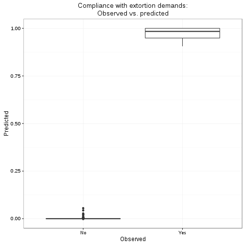

```r
# FOREST PLOTS?
# customize sjplots
set_theme(theme = "blank",
          geom.label.size = 0,
          axis.textsize.x = .7,
          axis.title.size = .9,
          axis.angle.x=90,
          axis.textsize.y = 0)

# Random intercepts
sjp.glmer(m1_l2, show.values = FALSE, sort.est= TRUE)
```

```
Plotting random effects...
```

```
Warning in .axisPars(usr, log = log, nintLog = nint): NAs introduced by
coercion to integer range
```

```
Warning in grDevices::axisTicks(log10(range(x, na.rm = TRUE)), log =
TRUE, : NAs introduced by coercion to integer range
```

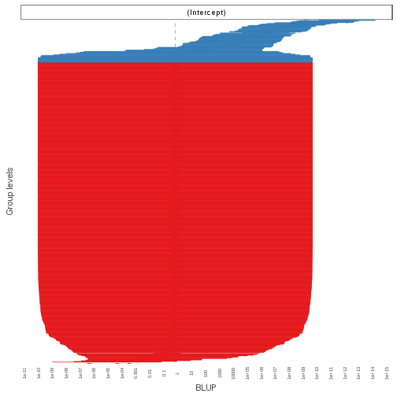

```r
# Forest plots
set_theme(theme = "blank",
          geom.label.size = 0,
          axis.textsize.x = .7,
          axis.title.size = .9,
          axis.angle.x=90,
          axis.textsize.y = .7)
sjp.glmer(m1_l2, type="fe", show.values = FALSE)
```

```
Warning in vcov.merMod(object): variance-covariance matrix computed from finite-difference Hessian is
not positive definite or contains NA values: falling back to var-cov estimated from RX
```

```
Warning in vcov.merMod(object, use.hessian = use.hessian): variance-covariance matrix computed from finite-difference Hessian is
not positive definite or contains NA values: falling back to var-cov estimated from RX
```

```
Warning in vcov.merMod(object, correlation = correlation, sigm = sig): variance-covariance matrix computed from finite-difference Hessian is
not positive definite or contains NA values: falling back to var-cov estimated from RX
```

```
Warning in .axisPars(usr, log = log, nintLog = nint): NAs introduced by
coercion to integer range
```

```
Warning in grDevices::axisTicks(log10(range(x, na.rm = TRUE)), log =
TRUE, : NAs introduced by coercion to integer range
```

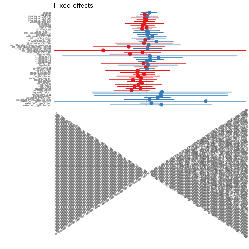

```r
sjp.glmer(m1_l2, type="fe", show.values = FALSE, sort.est = TRUE)
```

```
Warning in vcov.merMod(object): variance-covariance matrix computed from finite-difference Hessian is
not positive definite or contains NA values: falling back to var-cov estimated from RX
```

```
Warning in vcov.merMod(object, use.hessian = use.hessian): variance-covariance matrix computed from finite-difference Hessian is
not positive definite or contains NA values: falling back to var-cov estimated from RX
```

```
Warning in vcov.merMod(object, correlation = correlation, sigm = sig): variance-covariance matrix computed from finite-difference Hessian is
not positive definite or contains NA values: falling back to var-cov estimated from RX
```

```
Warning in .axisPars(usr, log = log, nintLog = nint): NAs introduced by
coercion to integer range
```

```
Warning in grDevices::axisTicks(log10(range(x, na.rm = TRUE)), log =
TRUE, : NAs introduced by coercion to integer range
```

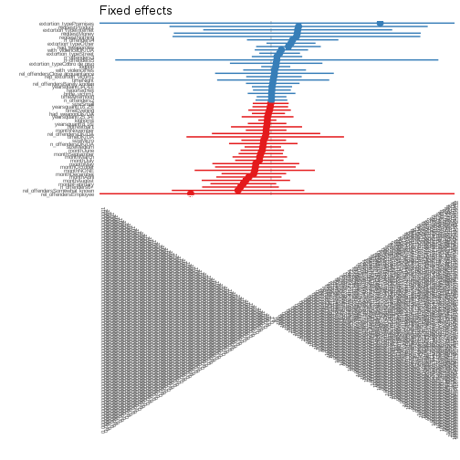

```r
#htmlreg(list(m1, m1_l2))
screenreg(list(m1, m1_l2))
```

```
Warning in vcov.merMod(model, useScale = FALSE, ...): variance-covariance matrix computed from finite-difference Hessian is
not positive definite or contains NA values: falling back to var-cov estimated from RX
```

```

====================================================
                             Model 1       Model 2  
----------------------------------------------------
(Intercept)                     -3.42 ***    -6.73  
                                (0.61)       (5.57) 
extortion_typeStreet             1.13         8.13  
                                (0.58)       (4.92) 
extortion_typePremises          18.17        21.88  
                             (1069.69)      (61.30) 
extortion_typeCobro de piso      2.41 *       5.61  
                                (0.97)       (8.84) 
timeAfternoon                    0.05        -2.88  
                                (0.38)       (3.34) 
timeEvening                     -0.32        -7.88  
                                (0.51)       (4.38) 
timeNight                        2.17 *      -5.99  
                                (0.97)      (10.59) 
timeDK/DA                        1.68        -2.45  
                                (1.48)      (13.88) 
n_offenders2                     1.05 **      1.96  
                                (0.38)       (3.51) 
n_offenders3                     0.96         4.55  
                                (0.64)       (5.28) 
n_offenders4+                    2.69 ***     7.75  
                                (0.80)       (7.66) 
n_offendersDK/DA                 0.16        -4.62  
                                (0.77)       (4.61) 
had_weaponYes                    0.75         7.83  
                                (0.74)       (5.65) 
had_weaponDK/DA                 -0.01         0.88  
                                (0.37)       (3.31) 
with_violenceYes                 0.37        -1.76  
                                (0.86)       (8.32) 
with_violenceDK/DA               0.70         1.83  
                                (0.67)       (6.71) 
reportedYes                      0.66        -4.53  
                                (0.40)       (4.18) 
rep_extortion_victim1            1.04         1.61  
                                (0.55)       (5.85) 
bribe_victim1                    0.10        -3.92  
                                (0.50)       (5.13) 
sizeMedium                      -0.15        -2.31  
                                (0.46)       (4.20) 
sizeSmall                        0.57        -0.07  
                                (0.44)       (4.03) 
sizeMicro                       -0.67        -5.86  
                                (0.50)       (5.43) 
hotrestbar1                     -0.98       -16.04 *
                                (0.58)       (7.12) 
yearsquant(8,16]                -0.11        -4.37  
                                (0.55)       (6.12) 
yearsquant(16,25]                0.77        -0.45  
                                (0.49)       (4.61) 
yearsquant(25,34]               -0.26        -2.38  
                                (0.57)       (5.71) 
yearsquant(34,43]                1.17 *       2.88  
                                (0.51)       (4.49) 
loghoms                         -0.07        -1.98  
                                (0.24)       (2.45) 
logpop                           0.50         3.65  
                                (0.35)       (3.98) 
----------------------------------------------------
AIC                            352.09       324.24  
BIC                            480.23       456.79  
Log Likelihood                -147.05      -132.12  
Deviance                       294.09               
Num. obs.                      613          613     
Num. groups: CVE_UNICA                      501     
Var: CVE_UNICA (Intercept)                  134.44  
====================================================
*** p < 0.001, ** p < 0.01, * p < 0.05
```

```r
lrtest(m1, m1_l2)
```

```
Warning in modelUpdate(objects[[i - 1]], objects[[i]]): original model was
of class "glm", updated model is of class "glmerMod"
```

```
Likelihood ratio test

Model 1: complied_bin ~ extortion_type + time + n_offenders + had_weapon + 
    with_violence + reported + rep_extortion_victim + bribe_victim + 
    size + hotrestbar + yearsquant + loghoms + logpop
Model 2: complied_bin ~ extortion_type + time + n_offenders + had_weapon + 
    with_violence + reported + rep_extortion_victim + bribe_victim + 
    size + hotrestbar + yearsquant + loghoms + logpop + (1 | 
    CVE_UNICA)
  #Df  LogLik Df  Chisq Pr(>Chisq)    
1  29 -147.05                         
2  30 -132.12  1 29.858  4.649e-08 ***
---
Signif. codes:  0 '***' 0.001 '**' 0.01 '*' 0.05 '.' 0.1 ' ' 1
```

```r
kable(lrtest(m1, m1_l2))
```

```
Warning in modelUpdate(objects[[i - 1]], objects[[i]]): original model was
of class "glm", updated model is of class "glmerMod"
```


| #Df|    LogLik| Df|    Chisq| Pr(>Chisq)|
|---:|---------:|--:|--------:|----------:|
|  29| -147.0471| NA|       NA|         NA|
|  30| -132.1181|  1| 29.85794|          0|

```r
anova(m1_l2, m1, test="LRT")
```

```
Data: m1df
Models:
m1: complied_bin ~ extortion_type + time + n_offenders + had_weapon + 
m1:     with_violence + reported + rep_extortion_victim + bribe_victim + 
m1:     size + hotrestbar + yearsquant + loghoms + logpop
m1_l2: complied_bin ~ extortion_type + time + n_offenders + had_weapon + 
m1_l2:     with_violence + reported + rep_extortion_victim + bribe_victim + 
m1_l2:     size + hotrestbar + yearsquant + loghoms + logpop + (1 | 
m1_l2:     CVE_UNICA)
      Df    AIC    BIC  logLik deviance  Chisq Chi Df Pr(>Chisq)    
m1    29 352.09 480.23 -147.05   294.09                             
m1_l2 30 324.24 456.79 -132.12   264.24 29.858      1  4.649e-08 ***
---
Signif. codes:  0 '***' 0.001 '**' 0.01 '*' 0.05 '.' 0.1 ' ' 1
```

```r
kable(anova(m1_l2, m1, test="LRT"))
```


|      | Df|      AIC|      BIC|    logLik| deviance|    Chisq| Chi Df| Pr(>Chisq)|
|:-----|--:|--------:|--------:|---------:|--------:|--------:|------:|----------:|
|m1    | 29| 352.0941| 480.2267| -147.0471| 294.0941|       NA|     NA|         NA|
|m1_l2 | 30| 324.2362| 456.7871| -132.1181| 264.2362| 29.85794|      1|          0|

## Three level model

Now we try the three-level configuration


```r
m1_l3 <- glmer(complied_bin ~
            extortion_type +
            time +
            n_offenders +
            had_weapon +
            with_violence +
            reported +
            rep_extortion_victim +
            bribe_victim +
            size + hotrestbar + yearsquant +
            loghoms + logpop +
            (1|CVE_UNICA) +
            (1|CVE_ENT),
          data=m1df,
          family = "binomial")
```

```
Warning in (function (fn, par, lower = rep.int(-Inf, n), upper =
rep.int(Inf, : failure to converge in 10000 evaluations
```

```
Warning in checkConv(attr(opt, "derivs"), opt$par, ctrl = control
$checkConv, : unable to evaluate scaled gradient
```

```
Warning in checkConv(attr(opt, "derivs"), opt$par, ctrl = control
$checkConv, : Model failed to converge: degenerate Hessian with 2 negative
eigenvalues
```

```r
summary(m1_l3)
```

```
Warning in vcov.merMod(object, use.hessian = use.hessian): variance-covariance matrix computed from finite-difference Hessian is
not positive definite or contains NA values: falling back to var-cov estimated from RX
```

```
Warning in vcov.merMod(object, correlation = correlation, sigm = sig): variance-covariance matrix computed from finite-difference Hessian is
not positive definite or contains NA values: falling back to var-cov estimated from RX
```

```
Generalized linear mixed model fit by maximum likelihood (Laplace
  Approximation) [glmerMod]
 Family: binomial  ( logit )
Formula: 
complied_bin ~ extortion_type + time + n_offenders + had_weapon +  
    with_violence + reported + rep_extortion_victim + bribe_victim +  
    size + hotrestbar + yearsquant + loghoms + logpop + (1 |  
    CVE_UNICA) + (1 | CVE_ENT)
   Data: m1df

     AIC      BIC   logLik deviance df.resid 
   277.4    414.3   -107.7    215.4      582 

Scaled residuals: 
     Min       1Q   Median       3Q      Max 
-0.59161 -0.00045 -0.00001  0.00000  1.69030 

Random effects:
 Groups    Name        Variance  Std.Dev.
 CVE_UNICA (Intercept) 5.451e+02 23.34665
 CVE_ENT   (Intercept) 9.183e-03  0.09583
Number of obs: 613, groups:  CVE_UNICA, 501; CVE_ENT, 32

Fixed effects:
                            Estimate Std. Error z value Pr(>|z|)  
(Intercept)                 -13.6469    14.1052  -0.968   0.3333  
extortion_typeStreet         11.3506    11.4183   0.994   0.3202  
extortion_typePremises       29.2261   427.2481   0.068   0.9455  
extortion_typeCobro de piso  13.6594    20.4008   0.670   0.5031  
timeAfternoon                 0.4976     7.9654   0.062   0.9502  
timeEvening                   0.1538     8.6133   0.018   0.9858  
timeNight                    12.3482    20.3218   0.608   0.5434  
timeDK/DA                    10.1607    31.5581   0.322   0.7475  
n_offenders2                  7.4757     7.7831   0.960   0.3368  
n_offenders3                  2.8777    13.0633   0.220   0.8256  
n_offenders4+                28.0436    16.8661   1.663   0.0964 .
n_offendersDK/DA            -17.9858    20.7179  -0.868   0.3853  
had_weaponYes                 5.4637    11.8233   0.462   0.6440  
had_weaponDK/DA               2.0878     8.8814   0.235   0.8142  
with_violenceYes             -5.6374    17.5838  -0.321   0.7485  
with_violenceDK/DA           -4.2970    17.5389  -0.245   0.8065  
reportedYes                   2.5784     8.5733   0.301   0.7636  
rep_extortion_victim1         4.3437    13.0245   0.334   0.7388  
bribe_victim1                -8.5018    10.7076  -0.794   0.4272  
sizeMedium                   -8.2207    10.9091  -0.754   0.4511  
sizeSmall                    -5.0733     9.1933  -0.552   0.5811  
sizeMicro                    -7.3074    11.7903  -0.620   0.5354  
hotrestbar1                  -3.9084    16.9823  -0.230   0.8180  
yearsquant(8,16]             -4.7112    12.9548  -0.364   0.7161  
yearsquant(16,25]             0.8971    10.6341   0.084   0.9328  
yearsquant(25,34]           -18.9044    12.7000  -1.488   0.1366  
yearsquant(34,43]             1.6845    11.7893   0.143   0.8864  
loghoms                      -1.2851     5.3399  -0.241   0.8098  
logpop                        2.8249     9.2160   0.306   0.7592  
---
Signif. codes:  0 '***' 0.001 '**' 0.01 '*' 0.05 '.' 0.1 ' ' 1
```

```

Correlation matrix not shown by default, as p = 29 > 12.
Use print(x, correlation=TRUE)  or
	 vcov(x)	 if you need it
```

```
convergence code: 0
unable to evaluate scaled gradient
Model failed to converge: degenerate  Hessian with 2 negative eigenvalues
failure to converge in 10000 evaluations
```

```r
### ICC for level 2
sum(get_re_var(m1_l3)) / (sum(get_re_var(m1_l3)) +
                        get_re_var(m1_l3, "sigma_2"))
```

```
[1] 0.9940006
```

```r
### ICC for level 3
get_re_var(m1_l3)[2] /( sum(get_re_var(m1_l3)) +
                        get_re_var(m1_l3, "sigma_2"))
```

```
    CVE_ENT 
1.67459e-05 
```

```r
print(icc(m1_l3), comp="var")
```

```
Generalized linear mixed model
 Family: binomial (logit)
Formula: complied_bin ~ extortion_type + time + n_offenders + had_weapon + with_violence + reported + rep_extortion_victim + bribe_victim + size + hotrestbar + yearsquant + loghoms + logpop + (1 | CVE_UNICA) + (1 | CVE_ENT)

      Within-group-variance:    3.290
     Between-group-variance:  545.066 (CVE_UNICA)
     Between-group-variance:    0.009 (CVE_ENT)
```

```r
# Try using the icc_3level function

icc_3level(m1_l3)
```

```
   CVE_UNICA      CVE_ENT 
0.9940005882 0.0000167459 
```

```r
## Describe data structure

## number of observations per individuals

length(unique(m1df$CVE_UNICA))
```

```
[1] 501
```

```r
table(table(m1df$CVE_UNICA))
```

```

  1   2   3   4   5 
431  42  19   4   5 
```

```r
min(table(m1df$CVE_UNICA))
```

```
[1] 1
```

```r
max(table(m1df$CVE_UNICA))
```

```
[1] 5
```

```r
mean(table(m1df$CVE_UNICA))
```

```
[1] 1.223553
```

```r
sum(table(m1df$CVE_UNICA))
```

```
[1] 613
```

```r
# number of observations per state
length(unique(m1df$CVE_ENT))
```

```
[1] 32
```

```r
table(m1df$CVE_ENT)
```

```

 1  2  3  4  5  6  7  8  9 10 11 12 13 14 15 16 17 18 19 20 21 22 23 24 25 
27 15 14 18 19 21 19 16 24 16 16 16 22 28 16 21 12 13 17 22 26 21 13 21 13 
26 27 28 29 30 31 32 
29 26 13 16 21 12 30 
```

```r
sum(table(m1df$CVE_ENT))
```

```
[1] 613
```

```r
min(table(m1df$CVE_ENT))
```

```
[1] 12
```

```r
max(table(m1df$CVE_ENT))
```

```
[1] 30
```

```r
mean(table(m1df$CVE_ENT))
```

```
[1] 19.15625
```

```r
# number of individuals per state

IperG <- with(m1df, tapply(CVE_UNICA, CVE_ENT,
                           FUN = function(x) length(unique(x))))
sum(IperG)
```

```
[1] 501
```

```r
min(IperG)
```

```
[1] 10
```

```r
max(IperG)
```

```
[1] 23
```

```r
mean(IperG)
```

```
[1] 15.65625
```

```r
## print m1_l3
#htmlreg(m1_l3)
screenreg(m1_l3)
```

```
Warning in vcov.merMod(model, useScale = FALSE, ...): variance-covariance matrix computed from finite-difference Hessian is
not positive definite or contains NA values: falling back to var-cov estimated from RX
```

```

=====================================
                             Model 1 
-------------------------------------
(Intercept)                   -13.65 
                              (14.11)
extortion_typeStreet           11.35 
                              (11.42)
extortion_typePremises         29.23 
                             (427.25)
extortion_typeCobro de piso    13.66 
                              (20.40)
timeAfternoon                   0.50 
                               (7.97)
timeEvening                     0.15 
                               (8.61)
timeNight                      12.35 
                              (20.32)
timeDK/DA                      10.16 
                              (31.56)
n_offenders2                    7.48 
                               (7.78)
n_offenders3                    2.88 
                              (13.06)
n_offenders4+                  28.04 
                              (16.87)
n_offendersDK/DA              -17.99 
                              (20.72)
had_weaponYes                   5.46 
                              (11.82)
had_weaponDK/DA                 2.09 
                               (8.88)
with_violenceYes               -5.64 
                              (17.58)
with_violenceDK/DA             -4.30 
                              (17.54)
reportedYes                     2.58 
                               (8.57)
rep_extortion_victim1           4.34 
                              (13.02)
bribe_victim1                  -8.50 
                              (10.71)
sizeMedium                     -8.22 
                              (10.91)
sizeSmall                      -5.07 
                               (9.19)
sizeMicro                      -7.31 
                              (11.79)
hotrestbar1                    -3.91 
                              (16.98)
yearsquant(8,16]               -4.71 
                              (12.95)
yearsquant(16,25]               0.90 
                              (10.63)
yearsquant(25,34]             -18.90 
                              (12.70)
yearsquant(34,43]               1.68 
                              (11.79)
loghoms                        -1.29 
                               (5.34)
logpop                          2.82 
                               (9.22)
-------------------------------------
AIC                           277.37 
BIC                           414.34 
Log Likelihood               -107.68 
Num. obs.                     613    
Num. groups: CVE_UNICA        501    
Num. groups: CVE_ENT           32    
Var: CVE_UNICA (Intercept)    545.07 
Var: CVE_ENT (Intercept)        0.01 
=====================================
*** p < 0.001, ** p < 0.01, * p < 0.05
```

```r
nobs(m1_l3)
```

```
[1] 613
```

```r
confint(m1_l3)
```

```
Computing profile confidence intervals ...
```

```
Warning in vcov.merMod(object, use.hessian = use.hessian): variance-covariance matrix computed from finite-difference Hessian is
not positive definite or contains NA values: falling back to var-cov estimated from RX

Warning in vcov.merMod(object, use.hessian = use.hessian): variance-covariance matrix computed from finite-difference Hessian is
not positive definite or contains NA values: falling back to var-cov estimated from RX
```

```
Warning in (function (fn, par, lower = rep.int(-Inf, n), upper =
rep.int(Inf, : failure to converge in 10000 evaluations
```

```
Error in zeta(shiftpar, start = opt[seqpar1][-w]): profiling detected new, lower deviance
```

```r
# droptest
m1_l3_dropped <- drop1(m1_l3, test="Chisq")
```

```
Warning in (function (fn, par, lower = rep.int(-Inf, n), upper =
rep.int(Inf, : failure to converge in 10000 evaluations
```

```
Warning in checkConv(attr(opt, "derivs"), opt$par, ctrl = control
$checkConv, : unable to evaluate scaled gradient
```

```
Warning in checkConv(attr(opt, "derivs"), opt$par, ctrl = control
$checkConv, : Model failed to converge: degenerate Hessian with 1 negative
eigenvalues
```

```
Warning in (function (fn, par, lower = rep.int(-Inf, n), upper =
rep.int(Inf, : failure to converge in 10000 evaluations
```

```
Warning in checkConv(attr(opt, "derivs"), opt$par, ctrl = control
$checkConv, : unable to evaluate scaled gradient
```

```
Warning in checkConv(attr(opt, "derivs"), opt$par, ctrl = control
$checkConv, : Model failed to converge: degenerate Hessian with 3 negative
eigenvalues
```

```
Warning in (function (fn, par, lower = rep.int(-Inf, n), upper =
rep.int(Inf, : failure to converge in 10000 evaluations
```

```
Warning in checkConv(attr(opt, "derivs"), opt$par, ctrl = control
$checkConv, : Model failed to converge with max|grad| = 2.59978 (tol =
0.001, component 1)
```

```
Warning in (function (fn, par, lower = rep.int(-Inf, n), upper =
rep.int(Inf, : failure to converge in 10000 evaluations
```

```
Warning in checkConv(attr(opt, "derivs"), opt$par, ctrl = control
$checkConv, : unable to evaluate scaled gradient
```

```
Warning in checkConv(attr(opt, "derivs"), opt$par, ctrl = control
$checkConv, : Model failed to converge: degenerate Hessian with 3 negative
eigenvalues
```

```
Warning in (function (fn, par, lower = rep.int(-Inf, n), upper =
rep.int(Inf, : failure to converge in 10000 evaluations
```

```
Warning in checkConv(attr(opt, "derivs"), opt$par, ctrl = control
$checkConv, : unable to evaluate scaled gradient
```

```
Warning in checkConv(attr(opt, "derivs"), opt$par, ctrl = control
$checkConv, : Model failed to converge: degenerate Hessian with 3 negative
eigenvalues
```

```
Warning in (function (fn, par, lower = rep.int(-Inf, n), upper =
rep.int(Inf, : failure to converge in 10000 evaluations
```

```
Warning in checkConv(attr(opt, "derivs"), opt$par, ctrl = control
$checkConv, : unable to evaluate scaled gradient
```

```
Warning in checkConv(attr(opt, "derivs"), opt$par, ctrl = control
$checkConv, : Model failed to converge: degenerate Hessian with 2 negative
eigenvalues
```

```
Warning in (function (fn, par, lower = rep.int(-Inf, n), upper =
rep.int(Inf, : failure to converge in 10000 evaluations
```

```
Warning in checkConv(attr(opt, "derivs"), opt$par, ctrl = control
$checkConv, : unable to evaluate scaled gradient
```

```
Warning in checkConv(attr(opt, "derivs"), opt$par, ctrl = control
$checkConv, : Model failed to converge: degenerate Hessian with 6 negative
eigenvalues
```

```
Warning in (function (fn, par, lower = rep.int(-Inf, n), upper =
rep.int(Inf, : failure to converge in 10000 evaluations
```

```
Warning in checkConv(attr(opt, "derivs"), opt$par, ctrl = control
$checkConv, : unable to evaluate scaled gradient
```

```
Warning in checkConv(attr(opt, "derivs"), opt$par, ctrl = control
$checkConv, : Model failed to converge: degenerate Hessian with 2 negative
eigenvalues
```

```
Warning in (function (fn, par, lower = rep.int(-Inf, n), upper =
rep.int(Inf, : failure to converge in 10000 evaluations
```

```
Warning in checkConv(attr(opt, "derivs"), opt$par, ctrl = control
$checkConv, : unable to evaluate scaled gradient
```

```
Warning in checkConv(attr(opt, "derivs"), opt$par, ctrl = control
$checkConv, : Model failed to converge: degenerate Hessian with 2 negative
eigenvalues
```

```
Warning in checkConv(attr(opt, "derivs"), opt$par, ctrl = control
$checkConv, : unable to evaluate scaled gradient
```

```
Warning in checkConv(attr(opt, "derivs"), opt$par, ctrl = control
$checkConv, : Model failed to converge: degenerate Hessian with 15 negative
eigenvalues
```

```
Warning in checkConv(attr(opt, "derivs"), opt$par, ctrl = control
$checkConv, : unable to evaluate scaled gradient
```

```
Warning in checkConv(attr(opt, "derivs"), opt$par, ctrl = control
$checkConv, : Model failed to converge: degenerate Hessian with 4 negative
eigenvalues
```

```
Warning in (function (fn, par, lower = rep.int(-Inf, n), upper =
rep.int(Inf, : failure to converge in 10000 evaluations
```

```
Warning in checkConv(attr(opt, "derivs"), opt$par, ctrl = control
$checkConv, : unable to evaluate scaled gradient
```

```
Warning in checkConv(attr(opt, "derivs"), opt$par, ctrl = control
$checkConv, : Model failed to converge: degenerate Hessian with 3 negative
eigenvalues
```

```
Warning in (function (fn, par, lower = rep.int(-Inf, n), upper =
rep.int(Inf, : failure to converge in 10000 evaluations
```

```
Warning in checkConv(attr(opt, "derivs"), opt$par, ctrl = control
$checkConv, : unable to evaluate scaled gradient
```

```
Warning in checkConv(attr(opt, "derivs"), opt$par, ctrl = control
$checkConv, : Model failed to converge: degenerate Hessian with 1 negative
eigenvalues
```

```r
kable(m1_l3_dropped)
```


|                     | Df|      AIC|        LRT|   Pr(Chi)|
|:--------------------|--:|--------:|----------:|---------:|
|<none>               | NA| 277.3668|         NA|        NA|
|extortion_type       |  3| 304.7403|  33.373467| 0.0000003|
|time                 |  4| 290.6597|  21.292880| 0.0002770|
|n_offenders          |  4| 321.9387|  52.571853| 0.0000000|
|had_weapon           |  2| 272.1905|  -1.176331| 1.0000000|
|with_violence        |  2| 291.4451|  18.078238| 0.0001187|
|reported             |  1| 249.4438| -25.923042| 1.0000000|
|rep_extortion_victim |  1| 306.5133|  31.146444| 0.0000000|
|bribe_victim         |  1| 261.2618| -14.105045| 1.0000000|
|size                 |  3| 266.7994|  -4.567432| 1.0000000|
|hotrestbar           |  1| 302.8516|  27.484811| 0.0000002|
|yearsquant           |  4| 328.9623|  59.595518| 0.0000000|
|loghoms              |  1| 262.5477| -12.819128| 1.0000000|
|logpop               |  1| 261.0621| -14.304723| 1.0000000|

```r
## Three-level Null

m1_l3_null <- glmer(complied_bin ~
                      (1|CVE_UNICA) +
                      (1|CVE_ENT),
                    data=m1df,
                    family = "binomial")

summary(m1_l3_null)
```

```
Generalized linear mixed model fit by maximum likelihood (Laplace
  Approximation) [glmerMod]
 Family: binomial  ( logit )
Formula: complied_bin ~ (1 | CVE_UNICA) + (1 | CVE_ENT)
   Data: m1df

     AIC      BIC   logLik deviance df.resid 
   225.1    238.3   -109.5    219.1      610 

Scaled residuals: 
     Min       1Q   Median       3Q      Max 
-0.99194 -0.00243 -0.00243 -0.00241  1.74058 

Random effects:
 Groups    Name        Variance Std.Dev.
 CVE_UNICA (Intercept) 1486     38.55   
 CVE_ENT   (Intercept)    0      0.00   
Number of obs: 613, groups:  CVE_UNICA, 501; CVE_ENT, 32

Fixed effects:
            Estimate Std. Error z value Pr(>|z|)    
(Intercept)  -12.032      1.038   -11.6   <2e-16 ***
---
Signif. codes:  0 '***' 0.001 '**' 0.01 '*' 0.05 '.' 0.1 ' ' 1
```

```r
print(icc(m1_l3_null), comp="var")
```

```
Generalized linear mixed model
 Family: binomial (logit)
Formula: complied_bin ~ (1 | CVE_UNICA) + (1 | CVE_ENT)

      Within-group-variance:    3.290
     Between-group-variance: 1485.723 (CVE_UNICA)
     Between-group-variance:    0.000 (CVE_ENT)
```

```r
icc_3level(m1_l3_null)
```

```
CVE_UNICA   CVE_ENT 
0.9977906 0.0000000 
```

```r
lrtest(m1_l3_null, m1_l3)
```

```
Likelihood ratio test

Model 1: complied_bin ~ (1 | CVE_UNICA) + (1 | CVE_ENT)
Model 2: complied_bin ~ extortion_type + time + n_offenders + had_weapon + 
    with_violence + reported + rep_extortion_victim + bribe_victim + 
    size + hotrestbar + yearsquant + loghoms + logpop + (1 | 
    CVE_UNICA) + (1 | CVE_ENT)
  #Df  LogLik Df  Chisq Pr(>Chisq)
1   3 -109.54                     
2  31 -107.68 28 3.7128          1
```

```r
kable(lrtest(m1_l3_null, m1_l3))
```


| #Df|    LogLik| Df|    Chisq| Pr(>Chisq)|
|---:|---------:|--:|--------:|----------:|
|   3| -109.5398| NA|       NA|         NA|
|  31| -107.6834| 28| 3.712783|          1|

```r
lrtest(m1_null,m1_l2_null,m1_l3_null, m1_l3)
```

```
Warning in modelUpdate(objects[[i - 1]], objects[[i]]): original model was
of class "glm", updated model is of class "glmerMod"
```

```
Warning in modelUpdate(objects[[i - 1]], objects[[i]]): original model was
of class "glm", updated model is of class "glmerMod"

Warning in modelUpdate(objects[[i - 1]], objects[[i]]): original model was
of class "glm", updated model is of class "glmerMod"
```

```
Likelihood ratio test

Model 1: complied_bin ~ 1
Model 2: complied_bin ~ (1 | CVE_UNICA)
Model 3: complied_bin ~ (1 | CVE_UNICA) + (1 | CVE_ENT)
Model 4: complied_bin ~ extortion_type + time + n_offenders + had_weapon + 
    with_violence + reported + rep_extortion_victim + bribe_victim + 
    size + hotrestbar + yearsquant + loghoms + logpop + (1 | 
    CVE_UNICA) + (1 | CVE_ENT)
  #Df  LogLik Df    Chisq Pr(>Chisq)    
1   1 -219.77                           
2   2 -109.54  1 220.4669     <2e-16 ***
3   3 -109.54  1   0.0000     0.9995    
4  31 -107.68 28   3.7128     1.0000    
---
Signif. codes:  0 '***' 0.001 '**' 0.01 '*' 0.05 '.' 0.1 ' ' 1
```

```r
kable(lrtest(m1_null,m1_l2_null,m1_l3_null, m1_l3))
```

```
Warning in modelUpdate(objects[[i - 1]], objects[[i]]): original model was
of class "glm", updated model is of class "glmerMod"

Warning in modelUpdate(objects[[i - 1]], objects[[i]]): original model was
of class "glm", updated model is of class "glmerMod"

Warning in modelUpdate(objects[[i - 1]], objects[[i]]): original model was
of class "glm", updated model is of class "glmerMod"
```


| #Df|    LogLik| Df|       Chisq| Pr(>Chisq)|
|---:|---------:|--:|-----------:|----------:|
|   1| -219.7733| NA|          NA|         NA|
|   2| -109.5398|  1| 220.4669203|  0.0000000|
|   3| -109.5398|  1|   0.0000005|  0.9994614|
|  31| -107.6834| 28|   3.7127830|  1.0000000|

```r
lrtest(m1_null,m1_l2_null,m1_l3_null, m1_l3)
```

```
Warning in modelUpdate(objects[[i - 1]], objects[[i]]): original model was
of class "glm", updated model is of class "glmerMod"

Warning in modelUpdate(objects[[i - 1]], objects[[i]]): original model was
of class "glm", updated model is of class "glmerMod"

Warning in modelUpdate(objects[[i - 1]], objects[[i]]): original model was
of class "glm", updated model is of class "glmerMod"
```

```
Likelihood ratio test

Model 1: complied_bin ~ 1
Model 2: complied_bin ~ (1 | CVE_UNICA)
Model 3: complied_bin ~ (1 | CVE_UNICA) + (1 | CVE_ENT)
Model 4: complied_bin ~ extortion_type + time + n_offenders + had_weapon + 
    with_violence + reported + rep_extortion_victim + bribe_victim + 
    size + hotrestbar + yearsquant + loghoms + logpop + (1 | 
    CVE_UNICA) + (1 | CVE_ENT)
  #Df  LogLik Df    Chisq Pr(>Chisq)    
1   1 -219.77                           
2   2 -109.54  1 220.4669     <2e-16 ***
3   3 -109.54  1   0.0000     0.9995    
4  31 -107.68 28   3.7128     1.0000    
---
Signif. codes:  0 '***' 0.001 '**' 0.01 '*' 0.05 '.' 0.1 ' ' 1
```

```r
kable(lrtest(m1_null,m1_l2_null,m1_l3_null, m1_l3))
```

```
Warning in modelUpdate(objects[[i - 1]], objects[[i]]): original model was
of class "glm", updated model is of class "glmerMod"

Warning in modelUpdate(objects[[i - 1]], objects[[i]]): original model was
of class "glm", updated model is of class "glmerMod"

Warning in modelUpdate(objects[[i - 1]], objects[[i]]): original model was
of class "glm", updated model is of class "glmerMod"
```


| #Df|    LogLik| Df|       Chisq| Pr(>Chisq)|
|---:|---------:|--:|-----------:|----------:|
|   1| -219.7733| NA|          NA|         NA|
|   2| -109.5398|  1| 220.4669203|  0.0000000|
|   3| -109.5398|  1|   0.0000005|  0.9994614|
|  31| -107.6834| 28|   3.7127830|  1.0000000|

```r
lrtest(m1_null,m1_l2_null,m1_l3_null)
```

```
Warning in modelUpdate(objects[[i - 1]], objects[[i]]): original model was
of class "glm", updated model is of class "glmerMod"

Warning in modelUpdate(objects[[i - 1]], objects[[i]]): original model was
of class "glm", updated model is of class "glmerMod"
```

```
Likelihood ratio test

Model 1: complied_bin ~ 1
Model 2: complied_bin ~ (1 | CVE_UNICA)
Model 3: complied_bin ~ (1 | CVE_UNICA) + (1 | CVE_ENT)
  #Df  LogLik Df  Chisq Pr(>Chisq)    
1   1 -219.77                         
2   2 -109.54  1 220.47     <2e-16 ***
3   3 -109.54  1   0.00     0.9995    
---
Signif. codes:  0 '***' 0.001 '**' 0.01 '*' 0.05 '.' 0.1 ' ' 1
```

```r
kable(lrtest(m1_null,m1_l2_null,m1_l3_null))
```

```
Warning in modelUpdate(objects[[i - 1]], objects[[i]]): original model was
of class "glm", updated model is of class "glmerMod"

Warning in modelUpdate(objects[[i - 1]], objects[[i]]): original model was
of class "glm", updated model is of class "glmerMod"
```


| #Df|    LogLik| Df|       Chisq| Pr(>Chisq)|
|---:|---------:|--:|-----------:|----------:|
|   1| -219.7733| NA|          NA|         NA|
|   2| -109.5398|  1| 220.4669203|  0.0000000|
|   3| -109.5398|  1|   0.0000005|  0.9994614|

```r
# compare sequentially
anova(m1_l3, m1_l3_null, test="LRT")
```

```
Data: m1df
Models:
m1_l3_null: complied_bin ~ (1 | CVE_UNICA) + (1 | CVE_ENT)
m1_l3: complied_bin ~ extortion_type + time + n_offenders + had_weapon + 
m1_l3:     with_violence + reported + rep_extortion_victim + bribe_victim + 
m1_l3:     size + hotrestbar + yearsquant + loghoms + logpop + (1 | 
m1_l3:     CVE_UNICA) + (1 | CVE_ENT)
           Df    AIC    BIC  logLik deviance  Chisq Chi Df Pr(>Chisq)
m1_l3_null  3 225.08 238.33 -109.54   219.08                         
m1_l3      31 277.37 414.34 -107.68   215.37 3.7128     28          1
```

```r
kable(anova(m1_l3, m1_l3_null, test="LRT"))
```


|           | Df|      AIC|      BIC|    logLik| deviance|    Chisq| Chi Df| Pr(>Chisq)|
|:----------|--:|--------:|--------:|---------:|--------:|--------:|------:|----------:|
|m1_l3_null |  3| 225.0796| 238.3347| -109.5398| 219.0796|       NA|     NA|         NA|
|m1_l3      | 31| 277.3668| 414.3361| -107.6834| 215.3668| 3.712783|     28|          1|

```r
anova(m1_l3, m1_l3_null, m1_null, test="LRT")
```

```
Data: m1df
Models:
m1_null: complied_bin ~ 1
m1_l3_null: complied_bin ~ (1 | CVE_UNICA) + (1 | CVE_ENT)
m1_l3: complied_bin ~ extortion_type + time + n_offenders + had_weapon + 
m1_l3:     with_violence + reported + rep_extortion_victim + bribe_victim + 
m1_l3:     size + hotrestbar + yearsquant + loghoms + logpop + (1 | 
m1_l3:     CVE_UNICA) + (1 | CVE_ENT)
           Df    AIC    BIC  logLik deviance    Chisq Chi Df Pr(>Chisq)
m1_null     1 441.55 445.96 -219.77   439.55                           
m1_l3_null  3 225.08 238.33 -109.54   219.08 220.4669      2     <2e-16
m1_l3      31 277.37 414.34 -107.68   215.37   3.7128     28          1
              
m1_null       
m1_l3_null ***
m1_l3         
---
Signif. codes:  0 '***' 0.001 '**' 0.01 '*' 0.05 '.' 0.1 ' ' 1
```

```r
kable(anova(m1_l3, m1_l3_null, m1_null, test="LRT"))
```


|           | Df|      AIC|      BIC|    logLik| deviance|      Chisq| Chi Df| Pr(>Chisq)|
|:----------|--:|--------:|--------:|---------:|--------:|----------:|------:|----------:|
|m1_null    |  1| 441.5465| 445.9649| -219.7733| 439.5465|         NA|     NA|         NA|
|m1_l3_null |  3| 225.0796| 238.3347| -109.5398| 219.0796| 220.466921|      2|          0|
|m1_l3      | 31| 277.3668| 414.3361| -107.6834| 215.3668|   3.712783|     28|          1|

```r
anova(m1_l3_null, m1_null, test="LRT")
```

```
Data: m1df
Models:
m1_null: complied_bin ~ 1
m1_l3_null: complied_bin ~ (1 | CVE_UNICA) + (1 | CVE_ENT)
           Df    AIC    BIC  logLik deviance  Chisq Chi Df Pr(>Chisq)    
m1_null     1 441.55 445.96 -219.77   439.55                             
m1_l3_null  3 225.08 238.33 -109.54   219.08 220.47      2  < 2.2e-16 ***
---
Signif. codes:  0 '***' 0.001 '**' 0.01 '*' 0.05 '.' 0.1 ' ' 1
```

```r
kable(anova(m1_l3_null, m1_null, test="LRT"))
```


|           | Df|      AIC|      BIC|    logLik| deviance|    Chisq| Chi Df| Pr(>Chisq)|
|:----------|--:|--------:|--------:|---------:|--------:|--------:|------:|----------:|
|m1_null    |  1| 441.5465| 445.9649| -219.7733| 439.5465|       NA|     NA|         NA|
|m1_l3_null |  3| 225.0796| 238.3347| -109.5398| 219.0796| 220.4669|      2|          0|

```r
anova(m1_l3_null, m1_l2_null, m1_null, test="LRT")
```

```
Data: m1df
Models:
m1_null: complied_bin ~ 1
m1_l2_null: complied_bin ~ (1 | CVE_UNICA)
m1_l3_null: complied_bin ~ (1 | CVE_UNICA) + (1 | CVE_ENT)
           Df    AIC    BIC  logLik deviance  Chisq Chi Df Pr(>Chisq)    
m1_null     1 441.55 445.96 -219.77   439.55                             
m1_l2_null  2 223.08 231.92 -109.54   219.08 220.47      1     <2e-16 ***
m1_l3_null  3 225.08 238.33 -109.54   219.08   0.00      1     0.9995    
---
Signif. codes:  0 '***' 0.001 '**' 0.01 '*' 0.05 '.' 0.1 ' ' 1
```

```r
kable(anova(m1_l3_null, m1_l2_null, m1_null, test="LRT"))
```


|           | Df|      AIC|      BIC|    logLik| deviance|       Chisq| Chi Df| Pr(>Chisq)|
|:----------|--:|--------:|--------:|---------:|--------:|-----------:|------:|----------:|
|m1_null    |  1| 441.5465| 445.9649| -219.7733| 439.5465|          NA|     NA|         NA|
|m1_l2_null |  2| 223.0796| 231.9163| -109.5398| 219.0796| 220.4669203|      1|  0.0000000|
|m1_l3_null |  3| 225.0796| 238.3347| -109.5398| 219.0796|   0.0000005|      1|  0.9994614|

```r
### RMSES
m1_l3_residuals <- residuals(m1_l3, type="response")

m1_l3_rmses <- c("m1_l3",
              sqrt(mean(m1_l3_residuals^2)),
              sqrt(mean(m1_l3_residuals^2))/sd(m1_l3_residuals),
              sqrt(mean(m1_l3_residuals^2))/
                          (max(m1_l3_residuals)-min(m1_l3_residuals)))

rmses <- rbind(rmses, m1_l3_rmses)

rmses
```

```
  model               RMSE             NRMSE             CVRMSE
1    m1  0.258218987356952 0.999184006392061  0.146708759599908
2 m1_l2 0.0709193893378527  1.00335378933392 0.0380635870146115
3 m1_l3 0.0367440155195846  1.00120179743041 0.0367440155195846
```

```r
kable(rmses)
```


|model |RMSE               |NRMSE             |CVRMSE             |
|:-----|:------------------|:-----------------|:------------------|
|m1    |0.258218987356952  |0.999184006392061 |0.146708759599908  |
|m1_l2 |0.0709193893378527 |1.00335378933392  |0.0380635870146115 |
|m1_l3 |0.0367440155195846 |1.00120179743041  |0.0367440155195846 |

```r
# Plot observed vs fitted
m1_l3_ob_pred <- data.frame(Observed=m1df$complied_bin,
                         Predicted=fitted(m1_l3, type=response))

ggplot(m1_l3_ob_pred, aes(Observed, Predicted)) +
  geom_boxplot() +
  theme_bw() +
  ggtitle("Compliance with extortion demands:\nObserved vs. predicted")
```

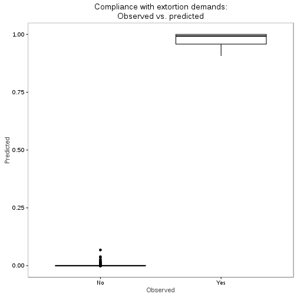

```r
# FOREST PLOTS?
# customize sjplots
set_theme(theme = "blank",
          geom.label.size = 0,
          axis.textsize.x = .7,
          axis.title.size = .9,
          axis.angle.x=90,
          axis.textsize.y = 0)

# Random intercepts
sjp.glmer(m1_l3, show.values = FALSE, sort.est= TRUE)
```

```
Plotting random effects...
```

```
Warning in .axisPars(usr, log = log, nintLog = nint): NAs introduced by
coercion to integer range
```

```
Warning in grDevices::axisTicks(log10(range(x, na.rm = TRUE)), log =
TRUE, : NAs introduced by coercion to integer range
```

```
Plotting random effects...
```

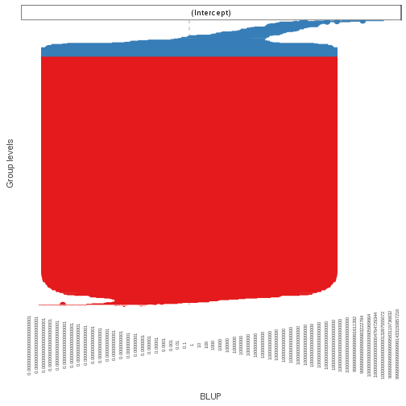

```r
# Forest plots
set_theme(theme = "blank",
          geom.label.size = 0,
          axis.textsize.x = .7,
          axis.title.size = .9,
          axis.angle.x=90,
          axis.textsize.y = .7)
sjp.glmer(m1_l3, type="fe", show.values = FALSE)
```

```
Warning in vcov.merMod(object): variance-covariance matrix computed from finite-difference Hessian is
not positive definite or contains NA values: falling back to var-cov estimated from RX
```

```
Warning in vcov.merMod(object, use.hessian = use.hessian): variance-covariance matrix computed from finite-difference Hessian is
not positive definite or contains NA values: falling back to var-cov estimated from RX
```

```
Warning in vcov.merMod(object, correlation = correlation, sigm = sig): variance-covariance matrix computed from finite-difference Hessian is
not positive definite or contains NA values: falling back to var-cov estimated from RX
```

```
Warning in .axisPars(usr, log = log, nintLog = nint): NAs introduced by
coercion to integer range
```

```
Warning in grDevices::axisTicks(log10(range(x, na.rm = TRUE)), log =
TRUE, : NAs introduced by coercion to integer range
```

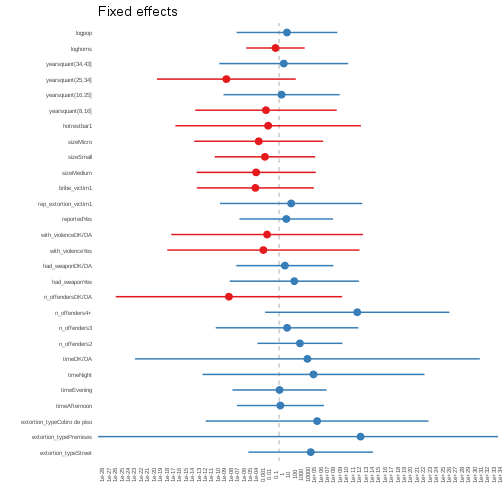

```r
sjp.glmer(m1_l3, type="fe", show.values = FALSE, sort.est = TRUE)
```

```
Warning in vcov.merMod(object): variance-covariance matrix computed from finite-difference Hessian is
not positive definite or contains NA values: falling back to var-cov estimated from RX
```

```
Warning in vcov.merMod(object, use.hessian = use.hessian): variance-covariance matrix computed from finite-difference Hessian is
not positive definite or contains NA values: falling back to var-cov estimated from RX
```

```
Warning in vcov.merMod(object, correlation = correlation, sigm = sig): variance-covariance matrix computed from finite-difference Hessian is
not positive definite or contains NA values: falling back to var-cov estimated from RX
```

```
Warning in .axisPars(usr, log = log, nintLog = nint): NAs introduced by
coercion to integer range
```

```
Warning in grDevices::axisTicks(log10(range(x, na.rm = TRUE)), log =
TRUE, : NAs introduced by coercion to integer range
```


```r
#htmlreg(list(m1, m1_l3))
screenreg(list(m1, m1_l3))
```

```
Warning in vcov.merMod(model, useScale = FALSE, ...): variance-covariance matrix computed from finite-difference Hessian is
not positive definite or contains NA values: falling back to var-cov estimated from RX
```

```

===================================================
                             Model 1       Model 2 
---------------------------------------------------
(Intercept)                     -3.42 ***   -13.65 
                                (0.61)      (14.11)
extortion_typeStreet             1.13        11.35 
                                (0.58)      (11.42)
extortion_typePremises          18.17        29.23 
                             (1069.69)     (427.25)
extortion_typeCobro de piso      2.41 *      13.66 
                                (0.97)      (20.40)
timeAfternoon                    0.05         0.50 
                                (0.38)       (7.97)
timeEvening                     -0.32         0.15 
                                (0.51)       (8.61)
timeNight                        2.17 *      12.35 
                                (0.97)      (20.32)
timeDK/DA                        1.68        10.16 
                                (1.48)      (31.56)
n_offenders2                     1.05 **      7.48 
                                (0.38)       (7.78)
n_offenders3                     0.96         2.88 
                                (0.64)      (13.06)
n_offenders4+                    2.69 ***    28.04 
                                (0.80)      (16.87)
n_offendersDK/DA                 0.16       -17.99 
                                (0.77)      (20.72)
had_weaponYes                    0.75         5.46 
                                (0.74)      (11.82)
had_weaponDK/DA                 -0.01         2.09 
                                (0.37)       (8.88)
with_violenceYes                 0.37        -5.64 
                                (0.86)      (17.58)
with_violenceDK/DA               0.70        -4.30 
                                (0.67)      (17.54)
reportedYes                      0.66         2.58 
                                (0.40)       (8.57)
rep_extortion_victim1            1.04         4.34 
                                (0.55)      (13.02)
bribe_victim1                    0.10        -8.50 
                                (0.50)      (10.71)
sizeMedium                      -0.15        -8.22 
                                (0.46)      (10.91)
sizeSmall                        0.57        -5.07 
                                (0.44)       (9.19)
sizeMicro                       -0.67        -7.31 
                                (0.50)      (11.79)
hotrestbar1                     -0.98        -3.91 
                                (0.58)      (16.98)
yearsquant(8,16]                -0.11        -4.71 
                                (0.55)      (12.95)
yearsquant(16,25]                0.77         0.90 
                                (0.49)      (10.63)
yearsquant(25,34]               -0.26       -18.90 
                                (0.57)      (12.70)
yearsquant(34,43]                1.17 *       1.68 
                                (0.51)      (11.79)
loghoms                         -0.07        -1.29 
                                (0.24)       (5.34)
logpop                           0.50         2.82 
                                (0.35)       (9.22)
---------------------------------------------------
AIC                            352.09       277.37 
BIC                            480.23       414.34 
Log Likelihood                -147.05      -107.68 
Deviance                       294.09              
Num. obs.                      613          613    
Num. groups: CVE_UNICA                      501    
Num. groups: CVE_ENT                         32    
Var: CVE_UNICA (Intercept)                  545.07 
Var: CVE_ENT (Intercept)                      0.01 
===================================================
*** p < 0.001, ** p < 0.01, * p < 0.05
```

```r
#htmlreg(list(m1, m1_l2, m1_l3))
screenreg(list(m1, m1_l2, m1_l3))
```

```
Warning in vcov.merMod(model, useScale = FALSE, ...): variance-covariance matrix computed from finite-difference Hessian is
not positive definite or contains NA values: falling back to var-cov estimated from RX
```

```
Warning in vcov.merMod(model, useScale = FALSE, ...): variance-covariance matrix computed from finite-difference Hessian is
not positive definite or contains NA values: falling back to var-cov estimated from RX
```

```

==============================================================
                             Model 1       Model 2    Model 3 
--------------------------------------------------------------
(Intercept)                     -3.42 ***    -6.73     -13.65 
                                (0.61)       (5.57)    (14.11)
extortion_typeStreet             1.13         8.13      11.35 
                                (0.58)       (4.92)    (11.42)
extortion_typePremises          18.17        21.88      29.23 
                             (1069.69)      (61.30)   (427.25)
extortion_typeCobro de piso      2.41 *       5.61      13.66 
                                (0.97)       (8.84)    (20.40)
timeAfternoon                    0.05        -2.88       0.50 
                                (0.38)       (3.34)     (7.97)
timeEvening                     -0.32        -7.88       0.15 
                                (0.51)       (4.38)     (8.61)
timeNight                        2.17 *      -5.99      12.35 
                                (0.97)      (10.59)    (20.32)
timeDK/DA                        1.68        -2.45      10.16 
                                (1.48)      (13.88)    (31.56)
n_offenders2                     1.05 **      1.96       7.48 
                                (0.38)       (3.51)     (7.78)
n_offenders3                     0.96         4.55       2.88 
                                (0.64)       (5.28)    (13.06)
n_offenders4+                    2.69 ***     7.75      28.04 
                                (0.80)       (7.66)    (16.87)
n_offendersDK/DA                 0.16        -4.62     -17.99 
                                (0.77)       (4.61)    (20.72)
had_weaponYes                    0.75         7.83       5.46 
                                (0.74)       (5.65)    (11.82)
had_weaponDK/DA                 -0.01         0.88       2.09 
                                (0.37)       (3.31)     (8.88)
with_violenceYes                 0.37        -1.76      -5.64 
                                (0.86)       (8.32)    (17.58)
with_violenceDK/DA               0.70         1.83      -4.30 
                                (0.67)       (6.71)    (17.54)
reportedYes                      0.66        -4.53       2.58 
                                (0.40)       (4.18)     (8.57)
rep_extortion_victim1            1.04         1.61       4.34 
                                (0.55)       (5.85)    (13.02)
bribe_victim1                    0.10        -3.92      -8.50 
                                (0.50)       (5.13)    (10.71)
sizeMedium                      -0.15        -2.31      -8.22 
                                (0.46)       (4.20)    (10.91)
sizeSmall                        0.57        -0.07      -5.07 
                                (0.44)       (4.03)     (9.19)
sizeMicro                       -0.67        -5.86      -7.31 
                                (0.50)       (5.43)    (11.79)
hotrestbar1                     -0.98       -16.04 *    -3.91 
                                (0.58)       (7.12)    (16.98)
yearsquant(8,16]                -0.11        -4.37      -4.71 
                                (0.55)       (6.12)    (12.95)
yearsquant(16,25]                0.77        -0.45       0.90 
                                (0.49)       (4.61)    (10.63)
yearsquant(25,34]               -0.26        -2.38     -18.90 
                                (0.57)       (5.71)    (12.70)
yearsquant(34,43]                1.17 *       2.88       1.68 
                                (0.51)       (4.49)    (11.79)
loghoms                         -0.07        -1.98      -1.29 
                                (0.24)       (2.45)     (5.34)
logpop                           0.50         3.65       2.82 
                                (0.35)       (3.98)     (9.22)
--------------------------------------------------------------
AIC                            352.09       324.24     277.37 
BIC                            480.23       456.79     414.34 
Log Likelihood                -147.05      -132.12    -107.68 
Deviance                       294.09                         
Num. obs.                      613          613        613    
Num. groups: CVE_UNICA                      501        501    
Var: CVE_UNICA (Intercept)                  134.44     545.07 
Num. groups: CVE_ENT                                    32    
Var: CVE_ENT (Intercept)                                 0.01 
==============================================================
*** p < 0.001, ** p < 0.01, * p < 0.05
```

```r
lrtest(m1, m1_l3)
```

```
Warning in modelUpdate(objects[[i - 1]], objects[[i]]): original model was
of class "glm", updated model is of class "glmerMod"
```

```
Likelihood ratio test

Model 1: complied_bin ~ extortion_type + time + n_offenders + had_weapon + 
    with_violence + reported + rep_extortion_victim + bribe_victim + 
    size + hotrestbar + yearsquant + loghoms + logpop
Model 2: complied_bin ~ extortion_type + time + n_offenders + had_weapon + 
    with_violence + reported + rep_extortion_victim + bribe_victim + 
    size + hotrestbar + yearsquant + loghoms + logpop + (1 | 
    CVE_UNICA) + (1 | CVE_ENT)
  #Df  LogLik Df  Chisq Pr(>Chisq)    
1  29 -147.05                         
2  31 -107.68  2 78.727  < 2.2e-16 ***
---
Signif. codes:  0 '***' 0.001 '**' 0.01 '*' 0.05 '.' 0.1 ' ' 1
```

```r
kable(lrtest(m1, m1_l3))
```

```
Warning in modelUpdate(objects[[i - 1]], objects[[i]]): original model was
of class "glm", updated model is of class "glmerMod"
```


| #Df|    LogLik| Df|    Chisq| Pr(>Chisq)|
|---:|---------:|--:|--------:|----------:|
|  29| -147.0471| NA|       NA|         NA|
|  31| -107.6834|  2| 78.72732|          0|

```r
anova(m1_l3, m1, test="LRT")
```

```
Data: m1df
Models:
m1: complied_bin ~ extortion_type + time + n_offenders + had_weapon + 
m1:     with_violence + reported + rep_extortion_victim + bribe_victim + 
m1:     size + hotrestbar + yearsquant + loghoms + logpop
m1_l3: complied_bin ~ extortion_type + time + n_offenders + had_weapon + 
m1_l3:     with_violence + reported + rep_extortion_victim + bribe_victim + 
m1_l3:     size + hotrestbar + yearsquant + loghoms + logpop + (1 | 
m1_l3:     CVE_UNICA) + (1 | CVE_ENT)
      Df    AIC    BIC  logLik deviance  Chisq Chi Df Pr(>Chisq)    
m1    29 352.09 480.23 -147.05   294.09                             
m1_l3 31 277.37 414.34 -107.68   215.37 78.727      2  < 2.2e-16 ***
---
Signif. codes:  0 '***' 0.001 '**' 0.01 '*' 0.05 '.' 0.1 ' ' 1
```

```r
kable(anova(m1_l3, m1, test="LRT"))
```


|      | Df|      AIC|      BIC|    logLik| deviance|    Chisq| Chi Df| Pr(>Chisq)|
|:-----|--:|--------:|--------:|---------:|--------:|--------:|------:|----------:|
|m1    | 29| 352.0941| 480.2267| -147.0471| 294.0941|       NA|     NA|         NA|
|m1_l3 | 31| 277.3668| 414.3361| -107.6834| 215.3668| 78.72732|      2|          0|

```r
lrtest(m1, m1_l2, m1_l3)
```

```
Warning in modelUpdate(objects[[i - 1]], objects[[i]]): original model was
of class "glm", updated model is of class "glmerMod"
```

```
Warning in modelUpdate(objects[[i - 1]], objects[[i]]): original model was
of class "glm", updated model is of class "glmerMod"
```

```
Likelihood ratio test

Model 1: complied_bin ~ extortion_type + time + n_offenders + had_weapon + 
    with_violence + reported + rep_extortion_victim + bribe_victim + 
    size + hotrestbar + yearsquant + loghoms + logpop
Model 2: complied_bin ~ extortion_type + time + n_offenders + had_weapon + 
    with_violence + reported + rep_extortion_victim + bribe_victim + 
    size + hotrestbar + yearsquant + loghoms + logpop + (1 | 
    CVE_UNICA)
Model 3: complied_bin ~ extortion_type + time + n_offenders + had_weapon + 
    with_violence + reported + rep_extortion_victim + bribe_victim + 
    size + hotrestbar + yearsquant + loghoms + logpop + (1 | 
    CVE_UNICA) + (1 | CVE_ENT)
  #Df  LogLik Df  Chisq Pr(>Chisq)    
1  29 -147.05                         
2  30 -132.12  1 29.858  4.649e-08 ***
3  31 -107.68  1 48.869  2.736e-12 ***
---
Signif. codes:  0 '***' 0.001 '**' 0.01 '*' 0.05 '.' 0.1 ' ' 1
```

```r
kable(lrtest(m1, m1_l2, m1_l3))
```

```
Warning in modelUpdate(objects[[i - 1]], objects[[i]]): original model was
of class "glm", updated model is of class "glmerMod"

Warning in modelUpdate(objects[[i - 1]], objects[[i]]): original model was
of class "glm", updated model is of class "glmerMod"
```


| #Df|    LogLik| Df|    Chisq| Pr(>Chisq)|
|---:|---------:|--:|--------:|----------:|
|  29| -147.0471| NA|       NA|         NA|
|  30| -132.1181|  1| 29.85794|          0|
|  31| -107.6834|  1| 48.86938|          0|

```r
anova(m1_l3, m1_l2, m1, test="LRT")
```

```
Data: m1df
Models:
m1: complied_bin ~ extortion_type + time + n_offenders + had_weapon + 
m1:     with_violence + reported + rep_extortion_victim + bribe_victim + 
m1:     size + hotrestbar + yearsquant + loghoms + logpop
m1_l2: complied_bin ~ extortion_type + time + n_offenders + had_weapon + 
m1_l2:     with_violence + reported + rep_extortion_victim + bribe_victim + 
m1_l2:     size + hotrestbar + yearsquant + loghoms + logpop + (1 | 
m1_l2:     CVE_UNICA)
m1_l3: complied_bin ~ extortion_type + time + n_offenders + had_weapon + 
m1_l3:     with_violence + reported + rep_extortion_victim + bribe_victim + 
m1_l3:     size + hotrestbar + yearsquant + loghoms + logpop + (1 | 
m1_l3:     CVE_UNICA) + (1 | CVE_ENT)
      Df    AIC    BIC  logLik deviance  Chisq Chi Df Pr(>Chisq)    
m1    29 352.09 480.23 -147.05   294.09                             
m1_l2 30 324.24 456.79 -132.12   264.24 29.858      1  4.649e-08 ***
m1_l3 31 277.37 414.34 -107.68   215.37 48.869      1  2.736e-12 ***
---
Signif. codes:  0 '***' 0.001 '**' 0.01 '*' 0.05 '.' 0.1 ' ' 1
```

```r
kable(anova(m1_l3, m1_l2, m1, test="LRT"))
```


|      | Df|      AIC|      BIC|    logLik| deviance|    Chisq| Chi Df| Pr(>Chisq)|
|:-----|--:|--------:|--------:|---------:|--------:|--------:|------:|----------:|
|m1    | 29| 352.0941| 480.2267| -147.0471| 294.0941|       NA|     NA|         NA|
|m1_l2 | 30| 324.2362| 456.7871| -132.1181| 264.2362| 29.85794|      1|          0|
|m1_l3 | 31| 277.3668| 414.3361| -107.6834| 215.3668| 48.86938|      1|          0|

```r
lrtest(m1_l2, m1_l3)
```

```
Likelihood ratio test

Model 1: complied_bin ~ extortion_type + time + n_offenders + had_weapon + 
    with_violence + reported + rep_extortion_victim + bribe_victim + 
    size + hotrestbar + yearsquant + loghoms + logpop + (1 | 
    CVE_UNICA)
Model 2: complied_bin ~ extortion_type + time + n_offenders + had_weapon + 
    with_violence + reported + rep_extortion_victim + bribe_victim + 
    size + hotrestbar + yearsquant + loghoms + logpop + (1 | 
    CVE_UNICA) + (1 | CVE_ENT)
  #Df  LogLik Df  Chisq Pr(>Chisq)    
1  30 -132.12                         
2  31 -107.68  1 48.869  2.736e-12 ***
---
Signif. codes:  0 '***' 0.001 '**' 0.01 '*' 0.05 '.' 0.1 ' ' 1
```

```r
kable(lrtest(m1_l2, m1_l3))
```


| #Df|    LogLik| Df|    Chisq| Pr(>Chisq)|
|---:|---------:|--:|--------:|----------:|
|  30| -132.1181| NA|       NA|         NA|
|  31| -107.6834|  1| 48.86938|          0|

```r
anova(m1_l3, m1_l2, test="LRT")
```

```
Data: m1df
Models:
m1_l2: complied_bin ~ extortion_type + time + n_offenders + had_weapon + 
m1_l2:     with_violence + reported + rep_extortion_victim + bribe_victim + 
m1_l2:     size + hotrestbar + yearsquant + loghoms + logpop + (1 | 
m1_l2:     CVE_UNICA)
m1_l3: complied_bin ~ extortion_type + time + n_offenders + had_weapon + 
m1_l3:     with_violence + reported + rep_extortion_victim + bribe_victim + 
m1_l3:     size + hotrestbar + yearsquant + loghoms + logpop + (1 | 
m1_l3:     CVE_UNICA) + (1 | CVE_ENT)
      Df    AIC    BIC  logLik deviance  Chisq Chi Df Pr(>Chisq)    
m1_l2 30 324.24 456.79 -132.12   264.24                             
m1_l3 31 277.37 414.34 -107.68   215.37 48.869      1  2.736e-12 ***
---
Signif. codes:  0 '***' 0.001 '**' 0.01 '*' 0.05 '.' 0.1 ' ' 1
```

```r
kable(anova(m1_l3, m1_l2, test="LRT"))
```


|      | Df|      AIC|      BIC|    logLik| deviance|    Chisq| Chi Df| Pr(>Chisq)|
|:-----|--:|--------:|--------:|---------:|--------:|--------:|------:|----------:|
|m1_l2 | 30| 324.2362| 456.7871| -132.1181| 264.2362|       NA|     NA|         NA|
|m1_l3 | 31| 277.3668| 414.3361| -107.6834| 215.3668| 48.86938|      1|          0|

Now test excluding all three level vars and all two level vars to test their influence.


```r
## Exclude state then business level variables

m1_l3_nostate <- glmer(complied_bin ~
                    extortion_type +
                    time +
                    n_offenders +
                    had_weapon +
                    with_violence +
                    reported +
                    rep_extortion_victim +
                    bribe_victim +
                    size + hotrestbar + yearsquant +
                    (1|CVE_UNICA) + (1|CVE_ENT),
                  data=m1df,
                  family = "binomial")
```

```
Warning in (function (fn, par, lower = rep.int(-Inf, n), upper =
rep.int(Inf, : failure to converge in 10000 evaluations
```

```
Warning in checkConv(attr(opt, "derivs"), opt$par, ctrl = control
$checkConv, : unable to evaluate scaled gradient
```

```
Warning in checkConv(attr(opt, "derivs"), opt$par, ctrl = control
$checkConv, : Model failed to converge: degenerate Hessian with 4 negative
eigenvalues
```

```r
summary(m1_l3_nostate)
```

```
Warning in vcov.merMod(object, use.hessian = use.hessian): variance-covariance matrix computed from finite-difference Hessian is
not positive definite or contains NA values: falling back to var-cov estimated from RX
```

```
Warning in vcov.merMod(object, correlation = correlation, sigm = sig): variance-covariance matrix computed from finite-difference Hessian is
not positive definite or contains NA values: falling back to var-cov estimated from RX
```

```
Generalized linear mixed model fit by maximum likelihood (Laplace
  Approximation) [glmerMod]
 Family: binomial  ( logit )
Formula: 
complied_bin ~ extortion_type + time + n_offenders + had_weapon +  
    with_violence + reported + rep_extortion_victim + bribe_victim +  
    size + hotrestbar + yearsquant + (1 | CVE_UNICA) + (1 | CVE_ENT)
   Data: m1df

     AIC      BIC   logLik deviance df.resid 
   317.1    445.2   -129.6    259.1      584 

Scaled residuals: 
     Min       1Q   Median       3Q      Max 
-0.95902 -0.00262 -0.00008  0.00000  1.64345 

Random effects:
 Groups    Name        Variance Std.Dev.
 CVE_UNICA (Intercept) 233.62   15.285  
 CVE_ENT   (Intercept)  11.38    3.373  
Number of obs: 613, groups:  CVE_UNICA, 501; CVE_ENT, 32

Fixed effects:
                            Estimate Std. Error z value Pr(>|z|)  
(Intercept)                  -7.7289     6.5859  -1.174   0.2406  
extortion_typeStreet          0.1930     7.5770   0.026   0.9797  
extortion_typePremises       18.6038   132.5065   0.140   0.8883  
extortion_typeCobro de piso -18.3239    14.2110  -1.289   0.1973  
timeAfternoon                -0.4075     4.4210  -0.092   0.9266  
timeEvening                  -3.8160     4.6770  -0.816   0.4145  
timeNight                     3.9630    14.3926   0.275   0.7830  
timeDK/DA                     3.3915    15.6207   0.217   0.8281  
n_offenders2                  3.7730     4.4581   0.846   0.3974  
n_offenders3                  5.0655     7.8656   0.644   0.5196  
n_offenders4+                25.2088     9.8375   2.562   0.0104 *
n_offendersDK/DA              0.7683     7.0113   0.110   0.9127  
had_weaponYes                 3.5926     7.6375   0.470   0.6381  
had_weaponDK/DA              -7.5827     4.4085  -1.720   0.0854 .
with_violenceYes              5.6643    10.5225   0.538   0.5904  
with_violenceDK/DA            4.0083     9.1277   0.439   0.6606  
reportedYes                   0.5884     4.9262   0.119   0.9049  
rep_extortion_victim1        -1.7445     8.3300  -0.209   0.8341  
bribe_victim1                 1.3161     6.5363   0.201   0.8404  
sizeMedium                   -4.5854     5.6442  -0.812   0.4166  
sizeSmall                    -5.5658     5.4772  -1.016   0.3096  
sizeMicro                    -8.2893     6.8357  -1.213   0.2253  
hotrestbar1                 -15.0456    10.0893  -1.491   0.1359  
yearsquant(8,16]              0.7951     7.2535   0.110   0.9127  
yearsquant(16,25]             0.8327     6.1514   0.135   0.8923  
yearsquant(25,34]            -6.9141     8.0015  -0.864   0.3875  
yearsquant(34,43]             4.0074     6.6808   0.600   0.5486  
---
Signif. codes:  0 '***' 0.001 '**' 0.01 '*' 0.05 '.' 0.1 ' ' 1
```

```

Correlation matrix not shown by default, as p = 27 > 12.
Use print(x, correlation=TRUE)  or
	 vcov(x)	 if you need it
```

```
convergence code: 0
unable to evaluate scaled gradient
Model failed to converge: degenerate  Hessian with 4 negative eigenvalues
failure to converge in 10000 evaluations
```

```r
lrtest(m1_l3_nostate, m1_l3)
```

```
Likelihood ratio test

Model 1: complied_bin ~ extortion_type + time + n_offenders + had_weapon + 
    with_violence + reported + rep_extortion_victim + bribe_victim + 
    size + hotrestbar + yearsquant + (1 | CVE_UNICA) + (1 | CVE_ENT)
Model 2: complied_bin ~ extortion_type + time + n_offenders + had_weapon + 
    with_violence + reported + rep_extortion_victim + bribe_victim + 
    size + hotrestbar + yearsquant + loghoms + logpop + (1 | 
    CVE_UNICA) + (1 | CVE_ENT)
  #Df  LogLik Df  Chisq Pr(>Chisq)    
1  29 -129.55                         
2  31 -107.68  2 43.741  3.175e-10 ***
---
Signif. codes:  0 '***' 0.001 '**' 0.01 '*' 0.05 '.' 0.1 ' ' 1
```

```r
kable(lrtest(m1_l3_nostate, m1_l3))
```


| #Df|    LogLik| Df|    Chisq| Pr(>Chisq)|
|---:|---------:|--:|--------:|----------:|
|  29| -129.5540| NA|       NA|         NA|
|  31| -107.6834|  2| 43.74122|          0|

```r
anova(m1_l3_nostate, m1_l3, test="LRT")
```

```
Data: m1df
Models:
m1_l3_nostate: complied_bin ~ extortion_type + time + n_offenders + had_weapon + 
m1_l3_nostate:     with_violence + reported + rep_extortion_victim + bribe_victim + 
m1_l3_nostate:     size + hotrestbar + yearsquant + (1 | CVE_UNICA) + (1 | CVE_ENT)
m1_l3: complied_bin ~ extortion_type + time + n_offenders + had_weapon + 
m1_l3:     with_violence + reported + rep_extortion_victim + bribe_victim + 
m1_l3:     size + hotrestbar + yearsquant + loghoms + logpop + (1 | 
m1_l3:     CVE_UNICA) + (1 | CVE_ENT)
              Df    AIC    BIC  logLik deviance  Chisq Chi Df Pr(>Chisq)
m1_l3_nostate 29 317.11 445.24 -129.55   259.11                         
m1_l3         31 277.37 414.34 -107.68   215.37 43.741      2  3.175e-10
                 
m1_l3_nostate    
m1_l3         ***
---
Signif. codes:  0 '***' 0.001 '**' 0.01 '*' 0.05 '.' 0.1 ' ' 1
```

```r
kable(anova(m1_l3_nostate, m1_l3, test="LRT"))
```


|              | Df|      AIC|      BIC|    logLik| deviance|    Chisq| Chi Df| Pr(>Chisq)|
|:-------------|--:|--------:|--------:|---------:|--------:|--------:|------:|----------:|
|m1_l3_nostate | 29| 317.1080| 445.2406| -129.5540| 259.1080|       NA|     NA|         NA|
|m1_l3         | 31| 277.3668| 414.3361| -107.6834| 215.3668| 43.74122|      2|          0|

```r
## Only incident level

m1_l3_nostate_nobus <- glmer(complied_bin ~
                  extortion_type +
                    time +
                    n_offenders +
                    had_weapon +
                    with_violence +
                    reported +
                    (1|CVE_UNICA) + (1|CVE_ENT),
                  data=m1df,
                  family = "binomial")
```

```
Warning in (function (fn, par, lower = rep.int(-Inf, n), upper =
rep.int(Inf, : failure to converge in 10000 evaluations
```

```
Warning in checkConv(attr(opt, "derivs"), opt$par, ctrl = control
$checkConv, : unable to evaluate scaled gradient
```

```
Warning in checkConv(attr(opt, "derivs"), opt$par, ctrl = control
$checkConv, : Hessian is numerically singular: parameters are not uniquely
determined
```

```r
summary(m1_l3_nostate_nobus)
```

```
Warning in vcov.merMod(object, use.hessian = use.hessian): variance-covariance matrix computed from finite-difference Hessian is
not positive definite or contains NA values: falling back to var-cov estimated from RX
```

```
Warning in vcov.merMod(object, correlation = correlation, sigm = sig): variance-covariance matrix computed from finite-difference Hessian is
not positive definite or contains NA values: falling back to var-cov estimated from RX
```

```
Generalized linear mixed model fit by maximum likelihood (Laplace
  Approximation) [glmerMod]
 Family: binomial  ( logit )
Formula: 
complied_bin ~ extortion_type + time + n_offenders + had_weapon +  
    with_violence + reported + (1 | CVE_UNICA) + (1 | CVE_ENT)
   Data: m1df

     AIC      BIC   logLik deviance df.resid 
   264.8    348.7   -113.4    226.8      594 

Scaled residuals: 
     Min       1Q   Median       3Q      Max 
-0.75275 -0.00282 -0.00003 -0.00002  1.70910 

Random effects:
 Groups    Name        Variance  Std.Dev.
 CVE_UNICA (Intercept) 7.796e+02 27.92153
 CVE_ENT   (Intercept) 1.725e-04  0.01313
Number of obs: 613, groups:  CVE_UNICA, 501; CVE_ENT, 32

Fixed effects:
                              Estimate Std. Error z value Pr(>|z|)  
(Intercept)                 -1.057e+01  7.536e+00  -1.403   0.1607  
extortion_typeStreet        -2.381e+00  1.250e+01  -0.190   0.8490  
extortion_typePremises       4.688e+02  2.023e+07   0.000   1.0000  
extortion_typeCobro de piso -2.390e+01  2.221e+01  -1.076   0.2819  
timeAfternoon               -1.032e+01  8.292e+00  -1.245   0.2131  
timeEvening                 -5.165e-01  7.206e+00  -0.072   0.9429  
timeNight                   -1.647e+01  2.245e+01  -0.734   0.4630  
timeDK/DA                   -7.702e+01  3.208e+01  -2.401   0.0164 *
n_offenders2                 1.562e+00  6.961e+00   0.224   0.8225  
n_offenders3                 1.148e+00  1.525e+01   0.075   0.9400  
n_offenders4+                8.343e+00  1.443e+01   0.578   0.5631  
n_offendersDK/DA            -7.231e+00  1.262e+01  -0.573   0.5666  
had_weaponYes                1.737e+01  1.353e+01   1.284   0.1990  
had_weaponDK/DA             -1.166e+00  8.296e+00  -0.140   0.8883  
with_violenceYes            -4.202e+00  1.613e+01  -0.260   0.7945  
with_violenceDK/DA          -1.155e+00  1.637e+01  -0.071   0.9438  
reportedYes                 -4.438e+00  9.479e+00  -0.468   0.6396  
---
Signif. codes:  0 '***' 0.001 '**' 0.01 '*' 0.05 '.' 0.1 ' ' 1
```

```

Correlation matrix not shown by default, as p = 17 > 12.
Use print(x, correlation=TRUE)  or
	 vcov(x)	 if you need it
```

```
convergence code: 0
unable to evaluate scaled gradient
 Hessian is numerically singular: parameters are not uniquely determined
failure to converge in 10000 evaluations
```

```r
lrtest(m1_l3_nostate_nobus, m1_l3_nostate)
```

```
Likelihood ratio test

Model 1: complied_bin ~ extortion_type + time + n_offenders + had_weapon + 
    with_violence + reported + (1 | CVE_UNICA) + (1 | CVE_ENT)
Model 2: complied_bin ~ extortion_type + time + n_offenders + had_weapon + 
    with_violence + reported + rep_extortion_victim + bribe_victim + 
    size + hotrestbar + yearsquant + (1 | CVE_UNICA) + (1 | CVE_ENT)
  #Df  LogLik Df  Chisq Pr(>Chisq)    
1  19 -113.40                         
2  29 -129.55 10 32.313  0.0003551 ***
---
Signif. codes:  0 '***' 0.001 '**' 0.01 '*' 0.05 '.' 0.1 ' ' 1
```

```r
kable(lrtest(m1_l3_nostate_nobus, m1_l3_nostate))
```


| #Df|    LogLik| Df|    Chisq| Pr(>Chisq)|
|---:|---------:|--:|--------:|----------:|
|  19| -113.3975| NA|       NA|         NA|
|  29| -129.5540| 10| 32.31307|  0.0003551|

```r
anova(m1_l3_nostate_nobus, m1_l3_nostate, test="LRT")
```

```
Data: m1df
Models:
m1_l3_nostate_nobus: complied_bin ~ extortion_type + time + n_offenders + had_weapon + 
m1_l3_nostate_nobus:     with_violence + reported + (1 | CVE_UNICA) + (1 | CVE_ENT)
m1_l3_nostate: complied_bin ~ extortion_type + time + n_offenders + had_weapon + 
m1_l3_nostate:     with_violence + reported + rep_extortion_victim + bribe_victim + 
m1_l3_nostate:     size + hotrestbar + yearsquant + (1 | CVE_UNICA) + (1 | CVE_ENT)
                    Df    AIC    BIC  logLik deviance Chisq Chi Df
m1_l3_nostate_nobus 19 264.79 348.74 -113.40   226.79             
m1_l3_nostate       29 317.11 445.24 -129.55   259.11     0     10
                    Pr(>Chisq)
m1_l3_nostate_nobus           
m1_l3_nostate                1
```

```r
kable(anova(m1_l3_nostate_nobus, m1_l3_nostate, test="LRT"))
```


|                    | Df|     AIC|      BIC|    logLik| deviance| Chisq| Chi Df| Pr(>Chisq)|
|:-------------------|--:|-------:|--------:|---------:|--------:|-----:|------:|----------:|
|m1_l3_nostate_nobus | 19| 264.795| 348.7439| -113.3975|  226.795|    NA|     NA|         NA|
|m1_l3_nostate       | 29| 317.108| 445.2406| -129.5540|  259.108|     0|     10|          1|

```r
lrtest(m1_l3_nostate_nobus, m1_l3_nostate, m1_l3)
```

```
Likelihood ratio test

Model 1: complied_bin ~ extortion_type + time + n_offenders + had_weapon + 
    with_violence + reported + (1 | CVE_UNICA) + (1 | CVE_ENT)
Model 2: complied_bin ~ extortion_type + time + n_offenders + had_weapon + 
    with_violence + reported + rep_extortion_victim + bribe_victim + 
    size + hotrestbar + yearsquant + (1 | CVE_UNICA) + (1 | CVE_ENT)
Model 3: complied_bin ~ extortion_type + time + n_offenders + had_weapon + 
    with_violence + reported + rep_extortion_victim + bribe_victim + 
    size + hotrestbar + yearsquant + loghoms + logpop + (1 | 
    CVE_UNICA) + (1 | CVE_ENT)
  #Df  LogLik Df  Chisq Pr(>Chisq)    
1  19 -113.40                         
2  29 -129.55 10 32.313  0.0003551 ***
3  31 -107.68  2 43.741  3.175e-10 ***
---
Signif. codes:  0 '***' 0.001 '**' 0.01 '*' 0.05 '.' 0.1 ' ' 1
```

```r
kable(lrtest(m1_l3_nostate_nobus, m1_l3_nostate, m1_l3))
```


| #Df|    LogLik| Df|    Chisq| Pr(>Chisq)|
|---:|---------:|--:|--------:|----------:|
|  19| -113.3975| NA|       NA|         NA|
|  29| -129.5540| 10| 32.31307|  0.0003551|
|  31| -107.6834|  2| 43.74122|  0.0000000|

```r
anova(m1_l3_nostate_nobus, m1_l3_nostate, m1_l3, test="LRT")
```

```
Data: m1df
Models:
m1_l3_nostate_nobus: complied_bin ~ extortion_type + time + n_offenders + had_weapon + 
m1_l3_nostate_nobus:     with_violence + reported + (1 | CVE_UNICA) + (1 | CVE_ENT)
m1_l3_nostate: complied_bin ~ extortion_type + time + n_offenders + had_weapon + 
m1_l3_nostate:     with_violence + reported + rep_extortion_victim + bribe_victim + 
m1_l3_nostate:     size + hotrestbar + yearsquant + (1 | CVE_UNICA) + (1 | CVE_ENT)
m1_l3: complied_bin ~ extortion_type + time + n_offenders + had_weapon + 
m1_l3:     with_violence + reported + rep_extortion_victim + bribe_victim + 
m1_l3:     size + hotrestbar + yearsquant + loghoms + logpop + (1 | 
m1_l3:     CVE_UNICA) + (1 | CVE_ENT)
                    Df    AIC    BIC  logLik deviance  Chisq Chi Df
m1_l3_nostate_nobus 19 264.79 348.74 -113.40   226.79              
m1_l3_nostate       29 317.11 445.24 -129.55   259.11  0.000     10
m1_l3               31 277.37 414.34 -107.68   215.37 43.741      2
                    Pr(>Chisq)    
m1_l3_nostate_nobus               
m1_l3_nostate                1    
m1_l3                3.175e-10 ***
---
Signif. codes:  0 '***' 0.001 '**' 0.01 '*' 0.05 '.' 0.1 ' ' 1
```

```r
kable(anova(m1_l3_nostate_nobus, m1_l3_nostate, m1_l3, test="LRT"))
```


|                    | Df|      AIC|      BIC|    logLik| deviance|    Chisq| Chi Df| Pr(>Chisq)|
|:-------------------|--:|--------:|--------:|---------:|--------:|--------:|------:|----------:|
|m1_l3_nostate_nobus | 19| 264.7950| 348.7439| -113.3975| 226.7950|       NA|     NA|         NA|
|m1_l3_nostate       | 29| 317.1080| 445.2406| -129.5540| 259.1080|  0.00000|     10|          1|
|m1_l3               | 31| 277.3668| 414.3361| -107.6834| 215.3668| 43.74122|      2|          0|

```r
lrtest(m1_l3_null, m1_l3_nostate_nobus, m1_l3_nostate, m1_l3)
```

```
Likelihood ratio test

Model 1: complied_bin ~ (1 | CVE_UNICA) + (1 | CVE_ENT)
Model 2: complied_bin ~ extortion_type + time + n_offenders + had_weapon + 
    with_violence + reported + (1 | CVE_UNICA) + (1 | CVE_ENT)
Model 3: complied_bin ~ extortion_type + time + n_offenders + had_weapon + 
    with_violence + reported + rep_extortion_victim + bribe_victim + 
    size + hotrestbar + yearsquant + (1 | CVE_UNICA) + (1 | CVE_ENT)
Model 4: complied_bin ~ extortion_type + time + n_offenders + had_weapon + 
    with_violence + reported + rep_extortion_victim + bribe_victim + 
    size + hotrestbar + yearsquant + loghoms + logpop + (1 | 
    CVE_UNICA) + (1 | CVE_ENT)
  #Df  LogLik Df   Chisq Pr(>Chisq)    
1   3 -109.54                          
2  19 -113.40 16  7.7154  0.9568916    
3  29 -129.55 10 32.3131  0.0003551 ***
4  31 -107.68  2 43.7412  3.175e-10 ***
---
Signif. codes:  0 '***' 0.001 '**' 0.01 '*' 0.05 '.' 0.1 ' ' 1
```

```r
kable(lrtest(m1_l3_null, m1_l3_nostate_nobus, m1_l3_nostate, m1_l3))
```


| #Df|    LogLik| Df|    Chisq| Pr(>Chisq)|
|---:|---------:|--:|--------:|----------:|
|   3| -109.5398| NA|       NA|         NA|
|  19| -113.3975| 16|  7.71537|  0.9568916|
|  29| -129.5540| 10| 32.31307|  0.0003551|
|  31| -107.6834|  2| 43.74122|  0.0000000|

```r
anova(m1_l3_null, m1_l3_nostate_nobus, m1_l3_nostate, m1_l3, test="LRT")
```

```
Data: m1df
Models:
m1_l3_null: complied_bin ~ (1 | CVE_UNICA) + (1 | CVE_ENT)
m1_l3_nostate_nobus: complied_bin ~ extortion_type + time + n_offenders + had_weapon + 
m1_l3_nostate_nobus:     with_violence + reported + (1 | CVE_UNICA) + (1 | CVE_ENT)
m1_l3_nostate: complied_bin ~ extortion_type + time + n_offenders + had_weapon + 
m1_l3_nostate:     with_violence + reported + rep_extortion_victim + bribe_victim + 
m1_l3_nostate:     size + hotrestbar + yearsquant + (1 | CVE_UNICA) + (1 | CVE_ENT)
m1_l3: complied_bin ~ extortion_type + time + n_offenders + had_weapon + 
m1_l3:     with_violence + reported + rep_extortion_victim + bribe_victim + 
m1_l3:     size + hotrestbar + yearsquant + loghoms + logpop + (1 | 
m1_l3:     CVE_UNICA) + (1 | CVE_ENT)
                    Df    AIC    BIC  logLik deviance  Chisq Chi Df
m1_l3_null           3 225.08 238.33 -109.54   219.08              
m1_l3_nostate_nobus 19 264.79 348.74 -113.40   226.79  0.000     16
m1_l3_nostate       29 317.11 445.24 -129.55   259.11  0.000     10
m1_l3               31 277.37 414.34 -107.68   215.37 43.741      2
                    Pr(>Chisq)    
m1_l3_null                        
m1_l3_nostate_nobus          1    
m1_l3_nostate                1    
m1_l3                3.175e-10 ***
---
Signif. codes:  0 '***' 0.001 '**' 0.01 '*' 0.05 '.' 0.1 ' ' 1
```

```r
kable(anova(m1_l3_null, m1_l3_nostate_nobus, m1_l3_nostate,
              m1_l3, test="LRT"))
```


|                    | Df|      AIC|      BIC|    logLik| deviance|    Chisq| Chi Df| Pr(>Chisq)|
|:-------------------|--:|--------:|--------:|---------:|--------:|--------:|------:|----------:|
|m1_l3_null          |  3| 225.0796| 238.3347| -109.5398| 219.0796|       NA|     NA|         NA|
|m1_l3_nostate_nobus | 19| 264.7950| 348.7439| -113.3975| 226.7950|  0.00000|     16|          1|
|m1_l3_nostate       | 29| 317.1080| 445.2406| -129.5540| 259.1080|  0.00000|     10|          1|
|m1_l3               | 31| 277.3668| 414.3361| -107.6834| 215.3668| 43.74122|      2|          0|

```r
## without the vars with a lot of missing

m1_l3_no_viol_off_wea <- glmer(complied_bin ~
                          extortion_type +
                          time +
                          reported +
                          (1|CVE_UNICA) + (1|CVE_ENT),
                        data=m1df,
                        family = "binomial")
```

```
Warning in checkConv(attr(opt, "derivs"), opt$par, ctrl = control
$checkConv, : unable to evaluate scaled gradient
```

```
Warning in checkConv(attr(opt, "derivs"), opt$par, ctrl = control
$checkConv, : Hessian is numerically singular: parameters are not uniquely
determined
```

```r
summary(m1_l3_no_viol_off_wea)
```

```
Warning in vcov.merMod(object, use.hessian = use.hessian): variance-covariance matrix computed from finite-difference Hessian is
not positive definite or contains NA values: falling back to var-cov estimated from RX
```

```
Warning in vcov.merMod(object, correlation = correlation, sigm = sig): variance-covariance matrix computed from finite-difference Hessian is
not positive definite or contains NA values: falling back to var-cov estimated from RX
```

```
Generalized linear mixed model fit by maximum likelihood (Laplace
  Approximation) [glmerMod]
 Family: binomial  ( logit )
Formula: 
complied_bin ~ extortion_type + time + reported + (1 | CVE_UNICA) +  
    (1 | CVE_ENT)
   Data: m1df

     AIC      BIC   logLik deviance df.resid 
   246.6    295.2   -112.3    224.6      602 

Scaled residuals: 
     Min       1Q   Median       3Q      Max 
-0.97864 -0.00396 -0.00277 -0.00011  1.75664 

Random effects:
 Groups    Name        Variance Std.Dev.
 CVE_UNICA (Intercept) 505.487  22.4830 
 CVE_ENT   (Intercept)   0.719   0.8479 
Number of obs: 613, groups:  CVE_UNICA, 501; CVE_ENT, 32

Fixed effects:
                              Estimate Std. Error z value Pr(>|z|)   
(Intercept)                 -1.819e+01  5.887e+00  -3.089  0.00201 **
extortion_typeStreet         3.524e+00  7.047e+00   0.500  0.61704   
extortion_typePremises       6.608e+01  2.023e+07   0.000  1.00000   
extortion_typeCobro de piso  2.706e+01  1.370e+01   1.975  0.04825 * 
timeAfternoon                7.104e+00  6.564e+00   1.082  0.27909   
timeEvening                  6.378e+00  5.702e+00   1.119  0.26329   
timeNight                   -1.303e+01  1.720e+01  -0.757  0.44882   
timeDK/DA                    3.112e+01  1.742e+01   1.786  0.07402 . 
reportedYes                 -5.423e-01  7.093e+00  -0.076  0.93906   
---
Signif. codes:  0 '***' 0.001 '**' 0.01 '*' 0.05 '.' 0.1 ' ' 1

Correlation of Fixed Effects:
            (Intr) extr_S extr_P ex_Cdp tmAftr tmEvnn tmNght tDK/DA
extrtn_typS -0.452                                                 
extrtn_typP  0.000  0.000                                          
extrtn_tCdp -0.214  0.126  0.000                                   
timeAfternn -0.705  0.222  0.000 -0.003                            
timeEvening -0.381 -0.050  0.000  0.065  0.322                     
timeNight   -0.342  0.155  0.000  0.073  0.241  0.130              
timeDK/DA   -0.338  0.153  0.000  0.072  0.238  0.129  0.116       
reportedYes -0.365 -0.005  0.000  0.133  0.076  0.085  0.125  0.123
convergence code: 0
unable to evaluate scaled gradient
 Hessian is numerically singular: parameters are not uniquely determined
```

```r
lrtest(m1_l3_no_viol_off_wea, m1_l3_nostate_nobus)
```

```
Likelihood ratio test

Model 1: complied_bin ~ extortion_type + time + reported + (1 | CVE_UNICA) + 
    (1 | CVE_ENT)
Model 2: complied_bin ~ extortion_type + time + n_offenders + had_weapon + 
    with_violence + reported + (1 | CVE_UNICA) + (1 | CVE_ENT)
  #Df  LogLik Df Chisq Pr(>Chisq)
1  11 -112.29                    
2  19 -113.40  8 2.221     0.9735
```

```r
kable(lrtest(m1_l3_no_viol_off_wea, m1_l3_nostate_nobus))
```


| #Df|    LogLik| Df|    Chisq| Pr(>Chisq)|
|---:|---------:|--:|--------:|----------:|
|  11| -112.2870| NA|       NA|         NA|
|  19| -113.3975|  8| 2.221026|  0.9734748|

```r
anova(m1_l3_no_viol_off_wea, m1_l3_nostate_nobus, test="LRT")
```

```
Data: m1df
Models:
m1_l3_no_viol_off_wea: complied_bin ~ extortion_type + time + reported + (1 | CVE_UNICA) + 
m1_l3_no_viol_off_wea:     (1 | CVE_ENT)
m1_l3_nostate_nobus: complied_bin ~ extortion_type + time + n_offenders + had_weapon + 
m1_l3_nostate_nobus:     with_violence + reported + (1 | CVE_UNICA) + (1 | CVE_ENT)
                      Df    AIC    BIC  logLik deviance Chisq Chi Df
m1_l3_no_viol_off_wea 11 246.57 295.18 -112.29   224.57             
m1_l3_nostate_nobus   19 264.80 348.74 -113.40   226.79     0      8
                      Pr(>Chisq)
m1_l3_no_viol_off_wea           
m1_l3_nostate_nobus            1
```

```r
kable(anova(m1_l3_no_viol_off_wea, m1_l3_nostate_nobus, test="LRT"))
```


|                      | Df|      AIC|      BIC|    logLik| deviance| Chisq| Chi Df| Pr(>Chisq)|
|:---------------------|--:|--------:|--------:|---------:|--------:|-----:|------:|----------:|
|m1_l3_no_viol_off_wea | 11| 246.5739| 295.1760| -112.2870| 224.5739|    NA|     NA|         NA|
|m1_l3_nostate_nobus   | 19| 264.7950| 348.7439| -113.3975| 226.7950|     0|      8|          1|

```r
lrtest(m1_l3_no_viol_off_wea, m1_l3_nostate_nobus, m1_l3_nostate, m1_l3)
```

```
Likelihood ratio test

Model 1: complied_bin ~ extortion_type + time + reported + (1 | CVE_UNICA) + 
    (1 | CVE_ENT)
Model 2: complied_bin ~ extortion_type + time + n_offenders + had_weapon + 
    with_violence + reported + (1 | CVE_UNICA) + (1 | CVE_ENT)
Model 3: complied_bin ~ extortion_type + time + n_offenders + had_weapon + 
    with_violence + reported + rep_extortion_victim + bribe_victim + 
    size + hotrestbar + yearsquant + (1 | CVE_UNICA) + (1 | CVE_ENT)
Model 4: complied_bin ~ extortion_type + time + n_offenders + had_weapon + 
    with_violence + reported + rep_extortion_victim + bribe_victim + 
    size + hotrestbar + yearsquant + loghoms + logpop + (1 | 
    CVE_UNICA) + (1 | CVE_ENT)
  #Df  LogLik Df  Chisq Pr(>Chisq)    
1  11 -112.29                         
2  19 -113.40  8  2.221  0.9734748    
3  29 -129.55 10 32.313  0.0003551 ***
4  31 -107.68  2 43.741  3.175e-10 ***
---
Signif. codes:  0 '***' 0.001 '**' 0.01 '*' 0.05 '.' 0.1 ' ' 1
```

```r
kable(lrtest(m1_l3_no_viol_off_wea, m1_l3_nostate_nobus,
             m1_l3_nostate, m1_l3))
```


| #Df|    LogLik| Df|     Chisq| Pr(>Chisq)|
|---:|---------:|--:|---------:|----------:|
|  11| -112.2870| NA|        NA|         NA|
|  19| -113.3975|  8|  2.221026|  0.9734748|
|  29| -129.5540| 10| 32.313066|  0.0003551|
|  31| -107.6834|  2| 43.741219|  0.0000000|

```r
anova(m1_l3_no_viol_off_wea, m1_l3_nostate_nobus,
         m1_l3_nostate, m1_l3, test="LRT")
```

```
Data: m1df
Models:
m1_l3_no_viol_off_wea: complied_bin ~ extortion_type + time + reported + (1 | CVE_UNICA) + 
m1_l3_no_viol_off_wea:     (1 | CVE_ENT)
m1_l3_nostate_nobus: complied_bin ~ extortion_type + time + n_offenders + had_weapon + 
m1_l3_nostate_nobus:     with_violence + reported + (1 | CVE_UNICA) + (1 | CVE_ENT)
m1_l3_nostate: complied_bin ~ extortion_type + time + n_offenders + had_weapon + 
m1_l3_nostate:     with_violence + reported + rep_extortion_victim + bribe_victim + 
m1_l3_nostate:     size + hotrestbar + yearsquant + (1 | CVE_UNICA) + (1 | CVE_ENT)
m1_l3: complied_bin ~ extortion_type + time + n_offenders + had_weapon + 
m1_l3:     with_violence + reported + rep_extortion_victim + bribe_victim + 
m1_l3:     size + hotrestbar + yearsquant + loghoms + logpop + (1 | 
m1_l3:     CVE_UNICA) + (1 | CVE_ENT)
                      Df    AIC    BIC  logLik deviance  Chisq Chi Df
m1_l3_no_viol_off_wea 11 246.57 295.18 -112.29   224.57              
m1_l3_nostate_nobus   19 264.79 348.74 -113.40   226.79  0.000      8
m1_l3_nostate         29 317.11 445.24 -129.55   259.11  0.000     10
m1_l3                 31 277.37 414.34 -107.68   215.37 43.741      2
                      Pr(>Chisq)    
m1_l3_no_viol_off_wea               
m1_l3_nostate_nobus            1    
m1_l3_nostate                  1    
m1_l3                  3.175e-10 ***
---
Signif. codes:  0 '***' 0.001 '**' 0.01 '*' 0.05 '.' 0.1 ' ' 1
```

```r
kable(anova(m1_l3_no_viol_off_wea, m1_l3_nostate_nobus,
               m1_l3_nostate, m1_l3, test="LRT"))
```


|                      | Df|      AIC|      BIC|    logLik| deviance|    Chisq| Chi Df| Pr(>Chisq)|
|:---------------------|--:|--------:|--------:|---------:|--------:|--------:|------:|----------:|
|m1_l3_no_viol_off_wea | 11| 246.5739| 295.1760| -112.2870| 224.5739|       NA|     NA|         NA|
|m1_l3_nostate_nobus   | 19| 264.7950| 348.7439| -113.3975| 226.7950|  0.00000|      8|          1|
|m1_l3_nostate         | 29| 317.1080| 445.2406| -129.5540| 259.1080|  0.00000|     10|          1|
|m1_l3                 | 31| 277.3668| 414.3361| -107.6834| 215.3668| 43.74122|      2|          0|

```r
lrtest(m1_l3_null, m1_l3_no_viol_off_wea, m1_l3_nostate_nobus,
        m1_l3_nostate, m1_l3)
```

```
Likelihood ratio test

Model 1: complied_bin ~ (1 | CVE_UNICA) + (1 | CVE_ENT)
Model 2: complied_bin ~ extortion_type + time + reported + (1 | CVE_UNICA) + 
    (1 | CVE_ENT)
Model 3: complied_bin ~ extortion_type + time + n_offenders + had_weapon + 
    with_violence + reported + (1 | CVE_UNICA) + (1 | CVE_ENT)
Model 4: complied_bin ~ extortion_type + time + n_offenders + had_weapon + 
    with_violence + reported + rep_extortion_victim + bribe_victim + 
    size + hotrestbar + yearsquant + (1 | CVE_UNICA) + (1 | CVE_ENT)
Model 5: complied_bin ~ extortion_type + time + n_offenders + had_weapon + 
    with_violence + reported + rep_extortion_victim + bribe_victim + 
    size + hotrestbar + yearsquant + loghoms + logpop + (1 | 
    CVE_UNICA) + (1 | CVE_ENT)
  #Df  LogLik Df   Chisq Pr(>Chisq)    
1   3 -109.54                          
2  11 -112.29  8  5.4943  0.7036665    
3  19 -113.40  8  2.2210  0.9734748    
4  29 -129.55 10 32.3131  0.0003551 ***
5  31 -107.68  2 43.7412  3.175e-10 ***
---
Signif. codes:  0 '***' 0.001 '**' 0.01 '*' 0.05 '.' 0.1 ' ' 1
```

```r
kable(lrtest(m1_l3, m1_l3_no_viol_off_wea, m1_l3_nostate_nobus,
                m1_l3_nostate, m1_l3))
```


| #Df|    LogLik|  Df|     Chisq| Pr(>Chisq)|
|---:|---------:|---:|---------:|----------:|
|  31| -107.6834|  NA|        NA|         NA|
|  11| -112.2870| -20|  9.207127|  0.9803817|
|  19| -113.3975|   8|  2.221026|  0.9734748|
|  29| -129.5540|  10| 32.313066|  0.0003551|
|  31| -107.6834|   2| 43.741219|  0.0000000|

```r
anova(m1_l3_null, m1_l3_no_viol_off_wea, m1_l3_nostate_nobus,
        m1_l3_nostate, m1_l3, test="LRT")
```

```
Data: m1df
Models:
m1_l3_null: complied_bin ~ (1 | CVE_UNICA) + (1 | CVE_ENT)
m1_l3_no_viol_off_wea: complied_bin ~ extortion_type + time + reported + (1 | CVE_UNICA) + 
m1_l3_no_viol_off_wea:     (1 | CVE_ENT)
m1_l3_nostate_nobus: complied_bin ~ extortion_type + time + n_offenders + had_weapon + 
m1_l3_nostate_nobus:     with_violence + reported + (1 | CVE_UNICA) + (1 | CVE_ENT)
m1_l3_nostate: complied_bin ~ extortion_type + time + n_offenders + had_weapon + 
m1_l3_nostate:     with_violence + reported + rep_extortion_victim + bribe_victim + 
m1_l3_nostate:     size + hotrestbar + yearsquant + (1 | CVE_UNICA) + (1 | CVE_ENT)
m1_l3: complied_bin ~ extortion_type + time + n_offenders + had_weapon + 
m1_l3:     with_violence + reported + rep_extortion_victim + bribe_victim + 
m1_l3:     size + hotrestbar + yearsquant + loghoms + logpop + (1 | 
m1_l3:     CVE_UNICA) + (1 | CVE_ENT)
                      Df    AIC    BIC  logLik deviance  Chisq Chi Df
m1_l3_null             3 225.08 238.33 -109.54   219.08              
m1_l3_no_viol_off_wea 11 246.57 295.18 -112.29   224.57  0.000      8
m1_l3_nostate_nobus   19 264.79 348.74 -113.40   226.79  0.000      8
m1_l3_nostate         29 317.11 445.24 -129.55   259.11  0.000     10
m1_l3                 31 277.37 414.34 -107.68   215.37 43.741      2
                      Pr(>Chisq)    
m1_l3_null                          
m1_l3_no_viol_off_wea          1    
m1_l3_nostate_nobus            1    
m1_l3_nostate                  1    
m1_l3                  3.175e-10 ***
---
Signif. codes:  0 '***' 0.001 '**' 0.01 '*' 0.05 '.' 0.1 ' ' 1
```

```r
kable(anova(m1_l3_null, m1_l3_no_viol_off_wea, m1_l3_nostate_nobus,
        m1_l3_nostate, m1_l3, test="LRT"))
```


|                      | Df|      AIC|      BIC|    logLik| deviance|    Chisq| Chi Df| Pr(>Chisq)|
|:---------------------|--:|--------:|--------:|---------:|--------:|--------:|------:|----------:|
|m1_l3_null            |  3| 225.0796| 238.3347| -109.5398| 219.0796|       NA|     NA|         NA|
|m1_l3_no_viol_off_wea | 11| 246.5739| 295.1760| -112.2870| 224.5739|  0.00000|      8|          1|
|m1_l3_nostate_nobus   | 19| 264.7950| 348.7439| -113.3975| 226.7950|  0.00000|      8|          1|
|m1_l3_nostate         | 29| 317.1080| 445.2406| -129.5540| 259.1080|  0.00000|     10|          1|
|m1_l3                 | 31| 277.3668| 414.3361| -107.6834| 215.3668| 43.74122|      2|          0|

```r
#htmlreg(list(m1_l3,sm1_l3, m1_l3_nostate, m1_l3_nostate_nobus,
#             m1_l3_no_viol_off_wea, m1_l3_null))

screenreg(list(m1_l3, m1_l3_nostate, m1_l3_nostate_nobus,
               m1_l3_no_viol_off_wea, m1_l3_null))
```

```
Warning in vcov.merMod(model, useScale = FALSE, ...): variance-covariance matrix computed from finite-difference Hessian is
not positive definite or contains NA values: falling back to var-cov estimated from RX
```

```
Warning in vcov.merMod(model, useScale = FALSE, ...): variance-covariance matrix computed from finite-difference Hessian is
not positive definite or contains NA values: falling back to var-cov estimated from RX

Warning in vcov.merMod(model, useScale = FALSE, ...): variance-covariance matrix computed from finite-difference Hessian is
not positive definite or contains NA values: falling back to var-cov estimated from RX

Warning in vcov.merMod(model, useScale = FALSE, ...): variance-covariance matrix computed from finite-difference Hessian is
not positive definite or contains NA values: falling back to var-cov estimated from RX
```

```

==============================================================================================
                             Model 1   Model 2    Model 3         Model 4          Model 5    
----------------------------------------------------------------------------------------------
(Intercept)                   -13.65     -7.73          -10.57          -18.19 **   -12.03 ***
                              (14.11)    (6.59)          (7.54)          (5.89)      (1.04)   
extortion_typeStreet           11.35      0.19           -2.38            3.52                
                              (11.42)    (7.58)         (12.50)          (7.05)               
extortion_typePremises         29.23     18.60          468.83           66.07                
                             (427.25)  (132.51)   (20234083.82)   (20234083.82)               
extortion_typeCobro de piso    13.66    -18.32          -23.90           27.06 *              
                              (20.40)   (14.21)         (22.21)         (13.70)               
timeAfternoon                   0.50     -0.41          -10.32            7.10                
                               (7.97)    (4.42)          (8.29)          (6.56)               
timeEvening                     0.15     -3.82           -0.52            6.38                
                               (8.61)    (4.68)          (7.21)          (5.70)               
timeNight                      12.35      3.96          -16.47          -13.03                
                              (20.32)   (14.39)         (22.45)         (17.20)               
timeDK/DA                      10.16      3.39          -77.02 *         31.12                
                              (31.56)   (15.62)         (32.08)         (17.42)               
n_offenders2                    7.48      3.77            1.56                                
                               (7.78)    (4.46)          (6.96)                               
n_offenders3                    2.88      5.07            1.15                                
                              (13.06)    (7.87)         (15.25)                               
n_offenders4+                  28.04     25.21 *          8.34                                
                              (16.87)    (9.84)         (14.43)                               
n_offendersDK/DA              -17.99      0.77           -7.23                                
                              (20.72)    (7.01)         (12.62)                               
had_weaponYes                   5.46      3.59           17.37                                
                              (11.82)    (7.64)         (13.53)                               
had_weaponDK/DA                 2.09     -7.58           -1.17                                
                               (8.88)    (4.41)          (8.30)                               
with_violenceYes               -5.64      5.66           -4.20                                
                              (17.58)   (10.52)         (16.13)                               
with_violenceDK/DA             -4.30      4.01           -1.15                                
                              (17.54)    (9.13)         (16.37)                               
reportedYes                     2.58      0.59           -4.44           -0.54                
                               (8.57)    (4.93)          (9.48)          (7.09)               
rep_extortion_victim1           4.34     -1.74                                                
                              (13.02)    (8.33)                                               
bribe_victim1                  -8.50      1.32                                                
                              (10.71)    (6.54)                                               
sizeMedium                     -8.22     -4.59                                                
                              (10.91)    (5.64)                                               
sizeSmall                      -5.07     -5.57                                                
                               (9.19)    (5.48)                                               
sizeMicro                      -7.31     -8.29                                                
                              (11.79)    (6.84)                                               
hotrestbar1                    -3.91    -15.05                                                
                              (16.98)   (10.09)                                               
yearsquant(8,16]               -4.71      0.80                                                
                              (12.95)    (7.25)                                               
yearsquant(16,25]               0.90      0.83                                                
                              (10.63)    (6.15)                                               
yearsquant(25,34]             -18.90     -6.91                                                
                              (12.70)    (8.00)                                               
yearsquant(34,43]               1.68      4.01                                                
                              (11.79)    (6.68)                                               
loghoms                        -1.29                                                          
                               (5.34)                                                         
logpop                          2.82                                                          
                               (9.22)                                                         
----------------------------------------------------------------------------------------------
AIC                           277.37    317.11          264.79          246.57      225.08    
BIC                           414.34    445.24          348.74          295.18      238.33    
Log Likelihood               -107.68   -129.55         -113.40         -112.29     -109.54    
Num. obs.                     613       613             613             613         613       
Num. groups: CVE_UNICA        501       501             501             501         501       
Num. groups: CVE_ENT           32        32              32              32          32       
Var: CVE_UNICA (Intercept)    545.07    233.62          779.61          505.49     1485.72    
Var: CVE_ENT (Intercept)        0.01     11.38            0.00            0.72        0.00    
==============================================================================================
*** p < 0.001, ** p < 0.01, * p < 0.05
```


# Models with subsector instead of hotrestbar


```r
## Single level first
n1 <- glm(complied_bin ~
           extortion_type +
           time +
           n_offenders +
           had_weapon +
           with_violence +
           reported +
           rep_extortion_victim +
           bribe_victim +
           size + hotrestbar + yearsquant +
           loghoms + logpop,
         data=m1df,
         family = "binomial")

summary(n1)
```

```

Call:
glm(formula = complied_bin ~ extortion_type + time + n_offenders + 
    had_weapon + with_violence + reported + rep_extortion_victim + 
    bribe_victim + size + hotrestbar + yearsquant + loghoms + 
    logpop, family = "binomial", data = m1df)

Deviance Residuals: 
    Min       1Q   Median       3Q      Max  
-1.7373  -0.4093  -0.2803  -0.1825   2.8187  

Coefficients:
                              Estimate Std. Error z value Pr(>|z|)    
(Intercept)                   -3.42018    0.60697  -5.635 1.75e-08 ***
extortion_typeStreet           1.12635    0.58069   1.940 0.052418 .  
extortion_typePremises        18.17198 1069.69478   0.017 0.986446    
extortion_typeCobro de piso    2.41194    0.97287   2.479 0.013168 *  
timeAfternoon                  0.05026    0.38103   0.132 0.895066    
timeEvening                   -0.32041    0.50944  -0.629 0.529385    
timeNight                      2.17266    0.97046   2.239 0.025170 *  
timeDK/DA                      1.68126    1.47897   1.137 0.255629    
n_offenders2                   1.05275    0.37556   2.803 0.005061 ** 
n_offenders3                   0.96485    0.64211   1.503 0.132932    
n_offenders4+                  2.68648    0.80272   3.347 0.000818 ***
n_offendersDK/DA               0.16231    0.77357   0.210 0.833808    
had_weaponYes                  0.75089    0.73804   1.017 0.308960    
had_weaponDK/DA               -0.01122    0.37276  -0.030 0.975983    
with_violenceYes               0.36520    0.86135   0.424 0.671576    
with_violenceDK/DA             0.69679    0.66537   1.047 0.294999    
reportedYes                    0.65618    0.39649   1.655 0.097932 .  
rep_extortion_victim1          1.04291    0.55412   1.882 0.059820 .  
bribe_victim1                  0.10118    0.49782   0.203 0.838943    
sizeMedium                    -0.15490    0.46183  -0.335 0.737316    
sizeSmall                      0.57247    0.44306   1.292 0.196327    
sizeMicro                     -0.66546    0.50186  -1.326 0.184839    
hotrestbar1                   -0.98413    0.57576  -1.709 0.087404 .  
yearsquant(8,16]              -0.11273    0.55354  -0.204 0.838623    
yearsquant(16,25]              0.77097    0.49424   1.560 0.118776    
yearsquant(25,34]             -0.26359    0.57431  -0.459 0.646257    
yearsquant(34,43]              1.17233    0.50986   2.299 0.021487 *  
loghoms                       -0.06576    0.23506  -0.280 0.779675    
logpop                         0.49658    0.35492   1.399 0.161769    
---
Signif. codes:  0 '***' 0.001 '**' 0.01 '*' 0.05 '.' 0.1 ' ' 1

(Dispersion parameter for binomial family taken to be 1)

    Null deviance: 439.55  on 612  degrees of freedom
Residual deviance: 294.09  on 584  degrees of freedom
AIC: 352.09

Number of Fisher Scoring iterations: 16
```

```r
pR2(n1)
```

```
         llh      llhNull           G2     McFadden         r2ML 
-147.0470700 -219.7732617  145.4523833    0.3309146    0.2112293 
        r2CU 
   0.4127138 
```

```r
#print(xtable(n1), type="html")
#htmlreg(n1)
screenreg(n1)
```

```

=========================================
                             Model 1     
-----------------------------------------
(Intercept)                     -3.42 ***
                                (0.61)   
extortion_typeStreet             1.13    
                                (0.58)   
extortion_typePremises          18.17    
                             (1069.69)   
extortion_typeCobro de piso      2.41 *  
                                (0.97)   
timeAfternoon                    0.05    
                                (0.38)   
timeEvening                     -0.32    
                                (0.51)   
timeNight                        2.17 *  
                                (0.97)   
timeDK/DA                        1.68    
                                (1.48)   
n_offenders2                     1.05 ** 
                                (0.38)   
n_offenders3                     0.96    
                                (0.64)   
n_offenders4+                    2.69 ***
                                (0.80)   
n_offendersDK/DA                 0.16    
                                (0.77)   
had_weaponYes                    0.75    
                                (0.74)   
had_weaponDK/DA                 -0.01    
                                (0.37)   
with_violenceYes                 0.37    
                                (0.86)   
with_violenceDK/DA               0.70    
                                (0.67)   
reportedYes                      0.66    
                                (0.40)   
rep_extortion_victim1            1.04    
                                (0.55)   
bribe_victim1                    0.10    
                                (0.50)   
sizeMedium                      -0.15    
                                (0.46)   
sizeSmall                        0.57    
                                (0.44)   
sizeMicro                       -0.67    
                                (0.50)   
hotrestbar1                     -0.98    
                                (0.58)   
yearsquant(8,16]                -0.11    
                                (0.55)   
yearsquant(16,25]                0.77    
                                (0.49)   
yearsquant(25,34]               -0.26    
                                (0.57)   
yearsquant(34,43]                1.17 *  
                                (0.51)   
loghoms                         -0.07    
                                (0.24)   
logpop                           0.50    
                                (0.35)   
-----------------------------------------
AIC                            352.09    
BIC                            480.23    
Log Likelihood                -147.05    
Deviance                       294.09    
Num. obs.                      613       
=========================================
*** p < 0.001, ** p < 0.01, * p < 0.05
```

```r
nobs(n1)
```

```
[1] 613
```

```r
confint(n1)
```

```
Waiting for profiling to be done...
```

```
Warning: glm.fit: fitted probabilities numerically 0 or 1 occurred

Warning: glm.fit: fitted probabilities numerically 0 or 1 occurred

Warning: glm.fit: fitted probabilities numerically 0 or 1 occurred

Warning: glm.fit: fitted probabilities numerically 0 or 1 occurred

Warning: glm.fit: fitted probabilities numerically 0 or 1 occurred

Warning: glm.fit: fitted probabilities numerically 0 or 1 occurred

Warning: glm.fit: fitted probabilities numerically 0 or 1 occurred

Warning: glm.fit: fitted probabilities numerically 0 or 1 occurred

Warning: glm.fit: fitted probabilities numerically 0 or 1 occurred

Warning: glm.fit: fitted probabilities numerically 0 or 1 occurred
```

```
Warning: glm.fit: algorithm did not converge
```

```
Warning: glm.fit: fitted probabilities numerically 0 or 1 occurred

Warning: glm.fit: fitted probabilities numerically 0 or 1 occurred

Warning: glm.fit: fitted probabilities numerically 0 or 1 occurred

Warning: glm.fit: fitted probabilities numerically 0 or 1 occurred

Warning: glm.fit: fitted probabilities numerically 0 or 1 occurred

Warning: glm.fit: fitted probabilities numerically 0 or 1 occurred

Warning: glm.fit: fitted probabilities numerically 0 or 1 occurred

Warning: glm.fit: fitted probabilities numerically 0 or 1 occurred

Warning: glm.fit: fitted probabilities numerically 0 or 1 occurred

Warning: glm.fit: fitted probabilities numerically 0 or 1 occurred

Warning: glm.fit: fitted probabilities numerically 0 or 1 occurred

Warning: glm.fit: fitted probabilities numerically 0 or 1 occurred

Warning: glm.fit: fitted probabilities numerically 0 or 1 occurred

Warning: glm.fit: fitted probabilities numerically 0 or 1 occurred

Warning: glm.fit: fitted probabilities numerically 0 or 1 occurred

Warning: glm.fit: fitted probabilities numerically 0 or 1 occurred

Warning: glm.fit: fitted probabilities numerically 0 or 1 occurred

Warning: glm.fit: fitted probabilities numerically 0 or 1 occurred

Warning: glm.fit: fitted probabilities numerically 0 or 1 occurred

Warning: glm.fit: fitted probabilities numerically 0 or 1 occurred

Warning: glm.fit: fitted probabilities numerically 0 or 1 occurred

Warning: glm.fit: fitted probabilities numerically 0 or 1 occurred

Warning: glm.fit: fitted probabilities numerically 0 or 1 occurred

Warning: glm.fit: fitted probabilities numerically 0 or 1 occurred

Warning: glm.fit: fitted probabilities numerically 0 or 1 occurred

Warning: glm.fit: fitted probabilities numerically 0 or 1 occurred

Warning: glm.fit: fitted probabilities numerically 0 or 1 occurred

Warning: glm.fit: fitted probabilities numerically 0 or 1 occurred

Warning: glm.fit: fitted probabilities numerically 0 or 1 occurred

Warning: glm.fit: fitted probabilities numerically 0 or 1 occurred

Warning: glm.fit: fitted probabilities numerically 0 or 1 occurred

Warning: glm.fit: fitted probabilities numerically 0 or 1 occurred

Warning: glm.fit: fitted probabilities numerically 0 or 1 occurred

Warning: glm.fit: fitted probabilities numerically 0 or 1 occurred

Warning: glm.fit: fitted probabilities numerically 0 or 1 occurred

Warning: glm.fit: fitted probabilities numerically 0 or 1 occurred

Warning: glm.fit: fitted probabilities numerically 0 or 1 occurred

Warning: glm.fit: fitted probabilities numerically 0 or 1 occurred

Warning: glm.fit: fitted probabilities numerically 0 or 1 occurred

Warning: glm.fit: fitted probabilities numerically 0 or 1 occurred

Warning: glm.fit: fitted probabilities numerically 0 or 1 occurred

Warning: glm.fit: fitted probabilities numerically 0 or 1 occurred

Warning: glm.fit: fitted probabilities numerically 0 or 1 occurred

Warning: glm.fit: fitted probabilities numerically 0 or 1 occurred

Warning: glm.fit: fitted probabilities numerically 0 or 1 occurred

Warning: glm.fit: fitted probabilities numerically 0 or 1 occurred

Warning: glm.fit: fitted probabilities numerically 0 or 1 occurred

Warning: glm.fit: fitted probabilities numerically 0 or 1 occurred

Warning: glm.fit: fitted probabilities numerically 0 or 1 occurred

Warning: glm.fit: fitted probabilities numerically 0 or 1 occurred

Warning: glm.fit: fitted probabilities numerically 0 or 1 occurred

Warning: glm.fit: fitted probabilities numerically 0 or 1 occurred

Warning: glm.fit: fitted probabilities numerically 0 or 1 occurred

Warning: glm.fit: fitted probabilities numerically 0 or 1 occurred

Warning: glm.fit: fitted probabilities numerically 0 or 1 occurred

Warning: glm.fit: fitted probabilities numerically 0 or 1 occurred

Warning: glm.fit: fitted probabilities numerically 0 or 1 occurred

Warning: glm.fit: fitted probabilities numerically 0 or 1 occurred

Warning: glm.fit: fitted probabilities numerically 0 or 1 occurred

Warning: glm.fit: fitted probabilities numerically 0 or 1 occurred

Warning: glm.fit: fitted probabilities numerically 0 or 1 occurred

Warning: glm.fit: fitted probabilities numerically 0 or 1 occurred

Warning: glm.fit: fitted probabilities numerically 0 or 1 occurred

Warning: glm.fit: fitted probabilities numerically 0 or 1 occurred

Warning: glm.fit: fitted probabilities numerically 0 or 1 occurred

Warning: glm.fit: fitted probabilities numerically 0 or 1 occurred

Warning: glm.fit: fitted probabilities numerically 0 or 1 occurred

Warning: glm.fit: fitted probabilities numerically 0 or 1 occurred

Warning: glm.fit: fitted probabilities numerically 0 or 1 occurred

Warning: glm.fit: fitted probabilities numerically 0 or 1 occurred

Warning: glm.fit: fitted probabilities numerically 0 or 1 occurred

Warning: glm.fit: fitted probabilities numerically 0 or 1 occurred

Warning: glm.fit: fitted probabilities numerically 0 or 1 occurred

Warning: glm.fit: fitted probabilities numerically 0 or 1 occurred

Warning: glm.fit: fitted probabilities numerically 0 or 1 occurred

Warning: glm.fit: fitted probabilities numerically 0 or 1 occurred

Warning: glm.fit: fitted probabilities numerically 0 or 1 occurred

Warning: glm.fit: fitted probabilities numerically 0 or 1 occurred

Warning: glm.fit: fitted probabilities numerically 0 or 1 occurred

Warning: glm.fit: fitted probabilities numerically 0 or 1 occurred

Warning: glm.fit: fitted probabilities numerically 0 or 1 occurred

Warning: glm.fit: fitted probabilities numerically 0 or 1 occurred

Warning: glm.fit: fitted probabilities numerically 0 or 1 occurred

Warning: glm.fit: fitted probabilities numerically 0 or 1 occurred

Warning: glm.fit: fitted probabilities numerically 0 or 1 occurred

Warning: glm.fit: fitted probabilities numerically 0 or 1 occurred

Warning: glm.fit: fitted probabilities numerically 0 or 1 occurred

Warning: glm.fit: fitted probabilities numerically 0 or 1 occurred

Warning: glm.fit: fitted probabilities numerically 0 or 1 occurred

Warning: glm.fit: fitted probabilities numerically 0 or 1 occurred

Warning: glm.fit: fitted probabilities numerically 0 or 1 occurred

Warning: glm.fit: fitted probabilities numerically 0 or 1 occurred

Warning: glm.fit: fitted probabilities numerically 0 or 1 occurred

Warning: glm.fit: fitted probabilities numerically 0 or 1 occurred

Warning: glm.fit: fitted probabilities numerically 0 or 1 occurred

Warning: glm.fit: fitted probabilities numerically 0 or 1 occurred

Warning: glm.fit: fitted probabilities numerically 0 or 1 occurred

Warning: glm.fit: fitted probabilities numerically 0 or 1 occurred

Warning: glm.fit: fitted probabilities numerically 0 or 1 occurred

Warning: glm.fit: fitted probabilities numerically 0 or 1 occurred

Warning: glm.fit: fitted probabilities numerically 0 or 1 occurred

Warning: glm.fit: fitted probabilities numerically 0 or 1 occurred

Warning: glm.fit: fitted probabilities numerically 0 or 1 occurred

Warning: glm.fit: fitted probabilities numerically 0 or 1 occurred

Warning: glm.fit: fitted probabilities numerically 0 or 1 occurred

Warning: glm.fit: fitted probabilities numerically 0 or 1 occurred

Warning: glm.fit: fitted probabilities numerically 0 or 1 occurred

Warning: glm.fit: fitted probabilities numerically 0 or 1 occurred

Warning: glm.fit: fitted probabilities numerically 0 or 1 occurred

Warning: glm.fit: fitted probabilities numerically 0 or 1 occurred

Warning: glm.fit: fitted probabilities numerically 0 or 1 occurred

Warning: glm.fit: fitted probabilities numerically 0 or 1 occurred

Warning: glm.fit: fitted probabilities numerically 0 or 1 occurred

Warning: glm.fit: fitted probabilities numerically 0 or 1 occurred

Warning: glm.fit: fitted probabilities numerically 0 or 1 occurred

Warning: glm.fit: fitted probabilities numerically 0 or 1 occurred

Warning: glm.fit: fitted probabilities numerically 0 or 1 occurred

Warning: glm.fit: fitted probabilities numerically 0 or 1 occurred

Warning: glm.fit: fitted probabilities numerically 0 or 1 occurred

Warning: glm.fit: fitted probabilities numerically 0 or 1 occurred

Warning: glm.fit: fitted probabilities numerically 0 or 1 occurred

Warning: glm.fit: fitted probabilities numerically 0 or 1 occurred

Warning: glm.fit: fitted probabilities numerically 0 or 1 occurred

Warning: glm.fit: fitted probabilities numerically 0 or 1 occurred

Warning: glm.fit: fitted probabilities numerically 0 or 1 occurred

Warning: glm.fit: fitted probabilities numerically 0 or 1 occurred

Warning: glm.fit: fitted probabilities numerically 0 or 1 occurred

Warning: glm.fit: fitted probabilities numerically 0 or 1 occurred

Warning: glm.fit: fitted probabilities numerically 0 or 1 occurred

Warning: glm.fit: fitted probabilities numerically 0 or 1 occurred

Warning: glm.fit: fitted probabilities numerically 0 or 1 occurred

Warning: glm.fit: fitted probabilities numerically 0 or 1 occurred

Warning: glm.fit: fitted probabilities numerically 0 or 1 occurred

Warning: glm.fit: fitted probabilities numerically 0 or 1 occurred

Warning: glm.fit: fitted probabilities numerically 0 or 1 occurred

Warning: glm.fit: fitted probabilities numerically 0 or 1 occurred

Warning: glm.fit: fitted probabilities numerically 0 or 1 occurred

Warning: glm.fit: fitted probabilities numerically 0 or 1 occurred

Warning: glm.fit: fitted probabilities numerically 0 or 1 occurred

Warning: glm.fit: fitted probabilities numerically 0 or 1 occurred

Warning: glm.fit: fitted probabilities numerically 0 or 1 occurred

Warning: glm.fit: fitted probabilities numerically 0 or 1 occurred

Warning: glm.fit: fitted probabilities numerically 0 or 1 occurred

Warning: glm.fit: fitted probabilities numerically 0 or 1 occurred

Warning: glm.fit: fitted probabilities numerically 0 or 1 occurred

Warning: glm.fit: fitted probabilities numerically 0 or 1 occurred

Warning: glm.fit: fitted probabilities numerically 0 or 1 occurred

Warning: glm.fit: fitted probabilities numerically 0 or 1 occurred

Warning: glm.fit: fitted probabilities numerically 0 or 1 occurred
```

```
                                   2.5 %       97.5 %
(Intercept)                  -4.68113396  -2.29377308
extortion_typeStreet         -0.04332963   2.25097375
extortion_typePremises      -36.72984322 320.21298947
extortion_typeCobro de piso   0.50450239   4.40084129
timeAfternoon                -0.69102974   0.81218581
timeEvening                  -1.36333994   0.65156288
timeNight                     0.03083743   3.99334783
timeDK/DA                    -1.75827533   4.44439417
n_offenders2                  0.30637042   1.78776818
n_offenders3                 -0.38597263   2.16585453
n_offenders4+                 1.10709093   4.28607922
n_offendersDK/DA             -1.59953404   1.52871443
had_weaponYes                -0.70873568   2.20797695
had_weaponDK/DA              -0.74811875   0.72293180
with_violenceYes             -1.37624572   2.03140506
with_violenceDK/DA           -0.72425427   1.93517139
reportedYes                  -0.15101966   1.41379214
rep_extortion_victim1        -0.12559472   2.07595768
bribe_victim1                -0.95509012   1.02223267
sizeMedium                   -1.06865676   0.75815731
sizeSmall                    -0.29125006   1.45906095
sizeMicro                    -1.67815353   0.31026835
hotrestbar1                  -2.23908867   0.05038694
yearsquant(8,16]             -1.22905246   0.96938368
yearsquant(16,25]            -0.19054772   1.76508600
yearsquant(25,34]            -1.43090098   0.84927860
yearsquant(34,43]             0.18673328   2.20171943
loghoms                      -0.53133468   0.39383780
logpop                       -0.18827383   1.20826692
```

```r
# compare with null
lrtest(n1)
```

```
Likelihood ratio test

Model 1: complied_bin ~ extortion_type + time + n_offenders + had_weapon + 
    with_violence + reported + rep_extortion_victim + bribe_victim + 
    size + hotrestbar + yearsquant + loghoms + logpop
Model 2: complied_bin ~ 1
  #Df  LogLik  Df  Chisq Pr(>Chisq)    
1  29 -147.05                          
2   1 -219.77 -28 145.45  < 2.2e-16 ***
---
Signif. codes:  0 '***' 0.001 '**' 0.01 '*' 0.05 '.' 0.1 ' ' 1
```

```r
kable(lrtest(n1))
```


| #Df|    LogLik|  Df|    Chisq| Pr(>Chisq)|
|---:|---------:|---:|--------:|----------:|
|  29| -147.0471|  NA|       NA|         NA|
|   1| -219.7733| -28| 145.4524|          0|

```r
waldtest(n1)
```

```
Wald test

Model 1: complied_bin ~ extortion_type + time + n_offenders + had_weapon + 
    with_violence + reported + rep_extortion_victim + bribe_victim + 
    size + hotrestbar + yearsquant + loghoms + logpop
Model 2: complied_bin ~ 1
  Res.Df  Df      F    Pr(>F)    
1    584                         
2    612 -28 2.5748 2.206e-05 ***
---
Signif. codes:  0 '***' 0.001 '**' 0.01 '*' 0.05 '.' 0.1 ' ' 1
```

```r
kable(waldtest(n1))
```


| Res.Df|  Df|        F|   Pr(>F)|
|------:|---:|--------:|--------:|
|    584|  NA|       NA|       NA|
|    612| -28| 2.574754| 2.21e-05|

```r
waldtest(n1, test="Chisq")
```

```
Wald test

Model 1: complied_bin ~ extortion_type + time + n_offenders + had_weapon + 
    with_violence + reported + rep_extortion_victim + bribe_victim + 
    size + hotrestbar + yearsquant + loghoms + logpop
Model 2: complied_bin ~ 1
  Res.Df  Df  Chisq Pr(>Chisq)    
1    584                          
2    612 -28 72.093  9.441e-06 ***
---
Signif. codes:  0 '***' 0.001 '**' 0.01 '*' 0.05 '.' 0.1 ' ' 1
```

```r
kable(waldtest(n1, test="Chisq"))
```


| Res.Df|  Df|   Chisq| Pr(>Chisq)|
|------:|---:|-------:|----------:|
|    584|  NA|      NA|         NA|
|    612| -28| 72.0931|    9.4e-06|

```r
# compare sequentially
anova(n1, test="Rao")
```

```
Analysis of Deviance Table

Model: binomial, link: logit

Response: complied_bin

Terms added sequentially (first to last)

                     Df Deviance Resid. Df Resid. Dev     Rao  Pr(>Chi)
NULL                                   612     439.55                  
extortion_type        3   84.525       609     355.02 133.938 < 2.2e-16
time                  4    4.819       605     350.20   7.845   0.09742
n_offenders           4   24.312       601     325.89  27.694 1.439e-05
had_weapon            2    1.851       599     324.04   1.903   0.38610
with_violence         2    1.533       597     322.51   1.764   0.41403
reported              1    2.141       596     320.37   2.310   0.12851
rep_extortion_victim  1    2.360       595     318.01   2.765   0.09636
bribe_victim          1    0.092       594     317.92   0.094   0.75944
size                  3    7.514       591     310.40   8.154   0.04293
hotrestbar            1    1.494       590     308.91   1.363   0.24295
yearsquant            4   11.280       586     297.63  11.808   0.01884
loghoms               1    1.527       585     296.10   1.504   0.22006
logpop                1    2.005       584     294.09   1.973   0.16013
                        
NULL                    
extortion_type       ***
time                 .  
n_offenders          ***
had_weapon              
with_violence           
reported                
rep_extortion_victim .  
bribe_victim            
size                 *  
hotrestbar              
yearsquant           *  
loghoms                 
logpop                  
---
Signif. codes:  0 '***' 0.001 '**' 0.01 '*' 0.05 '.' 0.1 ' ' 1
```

```r
kable(anova(n1, test="Rao"))
```


|                     | Df|   Deviance| Resid. Df| Resid. Dev|         Rao|  Pr(>Chi)|
|:--------------------|--:|----------:|---------:|----------:|-----------:|---------:|
|NULL                 | NA|         NA|       612|   439.5465|          NA|        NA|
|extortion_type       |  3| 84.5245695|       609|   355.0220| 133.9381363| 0.0000000|
|time                 |  4|  4.8189504|       605|   350.2030|   7.8450608| 0.0974216|
|n_offenders          |  4| 24.3116646|       601|   325.8913|  27.6937806| 0.0000144|
|had_weapon           |  2|  1.8506365|       599|   324.0407|   1.9033376| 0.3860962|
|with_violence        |  2|  1.5331783|       597|   322.5075|   1.7636405| 0.4140286|
|reported             |  1|  2.1406811|       596|   320.3668|   2.3103836| 0.1285123|
|rep_extortion_victim |  1|  2.3601800|       595|   318.0067|   2.7647339| 0.0963627|
|bribe_victim         |  1|  0.0916042|       594|   317.9151|   0.0937718| 0.7594358|
|size                 |  3|  7.5144030|       591|   310.4007|   8.1542287| 0.0429295|
|hotrestbar           |  1|  1.4943519|       590|   308.9063|   1.3633742| 0.2429536|
|yearsquant           |  4| 11.2798161|       586|   297.6265|  11.8078740| 0.0188386|
|loghoms              |  1|  1.5271489|       585|   296.0993|   1.5039601| 0.2200630|
|logpop               |  1|  2.0051986|       584|   294.0941|   1.9730194| 0.1601277|

```r
anova(n1, test="LRT")
```

```
Analysis of Deviance Table

Model: binomial, link: logit

Response: complied_bin

Terms added sequentially (first to last)

                     Df Deviance Resid. Df Resid. Dev  Pr(>Chi)    
NULL                                   612     439.55              
extortion_type        3   84.525       609     355.02 < 2.2e-16 ***
time                  4    4.819       605     350.20   0.30638    
n_offenders           4   24.312       601     325.89 6.917e-05 ***
had_weapon            2    1.851       599     324.04   0.39641    
with_violence         2    1.533       597     322.51   0.46460    
reported              1    2.141       596     320.37   0.14344    
rep_extortion_victim  1    2.360       595     318.01   0.12447    
bribe_victim          1    0.092       594     317.92   0.76215    
size                  3    7.514       591     310.40   0.05719 .  
hotrestbar            1    1.494       590     308.91   0.22154    
yearsquant            4   11.280       586     297.63   0.02359 *  
loghoms               1    1.527       585     296.10   0.21654    
logpop                1    2.005       584     294.09   0.15676    
---
Signif. codes:  0 '***' 0.001 '**' 0.01 '*' 0.05 '.' 0.1 ' ' 1
```

```r
kable(anova(n1, test="LRT"))
```


|                     | Df|   Deviance| Resid. Df| Resid. Dev|  Pr(>Chi)|
|:--------------------|--:|----------:|---------:|----------:|---------:|
|NULL                 | NA|         NA|       612|   439.5465|        NA|
|extortion_type       |  3| 84.5245695|       609|   355.0220| 0.0000000|
|time                 |  4|  4.8189504|       605|   350.2030| 0.3063838|
|n_offenders          |  4| 24.3116646|       601|   325.8913| 0.0000692|
|had_weapon           |  2|  1.8506365|       599|   324.0407| 0.3964052|
|with_violence        |  2|  1.5331783|       597|   322.5075| 0.4645950|
|reported             |  1|  2.1406811|       596|   320.3668| 0.1434382|
|rep_extortion_victim |  1|  2.3601800|       595|   318.0067| 0.1244678|
|bribe_victim         |  1|  0.0916042|       594|   317.9151| 0.7621476|
|size                 |  3|  7.5144030|       591|   310.4007| 0.0571895|
|hotrestbar           |  1|  1.4943519|       590|   308.9063| 0.2215425|
|yearsquant           |  4| 11.2798161|       586|   297.6265| 0.0235929|
|loghoms              |  1|  1.5271489|       585|   296.0993| 0.2165408|
|logpop               |  1|  2.0051986|       584|   294.0941| 0.1567608|

```r
# Test for multicollinearity
vif(n1)
```

```
                         GVIF Df GVIF^(1/(2*Df))
extortion_type       2.155179  3        1.136529
time                 1.852051  4        1.080082
n_offenders          2.638587  4        1.128941
had_weapon           2.914928  2        1.306643
with_violence        2.063042  2        1.198470
reported             1.112284  1        1.054649
rep_extortion_victim 1.188765  1        1.090305
bribe_victim         1.074549  1        1.036605
size                 1.444263  3        1.063182
hotrestbar           1.125186  1        1.060748
yearsquant           1.818745  4        1.077634
loghoms              2.684585  1        1.638470
logpop               2.730280  1        1.652356
```

```r
# another test for multicollinearity, but using an lm instead
ln1 <- lm(as.integer(complied_bin) ~
           extortion_type +
           time +
           n_offenders +
           had_weapon +
           with_violence +
           reported +
           rep_extortion_victim +
           bribe_victim +
           size + hotrestbar + yearsquant +
           loghoms + logpop,
         data=m1df)

summary(ln1)
```

```

Call:
lm(formula = as.integer(complied_bin) ~ extortion_type + time + 
    n_offenders + had_weapon + with_violence + reported + rep_extortion_victim + 
    bribe_victim + size + hotrestbar + yearsquant + loghoms + 
    logpop, data = m1df)

Residuals:
     Min       1Q   Median       3Q      Max 
-0.68801 -0.11316 -0.05729  0.00542  1.00599 

Coefficients:
                              Estimate Std. Error t value Pr(>|t|)    
(Intercept)                  1.012e+00  3.986e-02  25.382  < 2e-16 ***
extortion_typeStreet         1.646e-01  5.392e-02   3.053 0.002365 ** 
extortion_typePremises       5.883e-01  1.004e-01   5.860 7.72e-09 ***
extortion_typeCobro de piso  4.149e-01  1.096e-01   3.786 0.000169 ***
timeAfternoon               -6.245e-05  2.552e-02  -0.002 0.998048    
timeEvening                 -1.582e-02  3.436e-02  -0.460 0.645466    
timeNight                    2.218e-01  1.054e-01   2.104 0.035773 *  
timeDK/DA                    2.305e-01  1.623e-01   1.420 0.156038    
n_offenders2                 7.799e-02  2.913e-02   2.678 0.007625 ** 
n_offenders3                 6.802e-02  5.321e-02   1.278 0.201687    
n_offenders4+                2.757e-01  8.289e-02   3.326 0.000935 ***
n_offendersDK/DA             9.732e-03  5.186e-02   0.188 0.851211    
had_weaponYes                1.704e-01  7.885e-02   2.161 0.031089 *  
had_weaponDK/DA              3.427e-03  2.423e-02   0.141 0.887558    
with_violenceYes             6.717e-02  8.934e-02   0.752 0.452450    
with_violenceDK/DA           5.857e-02  4.857e-02   1.206 0.228372    
reportedYes                  5.434e-02  3.163e-02   1.718 0.086353 .  
rep_extortion_victim1        9.021e-02  4.489e-02   2.009 0.044959 *  
bribe_victim1                9.078e-03  3.234e-02   0.281 0.779062    
sizeMedium                  -1.141e-02  3.186e-02  -0.358 0.720293    
sizeSmall                    5.312e-02  3.453e-02   1.538 0.124540    
sizeMicro                   -3.181e-02  3.117e-02  -1.021 0.307899    
hotrestbar1                 -4.465e-02  3.173e-02  -1.407 0.159941    
yearsquant(8,16]             9.092e-03  3.418e-02   0.266 0.790344    
yearsquant(16,25]            6.429e-02  3.461e-02   1.858 0.063715 .  
yearsquant(25,34]           -2.513e-05  3.429e-02  -0.001 0.999416    
yearsquant(34,43]            9.484e-02  3.608e-02   2.629 0.008798 ** 
loghoms                     -5.277e-03  1.604e-02  -0.329 0.742185    
logpop                       3.466e-02  2.364e-02   1.466 0.143088    
---
Signif. codes:  0 '***' 0.001 '**' 0.01 '*' 0.05 '.' 0.1 ' ' 1

Residual standard error: 0.2708 on 584 degrees of freedom
Multiple R-squared:  0.3179,	Adjusted R-squared:  0.2852 
F-statistic: 9.722 on 28 and 584 DF,  p-value: < 2.2e-16
```

```r
vif(ln1)
```

```
                         GVIF Df GVIF^(1/(2*Df))
extortion_type       2.345416  3        1.152666
time                 1.258442  4        1.029151
n_offenders          2.659927  4        1.130079
had_weapon           3.146534  2        1.331859
with_violence        1.586536  2        1.122309
reported             1.047988  1        1.023713
rep_extortion_victim 1.075444  1        1.037036
bribe_victim         1.095638  1        1.046727
size                 1.185759  3        1.028804
hotrestbar           1.044908  1        1.022207
yearsquant           1.273189  4        1.030651
loghoms              2.549246  1        1.596636
logpop               2.545697  1        1.595524
```

```r
## RMSE for the fitted values

rmses <- data.frame(model=NA)

n1_residuals <- residuals(n1, type="response")

rmses$model[1] <- "n1"
rmses$RMSE <- sqrt(mean(n1_residuals^2))
rmses$NRMSE <- sqrt(mean(n1_residuals^2))/sd(n1_residuals)
rmses$CVRMSE <- sqrt(mean(n1_residuals^2))/(max(n1_residuals)-
                                             min(n1_residuals))

rmses
```

```
  model     RMSE    NRMSE    CVRMSE
1    n1 0.258219 0.999184 0.1467088
```

```r
kable(rmses)
```


|model |     RMSE|    NRMSE|    CVRMSE|
|:-----|--------:|--------:|---------:|
|n1    | 0.258219| 0.999184| 0.1467088|

```r
# Plot observed vs fitted
n1_ob_pred <- data.frame(Observed=n1df$complied_bin,
                        Predicted=fitted(n1, type=response))
```

```
Error in data.frame(Observed = n1df$complied_bin, Predicted = fitted(n1, : object 'n1df' not found
```

```r
ggplot(n1_ob_pred, aes(Observed, Predicted)) +
 geom_boxplot() +
 theme_bw() +
 ggtitle("Compliance with extortion demands:\nObserved vs. predicted")
```

```
Error in ggplot(n1_ob_pred, aes(Observed, Predicted)): object 'n1_ob_pred' not found
```

```r
## Stepwise selection of variables

sn1 <- step(n1)
```

```
Start:  AIC=352.09
complied_bin ~ extortion_type + time + n_offenders + had_weapon + 
    with_violence + reported + rep_extortion_victim + bribe_victim + 
    size + hotrestbar + yearsquant + loghoms + logpop

                       Df Deviance    AIC
- had_weapon            2   295.13 349.13
- with_violence         2   295.30 349.30
- time                  4   300.08 350.08
- bribe_victim          1   294.13 350.13
- loghoms               1   294.17 350.17
<none>                      294.09 352.09
- logpop                1   296.10 352.10
- reported              1   296.67 352.67
- size                  3   301.19 353.19
- rep_extortion_victim  1   297.21 353.21
- hotrestbar            1   297.54 353.54
- yearsquant            4   304.77 354.77
- n_offenders           4   308.99 358.99
- extortion_type        3   314.39 366.39

Step:  AIC=349.13
complied_bin ~ extortion_type + time + n_offenders + with_violence + 
    reported + rep_extortion_victim + bribe_victim + size + hotrestbar + 
    yearsquant + loghoms + logpop

                       Df Deviance    AIC
- with_violence         2   296.64 346.64
- time                  4   300.73 346.73
- bribe_victim          1   295.16 347.16
- loghoms               1   295.23 347.23
<none>                      295.13 349.13
- logpop                1   297.34 349.34
- reported              1   297.56 349.56
- rep_extortion_victim  1   298.26 350.26
- size                  3   302.44 350.44
- hotrestbar            1   299.06 351.06
- yearsquant            4   305.63 351.63
- n_offenders           4   319.86 365.86
- extortion_type        3   325.26 373.26

Step:  AIC=346.64
complied_bin ~ extortion_type + time + n_offenders + reported + 
    rep_extortion_victim + bribe_victim + size + hotrestbar + 
    yearsquant + loghoms + logpop

                       Df Deviance    AIC
- time                  4   302.15 344.15
- bribe_victim          1   296.64 344.64
- loghoms               1   296.83 344.83
<none>                      296.64 346.64
- reported              1   299.29 347.29
- rep_extortion_victim  1   299.49 347.49
- logpop                1   299.53 347.53
- hotrestbar            1   300.38 348.38
- yearsquant            4   306.62 348.62
- size                  3   304.70 348.70
- n_offenders           4   321.67 363.67
- extortion_type        3   329.63 373.63

Step:  AIC=344.15
complied_bin ~ extortion_type + n_offenders + reported + rep_extortion_victim + 
    bribe_victim + size + hotrestbar + yearsquant + loghoms + 
    logpop

                       Df Deviance    AIC
- bribe_victim          1   302.17 342.17
- loghoms               1   302.22 342.22
<none>                      302.15 344.15
- logpop                1   304.34 344.34
- reported              1   304.56 344.56
- size                  3   308.67 344.67
- rep_extortion_victim  1   305.19 345.19
- hotrestbar            1   306.11 346.11
- yearsquant            4   312.28 346.28
- n_offenders           4   327.46 361.46
- extortion_type        3   334.36 370.36

Step:  AIC=342.17
complied_bin ~ extortion_type + n_offenders + reported + rep_extortion_victim + 
    size + hotrestbar + yearsquant + loghoms + logpop

                       Df Deviance    AIC
- loghoms               1   302.25 340.25
<none>                      302.17 342.17
- logpop                1   304.37 342.37
- reported              1   304.58 342.58
- size                  3   308.73 342.73
- rep_extortion_victim  1   305.19 343.19
- hotrestbar            1   306.13 344.13
- yearsquant            4   312.33 344.33
- n_offenders           4   327.46 359.46
- extortion_type        3   334.38 368.38

Step:  AIC=340.25
complied_bin ~ extortion_type + n_offenders + reported + rep_extortion_victim + 
    size + hotrestbar + yearsquant + logpop

                       Df Deviance    AIC
<none>                      302.25 340.25
- reported              1   304.68 340.68
- size                  3   308.83 340.83
- rep_extortion_victim  1   305.28 341.28
- logpop                1   306.05 342.05
- hotrestbar            1   306.21 342.21
- yearsquant            4   312.54 342.54
- n_offenders           4   327.71 357.71
- extortion_type        3   334.58 366.58
```

```r
summary(sn1)
```

```

Call:
glm(formula = complied_bin ~ extortion_type + n_offenders + reported + 
    rep_extortion_victim + size + hotrestbar + yearsquant + logpop, 
    family = "binomial", data = m1df)

Deviance Residuals: 
    Min       1Q   Median       3Q      Max  
-1.5646  -0.4163  -0.2935  -0.1957   2.9808  

Coefficients:
                             Estimate Std. Error z value Pr(>|z|)    
(Intercept)                  -3.22617    0.50245  -6.421 1.36e-10 ***
extortion_typeStreet          1.31174    0.46268   2.835  0.00458 ** 
extortion_typePremises       17.47059  650.15857   0.027  0.97856    
extortion_typeCobro de piso   2.58763    0.91411   2.831  0.00464 ** 
n_offenders2                  1.06087    0.36219   2.929  0.00340 ** 
n_offenders3                  0.95707    0.62074   1.542  0.12312    
n_offenders4+                 3.13066    0.65726   4.763 1.91e-06 ***
n_offendersDK/DA              0.44621    0.69504   0.642  0.52087    
reportedYes                   0.62258    0.38770   1.606  0.10831    
rep_extortion_victim1         0.99650    0.53573   1.860  0.06287 .  
sizeMedium                   -0.29086    0.43704  -0.666  0.50572    
sizeSmall                     0.44658    0.41727   1.070  0.28451    
sizeMicro                    -0.67800    0.46297  -1.464  0.14307    
hotrestbar1                  -1.01996    0.56114  -1.818  0.06911 .  
yearsquant(8,16]             -0.04856    0.54032  -0.090  0.92838    
yearsquant(16,25]             0.79513    0.48689   1.633  0.10245    
yearsquant(25,34]            -0.22445    0.54375  -0.413  0.67976    
yearsquant(34,43]             1.10048    0.48905   2.250  0.02443 *  
logpop                        0.42014    0.21797   1.928  0.05392 .  
---
Signif. codes:  0 '***' 0.001 '**' 0.01 '*' 0.05 '.' 0.1 ' ' 1

(Dispersion parameter for binomial family taken to be 1)

    Null deviance: 439.55  on 612  degrees of freedom
Residual deviance: 302.25  on 594  degrees of freedom
AIC: 340.25

Number of Fisher Scoring iterations: 15
```

```r
#print(xtable(sn1), type="html")
#htmlreg(sn1)
screenreg(sn1)
```

```

========================================
                             Model 1    
----------------------------------------
(Intercept)                    -3.23 ***
                               (0.50)   
extortion_typeStreet            1.31 ** 
                               (0.46)   
extortion_typePremises         17.47    
                             (650.16)   
extortion_typeCobro de piso     2.59 ** 
                               (0.91)   
n_offenders2                    1.06 ** 
                               (0.36)   
n_offenders3                    0.96    
                               (0.62)   
n_offenders4+                   3.13 ***
                               (0.66)   
n_offendersDK/DA                0.45    
                               (0.70)   
reportedYes                     0.62    
                               (0.39)   
rep_extortion_victim1           1.00    
                               (0.54)   
sizeMedium                     -0.29    
                               (0.44)   
sizeSmall                       0.45    
                               (0.42)   
sizeMicro                      -0.68    
                               (0.46)   
hotrestbar1                    -1.02    
                               (0.56)   
yearsquant(8,16]               -0.05    
                               (0.54)   
yearsquant(16,25]               0.80    
                               (0.49)   
yearsquant(25,34]              -0.22    
                               (0.54)   
yearsquant(34,43]               1.10 *  
                               (0.49)   
logpop                          0.42    
                               (0.22)   
----------------------------------------
AIC                           340.25    
BIC                           424.20    
Log Likelihood               -151.13    
Deviance                      302.25    
Num. obs.                     613       
========================================
*** p < 0.001, ** p < 0.01, * p < 0.05
```

```r
#htmlreg(list(n1, sn1))
screenreg(list(n1, sn1))
```

```

======================================================
                             Model 1       Model 2    
------------------------------------------------------
(Intercept)                     -3.42 ***    -3.23 ***
                                (0.61)       (0.50)   
extortion_typeStreet             1.13         1.31 ** 
                                (0.58)       (0.46)   
extortion_typePremises          18.17        17.47    
                             (1069.69)     (650.16)   
extortion_typeCobro de piso      2.41 *       2.59 ** 
                                (0.97)       (0.91)   
timeAfternoon                    0.05                 
                                (0.38)                
timeEvening                     -0.32                 
                                (0.51)                
timeNight                        2.17 *               
                                (0.97)                
timeDK/DA                        1.68                 
                                (1.48)                
n_offenders2                     1.05 **      1.06 ** 
                                (0.38)       (0.36)   
n_offenders3                     0.96         0.96    
                                (0.64)       (0.62)   
n_offenders4+                    2.69 ***     3.13 ***
                                (0.80)       (0.66)   
n_offendersDK/DA                 0.16         0.45    
                                (0.77)       (0.70)   
had_weaponYes                    0.75                 
                                (0.74)                
had_weaponDK/DA                 -0.01                 
                                (0.37)                
with_violenceYes                 0.37                 
                                (0.86)                
with_violenceDK/DA               0.70                 
                                (0.67)                
reportedYes                      0.66         0.62    
                                (0.40)       (0.39)   
rep_extortion_victim1            1.04         1.00    
                                (0.55)       (0.54)   
bribe_victim1                    0.10                 
                                (0.50)                
sizeMedium                      -0.15        -0.29    
                                (0.46)       (0.44)   
sizeSmall                        0.57         0.45    
                                (0.44)       (0.42)   
sizeMicro                       -0.67        -0.68    
                                (0.50)       (0.46)   
hotrestbar1                     -0.98        -1.02    
                                (0.58)       (0.56)   
yearsquant(8,16]                -0.11        -0.05    
                                (0.55)       (0.54)   
yearsquant(16,25]                0.77         0.80    
                                (0.49)       (0.49)   
yearsquant(25,34]               -0.26        -0.22    
                                (0.57)       (0.54)   
yearsquant(34,43]                1.17 *       1.10 *  
                                (0.51)       (0.49)   
loghoms                         -0.07                 
                                (0.24)                
logpop                           0.50         0.42    
                                (0.35)       (0.22)   
------------------------------------------------------
AIC                            352.09       340.25    
BIC                            480.23       424.20    
Log Likelihood                -147.05      -151.13    
Deviance                       294.09       302.25    
Num. obs.                      613          613       
======================================================
*** p < 0.001, ** p < 0.01, * p < 0.05
```

```r
sn1$anova
```

```
             Step Df   Deviance Resid. Df Resid. Dev      AIC
1                 NA         NA       584   294.0941 352.0941
2    - had_weapon  2 1.03763066       586   295.1318 349.1318
3 - with_violence  2 1.50477726       588   296.6365 346.6365
4          - time  4 5.50997022       592   302.1465 344.1465
5  - bribe_victim  1 0.02575018       593   302.1723 342.1723
6       - loghoms  1 0.07890941       594   302.2512 340.2512
```

```r
kable(sn1$anova)
```


|Step            | Df|  Deviance| Resid. Df| Resid. Dev|      AIC|
|:---------------|--:|---------:|---------:|----------:|--------:|
|                | NA|        NA|       584|   294.0941| 352.0941|
|- had_weapon    |  2| 1.0376307|       586|   295.1318| 349.1318|
|- with_violence |  2| 1.5047773|       588|   296.6365| 346.6365|
|- time          |  4| 5.5099702|       592|   302.1465| 344.1465|
|- bribe_victim  |  1| 0.0257502|       593|   302.1723| 342.1723|
|- loghoms       |  1| 0.0789094|       594|   302.2512| 340.2512|

```r
## Using drop1 to test single variable exclusions

drop1(n1, test="LRT")
```

```
Single term deletions

Model:
complied_bin ~ extortion_type + time + n_offenders + had_weapon + 
    with_violence + reported + rep_extortion_victim + bribe_victim + 
    size + hotrestbar + yearsquant + loghoms + logpop
                     Df Deviance    AIC     LRT  Pr(>Chi)    
<none>                    294.09 352.09                      
extortion_type        3   314.39 366.39 20.2942 0.0001475 ***
time                  4   300.08 350.08  5.9816 0.2005297    
n_offenders           4   308.99 358.99 14.8920 0.0049305 ** 
had_weapon            2   295.13 349.13  1.0376 0.5952253    
with_violence         2   295.30 349.30  1.2065 0.5470212    
reported              1   296.67 352.67  2.5785 0.1083245    
rep_extortion_victim  1   297.21 353.21  3.1120 0.0777194 .  
bribe_victim          1   294.13 350.13  0.0407 0.8400716    
size                  3   301.19 353.19  7.0972 0.0688620 .  
hotrestbar            1   297.54 353.54  3.4469 0.0633716 .  
yearsquant            4   304.77 354.77 10.6807 0.0303965 *  
loghoms               1   294.17 350.17  0.0784 0.7794952    
logpop                1   296.10 352.10  2.0052 0.1567608    
---
Signif. codes:  0 '***' 0.001 '**' 0.01 '*' 0.05 '.' 0.1 ' ' 1
```

```r
kable(drop1(n1, test="LRT"))
```


|                     | Df| Deviance|      AIC|        LRT|  Pr(>Chi)|
|:--------------------|--:|--------:|--------:|----------:|---------:|
|<none>               | NA| 294.0941| 352.0941|         NA|        NA|
|extortion_type       |  3| 314.3884| 366.3884| 20.2942104| 0.0001475|
|time                 |  4| 300.0757| 350.0757|  5.9815589| 0.2005297|
|n_offenders          |  4| 308.9862| 358.9862| 14.8920317| 0.0049305|
|had_weapon           |  2| 295.1318| 349.1318|  1.0376307| 0.5952253|
|with_violence        |  2| 295.3007| 349.3007|  1.2065353| 0.5470212|
|reported             |  1| 296.6726| 352.6726|  2.5784965| 0.1083245|
|rep_extortion_victim |  1| 297.2061| 353.2061|  3.1119598| 0.0777194|
|bribe_victim         |  1| 294.1349| 350.1349|  0.0407240| 0.8400716|
|size                 |  3| 301.1914| 353.1914|  7.0972433| 0.0688620|
|hotrestbar           |  1| 297.5410| 353.5410|  3.4468707| 0.0633716|
|yearsquant           |  4| 304.7749| 354.7749| 10.6807271| 0.0303965|
|loghoms              |  1| 294.1725| 350.1725|  0.0783871| 0.7794952|
|logpop               |  1| 296.0993| 352.0993|  2.0051986| 0.1567608|

```r
## Exclude state then business level variables

n1_nostate <- glm(complied_bin ~
                    extortion_type +
                    time +
                    n_offenders +
                    had_weapon +
                    with_violence +
                    reported +
                    rep_extortion_victim +
                    bribe_victim +
                    size + hotrestbar + yearsquant,
                  data=m1df,
                  family = "binomial")

summary(n1_nostate)
```

```

Call:
glm(formula = complied_bin ~ extortion_type + time + n_offenders + 
    had_weapon + with_violence + reported + rep_extortion_victim + 
    bribe_victim + size + hotrestbar + yearsquant, family = "binomial", 
    data = m1df)

Deviance Residuals: 
    Min       1Q   Median       3Q      Max  
-1.7537  -0.3997  -0.2928  -0.1854   2.8013  

Coefficients:
                             Estimate Std. Error z value Pr(>|z|)    
(Intercept)                  -3.61408    0.60363  -5.987 2.13e-09 ***
extortion_typeStreet          1.09217    0.56429   1.935  0.05293 .  
extortion_typePremises       17.06417  661.58606   0.026  0.97942    
extortion_typeCobro de piso   2.44387    0.97493   2.507  0.01219 *  
timeAfternoon                 0.12391    0.37472   0.331  0.74089    
timeEvening                  -0.30240    0.49867  -0.606  0.54423    
timeNight                     2.01821    0.95279   2.118  0.03416 *  
timeDK/DA                     1.50056    1.47509   1.017  0.30903    
n_offenders2                  1.04291    0.37310   2.795  0.00519 ** 
n_offenders3                  0.93786    0.62515   1.500  0.13356    
n_offenders4+                 2.48273    0.78925   3.146  0.00166 ** 
n_offendersDK/DA              0.21788    0.76613   0.284  0.77611    
had_weaponYes                 0.83713    0.73555   1.138  0.25508    
had_weaponDK/DA              -0.07202    0.36839  -0.195  0.84501    
with_violenceYes              0.54353    0.84566   0.643  0.52040    
with_violenceDK/DA            0.78538    0.65185   1.205  0.22826    
reportedYes                   0.71542    0.39148   1.827  0.06763 .  
rep_extortion_victim1         1.01931    0.54789   1.860  0.06282 .  
bribe_victim1                 0.12859    0.49582   0.259  0.79537    
sizeMedium                   -0.12000    0.46085  -0.260  0.79456    
sizeSmall                     0.67372    0.43947   1.533  0.12526    
sizeMicro                    -0.56920    0.49433  -1.151  0.24955    
hotrestbar1                  -0.90222    0.56778  -1.589  0.11205    
yearsquant(8,16]             -0.10412    0.55297  -0.188  0.85064    
yearsquant(16,25]             0.82780    0.48839   1.695  0.09008 .  
yearsquant(25,34]            -0.16956    0.56489  -0.300  0.76405    
yearsquant(34,43]             1.23333    0.50540   2.440  0.01467 *  
---
Signif. codes:  0 '***' 0.001 '**' 0.01 '*' 0.05 '.' 0.1 ' ' 1

(Dispersion parameter for binomial family taken to be 1)

    Null deviance: 439.55  on 612  degrees of freedom
Residual deviance: 297.63  on 586  degrees of freedom
AIC: 351.63

Number of Fisher Scoring iterations: 15
```

```r
lrtest(n1_nostate, n1)
```

```
Likelihood ratio test

Model 1: complied_bin ~ extortion_type + time + n_offenders + had_weapon + 
    with_violence + reported + rep_extortion_victim + bribe_victim + 
    size + hotrestbar + yearsquant
Model 2: complied_bin ~ extortion_type + time + n_offenders + had_weapon + 
    with_violence + reported + rep_extortion_victim + bribe_victim + 
    size + hotrestbar + yearsquant + loghoms + logpop
  #Df  LogLik Df  Chisq Pr(>Chisq)
1  27 -148.81                     
2  29 -147.05  2 3.5323      0.171
```

```r
kable(lrtest(n1_nostate, n1))
```


| #Df|    LogLik| Df|    Chisq| Pr(>Chisq)|
|---:|---------:|--:|--------:|----------:|
|  27| -148.8132| NA|       NA|         NA|
|  29| -147.0471|  2| 3.532348|   0.170986|

```r
waldtest(n1_nostate, n1)
```

```
Wald test

Model 1: complied_bin ~ extortion_type + time + n_offenders + had_weapon + 
    with_violence + reported + rep_extortion_victim + bribe_victim + 
    size + hotrestbar + yearsquant
Model 2: complied_bin ~ extortion_type + time + n_offenders + had_weapon + 
    with_violence + reported + rep_extortion_victim + bribe_victim + 
    size + hotrestbar + yearsquant + loghoms + logpop
  Res.Df Df      F Pr(>F)
1    586                 
2    584  2 1.7322 0.1778
```

```r
kable(waldtest(n1_nostate, n1))
```


| Res.Df| Df|        F|    Pr(>F)|
|------:|--:|--------:|---------:|
|    586| NA|       NA|        NA|
|    584|  2| 1.732177| 0.1778065|

```r
waldtest(n1_nostate, n1, test="Chisq")
```

```
Wald test

Model 1: complied_bin ~ extortion_type + time + n_offenders + had_weapon + 
    with_violence + reported + rep_extortion_victim + bribe_victim + 
    size + hotrestbar + yearsquant
Model 2: complied_bin ~ extortion_type + time + n_offenders + had_weapon + 
    with_violence + reported + rep_extortion_victim + bribe_victim + 
    size + hotrestbar + yearsquant + loghoms + logpop
  Res.Df Df  Chisq Pr(>Chisq)
1    586                     
2    584  2 3.4644     0.1769
```

```r
kable(waldtest(n1_nostate, n1, test="Chisq"))
```


| Res.Df| Df|    Chisq| Pr(>Chisq)|
|------:|--:|--------:|----------:|
|    586| NA|       NA|         NA|
|    584|  2| 3.464354|  0.1768989|

```r
n1_nostate_nobus <- glm(complied_bin ~
                    extortion_type +
                    time +
                    n_offenders +
                    had_weapon +
                    with_violence +
                    reported,
                  data=m1df,
                  family = "binomial")

summary(n1_nostate_nobus)
```

```

Call:
glm(formula = complied_bin ~ extortion_type + time + n_offenders + 
    had_weapon + with_violence + reported, family = "binomial", 
    data = m1df)

Deviance Residuals: 
    Min       1Q   Median       3Q      Max  
-1.8969  -0.4133  -0.2887  -0.2835   2.5542  

Coefficients:
                             Estimate Std. Error z value Pr(>|z|)    
(Intercept)                  -3.12914    0.37433  -8.359  < 2e-16 ***
extortion_typeStreet          1.19830    0.50979   2.351  0.01874 *  
extortion_typePremises       17.89347  645.76959   0.028  0.97789    
extortion_typeCobro de piso   2.83378    0.87695   3.231  0.00123 ** 
timeAfternoon                -0.03707    0.35919  -0.103  0.91781    
timeEvening                  -0.09381    0.46130  -0.203  0.83885    
timeNight                     1.62938    0.93941   1.734  0.08283 .  
timeDK/DA                     2.17147    1.35648   1.601  0.10942    
n_offenders2                  1.02840    0.35591   2.890  0.00386 ** 
n_offenders3                  0.74880    0.59751   1.253  0.21013    
n_offenders4+                 2.00092    0.75188   2.661  0.00779 ** 
n_offendersDK/DA              0.40003    0.72615   0.551  0.58170    
had_weaponYes                 0.92221    0.70420   1.310  0.19034    
had_weaponDK/DA              -0.02777    0.35420  -0.078  0.93750    
with_violenceYes              0.24763    0.78829   0.314  0.75341    
with_violenceDK/DA            0.71045    0.61638   1.153  0.24907    
reportedYes                   0.56518    0.37461   1.509  0.13136    
---
Signif. codes:  0 '***' 0.001 '**' 0.01 '*' 0.05 '.' 0.1 ' ' 1

(Dispersion parameter for binomial family taken to be 1)

    Null deviance: 439.55  on 612  degrees of freedom
Residual deviance: 320.37  on 596  degrees of freedom
AIC: 354.37

Number of Fisher Scoring iterations: 15
```

```r
lrtest(n1_nostate_nobus, n1_nostate)
```

```
Likelihood ratio test

Model 1: complied_bin ~ extortion_type + time + n_offenders + had_weapon + 
    with_violence + reported
Model 2: complied_bin ~ extortion_type + time + n_offenders + had_weapon + 
    with_violence + reported + rep_extortion_victim + bribe_victim + 
    size + hotrestbar + yearsquant
  #Df  LogLik Df Chisq Pr(>Chisq)  
1  17 -160.18                      
2  27 -148.81 10 22.74    0.01175 *
---
Signif. codes:  0 '***' 0.001 '**' 0.01 '*' 0.05 '.' 0.1 ' ' 1
```

```r
kable(lrtest(n1_nostate_nobus, n1_nostate))
```


| #Df|    LogLik| Df|    Chisq| Pr(>Chisq)|
|---:|---------:|--:|--------:|----------:|
|  17| -160.1834| NA|       NA|         NA|
|  27| -148.8132| 10| 22.74036|  0.0117466|

```r
waldtest(n1_nostate_nobus, n1_nostate)
```

```
Wald test

Model 1: complied_bin ~ extortion_type + time + n_offenders + had_weapon + 
    with_violence + reported
Model 2: complied_bin ~ extortion_type + time + n_offenders + had_weapon + 
    with_violence + reported + rep_extortion_victim + bribe_victim + 
    size + hotrestbar + yearsquant
  Res.Df Df     F  Pr(>F)  
1    596                   
2    586 10 2.082 0.02408 *
---
Signif. codes:  0 '***' 0.001 '**' 0.01 '*' 0.05 '.' 0.1 ' ' 1
```

```r
kable(waldtest(n1_nostate_nobus, n1_nostate))
```


| Res.Df| Df|       F|    Pr(>F)|
|------:|--:|-------:|---------:|
|    596| NA|      NA|        NA|
|    586| 10| 2.08199| 0.0240811|

```r
waldtest(n1_nostate_nobus, n1_nostate, test="Chisq")
```

```
Wald test

Model 1: complied_bin ~ extortion_type + time + n_offenders + had_weapon + 
    with_violence + reported
Model 2: complied_bin ~ extortion_type + time + n_offenders + had_weapon + 
    with_violence + reported + rep_extortion_victim + bribe_victim + 
    size + hotrestbar + yearsquant
  Res.Df Df Chisq Pr(>Chisq)  
1    596                      
2    586 10 20.82    0.02239 *
---
Signif. codes:  0 '***' 0.001 '**' 0.01 '*' 0.05 '.' 0.1 ' ' 1
```

```r
kable(waldtest(n1_nostate_nobus, n1_nostate, test="Chisq"))
```


| Res.Df| Df|   Chisq| Pr(>Chisq)|
|------:|--:|-------:|----------:|
|    596| NA|      NA|         NA|
|    586| 10| 20.8199|   0.022385|

```r
lrtest(n1_nostate_nobus, n1_nostate, n1)
```

```
Likelihood ratio test

Model 1: complied_bin ~ extortion_type + time + n_offenders + had_weapon + 
    with_violence + reported
Model 2: complied_bin ~ extortion_type + time + n_offenders + had_weapon + 
    with_violence + reported + rep_extortion_victim + bribe_victim + 
    size + hotrestbar + yearsquant
Model 3: complied_bin ~ extortion_type + time + n_offenders + had_weapon + 
    with_violence + reported + rep_extortion_victim + bribe_victim + 
    size + hotrestbar + yearsquant + loghoms + logpop
  #Df  LogLik Df   Chisq Pr(>Chisq)  
1  17 -160.18                        
2  27 -148.81 10 22.7404    0.01175 *
3  29 -147.05  2  3.5323    0.17099  
---
Signif. codes:  0 '***' 0.001 '**' 0.01 '*' 0.05 '.' 0.1 ' ' 1
```

```r
kable(lrtest(n1_nostate_nobus, n1_nostate, n1))
```


| #Df|    LogLik| Df|     Chisq| Pr(>Chisq)|
|---:|---------:|--:|---------:|----------:|
|  17| -160.1834| NA|        NA|         NA|
|  27| -148.8132| 10| 22.740355|  0.0117466|
|  29| -147.0471|  2|  3.532348|  0.1709860|

```r
waldtest(n1_nostate_nobus, n1_nostate, n1)
```

```
Wald test

Model 1: complied_bin ~ extortion_type + time + n_offenders + had_weapon + 
    with_violence + reported
Model 2: complied_bin ~ extortion_type + time + n_offenders + had_weapon + 
    with_violence + reported + rep_extortion_victim + bribe_victim + 
    size + hotrestbar + yearsquant
Model 3: complied_bin ~ extortion_type + time + n_offenders + had_weapon + 
    with_violence + reported + rep_extortion_victim + bribe_victim + 
    size + hotrestbar + yearsquant + loghoms + logpop
  Res.Df Df      F  Pr(>F)  
1    596                    
2    586 10 2.0820 0.02408 *
3    584  2 1.7322 0.17781  
---
Signif. codes:  0 '***' 0.001 '**' 0.01 '*' 0.05 '.' 0.1 ' ' 1
```

```r
kable(waldtest(n1_nostate_nobus, n1_nostate, n1))
```


| Res.Df| Df|        F|    Pr(>F)|
|------:|--:|--------:|---------:|
|    596| NA|       NA|        NA|
|    586| 10| 2.081990| 0.0240811|
|    584|  2| 1.732177| 0.1778065|

```r
waldtest(n1_nostate_nobus, n1_nostate, n1, test="Chisq")
```

```
Wald test

Model 1: complied_bin ~ extortion_type + time + n_offenders + had_weapon + 
    with_violence + reported
Model 2: complied_bin ~ extortion_type + time + n_offenders + had_weapon + 
    with_violence + reported + rep_extortion_victim + bribe_victim + 
    size + hotrestbar + yearsquant
Model 3: complied_bin ~ extortion_type + time + n_offenders + had_weapon + 
    with_violence + reported + rep_extortion_victim + bribe_victim + 
    size + hotrestbar + yearsquant + loghoms + logpop
  Res.Df Df   Chisq Pr(>Chisq)  
1    596                        
2    586 10 20.8199    0.02239 *
3    584  2  3.4644    0.17690  
---
Signif. codes:  0 '***' 0.001 '**' 0.01 '*' 0.05 '.' 0.1 ' ' 1
```

```r
kable(waldtest(n1_nostate_nobus, n1_nostate, n1, test="Chisq"))
```


| Res.Df| Df|     Chisq| Pr(>Chisq)|
|------:|--:|---------:|----------:|
|    596| NA|        NA|         NA|
|    586| 10| 20.819897|  0.0223850|
|    584|  2|  3.464354|  0.1768989|

```r
## without the vars with a lot of missing

n1_no_viol_off_wea <- glm(complied_bin ~
                          extortion_type +
                          time +
                          reported,
                        data=m1df,
                        family = "binomial")

summary(n1_no_viol_off_wea)
```

```

Call:
glm(formula = complied_bin ~ extortion_type + time + reported, 
    family = "binomial", data = m1df)

Deviance Residuals: 
   Min      1Q  Median      3Q     Max  
-1.303  -0.386  -0.352  -0.351   2.374  

Coefficients:
                              Estimate Std. Error z value Pr(>|z|)    
(Intercept)                  -2.756173   0.286408  -9.623  < 2e-16 ***
extortion_typeStreet          2.014318   0.375665   5.362 8.23e-08 ***
extortion_typePremises       19.211398 719.835008   0.027 0.978708    
extortion_typeCobro de piso   3.041193   0.791972   3.840 0.000123 ***
timeAfternoon                 0.006212   0.336418   0.018 0.985267    
timeEvening                   0.196410   0.417509   0.470 0.638046    
timeNight                     1.728912   0.885617   1.952 0.050913 .  
timeDK/DA                     2.063025   1.257788   1.640 0.100963    
reportedYes                   0.697531   0.352319   1.980 0.047723 *  
---
Signif. codes:  0 '***' 0.001 '**' 0.01 '*' 0.05 '.' 0.1 ' ' 1

(Dispersion parameter for binomial family taken to be 1)

    Null deviance: 439.55  on 612  degrees of freedom
Residual deviance: 346.59  on 604  degrees of freedom
AIC: 364.59

Number of Fisher Scoring iterations: 15
```

```r
lrtest(n1_no_viol_off_wea, n1_nostate_nobus)
```

```
Likelihood ratio test

Model 1: complied_bin ~ extortion_type + time + reported
Model 2: complied_bin ~ extortion_type + time + n_offenders + had_weapon + 
    with_violence + reported
  #Df  LogLik Df  Chisq Pr(>Chisq)    
1   9 -173.29                         
2  17 -160.18  8 26.221  0.0009626 ***
---
Signif. codes:  0 '***' 0.001 '**' 0.01 '*' 0.05 '.' 0.1 ' ' 1
```

```r
kable(lrtest(n1_no_viol_off_wea, n1_nostate_nobus))
```


| #Df|    LogLik| Df|    Chisq| Pr(>Chisq)|
|---:|---------:|--:|--------:|----------:|
|   9| -173.2940| NA|       NA|         NA|
|  17| -160.1834|  8| 26.22108|  0.0009626|

```r
waldtest(n1_no_viol_off_wea, n1_nostate_nobus)
```

```
Wald test

Model 1: complied_bin ~ extortion_type + time + reported
Model 2: complied_bin ~ extortion_type + time + n_offenders + had_weapon + 
    with_violence + reported
  Res.Df Df      F   Pr(>F)   
1    604                      
2    596  8 3.1401 0.001728 **
---
Signif. codes:  0 '***' 0.001 '**' 0.01 '*' 0.05 '.' 0.1 ' ' 1
```

```r
kable(waldtest(n1_no_viol_off_wea, n1_nostate_nobus))
```


| Res.Df| Df|        F|    Pr(>F)|
|------:|--:|--------:|---------:|
|    604| NA|       NA|        NA|
|    596|  8| 3.140086| 0.0017277|

```r
waldtest(n1_no_viol_off_wea, n1_nostate_nobus, test="Chisq")
```

```
Wald test

Model 1: complied_bin ~ extortion_type + time + reported
Model 2: complied_bin ~ extortion_type + time + n_offenders + had_weapon + 
    with_violence + reported
  Res.Df Df  Chisq Pr(>Chisq)   
1    604                        
2    596  8 25.121   0.001483 **
---
Signif. codes:  0 '***' 0.001 '**' 0.01 '*' 0.05 '.' 0.1 ' ' 1
```

```r
kable(waldtest(n1_no_viol_off_wea, n1_nostate_nobus, test="Chisq"))
```


| Res.Df| Df|    Chisq| Pr(>Chisq)|
|------:|--:|--------:|----------:|
|    604| NA|       NA|         NA|
|    596|  8| 25.12069|   0.001483|

```r
lrtest(n1_no_viol_off_wea, n1_nostate_nobus, n1_nostate, n1)
```

```
Likelihood ratio test

Model 1: complied_bin ~ extortion_type + time + reported
Model 2: complied_bin ~ extortion_type + time + n_offenders + had_weapon + 
    with_violence + reported
Model 3: complied_bin ~ extortion_type + time + n_offenders + had_weapon + 
    with_violence + reported + rep_extortion_victim + bribe_victim + 
    size + hotrestbar + yearsquant
Model 4: complied_bin ~ extortion_type + time + n_offenders + had_weapon + 
    with_violence + reported + rep_extortion_victim + bribe_victim + 
    size + hotrestbar + yearsquant + loghoms + logpop
  #Df  LogLik Df   Chisq Pr(>Chisq)    
1   9 -173.29                          
2  17 -160.18  8 26.2211  0.0009626 ***
3  27 -148.81 10 22.7404  0.0117466 *  
4  29 -147.05  2  3.5323  0.1709860    
---
Signif. codes:  0 '***' 0.001 '**' 0.01 '*' 0.05 '.' 0.1 ' ' 1
```

```r
kable(lrtest(n1_no_viol_off_wea, n1_nostate_nobus, n1_nostate, n1))
```


| #Df|    LogLik| Df|     Chisq| Pr(>Chisq)|
|---:|---------:|--:|---------:|----------:|
|   9| -173.2940| NA|        NA|         NA|
|  17| -160.1834|  8| 26.221078|  0.0009626|
|  27| -148.8132| 10| 22.740355|  0.0117466|
|  29| -147.0471|  2|  3.532348|  0.1709860|

```r
waldtest(n1_no_viol_off_wea, n1_nostate_nobus, n1_nostate, n1)
```

```
Wald test

Model 1: complied_bin ~ extortion_type + time + reported
Model 2: complied_bin ~ extortion_type + time + n_offenders + had_weapon + 
    with_violence + reported
Model 3: complied_bin ~ extortion_type + time + n_offenders + had_weapon + 
    with_violence + reported + rep_extortion_victim + bribe_victim + 
    size + hotrestbar + yearsquant
Model 4: complied_bin ~ extortion_type + time + n_offenders + had_weapon + 
    with_violence + reported + rep_extortion_victim + bribe_victim + 
    size + hotrestbar + yearsquant + loghoms + logpop
  Res.Df Df      F   Pr(>F)   
1    604                      
2    596  8 3.1401 0.001728 **
3    586 10 2.0820 0.024081 * 
4    584  2 1.7322 0.177806   
---
Signif. codes:  0 '***' 0.001 '**' 0.01 '*' 0.05 '.' 0.1 ' ' 1
```

```r
kable(waldtest(n1_no_viol_off_wea, n1_nostate_nobus, n1_nostate, n1))
```


| Res.Df| Df|        F|    Pr(>F)|
|------:|--:|--------:|---------:|
|    604| NA|       NA|        NA|
|    596|  8| 3.140086| 0.0017277|
|    586| 10| 2.081990| 0.0240811|
|    584|  2| 1.732177| 0.1778065|

```r
waldtest(n1_no_viol_off_wea, n1_nostate_nobus, n1_nostate, n1, test="Chisq")
```

```
Wald test

Model 1: complied_bin ~ extortion_type + time + reported
Model 2: complied_bin ~ extortion_type + time + n_offenders + had_weapon + 
    with_violence + reported
Model 3: complied_bin ~ extortion_type + time + n_offenders + had_weapon + 
    with_violence + reported + rep_extortion_victim + bribe_victim + 
    size + hotrestbar + yearsquant
Model 4: complied_bin ~ extortion_type + time + n_offenders + had_weapon + 
    with_violence + reported + rep_extortion_victim + bribe_victim + 
    size + hotrestbar + yearsquant + loghoms + logpop
  Res.Df Df   Chisq Pr(>Chisq)   
1    604                         
2    596  8 25.1207   0.001483 **
3    586 10 20.8199   0.022385 * 
4    584  2  3.4644   0.176899   
---
Signif. codes:  0 '***' 0.001 '**' 0.01 '*' 0.05 '.' 0.1 ' ' 1
```

```r
kable(waldtest(n1_no_viol_off_wea, n1_nostate_nobus, n1_nostate, n1, test="Chisq"))
```


| Res.Df| Df|     Chisq| Pr(>Chisq)|
|------:|--:|---------:|----------:|
|    604| NA|        NA|         NA|
|    596|  8| 25.120686|  0.0014830|
|    586| 10| 20.819897|  0.0223850|
|    584|  2|  3.464354|  0.1768989|

```r
#htmlreg(list(n1,sn1, n1_nostate, n1_nostate_nobus,n1_no_viol_off_wea))
screenreg(list(n1,sn1, n1_nostate, n1_nostate_nobus,n1_no_viol_off_wea))
```

```

=============================================================================================
                             Model 1       Model 2      Model 3      Model 4      Model 5    
---------------------------------------------------------------------------------------------
(Intercept)                     -3.42 ***    -3.23 ***    -3.61 ***    -3.13 ***    -2.76 ***
                                (0.61)       (0.50)       (0.60)       (0.37)       (0.29)   
extortion_typeStreet             1.13         1.31 **      1.09         1.20 *       2.01 ***
                                (0.58)       (0.46)       (0.56)       (0.51)       (0.38)   
extortion_typePremises          18.17        17.47        17.06        17.89        19.21    
                             (1069.69)     (650.16)     (661.59)     (645.77)     (719.84)   
extortion_typeCobro de piso      2.41 *       2.59 **      2.44 *       2.83 **      3.04 ***
                                (0.97)       (0.91)       (0.97)       (0.88)       (0.79)   
timeAfternoon                    0.05                      0.12        -0.04         0.01    
                                (0.38)                    (0.37)       (0.36)       (0.34)   
timeEvening                     -0.32                     -0.30        -0.09         0.20    
                                (0.51)                    (0.50)       (0.46)       (0.42)   
timeNight                        2.17 *                    2.02 *       1.63         1.73    
                                (0.97)                    (0.95)       (0.94)       (0.89)   
timeDK/DA                        1.68                      1.50         2.17         2.06    
                                (1.48)                    (1.48)       (1.36)       (1.26)   
n_offenders2                     1.05 **      1.06 **      1.04 **      1.03 **              
                                (0.38)       (0.36)       (0.37)       (0.36)                
n_offenders3                     0.96         0.96         0.94         0.75                 
                                (0.64)       (0.62)       (0.63)       (0.60)                
n_offenders4+                    2.69 ***     3.13 ***     2.48 **      2.00 **              
                                (0.80)       (0.66)       (0.79)       (0.75)                
n_offendersDK/DA                 0.16         0.45         0.22         0.40                 
                                (0.77)       (0.70)       (0.77)       (0.73)                
had_weaponYes                    0.75                      0.84         0.92                 
                                (0.74)                    (0.74)       (0.70)                
had_weaponDK/DA                 -0.01                     -0.07        -0.03                 
                                (0.37)                    (0.37)       (0.35)                
with_violenceYes                 0.37                      0.54         0.25                 
                                (0.86)                    (0.85)       (0.79)                
with_violenceDK/DA               0.70                      0.79         0.71                 
                                (0.67)                    (0.65)       (0.62)                
reportedYes                      0.66         0.62         0.72         0.57         0.70 *  
                                (0.40)       (0.39)       (0.39)       (0.37)       (0.35)   
rep_extortion_victim1            1.04         1.00         1.02                              
                                (0.55)       (0.54)       (0.55)                             
bribe_victim1                    0.10                      0.13                              
                                (0.50)                    (0.50)                             
sizeMedium                      -0.15        -0.29        -0.12                              
                                (0.46)       (0.44)       (0.46)                             
sizeSmall                        0.57         0.45         0.67                              
                                (0.44)       (0.42)       (0.44)                             
sizeMicro                       -0.67        -0.68        -0.57                              
                                (0.50)       (0.46)       (0.49)                             
hotrestbar1                     -0.98        -1.02        -0.90                              
                                (0.58)       (0.56)       (0.57)                             
yearsquant(8,16]                -0.11        -0.05        -0.10                              
                                (0.55)       (0.54)       (0.55)                             
yearsquant(16,25]                0.77         0.80         0.83                              
                                (0.49)       (0.49)       (0.49)                             
yearsquant(25,34]               -0.26        -0.22        -0.17                              
                                (0.57)       (0.54)       (0.56)                             
yearsquant(34,43]                1.17 *       1.10 *       1.23 *                            
                                (0.51)       (0.49)       (0.51)                             
loghoms                         -0.07                                                        
                                (0.24)                                                       
logpop                           0.50         0.42                                           
                                (0.35)       (0.22)                                          
---------------------------------------------------------------------------------------------
AIC                            352.09       340.25       351.63       354.37       364.59    
BIC                            480.23       424.20       470.92       429.48       404.35    
Log Likelihood                -147.05      -151.13      -148.81      -160.18      -173.29    
Deviance                       294.09       302.25       297.63       320.37       346.59    
Num. obs.                      613          613          613          613          613       
=============================================================================================
*** p < 0.001, ** p < 0.01, * p < 0.05
```

```r
n1_null <- glm(complied_bin ~ 1, data=m1df, family="binomial")

# Null model
anova(n1_null, n1, test="Chisq")
```

```
Analysis of Deviance Table

Model 1: complied_bin ~ 1
Model 2: complied_bin ~ extortion_type + time + n_offenders + had_weapon + 
    with_violence + reported + rep_extortion_victim + bribe_victim + 
    size + hotrestbar + yearsquant + loghoms + logpop
  Resid. Df Resid. Dev Df Deviance  Pr(>Chi)    
1       612     439.55                          
2       584     294.09 28   145.45 < 2.2e-16 ***
---
Signif. codes:  0 '***' 0.001 '**' 0.01 '*' 0.05 '.' 0.1 ' ' 1
```

```r
kable(anova(n1_null, n1, test="Chisq"))
```


| Resid. Df| Resid. Dev| Df| Deviance| Pr(>Chi)|
|---------:|----------:|--:|--------:|--------:|
|       612|   439.5465| NA|       NA|       NA|
|       584|   294.0941| 28| 145.4524|        0|

```r
anova(n1_null, n1, test="LRT")
```

```
Analysis of Deviance Table

Model 1: complied_bin ~ 1
Model 2: complied_bin ~ extortion_type + time + n_offenders + had_weapon + 
    with_violence + reported + rep_extortion_victim + bribe_victim + 
    size + hotrestbar + yearsquant + loghoms + logpop
  Resid. Df Resid. Dev Df Deviance  Pr(>Chi)    
1       612     439.55                          
2       584     294.09 28   145.45 < 2.2e-16 ***
---
Signif. codes:  0 '***' 0.001 '**' 0.01 '*' 0.05 '.' 0.1 ' ' 1
```

```r
kable(anova(n1_null, n1, test="LRT"))
```


| Resid. Df| Resid. Dev| Df| Deviance| Pr(>Chi)|
|---------:|----------:|--:|--------:|--------:|
|       612|   439.5465| NA|       NA|       NA|
|       584|   294.0941| 28| 145.4524|        0|

```r
lrtest(n1_null, n1)
```

```
Likelihood ratio test

Model 1: complied_bin ~ 1
Model 2: complied_bin ~ extortion_type + time + n_offenders + had_weapon + 
    with_violence + reported + rep_extortion_victim + bribe_victim + 
    size + hotrestbar + yearsquant + loghoms + logpop
  #Df  LogLik Df  Chisq Pr(>Chisq)    
1   1 -219.77                         
2  29 -147.05 28 145.45  < 2.2e-16 ***
---
Signif. codes:  0 '***' 0.001 '**' 0.01 '*' 0.05 '.' 0.1 ' ' 1
```

```r
kable(lrtest(n1_null, n1))
```


| #Df|    LogLik| Df|    Chisq| Pr(>Chisq)|
|---:|---------:|--:|--------:|----------:|
|   1| -219.7733| NA|       NA|         NA|
|  29| -147.0471| 28| 145.4524|          0|

## Two level model

Now we try a two-level model


```r
n1_l2 <- glmer(complied_bin ~
            extortion_type +
            time +
            n_offenders +
            had_weapon +
            with_violence +
            reported +
            rep_extortion_victim +
            bribe_victim +
            size + hotrestbar + yearsquant +
            loghoms + logpop +
            (1|CVE_UNICA),
          data=m1df,
          family = "binomial")
```

```
Warning in (function (fn, par, lower = rep.int(-Inf, n), upper =
rep.int(Inf, : failure to converge in 10000 evaluations
```

```
Warning in checkConv(attr(opt, "derivs"), opt$par, ctrl = control
$checkConv, : unable to evaluate scaled gradient
```

```
Warning in checkConv(attr(opt, "derivs"), opt$par, ctrl = control
$checkConv, : Model failed to converge: degenerate Hessian with 6 negative
eigenvalues
```

```r
summary(n1_l2)
```

```
Warning in vcov.merMod(object, use.hessian = use.hessian): variance-covariance matrix computed from finite-difference Hessian is
not positive definite or contains NA values: falling back to var-cov estimated from RX
```

```
Warning in vcov.merMod(object, correlation = correlation, sigm = sig): variance-covariance matrix computed from finite-difference Hessian is
not positive definite or contains NA values: falling back to var-cov estimated from RX
```

```
Generalized linear mixed model fit by maximum likelihood (Laplace
  Approximation) [glmerMod]
 Family: binomial  ( logit )
Formula: 
complied_bin ~ extortion_type + time + n_offenders + had_weapon +  
    with_violence + reported + rep_extortion_victim + bribe_victim +  
    size + hotrestbar + yearsquant + loghoms + logpop + (1 |  
    CVE_UNICA)
   Data: m1df

     AIC      BIC   logLik deviance df.resid 
   324.2    456.8   -132.1    264.2      583 

Scaled residuals: 
    Min      1Q  Median      3Q     Max 
-2.7470 -0.0068 -0.0005  0.0000  7.0354 

Random effects:
 Groups    Name        Variance Std.Dev.
 CVE_UNICA (Intercept) 134.4    11.59   
Number of obs: 613, groups:  CVE_UNICA, 501

Fixed effects:
                             Estimate Std. Error z value Pr(>|z|)  
(Intercept)                  -6.73018    5.57437  -1.207   0.2273  
extortion_typeStreet          8.13444    4.92408   1.652   0.0985 .
extortion_typePremises       21.87572   61.29761   0.357   0.7212  
extortion_typeCobro de piso   5.61144    8.83557   0.635   0.5254  
timeAfternoon                -2.88366    3.33943  -0.864   0.3879  
timeEvening                  -7.88188    4.38129  -1.799   0.0720 .
timeNight                    -5.99013   10.59487  -0.565   0.5718  
timeDK/DA                    -2.45374   13.88187  -0.177   0.8597  
n_offenders2                  1.95896    3.50693   0.559   0.5764  
n_offenders3                  4.55203    5.27582   0.863   0.3882  
n_offenders4+                 7.75006    7.65611   1.012   0.3114  
n_offendersDK/DA             -4.61674    4.61170  -1.001   0.3168  
had_weaponYes                 7.83449    5.64658   1.387   0.1653  
had_weaponDK/DA               0.87730    3.30874   0.265   0.7909  
with_violenceYes             -1.76370    8.32110  -0.212   0.8321  
with_violenceDK/DA            1.83099    6.70769   0.273   0.7849  
reportedYes                  -4.52905    4.18037  -1.083   0.2786  
rep_extortion_victim1         1.61278    5.84971   0.276   0.7828  
bribe_victim1                -3.92219    5.12730  -0.765   0.4443  
sizeMedium                   -2.30512    4.20072  -0.549   0.5832  
sizeSmall                    -0.07417    4.03143  -0.018   0.9853  
sizeMicro                    -5.86433    5.42644  -1.081   0.2798  
hotrestbar1                 -16.04113    7.12151  -2.252   0.0243 *
yearsquant(8,16]             -4.36838    6.12145  -0.714   0.4755  
yearsquant(16,25]            -0.44866    4.61216  -0.097   0.9225  
yearsquant(25,34]            -2.38381    5.71243  -0.417   0.6765  
yearsquant(34,43]             2.88163    4.48512   0.642   0.5206  
loghoms                      -1.98077    2.45221  -0.808   0.4192  
logpop                        3.64617    3.97933   0.916   0.3595  
---
Signif. codes:  0 '***' 0.001 '**' 0.01 '*' 0.05 '.' 0.1 ' ' 1
```

```

Correlation matrix not shown by default, as p = 29 > 12.
Use print(x, correlation=TRUE)  or
	 vcov(x)	 if you need it
```

```
convergence code: 0
unable to evaluate scaled gradient
Model failed to converge: degenerate  Hessian with 6 negative eigenvalues
failure to converge in 10000 evaluations
```

```r
### ICC

icc(n1_l2)
```

```
Generalized linear mixed model
 Family: binomial (logit)
Formula: complied_bin ~ extortion_type + time + n_offenders + had_weapon + with_violence + reported + rep_extortion_victim + bribe_victim + size + hotrestbar + yearsquant + loghoms + logpop + (1 | CVE_UNICA)

  ICC (CVE_UNICA): 0.976113
```

```r
print(icc(n1_l2), comp="var")
```

```
Generalized linear mixed model
 Family: binomial (logit)
Formula: complied_bin ~ extortion_type + time + n_offenders + had_weapon + with_violence + reported + rep_extortion_victim + bribe_victim + size + hotrestbar + yearsquant + loghoms + logpop + (1 | CVE_UNICA)

      Within-group-variance:    3.290
     Between-group-variance:  134.438 (CVE_UNICA)
```

```r
## Describe data structure

## number of observations per individuals

length(unique(n1df$CVE_UNICA))
```

```
Error in unique(n1df$CVE_UNICA): object 'n1df' not found
```

```r
table(table(n1df$CVE_UNICA))
```

```
Error in table(n1df$CVE_UNICA): object 'n1df' not found
```

```r
min(table(n1df$CVE_UNICA))
```

```
Error in table(n1df$CVE_UNICA): object 'n1df' not found
```

```r
max(table(n1df$CVE_UNICA))
```

```
Error in table(n1df$CVE_UNICA): object 'n1df' not found
```

```r
mean(table(n1df$CVE_UNICA))
```

```
Error in table(n1df$CVE_UNICA): object 'n1df' not found
```

```r
sum(table(n1df$CVE_UNICA))
```

```
Error in table(n1df$CVE_UNICA): object 'n1df' not found
```

```r
# number of observations per state
length(unique(n1df$CVE_ENT))
```

```
Error in unique(n1df$CVE_ENT): object 'n1df' not found
```

```r
table(n1df$CVE_ENT)
```

```
Error in table(n1df$CVE_ENT): object 'n1df' not found
```

```r
sum(table(n1df$CVE_ENT))
```

```
Error in table(n1df$CVE_ENT): object 'n1df' not found
```

```r
min(table(n1df$CVE_ENT))
```

```
Error in table(n1df$CVE_ENT): object 'n1df' not found
```

```r
max(table(n1df$CVE_ENT))
```

```
Error in table(n1df$CVE_ENT): object 'n1df' not found
```

```r
mean(table(n1df$CVE_ENT))
```

```
Error in table(n1df$CVE_ENT): object 'n1df' not found
```

```r
# number of individuals per state

IperG <- with(n1df, tapply(CVE_UNICA, CVE_ENT,
                           FUN = function(x) length(unique(x))))
```

```
Error in with(n1df, tapply(CVE_UNICA, CVE_ENT, FUN = function(x) length(unique(x)))): object 'n1df' not found
```

```r
sum(IperG)
```

```
[1] 501
```

```r
min(IperG)
```

```
[1] 10
```

```r
max(IperG)
```

```
[1] 23
```

```r
mean(IperG)
```

```
[1] 15.65625
```

```r
## print n1_l2
#htmlreg(n1_l2)
screenreg(n1_l2)
```

```
Warning in vcov.merMod(model, useScale = FALSE, ...): variance-covariance matrix computed from finite-difference Hessian is
not positive definite or contains NA values: falling back to var-cov estimated from RX
```

```

======================================
                             Model 1  
--------------------------------------
(Intercept)                    -6.73  
                               (5.57) 
extortion_typeStreet            8.13  
                               (4.92) 
extortion_typePremises         21.88  
                              (61.30) 
extortion_typeCobro de piso     5.61  
                               (8.84) 
timeAfternoon                  -2.88  
                               (3.34) 
timeEvening                    -7.88  
                               (4.38) 
timeNight                      -5.99  
                              (10.59) 
timeDK/DA                      -2.45  
                              (13.88) 
n_offenders2                    1.96  
                               (3.51) 
n_offenders3                    4.55  
                               (5.28) 
n_offenders4+                   7.75  
                               (7.66) 
n_offendersDK/DA               -4.62  
                               (4.61) 
had_weaponYes                   7.83  
                               (5.65) 
had_weaponDK/DA                 0.88  
                               (3.31) 
with_violenceYes               -1.76  
                               (8.32) 
with_violenceDK/DA              1.83  
                               (6.71) 
reportedYes                    -4.53  
                               (4.18) 
rep_extortion_victim1           1.61  
                               (5.85) 
bribe_victim1                  -3.92  
                               (5.13) 
sizeMedium                     -2.31  
                               (4.20) 
sizeSmall                      -0.07  
                               (4.03) 
sizeMicro                      -5.86  
                               (5.43) 
hotrestbar1                   -16.04 *
                               (7.12) 
yearsquant(8,16]               -4.37  
                               (6.12) 
yearsquant(16,25]              -0.45  
                               (4.61) 
yearsquant(25,34]              -2.38  
                               (5.71) 
yearsquant(34,43]               2.88  
                               (4.49) 
loghoms                        -1.98  
                               (2.45) 
logpop                          3.65  
                               (3.98) 
--------------------------------------
AIC                           324.24  
BIC                           456.79  
Log Likelihood               -132.12  
Num. obs.                     613     
Num. groups: CVE_UNICA        501     
Var: CVE_UNICA (Intercept)    134.44  
======================================
*** p < 0.001, ** p < 0.01, * p < 0.05
```

```r
nobs(n1_l2)
```

```
[1] 613
```

```r
confint(n1_l2)
```

```
Computing profile confidence intervals ...
```

```
Warning in vcov.merMod(object, use.hessian = use.hessian): variance-covariance matrix computed from finite-difference Hessian is
not positive definite or contains NA values: falling back to var-cov estimated from RX

Warning in vcov.merMod(object, use.hessian = use.hessian): variance-covariance matrix computed from finite-difference Hessian is
not positive definite or contains NA values: falling back to var-cov estimated from RX
```

```
Warning in (function (fn, par, lower = rep.int(-Inf, n), upper =
rep.int(Inf, : failure to converge in 10000 evaluations
```

```
Error in zeta(shiftpar, start = opt[seqpar1][-w]): profiling detected new, lower deviance
```

```r
## Two-level Null

n1_l2_null <- glmer(complied_bin ~
                      (1|CVE_UNICA),
                    data=m1df,
                    family = "binomial")

summary(n1_l2_null)
```

```
Generalized linear mixed model fit by maximum likelihood (Laplace
  Approximation) [glmerMod]
 Family: binomial  ( logit )
Formula: complied_bin ~ (1 | CVE_UNICA)
   Data: m1df

     AIC      BIC   logLik deviance df.resid 
   223.1    231.9   -109.5    219.1      611 

Scaled residuals: 
     Min       1Q   Median       3Q      Max 
-0.99194 -0.00243 -0.00243 -0.00241  1.74058 

Random effects:
 Groups    Name        Variance Std.Dev.
 CVE_UNICA (Intercept) 1486     38.55   
Number of obs: 613, groups:  CVE_UNICA, 501

Fixed effects:
            Estimate Std. Error z value Pr(>|z|)    
(Intercept)  -12.032      1.042  -11.55   <2e-16 ***
---
Signif. codes:  0 '***' 0.001 '**' 0.01 '*' 0.05 '.' 0.1 ' ' 1
```

```r
lrtest(n1_l2_null, n1_l2)
```

```
Likelihood ratio test

Model 1: complied_bin ~ (1 | CVE_UNICA)
Model 2: complied_bin ~ extortion_type + time + n_offenders + had_weapon + 
    with_violence + reported + rep_extortion_victim + bribe_victim + 
    size + hotrestbar + yearsquant + loghoms + logpop + (1 | 
    CVE_UNICA)
  #Df  LogLik Df  Chisq Pr(>Chisq)  
1   2 -109.54                       
2  30 -132.12 28 45.157    0.02127 *
---
Signif. codes:  0 '***' 0.001 '**' 0.01 '*' 0.05 '.' 0.1 ' ' 1
```

```r
kable(lrtest(n1_l2_null, n1_l2))
```


| #Df|    LogLik| Df|    Chisq| Pr(>Chisq)|
|---:|---------:|--:|--------:|----------:|
|   2| -109.5398| NA|       NA|         NA|
|  30| -132.1181| 28| 45.15659|  0.0212697|

```r
lrtest(n1_null,n1_l2_null, n1_l2)
```

```
Warning in modelUpdate(objects[[i - 1]], objects[[i]]): original model was
of class "glm", updated model is of class "glmerMod"
```

```
Warning in modelUpdate(objects[[i - 1]], objects[[i]]): original model was
of class "glm", updated model is of class "glmerMod"
```

```
Likelihood ratio test

Model 1: complied_bin ~ 1
Model 2: complied_bin ~ (1 | CVE_UNICA)
Model 3: complied_bin ~ extortion_type + time + n_offenders + had_weapon + 
    with_violence + reported + rep_extortion_victim + bribe_victim + 
    size + hotrestbar + yearsquant + loghoms + logpop + (1 | 
    CVE_UNICA)
  #Df  LogLik Df   Chisq Pr(>Chisq)    
1   1 -219.77                          
2   2 -109.54  1 220.467    < 2e-16 ***
3  30 -132.12 28  45.157    0.02127 *  
---
Signif. codes:  0 '***' 0.001 '**' 0.01 '*' 0.05 '.' 0.1 ' ' 1
```

```r
kable(lrtest(n1_null,n1_l2_null, n1_l2))
```

```
Warning in modelUpdate(objects[[i - 1]], objects[[i]]): original model was
of class "glm", updated model is of class "glmerMod"

Warning in modelUpdate(objects[[i - 1]], objects[[i]]): original model was
of class "glm", updated model is of class "glmerMod"
```


| #Df|    LogLik| Df|     Chisq| Pr(>Chisq)|
|---:|---------:|--:|---------:|----------:|
|   1| -219.7733| NA|        NA|         NA|
|   2| -109.5398|  1| 220.46692|  0.0000000|
|  30| -132.1181| 28|  45.15659|  0.0212697|

```r
# compare sequentially
anova(n1_l2, n1_l2_null, test="LRT")
```

```
Data: m1df
Models:
n1_l2_null: complied_bin ~ (1 | CVE_UNICA)
n1_l2: complied_bin ~ extortion_type + time + n_offenders + had_weapon + 
n1_l2:     with_violence + reported + rep_extortion_victim + bribe_victim + 
n1_l2:     size + hotrestbar + yearsquant + loghoms + logpop + (1 | 
n1_l2:     CVE_UNICA)
           Df    AIC    BIC  logLik deviance Chisq Chi Df Pr(>Chisq)
n1_l2_null  2 223.08 231.92 -109.54   219.08                        
n1_l2      30 324.24 456.79 -132.12   264.24     0     28          1
```

```r
kable(anova(n1_l2, n1_l2_null, test="LRT"))
```


|           | Df|      AIC|      BIC|    logLik| deviance| Chisq| Chi Df| Pr(>Chisq)|
|:----------|--:|--------:|--------:|---------:|--------:|-----:|------:|----------:|
|n1_l2_null |  2| 223.0796| 231.9163| -109.5398| 219.0796|    NA|     NA|         NA|
|n1_l2      | 30| 324.2362| 456.7871| -132.1181| 264.2362|     0|     28|          1|

```r
anova(n1_l2, n1_l2_null, n1_null, test="LRT")
```

```
Data: m1df
Models:
n1_null: complied_bin ~ 1
n1_l2_null: complied_bin ~ (1 | CVE_UNICA)
n1_l2: complied_bin ~ extortion_type + time + n_offenders + had_weapon + 
n1_l2:     with_violence + reported + rep_extortion_victim + bribe_victim + 
n1_l2:     size + hotrestbar + yearsquant + loghoms + logpop + (1 | 
n1_l2:     CVE_UNICA)
           Df    AIC    BIC  logLik deviance  Chisq Chi Df Pr(>Chisq)    
n1_null     1 441.55 445.96 -219.77   439.55                             
n1_l2_null  2 223.08 231.92 -109.54   219.08 220.47      1     <2e-16 ***
n1_l2      30 324.24 456.79 -132.12   264.24   0.00     28          1    
---
Signif. codes:  0 '***' 0.001 '**' 0.01 '*' 0.05 '.' 0.1 ' ' 1
```

```r
kable(anova(n1_l2, n1_l2_null, n1_null, test="LRT"))
```


|           | Df|      AIC|      BIC|    logLik| deviance|    Chisq| Chi Df| Pr(>Chisq)|
|:----------|--:|--------:|--------:|---------:|--------:|--------:|------:|----------:|
|n1_null    |  1| 441.5465| 445.9649| -219.7733| 439.5465|       NA|     NA|         NA|
|n1_l2_null |  2| 223.0796| 231.9163| -109.5398| 219.0796| 220.4669|      1|          0|
|n1_l2      | 30| 324.2362| 456.7871| -132.1181| 264.2362|   0.0000|     28|          1|

```r
### RMSES
n1_l2_residuals <- residuals(n1_l2, type="response")

n1_l2_rmses <- c("n1_l2",
              sqrt(mean(n1_l2_residuals^2)),
              sqrt(mean(n1_l2_residuals^2))/sd(n1_l2_residuals),
              sqrt(mean(n1_l2_residuals^2))/
                          (max(n1_l2_residuals)-min(n1_l2_residuals)))

rmses <- rbind(rmses, n1_l2_rmses)

rmses
```

```
  model               RMSE             NRMSE             CVRMSE
1    n1  0.258218987356952 0.999184006392061  0.146708759599908
2 n1_l2 0.0709193893378527  1.00335378933392 0.0380635870146115
```

```r
kable(rmses)
```


|model |RMSE               |NRMSE             |CVRMSE             |
|:-----|:------------------|:-----------------|:------------------|
|n1    |0.258218987356952  |0.999184006392061 |0.146708759599908  |
|n1_l2 |0.0709193893378527 |1.00335378933392  |0.0380635870146115 |

```r
# Plot observed vs fitted
n1_l2_ob_pred <- data.frame(Observed=n1df$complied_bin,
                         Predicted=fitted(n1_l2, type=response))
```

```
Error in data.frame(Observed = n1df$complied_bin, Predicted = fitted(n1_l2, : object 'n1df' not found
```

```r
ggplot(n1_l2_ob_pred, aes(Observed, Predicted)) +
  geom_boxplot() +
  theme_bw() +
  ggtitle("Compliance with extortion demands:\nObserved vs. predicted")
```

```
Error in ggplot(n1_l2_ob_pred, aes(Observed, Predicted)): object 'n1_l2_ob_pred' not found
```

```r
# FOREST PLOTS?
# customize sjplots
set_theme(theme = "blank",
          geom.label.size = 0,
          axis.textsize.x = .7,
          axis.title.size = .9,
          axis.angle.x=90,
          axis.textsize.y = 0)

# Random intercepts
sjp.glmer(n1_l2, show.values = FALSE, sort.est= TRUE)
```

```
Plotting random effects...
```

```
Warning in .axisPars(usr, log = log, nintLog = nint): NAs introduced by
coercion to integer range
```

```
Warning in grDevices::axisTicks(log10(range(x, na.rm = TRUE)), log =
TRUE, : NAs introduced by coercion to integer range
```

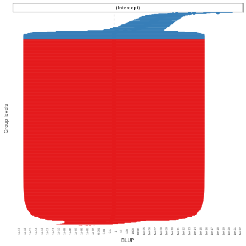

```r
# Forest plots
set_theme(theme = "blank",
          geom.label.size = 0,
          axis.textsize.x = .7,
          axis.title.size = .9,
          axis.angle.x=90,
          axis.textsize.y = .7)
sjp.glmer(n1_l2, type="fe", show.values = FALSE)
```

```
Warning in vcov.merMod(object): variance-covariance matrix computed from finite-difference Hessian is
not positive definite or contains NA values: falling back to var-cov estimated from RX
```

```
Warning in vcov.merMod(object, use.hessian = use.hessian): variance-covariance matrix computed from finite-difference Hessian is
not positive definite or contains NA values: falling back to var-cov estimated from RX
```

```
Warning in vcov.merMod(object, correlation = correlation, sigm = sig): variance-covariance matrix computed from finite-difference Hessian is
not positive definite or contains NA values: falling back to var-cov estimated from RX
```

```
Warning in .axisPars(usr, log = log, nintLog = nint): NAs introduced by
coercion to integer range
```

```
Warning in grDevices::axisTicks(log10(range(x, na.rm = TRUE)), log =
TRUE, : NAs introduced by coercion to integer range
```

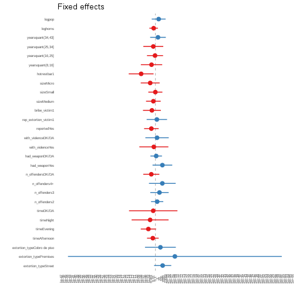

```r
sjp.glmer(n1_l2, type="fe", show.values = FALSE, sort.est = TRUE)
```

```
Warning in vcov.merMod(object): variance-covariance matrix computed from finite-difference Hessian is
not positive definite or contains NA values: falling back to var-cov estimated from RX
```

```
Warning in vcov.merMod(object, use.hessian = use.hessian): variance-covariance matrix computed from finite-difference Hessian is
not positive definite or contains NA values: falling back to var-cov estimated from RX
```

```
Warning in vcov.merMod(object, correlation = correlation, sigm = sig): variance-covariance matrix computed from finite-difference Hessian is
not positive definite or contains NA values: falling back to var-cov estimated from RX
```

```
Warning in .axisPars(usr, log = log, nintLog = nint): NAs introduced by
coercion to integer range
```

```
Warning in grDevices::axisTicks(log10(range(x, na.rm = TRUE)), log =
TRUE, : NAs introduced by coercion to integer range
```

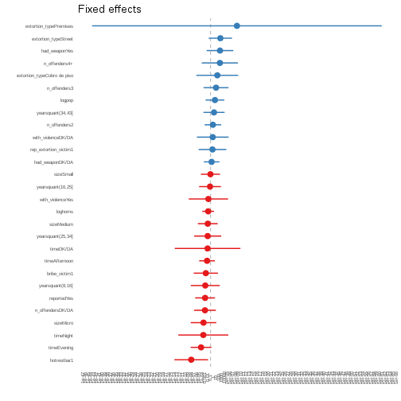

```r
#htmlreg(list(n1, n1_l2))
screenreg(list(n1, n1_l2))
```

```
Warning in vcov.merMod(model, useScale = FALSE, ...): variance-covariance matrix computed from finite-difference Hessian is
not positive definite or contains NA values: falling back to var-cov estimated from RX
```

```

====================================================
                             Model 1       Model 2  
----------------------------------------------------
(Intercept)                     -3.42 ***    -6.73  
                                (0.61)       (5.57) 
extortion_typeStreet             1.13         8.13  
                                (0.58)       (4.92) 
extortion_typePremises          18.17        21.88  
                             (1069.69)      (61.30) 
extortion_typeCobro de piso      2.41 *       5.61  
                                (0.97)       (8.84) 
timeAfternoon                    0.05        -2.88  
                                (0.38)       (3.34) 
timeEvening                     -0.32        -7.88  
                                (0.51)       (4.38) 
timeNight                        2.17 *      -5.99  
                                (0.97)      (10.59) 
timeDK/DA                        1.68        -2.45  
                                (1.48)      (13.88) 
n_offenders2                     1.05 **      1.96  
                                (0.38)       (3.51) 
n_offenders3                     0.96         4.55  
                                (0.64)       (5.28) 
n_offenders4+                    2.69 ***     7.75  
                                (0.80)       (7.66) 
n_offendersDK/DA                 0.16        -4.62  
                                (0.77)       (4.61) 
had_weaponYes                    0.75         7.83  
                                (0.74)       (5.65) 
had_weaponDK/DA                 -0.01         0.88  
                                (0.37)       (3.31) 
with_violenceYes                 0.37        -1.76  
                                (0.86)       (8.32) 
with_violenceDK/DA               0.70         1.83  
                                (0.67)       (6.71) 
reportedYes                      0.66        -4.53  
                                (0.40)       (4.18) 
rep_extortion_victim1            1.04         1.61  
                                (0.55)       (5.85) 
bribe_victim1                    0.10        -3.92  
                                (0.50)       (5.13) 
sizeMedium                      -0.15        -2.31  
                                (0.46)       (4.20) 
sizeSmall                        0.57        -0.07  
                                (0.44)       (4.03) 
sizeMicro                       -0.67        -5.86  
                                (0.50)       (5.43) 
hotrestbar1                     -0.98       -16.04 *
                                (0.58)       (7.12) 
yearsquant(8,16]                -0.11        -4.37  
                                (0.55)       (6.12) 
yearsquant(16,25]                0.77        -0.45  
                                (0.49)       (4.61) 
yearsquant(25,34]               -0.26        -2.38  
                                (0.57)       (5.71) 
yearsquant(34,43]                1.17 *       2.88  
                                (0.51)       (4.49) 
loghoms                         -0.07        -1.98  
                                (0.24)       (2.45) 
logpop                           0.50         3.65  
                                (0.35)       (3.98) 
----------------------------------------------------
AIC                            352.09       324.24  
BIC                            480.23       456.79  
Log Likelihood                -147.05      -132.12  
Deviance                       294.09               
Num. obs.                      613          613     
Num. groups: CVE_UNICA                      501     
Var: CVE_UNICA (Intercept)                  134.44  
====================================================
*** p < 0.001, ** p < 0.01, * p < 0.05
```

```r
lrtest(n1, n1_l2)
```

```
Warning in modelUpdate(objects[[i - 1]], objects[[i]]): original model was
of class "glm", updated model is of class "glmerMod"
```

```
Likelihood ratio test

Model 1: complied_bin ~ extortion_type + time + n_offenders + had_weapon + 
    with_violence + reported + rep_extortion_victim + bribe_victim + 
    size + hotrestbar + yearsquant + loghoms + logpop
Model 2: complied_bin ~ extortion_type + time + n_offenders + had_weapon + 
    with_violence + reported + rep_extortion_victim + bribe_victim + 
    size + hotrestbar + yearsquant + loghoms + logpop + (1 | 
    CVE_UNICA)
  #Df  LogLik Df  Chisq Pr(>Chisq)    
1  29 -147.05                         
2  30 -132.12  1 29.858  4.649e-08 ***
---
Signif. codes:  0 '***' 0.001 '**' 0.01 '*' 0.05 '.' 0.1 ' ' 1
```

```r
kable(lrtest(n1, n1_l2))
```

```
Warning in modelUpdate(objects[[i - 1]], objects[[i]]): original model was
of class "glm", updated model is of class "glmerMod"
```


| #Df|    LogLik| Df|    Chisq| Pr(>Chisq)|
|---:|---------:|--:|--------:|----------:|
|  29| -147.0471| NA|       NA|         NA|
|  30| -132.1181|  1| 29.85794|          0|

```r
anova(n1_l2, n1, test="LRT")
```

```
Data: m1df
Models:
n1: complied_bin ~ extortion_type + time + n_offenders + had_weapon + 
n1:     with_violence + reported + rep_extortion_victim + bribe_victim + 
n1:     size + hotrestbar + yearsquant + loghoms + logpop
n1_l2: complied_bin ~ extortion_type + time + n_offenders + had_weapon + 
n1_l2:     with_violence + reported + rep_extortion_victim + bribe_victim + 
n1_l2:     size + hotrestbar + yearsquant + loghoms + logpop + (1 | 
n1_l2:     CVE_UNICA)
      Df    AIC    BIC  logLik deviance  Chisq Chi Df Pr(>Chisq)    
n1    29 352.09 480.23 -147.05   294.09                             
n1_l2 30 324.24 456.79 -132.12   264.24 29.858      1  4.649e-08 ***
---
Signif. codes:  0 '***' 0.001 '**' 0.01 '*' 0.05 '.' 0.1 ' ' 1
```

```r
kable(anova(n1_l2, n1, test="LRT"))
```


|      | Df|      AIC|      BIC|    logLik| deviance|    Chisq| Chi Df| Pr(>Chisq)|
|:-----|--:|--------:|--------:|---------:|--------:|--------:|------:|----------:|
|n1    | 29| 352.0941| 480.2267| -147.0471| 294.0941|       NA|     NA|         NA|
|n1_l2 | 30| 324.2362| 456.7871| -132.1181| 264.2362| 29.85794|      1|          0|

## Three level model

Now we try the three-level configuration


```r
n1_l3 <- glmer(complied_bin ~
            extortion_type +
            time +
            n_offenders +
            had_weapon +
            with_violence +
            reported +
            rep_extortion_victim +
            bribe_victim +
            size + hotrestbar + yearsquant +
            loghoms + logpop +
            (1|CVE_UNICA) +
            (1|CVE_ENT),
          data=m1df,
          family = "binomial")
```

```
Warning in (function (fn, par, lower = rep.int(-Inf, n), upper =
rep.int(Inf, : failure to converge in 10000 evaluations
```

```
Warning in checkConv(attr(opt, "derivs"), opt$par, ctrl = control
$checkConv, : unable to evaluate scaled gradient
```

```
Warning in checkConv(attr(opt, "derivs"), opt$par, ctrl = control
$checkConv, : Model failed to converge: degenerate Hessian with 2 negative
eigenvalues
```

```r
summary(n1_l3)
```

```
Warning in vcov.merMod(object, use.hessian = use.hessian): variance-covariance matrix computed from finite-difference Hessian is
not positive definite or contains NA values: falling back to var-cov estimated from RX
```

```
Warning in vcov.merMod(object, correlation = correlation, sigm = sig): variance-covariance matrix computed from finite-difference Hessian is
not positive definite or contains NA values: falling back to var-cov estimated from RX
```

```
Generalized linear mixed model fit by maximum likelihood (Laplace
  Approximation) [glmerMod]
 Family: binomial  ( logit )
Formula: 
complied_bin ~ extortion_type + time + n_offenders + had_weapon +  
    with_violence + reported + rep_extortion_victim + bribe_victim +  
    size + hotrestbar + yearsquant + loghoms + logpop + (1 |  
    CVE_UNICA) + (1 | CVE_ENT)
   Data: m1df

     AIC      BIC   logLik deviance df.resid 
   277.4    414.3   -107.7    215.4      582 

Scaled residuals: 
     Min       1Q   Median       3Q      Max 
-0.59161 -0.00045 -0.00001  0.00000  1.69030 

Random effects:
 Groups    Name        Variance  Std.Dev.
 CVE_UNICA (Intercept) 5.451e+02 23.34665
 CVE_ENT   (Intercept) 9.183e-03  0.09583
Number of obs: 613, groups:  CVE_UNICA, 501; CVE_ENT, 32

Fixed effects:
                            Estimate Std. Error z value Pr(>|z|)  
(Intercept)                 -13.6469    14.1052  -0.968   0.3333  
extortion_typeStreet         11.3506    11.4183   0.994   0.3202  
extortion_typePremises       29.2261   427.2481   0.068   0.9455  
extortion_typeCobro de piso  13.6594    20.4008   0.670   0.5031  
timeAfternoon                 0.4976     7.9654   0.062   0.9502  
timeEvening                   0.1538     8.6133   0.018   0.9858  
timeNight                    12.3482    20.3218   0.608   0.5434  
timeDK/DA                    10.1607    31.5581   0.322   0.7475  
n_offenders2                  7.4757     7.7831   0.960   0.3368  
n_offenders3                  2.8777    13.0633   0.220   0.8256  
n_offenders4+                28.0436    16.8661   1.663   0.0964 .
n_offendersDK/DA            -17.9858    20.7179  -0.868   0.3853  
had_weaponYes                 5.4637    11.8233   0.462   0.6440  
had_weaponDK/DA               2.0878     8.8814   0.235   0.8142  
with_violenceYes             -5.6374    17.5838  -0.321   0.7485  
with_violenceDK/DA           -4.2970    17.5389  -0.245   0.8065  
reportedYes                   2.5784     8.5733   0.301   0.7636  
rep_extortion_victim1         4.3437    13.0245   0.334   0.7388  
bribe_victim1                -8.5018    10.7076  -0.794   0.4272  
sizeMedium                   -8.2207    10.9091  -0.754   0.4511  
sizeSmall                    -5.0733     9.1933  -0.552   0.5811  
sizeMicro                    -7.3074    11.7903  -0.620   0.5354  
hotrestbar1                  -3.9084    16.9823  -0.230   0.8180  
yearsquant(8,16]             -4.7112    12.9548  -0.364   0.7161  
yearsquant(16,25]             0.8971    10.6341   0.084   0.9328  
yearsquant(25,34]           -18.9044    12.7000  -1.488   0.1366  
yearsquant(34,43]             1.6845    11.7893   0.143   0.8864  
loghoms                      -1.2851     5.3399  -0.241   0.8098  
logpop                        2.8249     9.2160   0.306   0.7592  
---
Signif. codes:  0 '***' 0.001 '**' 0.01 '*' 0.05 '.' 0.1 ' ' 1
```

```

Correlation matrix not shown by default, as p = 29 > 12.
Use print(x, correlation=TRUE)  or
	 vcov(x)	 if you need it
```

```
convergence code: 0
unable to evaluate scaled gradient
Model failed to converge: degenerate  Hessian with 2 negative eigenvalues
failure to converge in 10000 evaluations
```

```r
### ICC for level 2
sum(get_re_var(n1_l3)) / (sum(get_re_var(n1_l3)) +
                        get_re_var(n1_l3, "sigma_2"))
```

```
[1] 0.9940006
```

```r
### ICC for level 3
get_re_var(n1_l3)[2] /( sum(get_re_var(n1_l3)) +
                        get_re_var(n1_l3, "sigma_2"))
```

```
    CVE_ENT 
1.67459e-05 
```

```r
print(icc(n1_l3), comp="var")
```

```
Generalized linear mixed model
 Family: binomial (logit)
Formula: complied_bin ~ extortion_type + time + n_offenders + had_weapon + with_violence + reported + rep_extortion_victim + bribe_victim + size + hotrestbar + yearsquant + loghoms + logpop + (1 | CVE_UNICA) + (1 | CVE_ENT)

      Within-group-variance:    3.290
     Between-group-variance:  545.066 (CVE_UNICA)
     Between-group-variance:    0.009 (CVE_ENT)
```

```r
# Try using the icc_3level function

icc_3level(n1_l3)
```

```
   CVE_UNICA      CVE_ENT 
0.9940005882 0.0000167459 
```

```r
## Describe data structure

## number of observations per individuals

length(unique(n1df$CVE_UNICA))
```

```
Error in unique(n1df$CVE_UNICA): object 'n1df' not found
```

```r
table(table(n1df$CVE_UNICA))
```

```
Error in table(n1df$CVE_UNICA): object 'n1df' not found
```

```r
min(table(n1df$CVE_UNICA))
```

```
Error in table(n1df$CVE_UNICA): object 'n1df' not found
```

```r
max(table(n1df$CVE_UNICA))
```

```
Error in table(n1df$CVE_UNICA): object 'n1df' not found
```

```r
mean(table(n1df$CVE_UNICA))
```

```
Error in table(n1df$CVE_UNICA): object 'n1df' not found
```

```r
sum(table(n1df$CVE_UNICA))
```

```
Error in table(n1df$CVE_UNICA): object 'n1df' not found
```

```r
# number of observations per state
length(unique(n1df$CVE_ENT))
```

```
Error in unique(n1df$CVE_ENT): object 'n1df' not found
```

```r
table(n1df$CVE_ENT)
```

```
Error in table(n1df$CVE_ENT): object 'n1df' not found
```

```r
sum(table(n1df$CVE_ENT))
```

```
Error in table(n1df$CVE_ENT): object 'n1df' not found
```

```r
min(table(n1df$CVE_ENT))
```

```
Error in table(n1df$CVE_ENT): object 'n1df' not found
```

```r
max(table(n1df$CVE_ENT))
```

```
Error in table(n1df$CVE_ENT): object 'n1df' not found
```

```r
mean(table(n1df$CVE_ENT))
```

```
Error in table(n1df$CVE_ENT): object 'n1df' not found
```

```r
# number of individuals per state

IperG <- with(n1df, tapply(CVE_UNICA, CVE_ENT,
                           FUN = function(x) length(unique(x))))
```

```
Error in with(n1df, tapply(CVE_UNICA, CVE_ENT, FUN = function(x) length(unique(x)))): object 'n1df' not found
```

```r
sum(IperG)
```

```
[1] 501
```

```r
min(IperG)
```

```
[1] 10
```

```r
max(IperG)
```

```
[1] 23
```

```r
mean(IperG)
```

```
[1] 15.65625
```

```r
## print n1_l3
#htmlreg(n1_l3)
screenreg(n1_l3)
```

```
Warning in vcov.merMod(model, useScale = FALSE, ...): variance-covariance matrix computed from finite-difference Hessian is
not positive definite or contains NA values: falling back to var-cov estimated from RX
```

```

=====================================
                             Model 1 
-------------------------------------
(Intercept)                   -13.65 
                              (14.11)
extortion_typeStreet           11.35 
                              (11.42)
extortion_typePremises         29.23 
                             (427.25)
extortion_typeCobro de piso    13.66 
                              (20.40)
timeAfternoon                   0.50 
                               (7.97)
timeEvening                     0.15 
                               (8.61)
timeNight                      12.35 
                              (20.32)
timeDK/DA                      10.16 
                              (31.56)
n_offenders2                    7.48 
                               (7.78)
n_offenders3                    2.88 
                              (13.06)
n_offenders4+                  28.04 
                              (16.87)
n_offendersDK/DA              -17.99 
                              (20.72)
had_weaponYes                   5.46 
                              (11.82)
had_weaponDK/DA                 2.09 
                               (8.88)
with_violenceYes               -5.64 
                              (17.58)
with_violenceDK/DA             -4.30 
                              (17.54)
reportedYes                     2.58 
                               (8.57)
rep_extortion_victim1           4.34 
                              (13.02)
bribe_victim1                  -8.50 
                              (10.71)
sizeMedium                     -8.22 
                              (10.91)
sizeSmall                      -5.07 
                               (9.19)
sizeMicro                      -7.31 
                              (11.79)
hotrestbar1                    -3.91 
                              (16.98)
yearsquant(8,16]               -4.71 
                              (12.95)
yearsquant(16,25]               0.90 
                              (10.63)
yearsquant(25,34]             -18.90 
                              (12.70)
yearsquant(34,43]               1.68 
                              (11.79)
loghoms                        -1.29 
                               (5.34)
logpop                          2.82 
                               (9.22)
-------------------------------------
AIC                           277.37 
BIC                           414.34 
Log Likelihood               -107.68 
Num. obs.                     613    
Num. groups: CVE_UNICA        501    
Num. groups: CVE_ENT           32    
Var: CVE_UNICA (Intercept)    545.07 
Var: CVE_ENT (Intercept)        0.01 
=====================================
*** p < 0.001, ** p < 0.01, * p < 0.05
```

```r
nobs(n1_l3)
```

```
[1] 613
```

```r
confint(n1_l3)
```

```
Computing profile confidence intervals ...
```

```
Warning in vcov.merMod(object, use.hessian = use.hessian): variance-covariance matrix computed from finite-difference Hessian is
not positive definite or contains NA values: falling back to var-cov estimated from RX

Warning in vcov.merMod(object, use.hessian = use.hessian): variance-covariance matrix computed from finite-difference Hessian is
not positive definite or contains NA values: falling back to var-cov estimated from RX
```

```
Warning in (function (fn, par, lower = rep.int(-Inf, n), upper =
rep.int(Inf, : failure to converge in 10000 evaluations
```

```
Error in zeta(shiftpar, start = opt[seqpar1][-w]): profiling detected new, lower deviance
```

```r
# droptest
n1_l3_dropped <- drop1(n1_l3, test="Chisq")
```

```
Warning in (function (fn, par, lower = rep.int(-Inf, n), upper =
rep.int(Inf, : failure to converge in 10000 evaluations
```

```
Warning in checkConv(attr(opt, "derivs"), opt$par, ctrl = control
$checkConv, : unable to evaluate scaled gradient
```

```
Warning in checkConv(attr(opt, "derivs"), opt$par, ctrl = control
$checkConv, : Model failed to converge: degenerate Hessian with 1 negative
eigenvalues
```

```
Warning in (function (fn, par, lower = rep.int(-Inf, n), upper =
rep.int(Inf, : failure to converge in 10000 evaluations
```

```
Warning in checkConv(attr(opt, "derivs"), opt$par, ctrl = control
$checkConv, : unable to evaluate scaled gradient
```

```
Warning in checkConv(attr(opt, "derivs"), opt$par, ctrl = control
$checkConv, : Model failed to converge: degenerate Hessian with 3 negative
eigenvalues
```

```
Warning in (function (fn, par, lower = rep.int(-Inf, n), upper =
rep.int(Inf, : failure to converge in 10000 evaluations
```

```
Warning in checkConv(attr(opt, "derivs"), opt$par, ctrl = control
$checkConv, : Model failed to converge with max|grad| = 2.59978 (tol =
0.001, component 1)
```

```
Warning in (function (fn, par, lower = rep.int(-Inf, n), upper =
rep.int(Inf, : failure to converge in 10000 evaluations
```

```
Warning in checkConv(attr(opt, "derivs"), opt$par, ctrl = control
$checkConv, : unable to evaluate scaled gradient
```

```
Warning in checkConv(attr(opt, "derivs"), opt$par, ctrl = control
$checkConv, : Model failed to converge: degenerate Hessian with 3 negative
eigenvalues
```

```
Warning in (function (fn, par, lower = rep.int(-Inf, n), upper =
rep.int(Inf, : failure to converge in 10000 evaluations
```

```
Warning in checkConv(attr(opt, "derivs"), opt$par, ctrl = control
$checkConv, : unable to evaluate scaled gradient
```

```
Warning in checkConv(attr(opt, "derivs"), opt$par, ctrl = control
$checkConv, : Model failed to converge: degenerate Hessian with 3 negative
eigenvalues
```

```
Warning in (function (fn, par, lower = rep.int(-Inf, n), upper =
rep.int(Inf, : failure to converge in 10000 evaluations
```

```
Warning in checkConv(attr(opt, "derivs"), opt$par, ctrl = control
$checkConv, : unable to evaluate scaled gradient
```

```
Warning in checkConv(attr(opt, "derivs"), opt$par, ctrl = control
$checkConv, : Model failed to converge: degenerate Hessian with 2 negative
eigenvalues
```

```
Warning in (function (fn, par, lower = rep.int(-Inf, n), upper =
rep.int(Inf, : failure to converge in 10000 evaluations
```

```
Warning in checkConv(attr(opt, "derivs"), opt$par, ctrl = control
$checkConv, : unable to evaluate scaled gradient
```

```
Warning in checkConv(attr(opt, "derivs"), opt$par, ctrl = control
$checkConv, : Model failed to converge: degenerate Hessian with 6 negative
eigenvalues
```

```
Warning in (function (fn, par, lower = rep.int(-Inf, n), upper =
rep.int(Inf, : failure to converge in 10000 evaluations
```

```
Warning in checkConv(attr(opt, "derivs"), opt$par, ctrl = control
$checkConv, : unable to evaluate scaled gradient
```

```
Warning in checkConv(attr(opt, "derivs"), opt$par, ctrl = control
$checkConv, : Model failed to converge: degenerate Hessian with 2 negative
eigenvalues
```

```
Warning in (function (fn, par, lower = rep.int(-Inf, n), upper =
rep.int(Inf, : failure to converge in 10000 evaluations
```

```
Warning in checkConv(attr(opt, "derivs"), opt$par, ctrl = control
$checkConv, : unable to evaluate scaled gradient
```

```
Warning in checkConv(attr(opt, "derivs"), opt$par, ctrl = control
$checkConv, : Model failed to converge: degenerate Hessian with 2 negative
eigenvalues
```

```
Warning in checkConv(attr(opt, "derivs"), opt$par, ctrl = control
$checkConv, : unable to evaluate scaled gradient
```

```
Warning in checkConv(attr(opt, "derivs"), opt$par, ctrl = control
$checkConv, : Model failed to converge: degenerate Hessian with 15 negative
eigenvalues
```

```
Warning in checkConv(attr(opt, "derivs"), opt$par, ctrl = control
$checkConv, : unable to evaluate scaled gradient
```

```
Warning in checkConv(attr(opt, "derivs"), opt$par, ctrl = control
$checkConv, : Model failed to converge: degenerate Hessian with 4 negative
eigenvalues
```

```
Warning in (function (fn, par, lower = rep.int(-Inf, n), upper =
rep.int(Inf, : failure to converge in 10000 evaluations
```

```
Warning in checkConv(attr(opt, "derivs"), opt$par, ctrl = control
$checkConv, : unable to evaluate scaled gradient
```

```
Warning in checkConv(attr(opt, "derivs"), opt$par, ctrl = control
$checkConv, : Model failed to converge: degenerate Hessian with 3 negative
eigenvalues
```

```
Warning in (function (fn, par, lower = rep.int(-Inf, n), upper =
rep.int(Inf, : failure to converge in 10000 evaluations
```

```
Warning in checkConv(attr(opt, "derivs"), opt$par, ctrl = control
$checkConv, : unable to evaluate scaled gradient
```

```
Warning in checkConv(attr(opt, "derivs"), opt$par, ctrl = control
$checkConv, : Model failed to converge: degenerate Hessian with 1 negative
eigenvalues
```

```r
kable(n1_l3_dropped)
```


|                     | Df|      AIC|        LRT|   Pr(Chi)|
|:--------------------|--:|--------:|----------:|---------:|
|<none>               | NA| 277.3668|         NA|        NA|
|extortion_type       |  3| 304.7403|  33.373467| 0.0000003|
|time                 |  4| 290.6597|  21.292880| 0.0002770|
|n_offenders          |  4| 321.9387|  52.571853| 0.0000000|
|had_weapon           |  2| 272.1905|  -1.176331| 1.0000000|
|with_violence        |  2| 291.4451|  18.078238| 0.0001187|
|reported             |  1| 249.4438| -25.923042| 1.0000000|
|rep_extortion_victim |  1| 306.5133|  31.146444| 0.0000000|
|bribe_victim         |  1| 261.2618| -14.105045| 1.0000000|
|size                 |  3| 266.7994|  -4.567432| 1.0000000|
|hotrestbar           |  1| 302.8516|  27.484811| 0.0000002|
|yearsquant           |  4| 328.9623|  59.595518| 0.0000000|
|loghoms              |  1| 262.5477| -12.819128| 1.0000000|
|logpop               |  1| 261.0621| -14.304723| 1.0000000|

```r
## Three-level Null

n1_l3_null <- glmer(complied_bin ~
                      (1|CVE_UNICA) +
                      (1|CVE_ENT),
                    data=m1df,
                    family = "binomial")

summary(n1_l3_null)
```

```
Generalized linear mixed model fit by maximum likelihood (Laplace
  Approximation) [glmerMod]
 Family: binomial  ( logit )
Formula: complied_bin ~ (1 | CVE_UNICA) + (1 | CVE_ENT)
   Data: m1df

     AIC      BIC   logLik deviance df.resid 
   225.1    238.3   -109.5    219.1      610 

Scaled residuals: 
     Min       1Q   Median       3Q      Max 
-0.99194 -0.00243 -0.00243 -0.00241  1.74058 

Random effects:
 Groups    Name        Variance Std.Dev.
 CVE_UNICA (Intercept) 1486     38.55   
 CVE_ENT   (Intercept)    0      0.00   
Number of obs: 613, groups:  CVE_UNICA, 501; CVE_ENT, 32

Fixed effects:
            Estimate Std. Error z value Pr(>|z|)    
(Intercept)  -12.032      1.038   -11.6   <2e-16 ***
---
Signif. codes:  0 '***' 0.001 '**' 0.01 '*' 0.05 '.' 0.1 ' ' 1
```

```r
print(icc(n1_l3_null), comp="var")
```

```
Generalized linear mixed model
 Family: binomial (logit)
Formula: complied_bin ~ (1 | CVE_UNICA) + (1 | CVE_ENT)

      Within-group-variance:    3.290
     Between-group-variance: 1485.723 (CVE_UNICA)
     Between-group-variance:    0.000 (CVE_ENT)
```

```r
icc_3level(n1_l3_null)
```

```
CVE_UNICA   CVE_ENT 
0.9977906 0.0000000 
```

```r
lrtest(n1_l3_null, n1_l3)
```

```
Likelihood ratio test

Model 1: complied_bin ~ (1 | CVE_UNICA) + (1 | CVE_ENT)
Model 2: complied_bin ~ extortion_type + time + n_offenders + had_weapon + 
    with_violence + reported + rep_extortion_victim + bribe_victim + 
    size + hotrestbar + yearsquant + loghoms + logpop + (1 | 
    CVE_UNICA) + (1 | CVE_ENT)
  #Df  LogLik Df  Chisq Pr(>Chisq)
1   3 -109.54                     
2  31 -107.68 28 3.7128          1
```

```r
kable(lrtest(n1_l3_null, n1_l3))
```


| #Df|    LogLik| Df|    Chisq| Pr(>Chisq)|
|---:|---------:|--:|--------:|----------:|
|   3| -109.5398| NA|       NA|         NA|
|  31| -107.6834| 28| 3.712783|          1|

```r
lrtest(n1_null,n1_l2_null,n1_l3_null, n1_l3)
```

```
Warning in modelUpdate(objects[[i - 1]], objects[[i]]): original model was
of class "glm", updated model is of class "glmerMod"
```

```
Warning in modelUpdate(objects[[i - 1]], objects[[i]]): original model was
of class "glm", updated model is of class "glmerMod"

Warning in modelUpdate(objects[[i - 1]], objects[[i]]): original model was
of class "glm", updated model is of class "glmerMod"
```

```
Likelihood ratio test

Model 1: complied_bin ~ 1
Model 2: complied_bin ~ (1 | CVE_UNICA)
Model 3: complied_bin ~ (1 | CVE_UNICA) + (1 | CVE_ENT)
Model 4: complied_bin ~ extortion_type + time + n_offenders + had_weapon + 
    with_violence + reported + rep_extortion_victim + bribe_victim + 
    size + hotrestbar + yearsquant + loghoms + logpop + (1 | 
    CVE_UNICA) + (1 | CVE_ENT)
  #Df  LogLik Df    Chisq Pr(>Chisq)    
1   1 -219.77                           
2   2 -109.54  1 220.4669     <2e-16 ***
3   3 -109.54  1   0.0000     0.9995    
4  31 -107.68 28   3.7128     1.0000    
---
Signif. codes:  0 '***' 0.001 '**' 0.01 '*' 0.05 '.' 0.1 ' ' 1
```

```r
kable(lrtest(n1_null,n1_l2_null,n1_l3_null, n1_l3))
```

```
Warning in modelUpdate(objects[[i - 1]], objects[[i]]): original model was
of class "glm", updated model is of class "glmerMod"

Warning in modelUpdate(objects[[i - 1]], objects[[i]]): original model was
of class "glm", updated model is of class "glmerMod"

Warning in modelUpdate(objects[[i - 1]], objects[[i]]): original model was
of class "glm", updated model is of class "glmerMod"
```


| #Df|    LogLik| Df|       Chisq| Pr(>Chisq)|
|---:|---------:|--:|-----------:|----------:|
|   1| -219.7733| NA|          NA|         NA|
|   2| -109.5398|  1| 220.4669203|  0.0000000|
|   3| -109.5398|  1|   0.0000005|  0.9994614|
|  31| -107.6834| 28|   3.7127830|  1.0000000|

```r
lrtest(n1_null,n1_l2_null,n1_l3_null, n1_l3)
```

```
Warning in modelUpdate(objects[[i - 1]], objects[[i]]): original model was
of class "glm", updated model is of class "glmerMod"

Warning in modelUpdate(objects[[i - 1]], objects[[i]]): original model was
of class "glm", updated model is of class "glmerMod"

Warning in modelUpdate(objects[[i - 1]], objects[[i]]): original model was
of class "glm", updated model is of class "glmerMod"
```

```
Likelihood ratio test

Model 1: complied_bin ~ 1
Model 2: complied_bin ~ (1 | CVE_UNICA)
Model 3: complied_bin ~ (1 | CVE_UNICA) + (1 | CVE_ENT)
Model 4: complied_bin ~ extortion_type + time + n_offenders + had_weapon + 
    with_violence + reported + rep_extortion_victim + bribe_victim + 
    size + hotrestbar + yearsquant + loghoms + logpop + (1 | 
    CVE_UNICA) + (1 | CVE_ENT)
  #Df  LogLik Df    Chisq Pr(>Chisq)    
1   1 -219.77                           
2   2 -109.54  1 220.4669     <2e-16 ***
3   3 -109.54  1   0.0000     0.9995    
4  31 -107.68 28   3.7128     1.0000    
---
Signif. codes:  0 '***' 0.001 '**' 0.01 '*' 0.05 '.' 0.1 ' ' 1
```

```r
kable(lrtest(n1_null,n1_l2_null,n1_l3_null, n1_l3))
```

```
Warning in modelUpdate(objects[[i - 1]], objects[[i]]): original model was
of class "glm", updated model is of class "glmerMod"

Warning in modelUpdate(objects[[i - 1]], objects[[i]]): original model was
of class "glm", updated model is of class "glmerMod"

Warning in modelUpdate(objects[[i - 1]], objects[[i]]): original model was
of class "glm", updated model is of class "glmerMod"
```


| #Df|    LogLik| Df|       Chisq| Pr(>Chisq)|
|---:|---------:|--:|-----------:|----------:|
|   1| -219.7733| NA|          NA|         NA|
|   2| -109.5398|  1| 220.4669203|  0.0000000|
|   3| -109.5398|  1|   0.0000005|  0.9994614|
|  31| -107.6834| 28|   3.7127830|  1.0000000|

```r
lrtest(n1_null,n1_l2_null,n1_l3_null)
```

```
Warning in modelUpdate(objects[[i - 1]], objects[[i]]): original model was
of class "glm", updated model is of class "glmerMod"

Warning in modelUpdate(objects[[i - 1]], objects[[i]]): original model was
of class "glm", updated model is of class "glmerMod"
```

```
Likelihood ratio test

Model 1: complied_bin ~ 1
Model 2: complied_bin ~ (1 | CVE_UNICA)
Model 3: complied_bin ~ (1 | CVE_UNICA) + (1 | CVE_ENT)
  #Df  LogLik Df  Chisq Pr(>Chisq)    
1   1 -219.77                         
2   2 -109.54  1 220.47     <2e-16 ***
3   3 -109.54  1   0.00     0.9995    
---
Signif. codes:  0 '***' 0.001 '**' 0.01 '*' 0.05 '.' 0.1 ' ' 1
```

```r
kable(lrtest(n1_null,n1_l2_null,n1_l3_null))
```

```
Warning in modelUpdate(objects[[i - 1]], objects[[i]]): original model was
of class "glm", updated model is of class "glmerMod"

Warning in modelUpdate(objects[[i - 1]], objects[[i]]): original model was
of class "glm", updated model is of class "glmerMod"
```


| #Df|    LogLik| Df|       Chisq| Pr(>Chisq)|
|---:|---------:|--:|-----------:|----------:|
|   1| -219.7733| NA|          NA|         NA|
|   2| -109.5398|  1| 220.4669203|  0.0000000|
|   3| -109.5398|  1|   0.0000005|  0.9994614|

```r
# compare sequentially
anova(n1_l3, n1_l3_null, test="LRT")
```

```
Data: m1df
Models:
n1_l3_null: complied_bin ~ (1 | CVE_UNICA) + (1 | CVE_ENT)
n1_l3: complied_bin ~ extortion_type + time + n_offenders + had_weapon + 
n1_l3:     with_violence + reported + rep_extortion_victim + bribe_victim + 
n1_l3:     size + hotrestbar + yearsquant + loghoms + logpop + (1 | 
n1_l3:     CVE_UNICA) + (1 | CVE_ENT)
           Df    AIC    BIC  logLik deviance  Chisq Chi Df Pr(>Chisq)
n1_l3_null  3 225.08 238.33 -109.54   219.08                         
n1_l3      31 277.37 414.34 -107.68   215.37 3.7128     28          1
```

```r
kable(anova(n1_l3, n1_l3_null, test="LRT"))
```


|           | Df|      AIC|      BIC|    logLik| deviance|    Chisq| Chi Df| Pr(>Chisq)|
|:----------|--:|--------:|--------:|---------:|--------:|--------:|------:|----------:|
|n1_l3_null |  3| 225.0796| 238.3347| -109.5398| 219.0796|       NA|     NA|         NA|
|n1_l3      | 31| 277.3668| 414.3361| -107.6834| 215.3668| 3.712783|     28|          1|

```r
anova(n1_l3, n1_l3_null, n1_null, test="LRT")
```

```
Data: m1df
Models:
n1_null: complied_bin ~ 1
n1_l3_null: complied_bin ~ (1 | CVE_UNICA) + (1 | CVE_ENT)
n1_l3: complied_bin ~ extortion_type + time + n_offenders + had_weapon + 
n1_l3:     with_violence + reported + rep_extortion_victim + bribe_victim + 
n1_l3:     size + hotrestbar + yearsquant + loghoms + logpop + (1 | 
n1_l3:     CVE_UNICA) + (1 | CVE_ENT)
           Df    AIC    BIC  logLik deviance    Chisq Chi Df Pr(>Chisq)
n1_null     1 441.55 445.96 -219.77   439.55                           
n1_l3_null  3 225.08 238.33 -109.54   219.08 220.4669      2     <2e-16
n1_l3      31 277.37 414.34 -107.68   215.37   3.7128     28          1
              
n1_null       
n1_l3_null ***
n1_l3         
---
Signif. codes:  0 '***' 0.001 '**' 0.01 '*' 0.05 '.' 0.1 ' ' 1
```

```r
kable(anova(n1_l3, n1_l3_null, n1_null, test="LRT"))
```


|           | Df|      AIC|      BIC|    logLik| deviance|      Chisq| Chi Df| Pr(>Chisq)|
|:----------|--:|--------:|--------:|---------:|--------:|----------:|------:|----------:|
|n1_null    |  1| 441.5465| 445.9649| -219.7733| 439.5465|         NA|     NA|         NA|
|n1_l3_null |  3| 225.0796| 238.3347| -109.5398| 219.0796| 220.466921|      2|          0|
|n1_l3      | 31| 277.3668| 414.3361| -107.6834| 215.3668|   3.712783|     28|          1|

```r
anova(n1_l3_null, n1_null, test="LRT")
```

```
Data: m1df
Models:
n1_null: complied_bin ~ 1
n1_l3_null: complied_bin ~ (1 | CVE_UNICA) + (1 | CVE_ENT)
           Df    AIC    BIC  logLik deviance  Chisq Chi Df Pr(>Chisq)    
n1_null     1 441.55 445.96 -219.77   439.55                             
n1_l3_null  3 225.08 238.33 -109.54   219.08 220.47      2  < 2.2e-16 ***
---
Signif. codes:  0 '***' 0.001 '**' 0.01 '*' 0.05 '.' 0.1 ' ' 1
```

```r
kable(anova(n1_l3_null, n1_null, test="LRT"))
```


|           | Df|      AIC|      BIC|    logLik| deviance|    Chisq| Chi Df| Pr(>Chisq)|
|:----------|--:|--------:|--------:|---------:|--------:|--------:|------:|----------:|
|n1_null    |  1| 441.5465| 445.9649| -219.7733| 439.5465|       NA|     NA|         NA|
|n1_l3_null |  3| 225.0796| 238.3347| -109.5398| 219.0796| 220.4669|      2|          0|

```r
anova(n1_l3_null, n1_l2_null, n1_null, test="LRT")
```

```
Data: m1df
Models:
n1_null: complied_bin ~ 1
n1_l2_null: complied_bin ~ (1 | CVE_UNICA)
n1_l3_null: complied_bin ~ (1 | CVE_UNICA) + (1 | CVE_ENT)
           Df    AIC    BIC  logLik deviance  Chisq Chi Df Pr(>Chisq)    
n1_null     1 441.55 445.96 -219.77   439.55                             
n1_l2_null  2 223.08 231.92 -109.54   219.08 220.47      1     <2e-16 ***
n1_l3_null  3 225.08 238.33 -109.54   219.08   0.00      1     0.9995    
---
Signif. codes:  0 '***' 0.001 '**' 0.01 '*' 0.05 '.' 0.1 ' ' 1
```

```r
kable(anova(n1_l3_null, n1_l2_null, n1_null, test="LRT"))
```


|           | Df|      AIC|      BIC|    logLik| deviance|       Chisq| Chi Df| Pr(>Chisq)|
|:----------|--:|--------:|--------:|---------:|--------:|-----------:|------:|----------:|
|n1_null    |  1| 441.5465| 445.9649| -219.7733| 439.5465|          NA|     NA|         NA|
|n1_l2_null |  2| 223.0796| 231.9163| -109.5398| 219.0796| 220.4669203|      1|  0.0000000|
|n1_l3_null |  3| 225.0796| 238.3347| -109.5398| 219.0796|   0.0000005|      1|  0.9994614|

```r
### RMSES
n1_l3_residuals <- residuals(n1_l3, type="response")

n1_l3_rmses <- c("n1_l3",
              sqrt(mean(n1_l3_residuals^2)),
              sqrt(mean(n1_l3_residuals^2))/sd(n1_l3_residuals),
              sqrt(mean(n1_l3_residuals^2))/
                          (max(n1_l3_residuals)-min(n1_l3_residuals)))

rmses <- rbind(rmses, n1_l3_rmses)

rmses
```

```
  model               RMSE             NRMSE             CVRMSE
1    n1  0.258218987356952 0.999184006392061  0.146708759599908
2 n1_l2 0.0709193893378527  1.00335378933392 0.0380635870146115
3 n1_l3 0.0367440155195846  1.00120179743041 0.0367440155195846
```

```r
kable(rmses)
```


|model |RMSE               |NRMSE             |CVRMSE             |
|:-----|:------------------|:-----------------|:------------------|
|n1    |0.258218987356952  |0.999184006392061 |0.146708759599908  |
|n1_l2 |0.0709193893378527 |1.00335378933392  |0.0380635870146115 |
|n1_l3 |0.0367440155195846 |1.00120179743041  |0.0367440155195846 |

```r
# Plot observed vs fitted
n1_l3_ob_pred <- data.frame(Observed=n1df$complied_bin,
                         Predicted=fitted(n1_l3, type=response))
```

```
Error in data.frame(Observed = n1df$complied_bin, Predicted = fitted(n1_l3, : object 'n1df' not found
```

```r
ggplot(n1_l3_ob_pred, aes(Observed, Predicted)) +
  geom_boxplot() +
  theme_bw() +
  ggtitle("Compliance with extortion demands:\nObserved vs. predicted")
```

```
Error in ggplot(n1_l3_ob_pred, aes(Observed, Predicted)): object 'n1_l3_ob_pred' not found
```

```r
# FOREST PLOTS?
# customize sjplots
set_theme(theme = "blank",
          geom.label.size = 0,
          axis.textsize.x = .7,
          axis.title.size = .9,
          axis.angle.x=90,
          axis.textsize.y = 0)

# Random intercepts
sjp.glmer(n1_l3, show.values = FALSE, sort.est= TRUE)
```

```
Plotting random effects...
```

```
Warning in .axisPars(usr, log = log, nintLog = nint): NAs introduced by
coercion to integer range
```

```
Warning in grDevices::axisTicks(log10(range(x, na.rm = TRUE)), log =
TRUE, : NAs introduced by coercion to integer range
```

```
Plotting random effects...
```

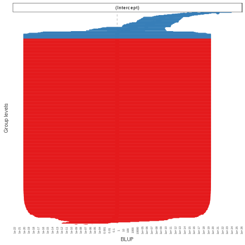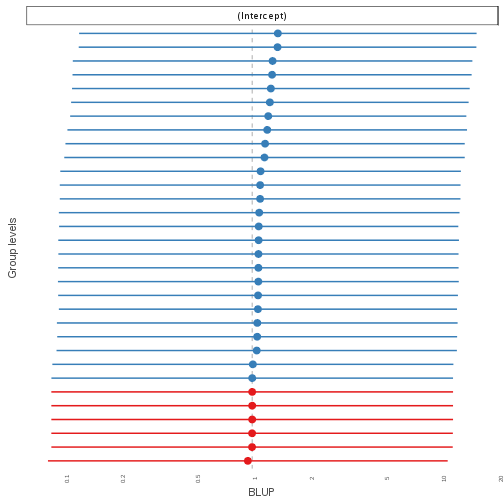

```r
# Forest plots
set_theme(theme = "blank",
          geom.label.size = 0,
          axis.textsize.x = .7,
          axis.title.size = .9,
          axis.angle.x=90,
          axis.textsize.y = .7)
sjp.glmer(n1_l3, type="fe", show.values = FALSE)
```

```
Warning in vcov.merMod(object): variance-covariance matrix computed from finite-difference Hessian is
not positive definite or contains NA values: falling back to var-cov estimated from RX
```

```
Warning in vcov.merMod(object, use.hessian = use.hessian): variance-covariance matrix computed from finite-difference Hessian is
not positive definite or contains NA values: falling back to var-cov estimated from RX
```

```
Warning in vcov.merMod(object, correlation = correlation, sigm = sig): variance-covariance matrix computed from finite-difference Hessian is
not positive definite or contains NA values: falling back to var-cov estimated from RX
```

```
Warning in .axisPars(usr, log = log, nintLog = nint): NAs introduced by
coercion to integer range
```

```
Warning in grDevices::axisTicks(log10(range(x, na.rm = TRUE)), log =
TRUE, : NAs introduced by coercion to integer range
```

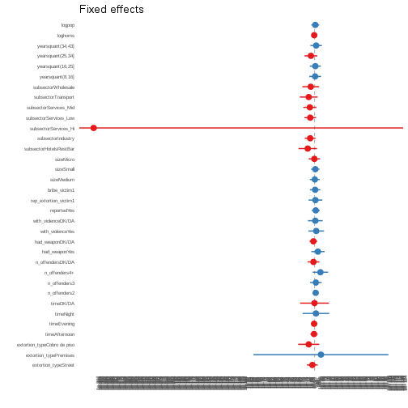

```r
sjp.glmer(n1_l3, type="fe", show.values = FALSE, sort.est = TRUE)
```

```
Warning in vcov.merMod(object): variance-covariance matrix computed from finite-difference Hessian is
not positive definite or contains NA values: falling back to var-cov estimated from RX
```

```
Warning in vcov.merMod(object, use.hessian = use.hessian): variance-covariance matrix computed from finite-difference Hessian is
not positive definite or contains NA values: falling back to var-cov estimated from RX
```

```
Warning in vcov.merMod(object, correlation = correlation, sigm = sig): variance-covariance matrix computed from finite-difference Hessian is
not positive definite or contains NA values: falling back to var-cov estimated from RX
```

```
Warning in .axisPars(usr, log = log, nintLog = nint): NAs introduced by
coercion to integer range
```

```
Warning in grDevices::axisTicks(log10(range(x, na.rm = TRUE)), log =
TRUE, : NAs introduced by coercion to integer range
```

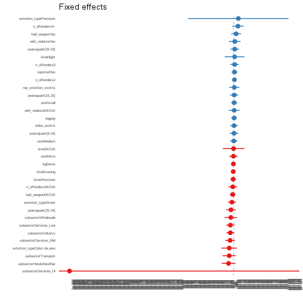

```r
#htmlreg(list(n1, n1_l3))
screenreg(list(n1, n1_l3))
```

```
Warning in vcov.merMod(model, useScale = FALSE, ...): variance-covariance matrix computed from finite-difference Hessian is
not positive definite or contains NA values: falling back to var-cov estimated from RX
```

```

===================================================
                             Model 1       Model 2 
---------------------------------------------------
(Intercept)                     -3.42 ***   -13.65 
                                (0.61)      (14.11)
extortion_typeStreet             1.13        11.35 
                                (0.58)      (11.42)
extortion_typePremises          18.17        29.23 
                             (1069.69)     (427.25)
extortion_typeCobro de piso      2.41 *      13.66 
                                (0.97)      (20.40)
timeAfternoon                    0.05         0.50 
                                (0.38)       (7.97)
timeEvening                     -0.32         0.15 
                                (0.51)       (8.61)
timeNight                        2.17 *      12.35 
                                (0.97)      (20.32)
timeDK/DA                        1.68        10.16 
                                (1.48)      (31.56)
n_offenders2                     1.05 **      7.48 
                                (0.38)       (7.78)
n_offenders3                     0.96         2.88 
                                (0.64)      (13.06)
n_offenders4+                    2.69 ***    28.04 
                                (0.80)      (16.87)
n_offendersDK/DA                 0.16       -17.99 
                                (0.77)      (20.72)
had_weaponYes                    0.75         5.46 
                                (0.74)      (11.82)
had_weaponDK/DA                 -0.01         2.09 
                                (0.37)       (8.88)
with_violenceYes                 0.37        -5.64 
                                (0.86)      (17.58)
with_violenceDK/DA               0.70        -4.30 
                                (0.67)      (17.54)
reportedYes                      0.66         2.58 
                                (0.40)       (8.57)
rep_extortion_victim1            1.04         4.34 
                                (0.55)      (13.02)
bribe_victim1                    0.10        -8.50 
                                (0.50)      (10.71)
sizeMedium                      -0.15        -8.22 
                                (0.46)      (10.91)
sizeSmall                        0.57        -5.07 
                                (0.44)       (9.19)
sizeMicro                       -0.67        -7.31 
                                (0.50)      (11.79)
hotrestbar1                     -0.98        -3.91 
                                (0.58)      (16.98)
yearsquant(8,16]                -0.11        -4.71 
                                (0.55)      (12.95)
yearsquant(16,25]                0.77         0.90 
                                (0.49)      (10.63)
yearsquant(25,34]               -0.26       -18.90 
                                (0.57)      (12.70)
yearsquant(34,43]                1.17 *       1.68 
                                (0.51)      (11.79)
loghoms                         -0.07        -1.29 
                                (0.24)       (5.34)
logpop                           0.50         2.82 
                                (0.35)       (9.22)
---------------------------------------------------
AIC                            352.09       277.37 
BIC                            480.23       414.34 
Log Likelihood                -147.05      -107.68 
Deviance                       294.09              
Num. obs.                      613          613    
Num. groups: CVE_UNICA                      501    
Num. groups: CVE_ENT                         32    
Var: CVE_UNICA (Intercept)                  545.07 
Var: CVE_ENT (Intercept)                      0.01 
===================================================
*** p < 0.001, ** p < 0.01, * p < 0.05
```

```r
#htmlreg(list(n1, n1_l2, n1_l3))
screenreg(list(n1, n1_l2, n1_l3))
```

```
Warning in vcov.merMod(model, useScale = FALSE, ...): variance-covariance matrix computed from finite-difference Hessian is
not positive definite or contains NA values: falling back to var-cov estimated from RX
```

```
Warning in vcov.merMod(model, useScale = FALSE, ...): variance-covariance matrix computed from finite-difference Hessian is
not positive definite or contains NA values: falling back to var-cov estimated from RX
```

```

==============================================================
                             Model 1       Model 2    Model 3 
--------------------------------------------------------------
(Intercept)                     -3.42 ***    -6.73     -13.65 
                                (0.61)       (5.57)    (14.11)
extortion_typeStreet             1.13         8.13      11.35 
                                (0.58)       (4.92)    (11.42)
extortion_typePremises          18.17        21.88      29.23 
                             (1069.69)      (61.30)   (427.25)
extortion_typeCobro de piso      2.41 *       5.61      13.66 
                                (0.97)       (8.84)    (20.40)
timeAfternoon                    0.05        -2.88       0.50 
                                (0.38)       (3.34)     (7.97)
timeEvening                     -0.32        -7.88       0.15 
                                (0.51)       (4.38)     (8.61)
timeNight                        2.17 *      -5.99      12.35 
                                (0.97)      (10.59)    (20.32)
timeDK/DA                        1.68        -2.45      10.16 
                                (1.48)      (13.88)    (31.56)
n_offenders2                     1.05 **      1.96       7.48 
                                (0.38)       (3.51)     (7.78)
n_offenders3                     0.96         4.55       2.88 
                                (0.64)       (5.28)    (13.06)
n_offenders4+                    2.69 ***     7.75      28.04 
                                (0.80)       (7.66)    (16.87)
n_offendersDK/DA                 0.16        -4.62     -17.99 
                                (0.77)       (4.61)    (20.72)
had_weaponYes                    0.75         7.83       5.46 
                                (0.74)       (5.65)    (11.82)
had_weaponDK/DA                 -0.01         0.88       2.09 
                                (0.37)       (3.31)     (8.88)
with_violenceYes                 0.37        -1.76      -5.64 
                                (0.86)       (8.32)    (17.58)
with_violenceDK/DA               0.70         1.83      -4.30 
                                (0.67)       (6.71)    (17.54)
reportedYes                      0.66        -4.53       2.58 
                                (0.40)       (4.18)     (8.57)
rep_extortion_victim1            1.04         1.61       4.34 
                                (0.55)       (5.85)    (13.02)
bribe_victim1                    0.10        -3.92      -8.50 
                                (0.50)       (5.13)    (10.71)
sizeMedium                      -0.15        -2.31      -8.22 
                                (0.46)       (4.20)    (10.91)
sizeSmall                        0.57        -0.07      -5.07 
                                (0.44)       (4.03)     (9.19)
sizeMicro                       -0.67        -5.86      -7.31 
                                (0.50)       (5.43)    (11.79)
hotrestbar1                     -0.98       -16.04 *    -3.91 
                                (0.58)       (7.12)    (16.98)
yearsquant(8,16]                -0.11        -4.37      -4.71 
                                (0.55)       (6.12)    (12.95)
yearsquant(16,25]                0.77        -0.45       0.90 
                                (0.49)       (4.61)    (10.63)
yearsquant(25,34]               -0.26        -2.38     -18.90 
                                (0.57)       (5.71)    (12.70)
yearsquant(34,43]                1.17 *       2.88       1.68 
                                (0.51)       (4.49)    (11.79)
loghoms                         -0.07        -1.98      -1.29 
                                (0.24)       (2.45)     (5.34)
logpop                           0.50         3.65       2.82 
                                (0.35)       (3.98)     (9.22)
--------------------------------------------------------------
AIC                            352.09       324.24     277.37 
BIC                            480.23       456.79     414.34 
Log Likelihood                -147.05      -132.12    -107.68 
Deviance                       294.09                         
Num. obs.                      613          613        613    
Num. groups: CVE_UNICA                      501        501    
Var: CVE_UNICA (Intercept)                  134.44     545.07 
Num. groups: CVE_ENT                                    32    
Var: CVE_ENT (Intercept)                                 0.01 
==============================================================
*** p < 0.001, ** p < 0.01, * p < 0.05
```

```r
lrtest(n1, n1_l3)
```

```
Warning in modelUpdate(objects[[i - 1]], objects[[i]]): original model was
of class "glm", updated model is of class "glmerMod"
```

```
Likelihood ratio test

Model 1: complied_bin ~ extortion_type + time + n_offenders + had_weapon + 
    with_violence + reported + rep_extortion_victim + bribe_victim + 
    size + hotrestbar + yearsquant + loghoms + logpop
Model 2: complied_bin ~ extortion_type + time + n_offenders + had_weapon + 
    with_violence + reported + rep_extortion_victim + bribe_victim + 
    size + hotrestbar + yearsquant + loghoms + logpop + (1 | 
    CVE_UNICA) + (1 | CVE_ENT)
  #Df  LogLik Df  Chisq Pr(>Chisq)    
1  29 -147.05                         
2  31 -107.68  2 78.727  < 2.2e-16 ***
---
Signif. codes:  0 '***' 0.001 '**' 0.01 '*' 0.05 '.' 0.1 ' ' 1
```

```r
kable(lrtest(n1, n1_l3))
```

```
Warning in modelUpdate(objects[[i - 1]], objects[[i]]): original model was
of class "glm", updated model is of class "glmerMod"
```


| #Df|    LogLik| Df|    Chisq| Pr(>Chisq)|
|---:|---------:|--:|--------:|----------:|
|  29| -147.0471| NA|       NA|         NA|
|  31| -107.6834|  2| 78.72732|          0|

```r
anova(n1_l3, n1, test="LRT")
```

```
Data: m1df
Models:
n1: complied_bin ~ extortion_type + time + n_offenders + had_weapon + 
n1:     with_violence + reported + rep_extortion_victim + bribe_victim + 
n1:     size + hotrestbar + yearsquant + loghoms + logpop
n1_l3: complied_bin ~ extortion_type + time + n_offenders + had_weapon + 
n1_l3:     with_violence + reported + rep_extortion_victim + bribe_victim + 
n1_l3:     size + hotrestbar + yearsquant + loghoms + logpop + (1 | 
n1_l3:     CVE_UNICA) + (1 | CVE_ENT)
      Df    AIC    BIC  logLik deviance  Chisq Chi Df Pr(>Chisq)    
n1    29 352.09 480.23 -147.05   294.09                             
n1_l3 31 277.37 414.34 -107.68   215.37 78.727      2  < 2.2e-16 ***
---
Signif. codes:  0 '***' 0.001 '**' 0.01 '*' 0.05 '.' 0.1 ' ' 1
```

```r
kable(anova(n1_l3, n1, test="LRT"))
```


|      | Df|      AIC|      BIC|    logLik| deviance|    Chisq| Chi Df| Pr(>Chisq)|
|:-----|--:|--------:|--------:|---------:|--------:|--------:|------:|----------:|
|n1    | 29| 352.0941| 480.2267| -147.0471| 294.0941|       NA|     NA|         NA|
|n1_l3 | 31| 277.3668| 414.3361| -107.6834| 215.3668| 78.72732|      2|          0|

```r
lrtest(n1, n1_l2, n1_l3)
```

```
Warning in modelUpdate(objects[[i - 1]], objects[[i]]): original model was
of class "glm", updated model is of class "glmerMod"
```

```
Warning in modelUpdate(objects[[i - 1]], objects[[i]]): original model was
of class "glm", updated model is of class "glmerMod"
```

```
Likelihood ratio test

Model 1: complied_bin ~ extortion_type + time + n_offenders + had_weapon + 
    with_violence + reported + rep_extortion_victim + bribe_victim + 
    size + hotrestbar + yearsquant + loghoms + logpop
Model 2: complied_bin ~ extortion_type + time + n_offenders + had_weapon + 
    with_violence + reported + rep_extortion_victim + bribe_victim + 
    size + hotrestbar + yearsquant + loghoms + logpop + (1 | 
    CVE_UNICA)
Model 3: complied_bin ~ extortion_type + time + n_offenders + had_weapon + 
    with_violence + reported + rep_extortion_victim + bribe_victim + 
    size + hotrestbar + yearsquant + loghoms + logpop + (1 | 
    CVE_UNICA) + (1 | CVE_ENT)
  #Df  LogLik Df  Chisq Pr(>Chisq)    
1  29 -147.05                         
2  30 -132.12  1 29.858  4.649e-08 ***
3  31 -107.68  1 48.869  2.736e-12 ***
---
Signif. codes:  0 '***' 0.001 '**' 0.01 '*' 0.05 '.' 0.1 ' ' 1
```

```r
kable(lrtest(n1, n1_l2, n1_l3))
```

```
Warning in modelUpdate(objects[[i - 1]], objects[[i]]): original model was
of class "glm", updated model is of class "glmerMod"

Warning in modelUpdate(objects[[i - 1]], objects[[i]]): original model was
of class "glm", updated model is of class "glmerMod"
```


| #Df|    LogLik| Df|    Chisq| Pr(>Chisq)|
|---:|---------:|--:|--------:|----------:|
|  29| -147.0471| NA|       NA|         NA|
|  30| -132.1181|  1| 29.85794|          0|
|  31| -107.6834|  1| 48.86938|          0|

```r
anova(n1_l3, n1_l2, n1, test="LRT")
```

```
Data: m1df
Models:
n1: complied_bin ~ extortion_type + time + n_offenders + had_weapon + 
n1:     with_violence + reported + rep_extortion_victim + bribe_victim + 
n1:     size + hotrestbar + yearsquant + loghoms + logpop
n1_l2: complied_bin ~ extortion_type + time + n_offenders + had_weapon + 
n1_l2:     with_violence + reported + rep_extortion_victim + bribe_victim + 
n1_l2:     size + hotrestbar + yearsquant + loghoms + logpop + (1 | 
n1_l2:     CVE_UNICA)
n1_l3: complied_bin ~ extortion_type + time + n_offenders + had_weapon + 
n1_l3:     with_violence + reported + rep_extortion_victim + bribe_victim + 
n1_l3:     size + hotrestbar + yearsquant + loghoms + logpop + (1 | 
n1_l3:     CVE_UNICA) + (1 | CVE_ENT)
      Df    AIC    BIC  logLik deviance  Chisq Chi Df Pr(>Chisq)    
n1    29 352.09 480.23 -147.05   294.09                             
n1_l2 30 324.24 456.79 -132.12   264.24 29.858      1  4.649e-08 ***
n1_l3 31 277.37 414.34 -107.68   215.37 48.869      1  2.736e-12 ***
---
Signif. codes:  0 '***' 0.001 '**' 0.01 '*' 0.05 '.' 0.1 ' ' 1
```

```r
kable(anova(n1_l3, n1_l2, n1, test="LRT"))
```


|      | Df|      AIC|      BIC|    logLik| deviance|    Chisq| Chi Df| Pr(>Chisq)|
|:-----|--:|--------:|--------:|---------:|--------:|--------:|------:|----------:|
|n1    | 29| 352.0941| 480.2267| -147.0471| 294.0941|       NA|     NA|         NA|
|n1_l2 | 30| 324.2362| 456.7871| -132.1181| 264.2362| 29.85794|      1|          0|
|n1_l3 | 31| 277.3668| 414.3361| -107.6834| 215.3668| 48.86938|      1|          0|

```r
lrtest(n1_l2, n1_l3)
```

```
Likelihood ratio test

Model 1: complied_bin ~ extortion_type + time + n_offenders + had_weapon + 
    with_violence + reported + rep_extortion_victim + bribe_victim + 
    size + hotrestbar + yearsquant + loghoms + logpop + (1 | 
    CVE_UNICA)
Model 2: complied_bin ~ extortion_type + time + n_offenders + had_weapon + 
    with_violence + reported + rep_extortion_victim + bribe_victim + 
    size + hotrestbar + yearsquant + loghoms + logpop + (1 | 
    CVE_UNICA) + (1 | CVE_ENT)
  #Df  LogLik Df  Chisq Pr(>Chisq)    
1  30 -132.12                         
2  31 -107.68  1 48.869  2.736e-12 ***
---
Signif. codes:  0 '***' 0.001 '**' 0.01 '*' 0.05 '.' 0.1 ' ' 1
```

```r
kable(lrtest(n1_l2, n1_l3))
```


| #Df|    LogLik| Df|    Chisq| Pr(>Chisq)|
|---:|---------:|--:|--------:|----------:|
|  30| -132.1181| NA|       NA|         NA|
|  31| -107.6834|  1| 48.86938|          0|

```r
anova(n1_l3, n1_l2, test="LRT")
```

```
Data: m1df
Models:
n1_l2: complied_bin ~ extortion_type + time + n_offenders + had_weapon + 
n1_l2:     with_violence + reported + rep_extortion_victim + bribe_victim + 
n1_l2:     size + hotrestbar + yearsquant + loghoms + logpop + (1 | 
n1_l2:     CVE_UNICA)
n1_l3: complied_bin ~ extortion_type + time + n_offenders + had_weapon + 
n1_l3:     with_violence + reported + rep_extortion_victim + bribe_victim + 
n1_l3:     size + hotrestbar + yearsquant + loghoms + logpop + (1 | 
n1_l3:     CVE_UNICA) + (1 | CVE_ENT)
      Df    AIC    BIC  logLik deviance  Chisq Chi Df Pr(>Chisq)    
n1_l2 30 324.24 456.79 -132.12   264.24                             
n1_l3 31 277.37 414.34 -107.68   215.37 48.869      1  2.736e-12 ***
---
Signif. codes:  0 '***' 0.001 '**' 0.01 '*' 0.05 '.' 0.1 ' ' 1
```

```r
kable(anova(n1_l3, n1_l2, test="LRT"))
```


|      | Df|      AIC|      BIC|    logLik| deviance|    Chisq| Chi Df| Pr(>Chisq)|
|:-----|--:|--------:|--------:|---------:|--------:|--------:|------:|----------:|
|n1_l2 | 30| 324.2362| 456.7871| -132.1181| 264.2362|       NA|     NA|         NA|
|n1_l3 | 31| 277.3668| 414.3361| -107.6834| 215.3668| 48.86938|      1|          0|

Now test excluding all three level vars and all two level vars to test their influence.


```r
## Exclude state then business level variables

n1_l3_nostate <- glmer(complied_bin ~
                    extortion_type +
                    time +
                    n_offenders +
                    had_weapon +
                    with_violence +
                    reported +
                    rep_extortion_victim +
                    bribe_victim +
                    size + hotrestbar + yearsquant +
                    (1|CVE_UNICA) + (1|CVE_ENT),
                  data=m1df,
                  family = "binomial")
```

```
Warning in (function (fn, par, lower = rep.int(-Inf, n), upper =
rep.int(Inf, : failure to converge in 10000 evaluations
```

```
Warning in checkConv(attr(opt, "derivs"), opt$par, ctrl = control
$checkConv, : unable to evaluate scaled gradient
```

```
Warning in checkConv(attr(opt, "derivs"), opt$par, ctrl = control
$checkConv, : Model failed to converge: degenerate Hessian with 4 negative
eigenvalues
```

```r
summary(n1_l3_nostate)
```

```
Warning in vcov.merMod(object, use.hessian = use.hessian): variance-covariance matrix computed from finite-difference Hessian is
not positive definite or contains NA values: falling back to var-cov estimated from RX
```

```
Warning in vcov.merMod(object, correlation = correlation, sigm = sig): variance-covariance matrix computed from finite-difference Hessian is
not positive definite or contains NA values: falling back to var-cov estimated from RX
```

```
Generalized linear mixed model fit by maximum likelihood (Laplace
  Approximation) [glmerMod]
 Family: binomial  ( logit )
Formula: 
complied_bin ~ extortion_type + time + n_offenders + had_weapon +  
    with_violence + reported + rep_extortion_victim + bribe_victim +  
    size + hotrestbar + yearsquant + (1 | CVE_UNICA) + (1 | CVE_ENT)
   Data: m1df

     AIC      BIC   logLik deviance df.resid 
   317.1    445.2   -129.6    259.1      584 

Scaled residuals: 
     Min       1Q   Median       3Q      Max 
-0.95902 -0.00262 -0.00008  0.00000  1.64345 

Random effects:
 Groups    Name        Variance Std.Dev.
 CVE_UNICA (Intercept) 233.62   15.285  
 CVE_ENT   (Intercept)  11.38    3.373  
Number of obs: 613, groups:  CVE_UNICA, 501; CVE_ENT, 32

Fixed effects:
                            Estimate Std. Error z value Pr(>|z|)  
(Intercept)                  -7.7289     6.5859  -1.174   0.2406  
extortion_typeStreet          0.1930     7.5770   0.026   0.9797  
extortion_typePremises       18.6038   132.5065   0.140   0.8883  
extortion_typeCobro de piso -18.3239    14.2110  -1.289   0.1973  
timeAfternoon                -0.4075     4.4210  -0.092   0.9266  
timeEvening                  -3.8160     4.6770  -0.816   0.4145  
timeNight                     3.9630    14.3926   0.275   0.7830  
timeDK/DA                     3.3915    15.6207   0.217   0.8281  
n_offenders2                  3.7730     4.4581   0.846   0.3974  
n_offenders3                  5.0655     7.8656   0.644   0.5196  
n_offenders4+                25.2088     9.8375   2.562   0.0104 *
n_offendersDK/DA              0.7683     7.0113   0.110   0.9127  
had_weaponYes                 3.5926     7.6375   0.470   0.6381  
had_weaponDK/DA              -7.5827     4.4085  -1.720   0.0854 .
with_violenceYes              5.6643    10.5225   0.538   0.5904  
with_violenceDK/DA            4.0083     9.1277   0.439   0.6606  
reportedYes                   0.5884     4.9262   0.119   0.9049  
rep_extortion_victim1        -1.7445     8.3300  -0.209   0.8341  
bribe_victim1                 1.3161     6.5363   0.201   0.8404  
sizeMedium                   -4.5854     5.6442  -0.812   0.4166  
sizeSmall                    -5.5658     5.4772  -1.016   0.3096  
sizeMicro                    -8.2893     6.8357  -1.213   0.2253  
hotrestbar1                 -15.0456    10.0893  -1.491   0.1359  
yearsquant(8,16]              0.7951     7.2535   0.110   0.9127  
yearsquant(16,25]             0.8327     6.1514   0.135   0.8923  
yearsquant(25,34]            -6.9141     8.0015  -0.864   0.3875  
yearsquant(34,43]             4.0074     6.6808   0.600   0.5486  
---
Signif. codes:  0 '***' 0.001 '**' 0.01 '*' 0.05 '.' 0.1 ' ' 1
```

```

Correlation matrix not shown by default, as p = 27 > 12.
Use print(x, correlation=TRUE)  or
	 vcov(x)	 if you need it
```

```
convergence code: 0
unable to evaluate scaled gradient
Model failed to converge: degenerate  Hessian with 4 negative eigenvalues
failure to converge in 10000 evaluations
```

```r
lrtest(n1_l3_nostate, n1_l3)
```

```
Likelihood ratio test

Model 1: complied_bin ~ extortion_type + time + n_offenders + had_weapon + 
    with_violence + reported + rep_extortion_victim + bribe_victim + 
    size + hotrestbar + yearsquant + (1 | CVE_UNICA) + (1 | CVE_ENT)
Model 2: complied_bin ~ extortion_type + time + n_offenders + had_weapon + 
    with_violence + reported + rep_extortion_victim + bribe_victim + 
    size + hotrestbar + yearsquant + loghoms + logpop + (1 | 
    CVE_UNICA) + (1 | CVE_ENT)
  #Df  LogLik Df  Chisq Pr(>Chisq)    
1  29 -129.55                         
2  31 -107.68  2 43.741  3.175e-10 ***
---
Signif. codes:  0 '***' 0.001 '**' 0.01 '*' 0.05 '.' 0.1 ' ' 1
```

```r
kable(lrtest(n1_l3_nostate, n1_l3))
```


| #Df|    LogLik| Df|    Chisq| Pr(>Chisq)|
|---:|---------:|--:|--------:|----------:|
|  29| -129.5540| NA|       NA|         NA|
|  31| -107.6834|  2| 43.74122|          0|

```r
anova(n1_l3_nostate, n1_l3, test="LRT")
```

```
Data: m1df
Models:
n1_l3_nostate: complied_bin ~ extortion_type + time + n_offenders + had_weapon + 
n1_l3_nostate:     with_violence + reported + rep_extortion_victim + bribe_victim + 
n1_l3_nostate:     size + hotrestbar + yearsquant + (1 | CVE_UNICA) + (1 | CVE_ENT)
n1_l3: complied_bin ~ extortion_type + time + n_offenders + had_weapon + 
n1_l3:     with_violence + reported + rep_extortion_victim + bribe_victim + 
n1_l3:     size + hotrestbar + yearsquant + loghoms + logpop + (1 | 
n1_l3:     CVE_UNICA) + (1 | CVE_ENT)
              Df    AIC    BIC  logLik deviance  Chisq Chi Df Pr(>Chisq)
n1_l3_nostate 29 317.11 445.24 -129.55   259.11                         
n1_l3         31 277.37 414.34 -107.68   215.37 43.741      2  3.175e-10
                 
n1_l3_nostate    
n1_l3         ***
---
Signif. codes:  0 '***' 0.001 '**' 0.01 '*' 0.05 '.' 0.1 ' ' 1
```

```r
kable(anova(n1_l3_nostate, n1_l3, test="LRT"))
```


|              | Df|      AIC|      BIC|    logLik| deviance|    Chisq| Chi Df| Pr(>Chisq)|
|:-------------|--:|--------:|--------:|---------:|--------:|--------:|------:|----------:|
|n1_l3_nostate | 29| 317.1080| 445.2406| -129.5540| 259.1080|       NA|     NA|         NA|
|n1_l3         | 31| 277.3668| 414.3361| -107.6834| 215.3668| 43.74122|      2|          0|

```r
## Only incident level

n1_l3_nostate_nobus <- glmer(complied_bin ~
                  extortion_type +
                    time +
                    n_offenders +
                    had_weapon +
                    with_violence +
                    reported +
                    (1|CVE_UNICA) + (1|CVE_ENT),
                  data=m1df,
                  family = "binomial")
```

```
Warning in (function (fn, par, lower = rep.int(-Inf, n), upper =
rep.int(Inf, : failure to converge in 10000 evaluations
```

```
Warning in checkConv(attr(opt, "derivs"), opt$par, ctrl = control
$checkConv, : unable to evaluate scaled gradient
```

```
Warning in checkConv(attr(opt, "derivs"), opt$par, ctrl = control
$checkConv, : Hessian is numerically singular: parameters are not uniquely
determined
```

```r
summary(n1_l3_nostate_nobus)
```

```
Warning in vcov.merMod(object, use.hessian = use.hessian): variance-covariance matrix computed from finite-difference Hessian is
not positive definite or contains NA values: falling back to var-cov estimated from RX
```

```
Warning in vcov.merMod(object, correlation = correlation, sigm = sig): variance-covariance matrix computed from finite-difference Hessian is
not positive definite or contains NA values: falling back to var-cov estimated from RX
```

```
Generalized linear mixed model fit by maximum likelihood (Laplace
  Approximation) [glmerMod]
 Family: binomial  ( logit )
Formula: 
complied_bin ~ extortion_type + time + n_offenders + had_weapon +  
    with_violence + reported + (1 | CVE_UNICA) + (1 | CVE_ENT)
   Data: m1df

     AIC      BIC   logLik deviance df.resid 
   264.8    348.7   -113.4    226.8      594 

Scaled residuals: 
     Min       1Q   Median       3Q      Max 
-0.75275 -0.00282 -0.00003 -0.00002  1.70910 

Random effects:
 Groups    Name        Variance  Std.Dev.
 CVE_UNICA (Intercept) 7.796e+02 27.92153
 CVE_ENT   (Intercept) 1.725e-04  0.01313
Number of obs: 613, groups:  CVE_UNICA, 501; CVE_ENT, 32

Fixed effects:
                              Estimate Std. Error z value Pr(>|z|)  
(Intercept)                 -1.057e+01  7.536e+00  -1.403   0.1607  
extortion_typeStreet        -2.381e+00  1.250e+01  -0.190   0.8490  
extortion_typePremises       4.688e+02  2.023e+07   0.000   1.0000  
extortion_typeCobro de piso -2.390e+01  2.221e+01  -1.076   0.2819  
timeAfternoon               -1.032e+01  8.292e+00  -1.245   0.2131  
timeEvening                 -5.165e-01  7.206e+00  -0.072   0.9429  
timeNight                   -1.647e+01  2.245e+01  -0.734   0.4630  
timeDK/DA                   -7.702e+01  3.208e+01  -2.401   0.0164 *
n_offenders2                 1.562e+00  6.961e+00   0.224   0.8225  
n_offenders3                 1.148e+00  1.525e+01   0.075   0.9400  
n_offenders4+                8.343e+00  1.443e+01   0.578   0.5631  
n_offendersDK/DA            -7.231e+00  1.262e+01  -0.573   0.5666  
had_weaponYes                1.737e+01  1.353e+01   1.284   0.1990  
had_weaponDK/DA             -1.166e+00  8.296e+00  -0.140   0.8883  
with_violenceYes            -4.202e+00  1.613e+01  -0.260   0.7945  
with_violenceDK/DA          -1.155e+00  1.637e+01  -0.071   0.9438  
reportedYes                 -4.438e+00  9.479e+00  -0.468   0.6396  
---
Signif. codes:  0 '***' 0.001 '**' 0.01 '*' 0.05 '.' 0.1 ' ' 1
```

```

Correlation matrix not shown by default, as p = 17 > 12.
Use print(x, correlation=TRUE)  or
	 vcov(x)	 if you need it
```

```
convergence code: 0
unable to evaluate scaled gradient
 Hessian is numerically singular: parameters are not uniquely determined
failure to converge in 10000 evaluations
```

```r
lrtest(n1_l3_nostate_nobus, n1_l3_nostate)
```

```
Likelihood ratio test

Model 1: complied_bin ~ extortion_type + time + n_offenders + had_weapon + 
    with_violence + reported + (1 | CVE_UNICA) + (1 | CVE_ENT)
Model 2: complied_bin ~ extortion_type + time + n_offenders + had_weapon + 
    with_violence + reported + rep_extortion_victim + bribe_victim + 
    size + hotrestbar + yearsquant + (1 | CVE_UNICA) + (1 | CVE_ENT)
  #Df  LogLik Df  Chisq Pr(>Chisq)    
1  19 -113.40                         
2  29 -129.55 10 32.313  0.0003551 ***
---
Signif. codes:  0 '***' 0.001 '**' 0.01 '*' 0.05 '.' 0.1 ' ' 1
```

```r
kable(lrtest(n1_l3_nostate_nobus, n1_l3_nostate))
```


| #Df|    LogLik| Df|    Chisq| Pr(>Chisq)|
|---:|---------:|--:|--------:|----------:|
|  19| -113.3975| NA|       NA|         NA|
|  29| -129.5540| 10| 32.31307|  0.0003551|

```r
anova(n1_l3_nostate_nobus, n1_l3_nostate, test="LRT")
```

```
Data: m1df
Models:
n1_l3_nostate_nobus: complied_bin ~ extortion_type + time + n_offenders + had_weapon + 
n1_l3_nostate_nobus:     with_violence + reported + (1 | CVE_UNICA) + (1 | CVE_ENT)
n1_l3_nostate: complied_bin ~ extortion_type + time + n_offenders + had_weapon + 
n1_l3_nostate:     with_violence + reported + rep_extortion_victim + bribe_victim + 
n1_l3_nostate:     size + hotrestbar + yearsquant + (1 | CVE_UNICA) + (1 | CVE_ENT)
                    Df    AIC    BIC  logLik deviance Chisq Chi Df
n1_l3_nostate_nobus 19 264.79 348.74 -113.40   226.79             
n1_l3_nostate       29 317.11 445.24 -129.55   259.11     0     10
                    Pr(>Chisq)
n1_l3_nostate_nobus           
n1_l3_nostate                1
```

```r
kable(anova(n1_l3_nostate_nobus, n1_l3_nostate, test="LRT"))
```


|                    | Df|     AIC|      BIC|    logLik| deviance| Chisq| Chi Df| Pr(>Chisq)|
|:-------------------|--:|-------:|--------:|---------:|--------:|-----:|------:|----------:|
|n1_l3_nostate_nobus | 19| 264.795| 348.7439| -113.3975|  226.795|    NA|     NA|         NA|
|n1_l3_nostate       | 29| 317.108| 445.2406| -129.5540|  259.108|     0|     10|          1|

```r
lrtest(n1_l3_nostate_nobus, n1_l3_nostate, n1_l3)
```

```
Likelihood ratio test

Model 1: complied_bin ~ extortion_type + time + n_offenders + had_weapon + 
    with_violence + reported + (1 | CVE_UNICA) + (1 | CVE_ENT)
Model 2: complied_bin ~ extortion_type + time + n_offenders + had_weapon + 
    with_violence + reported + rep_extortion_victim + bribe_victim + 
    size + hotrestbar + yearsquant + (1 | CVE_UNICA) + (1 | CVE_ENT)
Model 3: complied_bin ~ extortion_type + time + n_offenders + had_weapon + 
    with_violence + reported + rep_extortion_victim + bribe_victim + 
    size + hotrestbar + yearsquant + loghoms + logpop + (1 | 
    CVE_UNICA) + (1 | CVE_ENT)
  #Df  LogLik Df  Chisq Pr(>Chisq)    
1  19 -113.40                         
2  29 -129.55 10 32.313  0.0003551 ***
3  31 -107.68  2 43.741  3.175e-10 ***
---
Signif. codes:  0 '***' 0.001 '**' 0.01 '*' 0.05 '.' 0.1 ' ' 1
```

```r
kable(lrtest(n1_l3_nostate_nobus, n1_l3_nostate, n1_l3))
```


| #Df|    LogLik| Df|    Chisq| Pr(>Chisq)|
|---:|---------:|--:|--------:|----------:|
|  19| -113.3975| NA|       NA|         NA|
|  29| -129.5540| 10| 32.31307|  0.0003551|
|  31| -107.6834|  2| 43.74122|  0.0000000|

```r
anova(n1_l3_nostate_nobus, n1_l3_nostate, n1_l3, test="LRT")
```

```
Data: m1df
Models:
n1_l3_nostate_nobus: complied_bin ~ extortion_type + time + n_offenders + had_weapon + 
n1_l3_nostate_nobus:     with_violence + reported + (1 | CVE_UNICA) + (1 | CVE_ENT)
n1_l3_nostate: complied_bin ~ extortion_type + time + n_offenders + had_weapon + 
n1_l3_nostate:     with_violence + reported + rep_extortion_victim + bribe_victim + 
n1_l3_nostate:     size + hotrestbar + yearsquant + (1 | CVE_UNICA) + (1 | CVE_ENT)
n1_l3: complied_bin ~ extortion_type + time + n_offenders + had_weapon + 
n1_l3:     with_violence + reported + rep_extortion_victim + bribe_victim + 
n1_l3:     size + hotrestbar + yearsquant + loghoms + logpop + (1 | 
n1_l3:     CVE_UNICA) + (1 | CVE_ENT)
                    Df    AIC    BIC  logLik deviance  Chisq Chi Df
n1_l3_nostate_nobus 19 264.79 348.74 -113.40   226.79              
n1_l3_nostate       29 317.11 445.24 -129.55   259.11  0.000     10
n1_l3               31 277.37 414.34 -107.68   215.37 43.741      2
                    Pr(>Chisq)    
n1_l3_nostate_nobus               
n1_l3_nostate                1    
n1_l3                3.175e-10 ***
---
Signif. codes:  0 '***' 0.001 '**' 0.01 '*' 0.05 '.' 0.1 ' ' 1
```

```r
kable(anova(n1_l3_nostate_nobus, n1_l3_nostate, n1_l3, test="LRT"))
```


|                    | Df|      AIC|      BIC|    logLik| deviance|    Chisq| Chi Df| Pr(>Chisq)|
|:-------------------|--:|--------:|--------:|---------:|--------:|--------:|------:|----------:|
|n1_l3_nostate_nobus | 19| 264.7950| 348.7439| -113.3975| 226.7950|       NA|     NA|         NA|
|n1_l3_nostate       | 29| 317.1080| 445.2406| -129.5540| 259.1080|  0.00000|     10|          1|
|n1_l3               | 31| 277.3668| 414.3361| -107.6834| 215.3668| 43.74122|      2|          0|

```r
lrtest(n1_l3_null, n1_l3_nostate_nobus, n1_l3_nostate, n1_l3)
```

```
Likelihood ratio test

Model 1: complied_bin ~ (1 | CVE_UNICA) + (1 | CVE_ENT)
Model 2: complied_bin ~ extortion_type + time + n_offenders + had_weapon + 
    with_violence + reported + (1 | CVE_UNICA) + (1 | CVE_ENT)
Model 3: complied_bin ~ extortion_type + time + n_offenders + had_weapon + 
    with_violence + reported + rep_extortion_victim + bribe_victim + 
    size + hotrestbar + yearsquant + (1 | CVE_UNICA) + (1 | CVE_ENT)
Model 4: complied_bin ~ extortion_type + time + n_offenders + had_weapon + 
    with_violence + reported + rep_extortion_victim + bribe_victim + 
    size + hotrestbar + yearsquant + loghoms + logpop + (1 | 
    CVE_UNICA) + (1 | CVE_ENT)
  #Df  LogLik Df   Chisq Pr(>Chisq)    
1   3 -109.54                          
2  19 -113.40 16  7.7154  0.9568916    
3  29 -129.55 10 32.3131  0.0003551 ***
4  31 -107.68  2 43.7412  3.175e-10 ***
---
Signif. codes:  0 '***' 0.001 '**' 0.01 '*' 0.05 '.' 0.1 ' ' 1
```

```r
kable(lrtest(n1_l3_null, n1_l3_nostate_nobus, n1_l3_nostate, n1_l3))
```


| #Df|    LogLik| Df|    Chisq| Pr(>Chisq)|
|---:|---------:|--:|--------:|----------:|
|   3| -109.5398| NA|       NA|         NA|
|  19| -113.3975| 16|  7.71537|  0.9568916|
|  29| -129.5540| 10| 32.31307|  0.0003551|
|  31| -107.6834|  2| 43.74122|  0.0000000|

```r
anova(n1_l3_null, n1_l3_nostate_nobus, n1_l3_nostate, n1_l3, test="LRT")
```

```
Data: m1df
Models:
n1_l3_null: complied_bin ~ (1 | CVE_UNICA) + (1 | CVE_ENT)
n1_l3_nostate_nobus: complied_bin ~ extortion_type + time + n_offenders + had_weapon + 
n1_l3_nostate_nobus:     with_violence + reported + (1 | CVE_UNICA) + (1 | CVE_ENT)
n1_l3_nostate: complied_bin ~ extortion_type + time + n_offenders + had_weapon + 
n1_l3_nostate:     with_violence + reported + rep_extortion_victim + bribe_victim + 
n1_l3_nostate:     size + hotrestbar + yearsquant + (1 | CVE_UNICA) + (1 | CVE_ENT)
n1_l3: complied_bin ~ extortion_type + time + n_offenders + had_weapon + 
n1_l3:     with_violence + reported + rep_extortion_victim + bribe_victim + 
n1_l3:     size + hotrestbar + yearsquant + loghoms + logpop + (1 | 
n1_l3:     CVE_UNICA) + (1 | CVE_ENT)
                    Df    AIC    BIC  logLik deviance  Chisq Chi Df
n1_l3_null           3 225.08 238.33 -109.54   219.08              
n1_l3_nostate_nobus 19 264.79 348.74 -113.40   226.79  0.000     16
n1_l3_nostate       29 317.11 445.24 -129.55   259.11  0.000     10
n1_l3               31 277.37 414.34 -107.68   215.37 43.741      2
                    Pr(>Chisq)    
n1_l3_null                        
n1_l3_nostate_nobus          1    
n1_l3_nostate                1    
n1_l3                3.175e-10 ***
---
Signif. codes:  0 '***' 0.001 '**' 0.01 '*' 0.05 '.' 0.1 ' ' 1
```

```r
kable(anova(n1_l3_null, n1_l3_nostate_nobus, n1_l3_nostate,
              n1_l3, test="LRT"))
```


|                    | Df|      AIC|      BIC|    logLik| deviance|    Chisq| Chi Df| Pr(>Chisq)|
|:-------------------|--:|--------:|--------:|---------:|--------:|--------:|------:|----------:|
|n1_l3_null          |  3| 225.0796| 238.3347| -109.5398| 219.0796|       NA|     NA|         NA|
|n1_l3_nostate_nobus | 19| 264.7950| 348.7439| -113.3975| 226.7950|  0.00000|     16|          1|
|n1_l3_nostate       | 29| 317.1080| 445.2406| -129.5540| 259.1080|  0.00000|     10|          1|
|n1_l3               | 31| 277.3668| 414.3361| -107.6834| 215.3668| 43.74122|      2|          0|

```r
## without the vars with a lot of missing

n1_l3_no_viol_off_wea <- glmer(complied_bin ~
                          extortion_type +
                          time +
                          reported +
                          (1|CVE_UNICA) + (1|CVE_ENT),
                        data=m1df,
                        family = "binomial")
```

```
Warning in checkConv(attr(opt, "derivs"), opt$par, ctrl = control
$checkConv, : unable to evaluate scaled gradient
```

```
Warning in checkConv(attr(opt, "derivs"), opt$par, ctrl = control
$checkConv, : Hessian is numerically singular: parameters are not uniquely
determined
```

```r
summary(n1_l3_no_viol_off_wea)
```

```
Warning in vcov.merMod(object, use.hessian = use.hessian): variance-covariance matrix computed from finite-difference Hessian is
not positive definite or contains NA values: falling back to var-cov estimated from RX
```

```
Warning in vcov.merMod(object, correlation = correlation, sigm = sig): variance-covariance matrix computed from finite-difference Hessian is
not positive definite or contains NA values: falling back to var-cov estimated from RX
```

```
Generalized linear mixed model fit by maximum likelihood (Laplace
  Approximation) [glmerMod]
 Family: binomial  ( logit )
Formula: 
complied_bin ~ extortion_type + time + reported + (1 | CVE_UNICA) +  
    (1 | CVE_ENT)
   Data: m1df

     AIC      BIC   logLik deviance df.resid 
   246.6    295.2   -112.3    224.6      602 

Scaled residuals: 
     Min       1Q   Median       3Q      Max 
-0.97864 -0.00396 -0.00277 -0.00011  1.75664 

Random effects:
 Groups    Name        Variance Std.Dev.
 CVE_UNICA (Intercept) 505.487  22.4830 
 CVE_ENT   (Intercept)   0.719   0.8479 
Number of obs: 613, groups:  CVE_UNICA, 501; CVE_ENT, 32

Fixed effects:
                              Estimate Std. Error z value Pr(>|z|)   
(Intercept)                 -1.819e+01  5.887e+00  -3.089  0.00201 **
extortion_typeStreet         3.524e+00  7.047e+00   0.500  0.61704   
extortion_typePremises       6.608e+01  2.023e+07   0.000  1.00000   
extortion_typeCobro de piso  2.706e+01  1.370e+01   1.975  0.04825 * 
timeAfternoon                7.104e+00  6.564e+00   1.082  0.27909   
timeEvening                  6.378e+00  5.702e+00   1.119  0.26329   
timeNight                   -1.303e+01  1.720e+01  -0.757  0.44882   
timeDK/DA                    3.112e+01  1.742e+01   1.786  0.07402 . 
reportedYes                 -5.423e-01  7.093e+00  -0.076  0.93906   
---
Signif. codes:  0 '***' 0.001 '**' 0.01 '*' 0.05 '.' 0.1 ' ' 1

Correlation of Fixed Effects:
            (Intr) extr_S extr_P ex_Cdp tmAftr tmEvnn tmNght tDK/DA
extrtn_typS -0.452                                                 
extrtn_typP  0.000  0.000                                          
extrtn_tCdp -0.214  0.126  0.000                                   
timeAfternn -0.705  0.222  0.000 -0.003                            
timeEvening -0.381 -0.050  0.000  0.065  0.322                     
timeNight   -0.342  0.155  0.000  0.073  0.241  0.130              
timeDK/DA   -0.338  0.153  0.000  0.072  0.238  0.129  0.116       
reportedYes -0.365 -0.005  0.000  0.133  0.076  0.085  0.125  0.123
convergence code: 0
unable to evaluate scaled gradient
 Hessian is numerically singular: parameters are not uniquely determined
```

```r
lrtest(n1_l3_no_viol_off_wea, n1_l3_nostate_nobus)
```

```
Likelihood ratio test

Model 1: complied_bin ~ extortion_type + time + reported + (1 | CVE_UNICA) + 
    (1 | CVE_ENT)
Model 2: complied_bin ~ extortion_type + time + n_offenders + had_weapon + 
    with_violence + reported + (1 | CVE_UNICA) + (1 | CVE_ENT)
  #Df  LogLik Df Chisq Pr(>Chisq)
1  11 -112.29                    
2  19 -113.40  8 2.221     0.9735
```

```r
kable(lrtest(n1_l3_no_viol_off_wea, n1_l3_nostate_nobus))
```


| #Df|    LogLik| Df|    Chisq| Pr(>Chisq)|
|---:|---------:|--:|--------:|----------:|
|  11| -112.2870| NA|       NA|         NA|
|  19| -113.3975|  8| 2.221026|  0.9734748|

```r
anova(n1_l3_no_viol_off_wea, n1_l3_nostate_nobus, test="LRT")
```

```
Data: m1df
Models:
n1_l3_no_viol_off_wea: complied_bin ~ extortion_type + time + reported + (1 | CVE_UNICA) + 
n1_l3_no_viol_off_wea:     (1 | CVE_ENT)
n1_l3_nostate_nobus: complied_bin ~ extortion_type + time + n_offenders + had_weapon + 
n1_l3_nostate_nobus:     with_violence + reported + (1 | CVE_UNICA) + (1 | CVE_ENT)
                      Df    AIC    BIC  logLik deviance Chisq Chi Df
n1_l3_no_viol_off_wea 11 246.57 295.18 -112.29   224.57             
n1_l3_nostate_nobus   19 264.80 348.74 -113.40   226.79     0      8
                      Pr(>Chisq)
n1_l3_no_viol_off_wea           
n1_l3_nostate_nobus            1
```

```r
kable(anova(n1_l3_no_viol_off_wea, n1_l3_nostate_nobus, test="LRT"))
```


|                      | Df|      AIC|      BIC|    logLik| deviance| Chisq| Chi Df| Pr(>Chisq)|
|:---------------------|--:|--------:|--------:|---------:|--------:|-----:|------:|----------:|
|n1_l3_no_viol_off_wea | 11| 246.5739| 295.1760| -112.2870| 224.5739|    NA|     NA|         NA|
|n1_l3_nostate_nobus   | 19| 264.7950| 348.7439| -113.3975| 226.7950|     0|      8|          1|

```r
lrtest(n1_l3_no_viol_off_wea, n1_l3_nostate_nobus, n1_l3_nostate, n1_l3)
```

```
Likelihood ratio test

Model 1: complied_bin ~ extortion_type + time + reported + (1 | CVE_UNICA) + 
    (1 | CVE_ENT)
Model 2: complied_bin ~ extortion_type + time + n_offenders + had_weapon + 
    with_violence + reported + (1 | CVE_UNICA) + (1 | CVE_ENT)
Model 3: complied_bin ~ extortion_type + time + n_offenders + had_weapon + 
    with_violence + reported + rep_extortion_victim + bribe_victim + 
    size + hotrestbar + yearsquant + (1 | CVE_UNICA) + (1 | CVE_ENT)
Model 4: complied_bin ~ extortion_type + time + n_offenders + had_weapon + 
    with_violence + reported + rep_extortion_victim + bribe_victim + 
    size + hotrestbar + yearsquant + loghoms + logpop + (1 | 
    CVE_UNICA) + (1 | CVE_ENT)
  #Df  LogLik Df  Chisq Pr(>Chisq)    
1  11 -112.29                         
2  19 -113.40  8  2.221  0.9734748    
3  29 -129.55 10 32.313  0.0003551 ***
4  31 -107.68  2 43.741  3.175e-10 ***
---
Signif. codes:  0 '***' 0.001 '**' 0.01 '*' 0.05 '.' 0.1 ' ' 1
```

```r
kable(lrtest(n1_l3_no_viol_off_wea, n1_l3_nostate_nobus,
             n1_l3_nostate, n1_l3))
```


| #Df|    LogLik| Df|     Chisq| Pr(>Chisq)|
|---:|---------:|--:|---------:|----------:|
|  11| -112.2870| NA|        NA|         NA|
|  19| -113.3975|  8|  2.221026|  0.9734748|
|  29| -129.5540| 10| 32.313066|  0.0003551|
|  31| -107.6834|  2| 43.741219|  0.0000000|

```r
anova(n1_l3_no_viol_off_wea, n1_l3_nostate_nobus,
         n1_l3_nostate, n1_l3, test="LRT")
```

```
Data: m1df
Models:
n1_l3_no_viol_off_wea: complied_bin ~ extortion_type + time + reported + (1 | CVE_UNICA) + 
n1_l3_no_viol_off_wea:     (1 | CVE_ENT)
n1_l3_nostate_nobus: complied_bin ~ extortion_type + time + n_offenders + had_weapon + 
n1_l3_nostate_nobus:     with_violence + reported + (1 | CVE_UNICA) + (1 | CVE_ENT)
n1_l3_nostate: complied_bin ~ extortion_type + time + n_offenders + had_weapon + 
n1_l3_nostate:     with_violence + reported + rep_extortion_victim + bribe_victim + 
n1_l3_nostate:     size + hotrestbar + yearsquant + (1 | CVE_UNICA) + (1 | CVE_ENT)
n1_l3: complied_bin ~ extortion_type + time + n_offenders + had_weapon + 
n1_l3:     with_violence + reported + rep_extortion_victim + bribe_victim + 
n1_l3:     size + hotrestbar + yearsquant + loghoms + logpop + (1 | 
n1_l3:     CVE_UNICA) + (1 | CVE_ENT)
                      Df    AIC    BIC  logLik deviance  Chisq Chi Df
n1_l3_no_viol_off_wea 11 246.57 295.18 -112.29   224.57              
n1_l3_nostate_nobus   19 264.79 348.74 -113.40   226.79  0.000      8
n1_l3_nostate         29 317.11 445.24 -129.55   259.11  0.000     10
n1_l3                 31 277.37 414.34 -107.68   215.37 43.741      2
                      Pr(>Chisq)    
n1_l3_no_viol_off_wea               
n1_l3_nostate_nobus            1    
n1_l3_nostate                  1    
n1_l3                  3.175e-10 ***
---
Signif. codes:  0 '***' 0.001 '**' 0.01 '*' 0.05 '.' 0.1 ' ' 1
```

```r
kable(anova(n1_l3_no_viol_off_wea, n1_l3_nostate_nobus,
               n1_l3_nostate, n1_l3, test="LRT"))
```


|                      | Df|      AIC|      BIC|    logLik| deviance|    Chisq| Chi Df| Pr(>Chisq)|
|:---------------------|--:|--------:|--------:|---------:|--------:|--------:|------:|----------:|
|n1_l3_no_viol_off_wea | 11| 246.5739| 295.1760| -112.2870| 224.5739|       NA|     NA|         NA|
|n1_l3_nostate_nobus   | 19| 264.7950| 348.7439| -113.3975| 226.7950|  0.00000|      8|          1|
|n1_l3_nostate         | 29| 317.1080| 445.2406| -129.5540| 259.1080|  0.00000|     10|          1|
|n1_l3                 | 31| 277.3668| 414.3361| -107.6834| 215.3668| 43.74122|      2|          0|

```r
lrtest(n1_l3_null, n1_l3_no_viol_off_wea, n1_l3_nostate_nobus,
        n1_l3_nostate, n1_l3)
```

```
Likelihood ratio test

Model 1: complied_bin ~ (1 | CVE_UNICA) + (1 | CVE_ENT)
Model 2: complied_bin ~ extortion_type + time + reported + (1 | CVE_UNICA) + 
    (1 | CVE_ENT)
Model 3: complied_bin ~ extortion_type + time + n_offenders + had_weapon + 
    with_violence + reported + (1 | CVE_UNICA) + (1 | CVE_ENT)
Model 4: complied_bin ~ extortion_type + time + n_offenders + had_weapon + 
    with_violence + reported + rep_extortion_victim + bribe_victim + 
    size + hotrestbar + yearsquant + (1 | CVE_UNICA) + (1 | CVE_ENT)
Model 5: complied_bin ~ extortion_type + time + n_offenders + had_weapon + 
    with_violence + reported + rep_extortion_victim + bribe_victim + 
    size + hotrestbar + yearsquant + loghoms + logpop + (1 | 
    CVE_UNICA) + (1 | CVE_ENT)
  #Df  LogLik Df   Chisq Pr(>Chisq)    
1   3 -109.54                          
2  11 -112.29  8  5.4943  0.7036665    
3  19 -113.40  8  2.2210  0.9734748    
4  29 -129.55 10 32.3131  0.0003551 ***
5  31 -107.68  2 43.7412  3.175e-10 ***
---
Signif. codes:  0 '***' 0.001 '**' 0.01 '*' 0.05 '.' 0.1 ' ' 1
```

```r
kable(lrtest(n1_l3, n1_l3_no_viol_off_wea, n1_l3_nostate_nobus,
                n1_l3_nostate, n1_l3))
```


| #Df|    LogLik|  Df|     Chisq| Pr(>Chisq)|
|---:|---------:|---:|---------:|----------:|
|  31| -107.6834|  NA|        NA|         NA|
|  11| -112.2870| -20|  9.207127|  0.9803817|
|  19| -113.3975|   8|  2.221026|  0.9734748|
|  29| -129.5540|  10| 32.313066|  0.0003551|
|  31| -107.6834|   2| 43.741219|  0.0000000|

```r
anova(n1_l3_null, n1_l3_no_viol_off_wea, n1_l3_nostate_nobus,
        n1_l3_nostate, n1_l3, test="LRT")
```

```
Data: m1df
Models:
n1_l3_null: complied_bin ~ (1 | CVE_UNICA) + (1 | CVE_ENT)
n1_l3_no_viol_off_wea: complied_bin ~ extortion_type + time + reported + (1 | CVE_UNICA) + 
n1_l3_no_viol_off_wea:     (1 | CVE_ENT)
n1_l3_nostate_nobus: complied_bin ~ extortion_type + time + n_offenders + had_weapon + 
n1_l3_nostate_nobus:     with_violence + reported + (1 | CVE_UNICA) + (1 | CVE_ENT)
n1_l3_nostate: complied_bin ~ extortion_type + time + n_offenders + had_weapon + 
n1_l3_nostate:     with_violence + reported + rep_extortion_victim + bribe_victim + 
n1_l3_nostate:     size + hotrestbar + yearsquant + (1 | CVE_UNICA) + (1 | CVE_ENT)
n1_l3: complied_bin ~ extortion_type + time + n_offenders + had_weapon + 
n1_l3:     with_violence + reported + rep_extortion_victim + bribe_victim + 
n1_l3:     size + hotrestbar + yearsquant + loghoms + logpop + (1 | 
n1_l3:     CVE_UNICA) + (1 | CVE_ENT)
                      Df    AIC    BIC  logLik deviance  Chisq Chi Df
n1_l3_null             3 225.08 238.33 -109.54   219.08              
n1_l3_no_viol_off_wea 11 246.57 295.18 -112.29   224.57  0.000      8
n1_l3_nostate_nobus   19 264.79 348.74 -113.40   226.79  0.000      8
n1_l3_nostate         29 317.11 445.24 -129.55   259.11  0.000     10
n1_l3                 31 277.37 414.34 -107.68   215.37 43.741      2
                      Pr(>Chisq)    
n1_l3_null                          
n1_l3_no_viol_off_wea          1    
n1_l3_nostate_nobus            1    
n1_l3_nostate                  1    
n1_l3                  3.175e-10 ***
---
Signif. codes:  0 '***' 0.001 '**' 0.01 '*' 0.05 '.' 0.1 ' ' 1
```

```r
kable(anova(n1_l3_null, n1_l3_no_viol_off_wea, n1_l3_nostate_nobus,
        n1_l3_nostate, n1_l3, test="LRT"))
```


|                      | Df|      AIC|      BIC|    logLik| deviance|    Chisq| Chi Df| Pr(>Chisq)|
|:---------------------|--:|--------:|--------:|---------:|--------:|--------:|------:|----------:|
|n1_l3_null            |  3| 225.0796| 238.3347| -109.5398| 219.0796|       NA|     NA|         NA|
|n1_l3_no_viol_off_wea | 11| 246.5739| 295.1760| -112.2870| 224.5739|  0.00000|      8|          1|
|n1_l3_nostate_nobus   | 19| 264.7950| 348.7439| -113.3975| 226.7950|  0.00000|      8|          1|
|n1_l3_nostate         | 29| 317.1080| 445.2406| -129.5540| 259.1080|  0.00000|     10|          1|
|n1_l3                 | 31| 277.3668| 414.3361| -107.6834| 215.3668| 43.74122|      2|          0|

```r
#htmlreg(list(n1_l3,sn1_l3, n1_l3_nostate, n1_l3_nostate_nobus,
#             n1_l3_no_viol_off_wea, n1_l3_null))

screenreg(list(n1_l3, n1_l3_nostate, n1_l3_nostate_nobus,
               n1_l3_no_viol_off_wea, n1_l3_null))
```

```
Warning in vcov.merMod(model, useScale = FALSE, ...): variance-covariance matrix computed from finite-difference Hessian is
not positive definite or contains NA values: falling back to var-cov estimated from RX
```

```
Warning in vcov.merMod(model, useScale = FALSE, ...): variance-covariance matrix computed from finite-difference Hessian is
not positive definite or contains NA values: falling back to var-cov estimated from RX

Warning in vcov.merMod(model, useScale = FALSE, ...): variance-covariance matrix computed from finite-difference Hessian is
not positive definite or contains NA values: falling back to var-cov estimated from RX

Warning in vcov.merMod(model, useScale = FALSE, ...): variance-covariance matrix computed from finite-difference Hessian is
not positive definite or contains NA values: falling back to var-cov estimated from RX
```

```

==============================================================================================
                             Model 1   Model 2    Model 3         Model 4          Model 5    
----------------------------------------------------------------------------------------------
(Intercept)                   -13.65     -7.73          -10.57          -18.19 **   -12.03 ***
                              (14.11)    (6.59)          (7.54)          (5.89)      (1.04)   
extortion_typeStreet           11.35      0.19           -2.38            3.52                
                              (11.42)    (7.58)         (12.50)          (7.05)               
extortion_typePremises         29.23     18.60          468.83           66.07                
                             (427.25)  (132.51)   (20234083.82)   (20234083.82)               
extortion_typeCobro de piso    13.66    -18.32          -23.90           27.06 *              
                              (20.40)   (14.21)         (22.21)         (13.70)               
timeAfternoon                   0.50     -0.41          -10.32            7.10                
                               (7.97)    (4.42)          (8.29)          (6.56)               
timeEvening                     0.15     -3.82           -0.52            6.38                
                               (8.61)    (4.68)          (7.21)          (5.70)               
timeNight                      12.35      3.96          -16.47          -13.03                
                              (20.32)   (14.39)         (22.45)         (17.20)               
timeDK/DA                      10.16      3.39          -77.02 *         31.12                
                              (31.56)   (15.62)         (32.08)         (17.42)               
n_offenders2                    7.48      3.77            1.56                                
                               (7.78)    (4.46)          (6.96)                               
n_offenders3                    2.88      5.07            1.15                                
                              (13.06)    (7.87)         (15.25)                               
n_offenders4+                  28.04     25.21 *          8.34                                
                              (16.87)    (9.84)         (14.43)                               
n_offendersDK/DA              -17.99      0.77           -7.23                                
                              (20.72)    (7.01)         (12.62)                               
had_weaponYes                   5.46      3.59           17.37                                
                              (11.82)    (7.64)         (13.53)                               
had_weaponDK/DA                 2.09     -7.58           -1.17                                
                               (8.88)    (4.41)          (8.30)                               
with_violenceYes               -5.64      5.66           -4.20                                
                              (17.58)   (10.52)         (16.13)                               
with_violenceDK/DA             -4.30      4.01           -1.15                                
                              (17.54)    (9.13)         (16.37)                               
reportedYes                     2.58      0.59           -4.44           -0.54                
                               (8.57)    (4.93)          (9.48)          (7.09)               
rep_extortion_victim1           4.34     -1.74                                                
                              (13.02)    (8.33)                                               
bribe_victim1                  -8.50      1.32                                                
                              (10.71)    (6.54)                                               
sizeMedium                     -8.22     -4.59                                                
                              (10.91)    (5.64)                                               
sizeSmall                      -5.07     -5.57                                                
                               (9.19)    (5.48)                                               
sizeMicro                      -7.31     -8.29                                                
                              (11.79)    (6.84)                                               
hotrestbar1                    -3.91    -15.05                                                
                              (16.98)   (10.09)                                               
yearsquant(8,16]               -4.71      0.80                                                
                              (12.95)    (7.25)                                               
yearsquant(16,25]               0.90      0.83                                                
                              (10.63)    (6.15)                                               
yearsquant(25,34]             -18.90     -6.91                                                
                              (12.70)    (8.00)                                               
yearsquant(34,43]               1.68      4.01                                                
                              (11.79)    (6.68)                                               
loghoms                        -1.29                                                          
                               (5.34)                                                         
logpop                          2.82                                                          
                               (9.22)                                                         
----------------------------------------------------------------------------------------------
AIC                           277.37    317.11          264.79          246.57      225.08    
BIC                           414.34    445.24          348.74          295.18      238.33    
Log Likelihood               -107.68   -129.55         -113.40         -112.29     -109.54    
Num. obs.                     613       613             613             613         613       
Num. groups: CVE_UNICA        501       501             501             501         501       
Num. groups: CVE_ENT           32        32              32              32          32       
Var: CVE_UNICA (Intercept)    545.07    233.62          779.61          505.49     1485.72    
Var: CVE_ENT (Intercept)        0.01     11.38            0.00            0.72        0.00    
==============================================================================================
*** p < 0.001, ** p < 0.01, * p < 0.05
```


# Benchmark stats


```r
endtime <- proc.time()
time <- endtime - starttime
time
```

```
    user   system  elapsed 
4717.877  120.866 4704.531 
```

```r
print(paste("the script took", round(time[3]/60,2),
              "minutes to run.", sep=" "))
```

```
[1] "the script took 78.41 minutes to run."
```
